# CIFAR 100

## Concurrent training, regular CIFAR 100

### Test 1

#### Adam

Adam with regular parameters

`def __init__(self, params, lr=1e-3, beta1=0.9, beta2=0.999, eps=1e-8, device="cpu")`

Epoch 0, train loss 3.4380, train acc 0.1717, val loss 3.0018, val acc 0.2375

Epoch 1, train loss 2.5202, train acc 0.3445, val loss 2.5301, val acc 0.3464

Epoch 2, train loss 2.0643, train acc 0.4419, val loss 2.1549, val acc 0.4221

Epoch 3, train loss 1.7737, train acc 0.5113, val loss 1.9711, val acc 0.4627

Epoch 4, train loss 1.5449, train acc 0.5667, val loss 1.9505, val acc 0.4757

Epoch 5, train loss 1.3612, train acc 0.6111, val loss 1.7459, val acc 0.5229

Epoch 6, train loss 1.2037, train acc 0.6547, val loss 1.6999, val acc 0.5385

Epoch 7, train loss 1.0553, train acc 0.6941, val loss 1.6258, val acc 0.5606

Epoch 8, train loss 0.9228, train acc 0.7276, val loss 1.6842, val acc 0.5584

Epoch 9, train loss 0.7980, train acc 0.7642, val loss 1.7137, val acc 0.5583

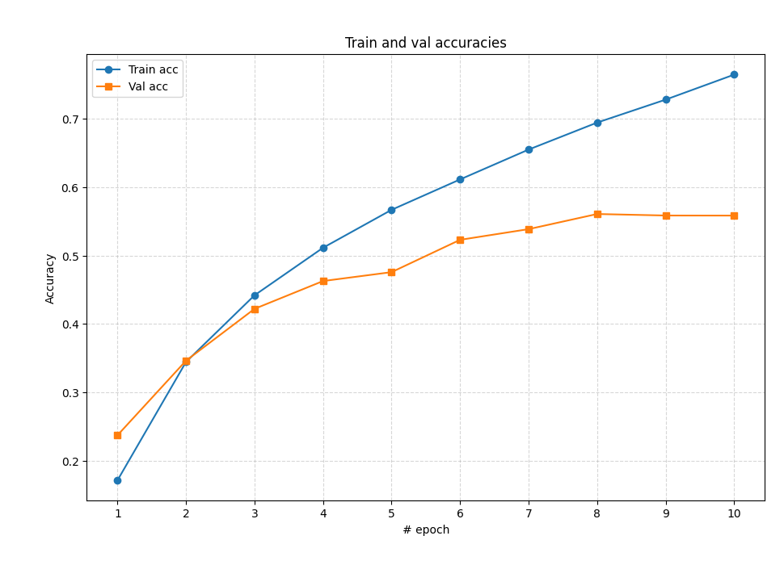

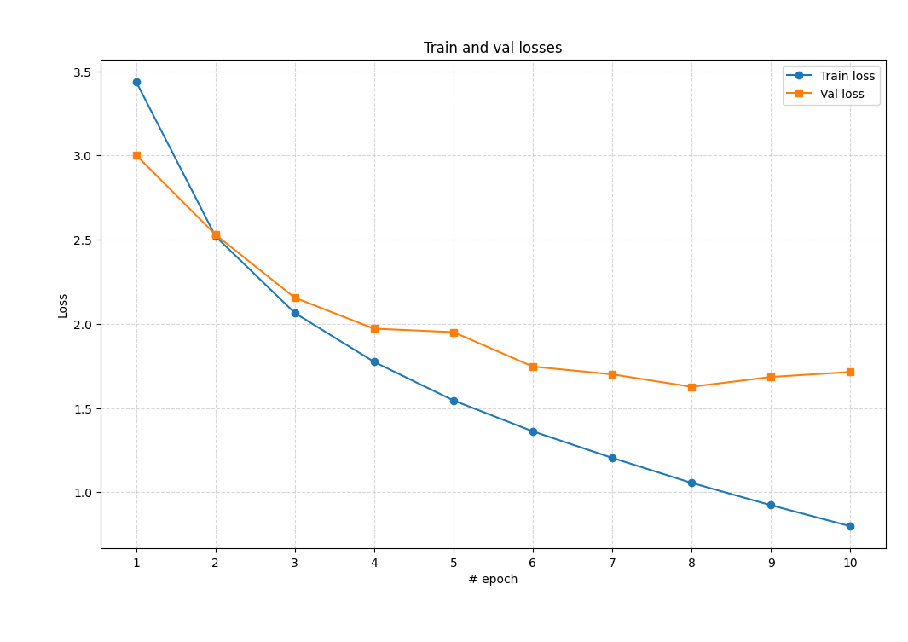

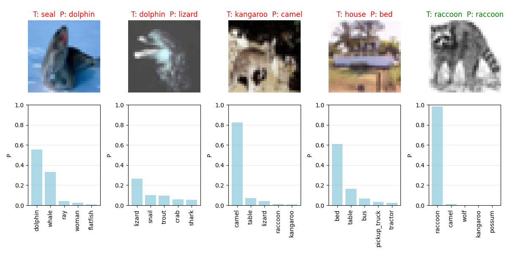

#### RMSProp

`def __init__(self, params, lr=1e-3, beta=0.99, eps=1e-8, device="cpu")`

Epoch 0, train loss 3.7468, train acc 0.1178, val loss 3.4092, val acc 0.1758

Epoch 1, train loss 2.8808, train acc 0.2715, val loss 2.8657, val acc 0.2751

Epoch 2, train loss 2.3749, train acc 0.3740, val loss 2.9325, val acc 0.2843

Epoch 3, train loss 2.0451, train acc 0.4484, val loss 2.5139, val acc 0.3556

Epoch 4, train loss 1.8109, train acc 0.5004, val loss 2.1570, val acc 0.4277

Epoch 5, train loss 1.6304, train acc 0.5439, val loss 2.2888, val acc 0.4316

Epoch 6, train loss 1.4677, train acc 0.5856, val loss 2.1067, val acc 0.4571

Epoch 7, train loss 1.3299, train acc 0.6168, val loss 2.1290, val acc 0.4442

Epoch 8, train loss 1.2031, train acc 0.6537, val loss 1.7893, val acc 0.5171

Epoch 9, train loss 1.0813, train acc 0.6854, val loss 2.3711, val acc 0.4427

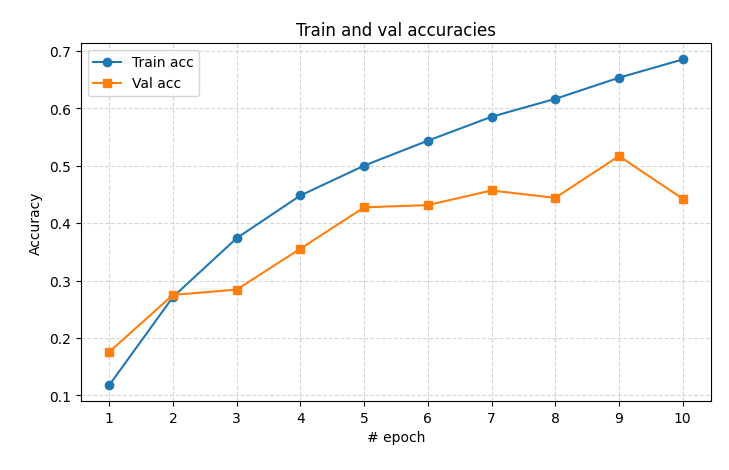

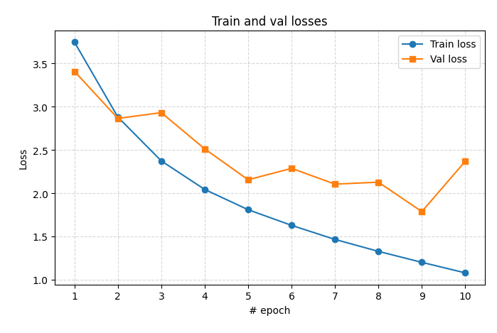

#### Adadelta

Epoch 0, train loss 3.5895, train acc 0.1416, val loss 3.6502, val acc 0.1614

Epoch 1, train loss 2.6972, train acc 0.3037, val loss 2.7232, val acc 0.3034

Epoch 2, train loss 2.2076, train acc 0.4055, val loss 3.0187, val acc 0.2731

Epoch 3, train loss 1.8967, train acc 0.4791, val loss 2.1674, val acc 0.4242

Epoch 4, train loss 1.6579, train acc 0.5358, val loss 2.0045, val acc 0.4580

Epoch 5, train loss 1.4576, train acc 0.5869, val loss 2.2938, val acc 0.4201

Epoch 6, train loss 1.2842, train acc 0.6281, val loss 1.9241, val acc 0.4826

Epoch 7, train loss 1.1262, train acc 0.6713, val loss 1.9166, val acc 0.5072

Epoch 8, train loss 0.9845, train acc 0.7073, val loss 1.9346, val acc 0.5008

Epoch 9, train loss 0.8512, train acc 0.7460, val loss 1.8661, val acc 0.528

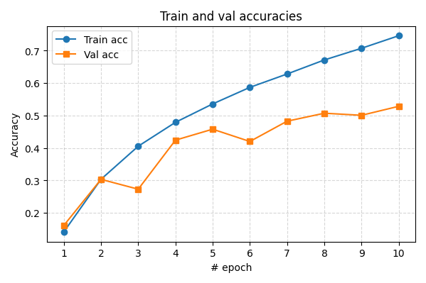

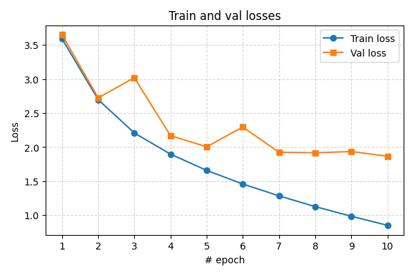

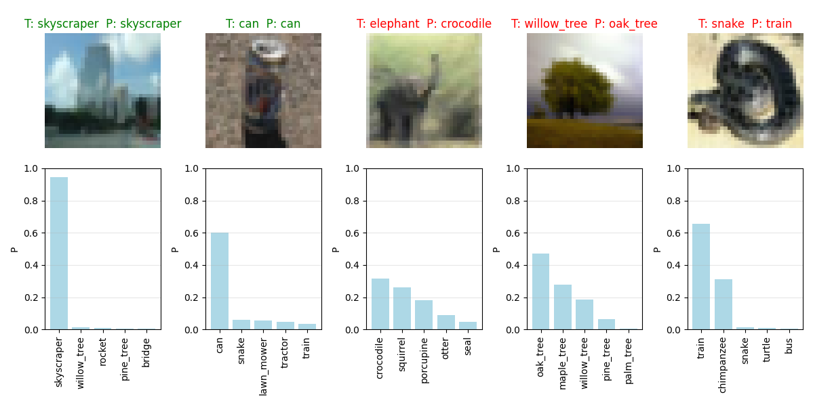

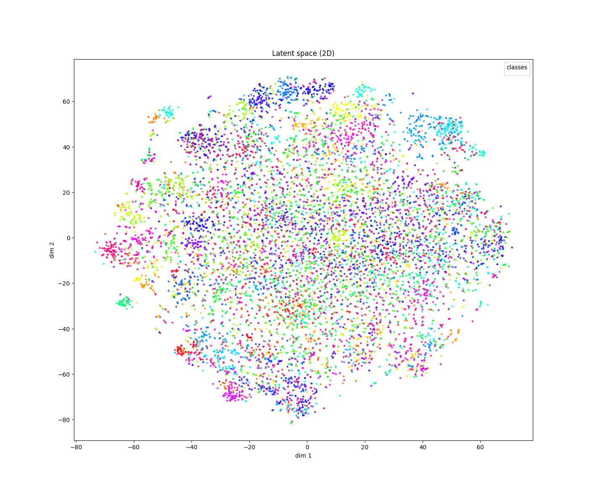

## Sequential training

Training using Adadelta, and dropout with probability 0.5

Task  0: classes = [25, 61, 42, 33, 81, 68, 6, 7, 54, 94]

Task  1: classes = [67, 71, 62, 0, 3, 41, 39, 85, 88, 16]

Task  2: classes = [82, 22, 92, 4, 14, 46, 30, 56, 28, 79]

Task  3: classes = [48, 74, 35, 24, 90, 84, 5, 95, 83, 60]

Task  4: classes = [32, 73, 47, 70, 43, 53, 20, 89, 17, 64]

Task  5: classes = [18, 76, 10, 97, 65, 44, 72, 40, 57, 78]

Task  6: classes = [77, 91, 52, 58, 93, 29, 38, 98, 37, 36]

Task  7: classes = [2, 1, 15, 23, 8, 9, 19, 51, 66, 75]

Task  8: classes = [87, 99, 63, 86, 59, 31, 50, 55, 11, 96]

Task  9: classes = [34, 13, 49, 80, 45, 26, 12, 27, 69, 21]

##### Training task 0 with classes [25, 61, 42, 33, 81, 68, 6, 7, 54, 94]

Epoch 14, train loss 0.5852, train acc 0.7968, val loss 1.4646, val acc 0.5880

On all previous tasks, loss 1.4645904331207276, acc 0.5880

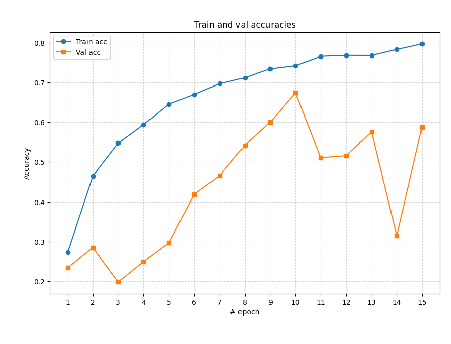

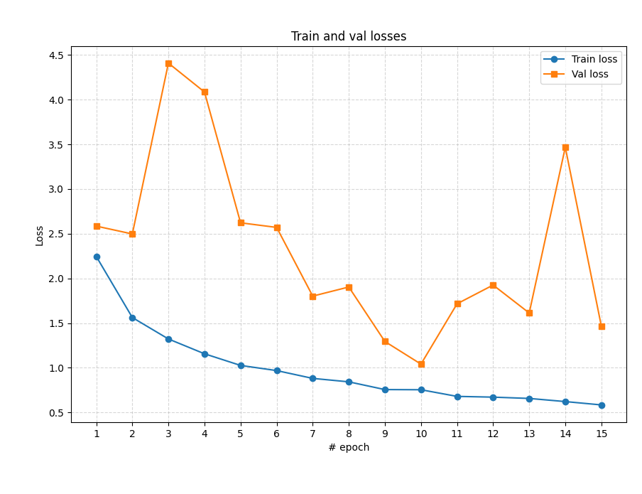

##### Training task 1 with classes [67, 71, 62, 0, 3, 41, 39, 85, 88, 16]

Epoch 14, train loss 0.3957, train acc 0.8702, val loss 0.6616, val acc 0.8020

On all previous tasks, loss 5.5431067047119145, acc 0.401

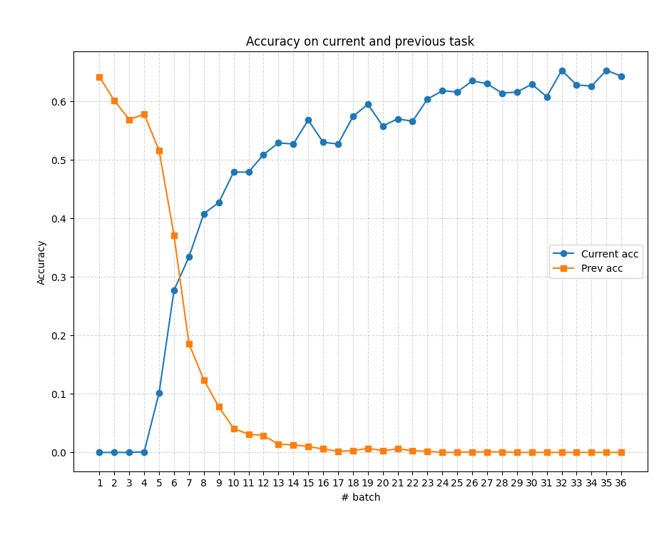

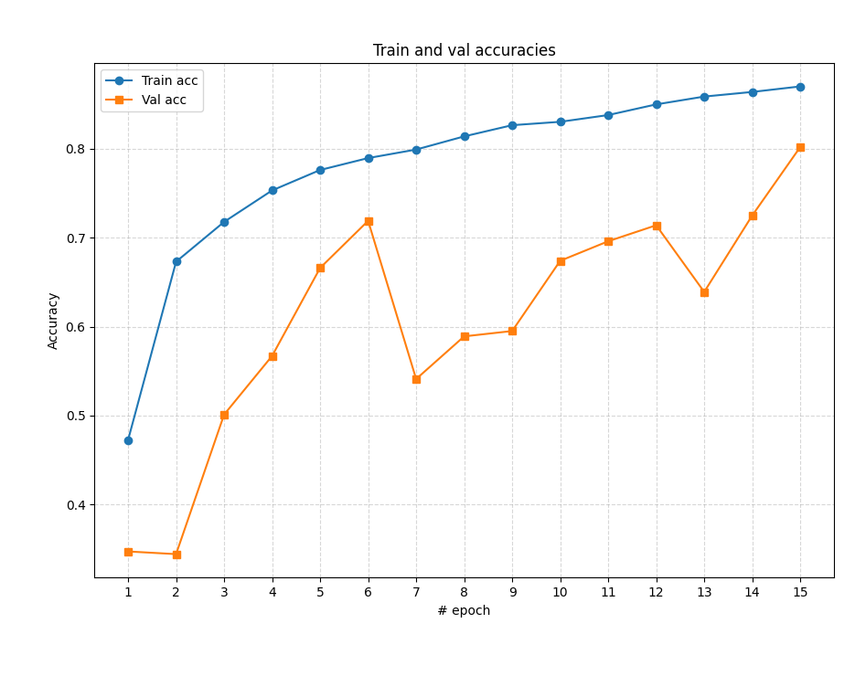

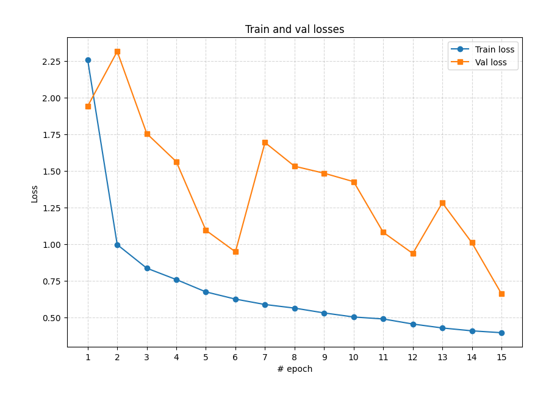

##### Training task 2 with classes [82, 22, 92, 4, 14, 46, 30, 56, 28, 79]

Epoch 14, train loss 0.5486, train acc 0.8100, val loss 1.2962, val acc 0.6770

On all previous tasks, loss 8.684470924377441, acc 0.22566666666666665

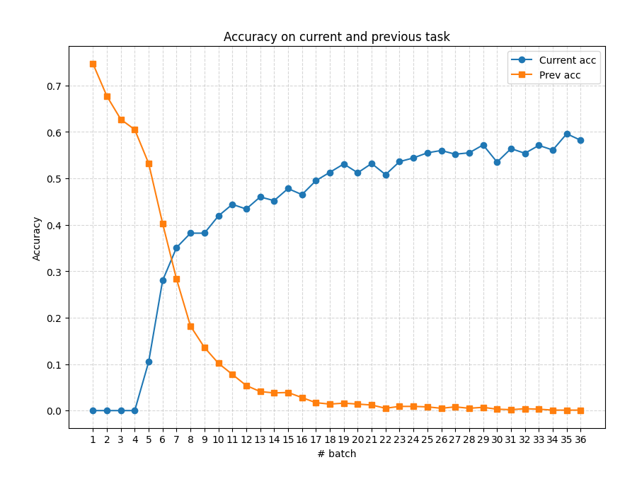

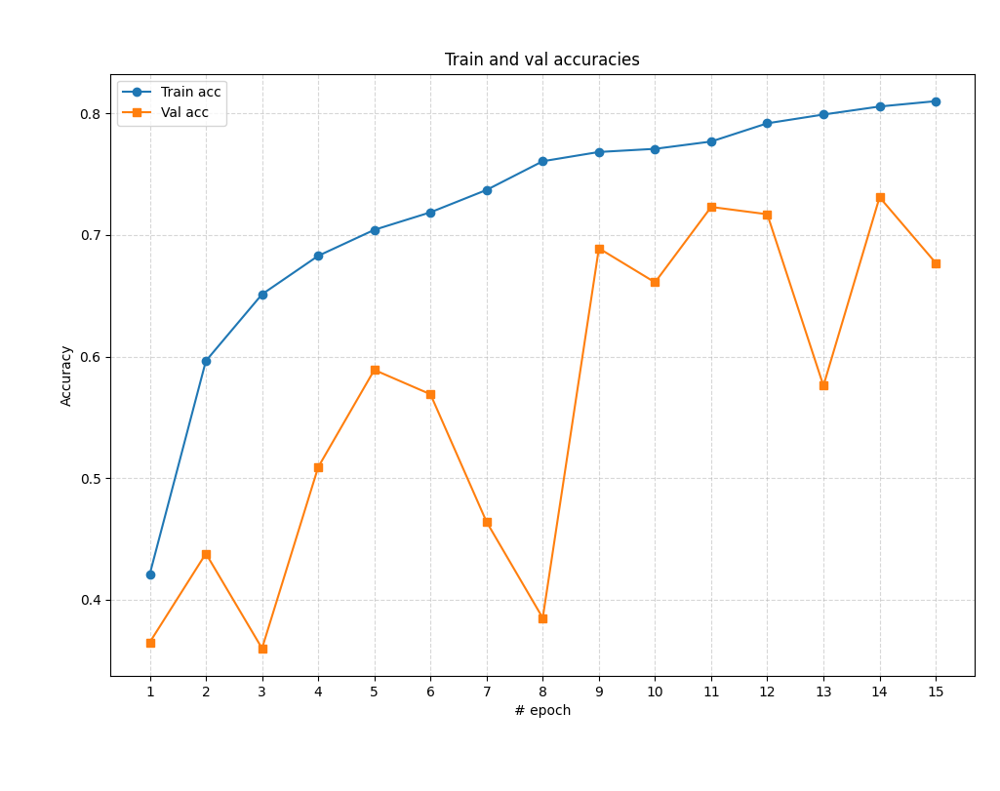

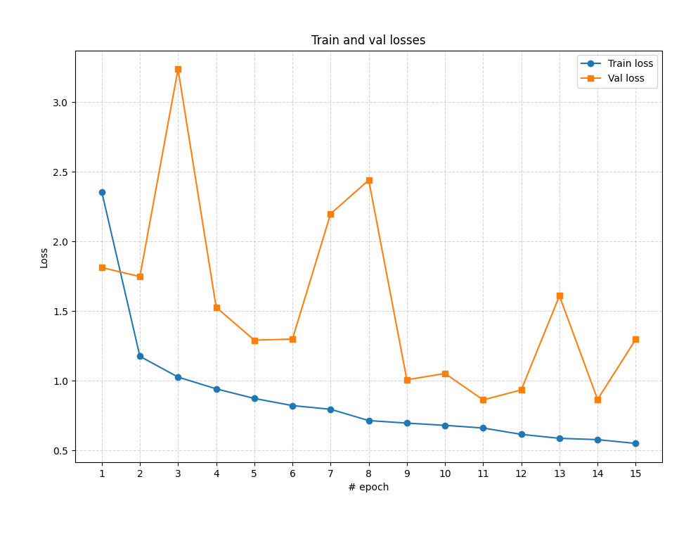

##### Training task 3 with classes [48, 74, 35, 24, 90, 84, 5, 95, 83, 60]

Epoch 14, train loss 0.3682, train acc 0.8682, val loss 0.8112, val acc 0.7430

On all previous tasks, loss 8.92057144165039, acc 0.18575

##### Training task 4 with classes [32, 73, 47, 70, 43, 53, 20, 89, 17, 64]

Epoch 14, train loss 0.3220, train acc 0.8854, val loss 0.7286, val acc 0.7650

On all previous tasks, loss 9.042738537597657, acc 0.153

##### Training task 5 with classes [18, 76, 10, 97, 65, 44, 72, 40, 57, 78]

Epoch 14, train loss 0.7545, train acc 0.7444, val loss 1.2880, val acc 0.5790

On all previous tasks, loss 9.573794588724772, acc 0.0965

##### Training task 6 with classes [77, 91, 52, 58, 93, 29, 38, 98, 37, 36]

Epoch 14, train loss 0.4702, train acc 0.8374, val loss 0.8806, val acc 0.7360

On all previous tasks, loss 9.792192609514508, acc 0.10514285714285715

##### Training task 7 with classes [2, 1, 15, 23, 8, 9, 19, 51, 66, 75]

Epoch 14, train loss 0.4438, train acc 0.8488, val loss 0.8913, val acc 0.7200

On all previous tasks, loss 9.706102737426757, acc 0.09

##### Training task 8 with classes [87, 99, 63, 86, 59, 31, 50, 55, 11, 96]

Epoch 14, train loss 0.5396, train acc 0.8062, val loss 1.0123, val acc 0.7070

On all previous tasks, loss 10.512745715671116, acc 0.07855555555555556

##### Training task 9 with classes [34, 13, 49, 80, 45, 26, 12, 27, 69, 21]

Epoch 14, train loss 0.5087, train acc 0.8196, val loss 0.9262, val acc 0.7240

On all previous tasks, loss 10.658863336181641, acc 0.0724

### Longer training

Training using Adadelta, and dropout with probability 0.5, for 200 epochs (or 90\% acc on validation set, whatever comes first):

**Task 1**

Epoch 199, train loss 0.0485, train acc 0.9828, val loss 1.0216, val acc 0.8110

On all previous tasks, loss 1.0216185398101807, acc 0.811

Accuracy    | Task 1 |
|------------|------- |
| Classifier                     | 0.8400 |
| Class                couch    | 0.8000 |
| Class                plate    | 0.9474 |
| Class              leopard    | 0.7727 |
| Class               forest    | 0.8947 |
| Class            streetcar    | 0.8462 |
| Class                 road    | 0.8333 |
| Class                  bee    | 0.7917 |
| Class               beetle    | 0.7778 |
| Class               orchid    | 0.8750 |
| Class             wardrobe    | 0.9231 |

**Task 2**

Epoch 118, train loss 0.0488, train acc 0.9840, val loss 0.5626, val acc 0.9020

On all previous tasks, loss 6.09733037185669, acc 0.451

| Accuracy    | Task 1 | Task 2 |
|------------|------- |------- |
| Classifier                     | 0.8400 | 0.7650 |
| Class                couch    | 0.8000 | 0.6296 |
| Class                plate    | 0.9474 | 0.8000 |
| Class              leopard    | 0.7727 | 0.6000 |
| Class               forest    | 0.8947 | 0.4118 |
| Class            streetcar    | 0.8462 | 0.9091 |
| Class                 road    | 0.8333 | 0.7778 |
| Class                  bee    | 0.7917 | 0.6667 |
| Class               beetle    | 0.7778 | 0.6000 |
| Class               orchid    | 0.8750 | 0.8000 |
| Class             wardrobe    | 0.9231 | 0.8500 |
| Class                  ray    |        | 0.7333 |
| Class                  sea    |        | 0.8750 |
| Class                poppy    |        | 0.8966 |
| Class                apple    |        | 0.9565 |
| Class                 bear    |        | 0.6154 |
| Class           lawn_mower    |        | 0.8889 |
| Class             keyboard    |        | 0.8000 |
| Class                 tank    |        | 0.8800 |
| Class                tiger    |        | 0.7917 |
| Class                  can    |        | 0.6000 |

**Task 3**

Epoch 199, train loss 0.0591, train acc 0.9790, val loss 0.8057, val acc 0.8480

On all previous tasks, loss 8.354194271087646, acc 0.283

| Accuracy    | Task 1 | Task 2 | Task 3 |
|------------|------- |------- |------- |
| Classifier                     | 0.8400 | 0.7650 | 0.6683 |
| Class                couch    | 0.8000 | 0.6296 | 0.4783 |
| Class                plate    | 0.9474 | 0.8000 | 0.7619 |
| Class              leopard    | 0.7727 | 0.6000 | 0.4286 |
| Class               forest    | 0.8947 | 0.4118 | 0.6000 |
| Class            streetcar    | 0.8462 | 0.9091 | 0.8148 |
| Class                 road    | 0.8333 | 0.7778 | 0.9444 |
| Class                  bee    | 0.7917 | 0.6667 | 0.3889 |
| Class               beetle    | 0.7778 | 0.6000 | 0.5862 |
| Class               orchid    | 0.8750 | 0.8000 | 0.7273 |
| Class             wardrobe    | 0.9231 | 0.8500 | 0.9286 |
| Class                  ray    |        | 0.7333 | 0.8125 |
| Class                  sea    |        | 0.8750 | 0.9000 |
| Class                poppy    |        | 0.8966 | 0.5455 |
| Class                apple    |        | 0.9565 | 0.8095 |
| Class                 bear    |        | 0.6154 | 0.6500 |
| Class           lawn_mower    |        | 0.8889 | 0.6667 |
| Class             keyboard    |        | 0.8000 | 0.7778 |
| Class                 tank    |        | 0.8800 | 1.0000 |
| Class                tiger    |        | 0.7917 | 0.5909 |
| Class                  can    |        | 0.6000 | 0.4800 |
| Class            sunflower    |        |        | 0.8824 |
| Class                clock    |        |        | 0.4000 |
| Class                tulip    |        |        | 0.4762 |
| Class               beaver    |        |        | 0.6818 |
| Class            butterfly    |        |        | 0.4737 |
| Class                  man    |        |        | 0.7000 |
| Class              dolphin    |        |        | 0.6875 |
| Class            palm_tree    |        |        | 0.9048 |
| Class                  cup    |        |        | 0.6316 |
| Class               spider    |        |        | 0.6333 |

**Task 4**

Epoch 75, train loss 0.0818, train acc 0.9710, val loss 0.4257, val acc 0.9030

On all previous tasks, loss 9.039847373962402, acc 0.23825

| Accuracy    | Task 1 | Task 2 | Task 3 | Task 4 |
|------------|------- |------- |------- |------- |
| Classifier                     | 0.8400 | 0.7650 | 0.6683 | 0.5837 |
| Class                couch    | 0.8000 | 0.6296 | 0.4783 | 0.3636 |
| Class                plate    | 0.9474 | 0.8000 | 0.7619 | 0.5625 |
| Class              leopard    | 0.7727 | 0.6000 | 0.4286 | 0.6400 |
| Class               forest    | 0.8947 | 0.4118 | 0.6000 | 0.7895 |
| Class            streetcar    | 0.8462 | 0.9091 | 0.8148 | 0.4444 |
| Class                 road    | 0.8333 | 0.7778 | 0.9444 | 0.7826 |
| Class                  bee    | 0.7917 | 0.6667 | 0.3889 | 0.5217 |
| Class               beetle    | 0.7778 | 0.6000 | 0.5862 | 0.3478 |
| Class               orchid    | 0.8750 | 0.8000 | 0.7273 | 0.4500 |
| Class             wardrobe    | 0.9231 | 0.8500 | 0.9286 | 0.8750 |
| Class                  ray    |        | 0.7333 | 0.8125 | 0.5000 |
| Class                  sea    |        | 0.8750 | 0.9000 | 0.7368 |
| Class                poppy    |        | 0.8966 | 0.5455 | 0.5600 |
| Class                apple    |        | 0.9565 | 0.8095 | 0.6842 |
| Class                 bear    |        | 0.6154 | 0.6500 | 0.4667 |
| Class           lawn_mower    |        | 0.8889 | 0.6667 | 0.7500 |
| Class             keyboard    |        | 0.8000 | 0.7778 | 0.4286 |
| Class                 tank    |        | 0.8800 | 1.0000 | 0.7500 |
| Class                tiger    |        | 0.7917 | 0.5909 | 0.5600 |
| Class                  can    |        | 0.6000 | 0.4800 | 0.5000 |
| Class            sunflower    |        |        | 0.8824 | 0.6667 |
| Class                clock    |        |        | 0.4000 | 0.5789 |
| Class                tulip    |        |        | 0.4762 | 0.1250 |
| Class               beaver    |        |        | 0.6818 | 0.3500 |
| Class            butterfly    |        |        | 0.4737 | 0.5833 |
| Class                  man    |        |        | 0.7000 | 0.4800 |
| Class              dolphin    |        |        | 0.6875 | 0.5455 |
| Class            palm_tree    |        |        | 0.9048 | 0.8947 |
| Class                  cup    |        |        | 0.6316 | 0.7647 |
| Class               spider    |        |        | 0.6333 | 0.6190 |
| Class           motorcycle    |        |        |        | 0.8636 |
| Class                shrew    |        |        |        | 0.4737 |
| Class                 girl    |        |        |        | 0.6842 |
| Class            cockroach    |        |        |        | 0.8750 |
| Class                train    |        |        |        | 0.4231 |
| Class                table    |        |        |        | 0.6000 |
| Class                  bed    |        |        |        | 0.8333 |
| Class                whale    |        |        |        | 0.4118 |
| Class         sweet_pepper    |        |        |        | 0.4706 |
| Class                plain    |        |        |        | 0.6818 |

**Task 5**

Epoch 154, train loss 0.0415, train acc 0.9854, val loss 0.4745, val acc 0.9020

On all previous tasks, loss 9.023781416320801, acc 0.182

| Accuracy    | Task 1 | Task 2 | Task 3 | Task 4 | Task 5 |
|------------|------- |------- |------- |------- |------- |
| Classifier                     | 0.8400 | 0.7650 | 0.6683 | 0.5837 | 0.5600 |
| Class                couch    | 0.8000 | 0.6296 | 0.4783 | 0.3636 | 0.1500 |
| Class                plate    | 0.9474 | 0.8000 | 0.7619 | 0.5625 | 0.8667 |
| Class              leopard    | 0.7727 | 0.6000 | 0.4286 | 0.6400 | 0.5172 |
| Class               forest    | 0.8947 | 0.4118 | 0.6000 | 0.7895 | 0.5263 |
| Class            streetcar    | 0.8462 | 0.9091 | 0.8148 | 0.4444 | 0.7500 |
| Class                 road    | 0.8333 | 0.7778 | 0.9444 | 0.7826 | 0.7059 |
| Class                  bee    | 0.7917 | 0.6667 | 0.3889 | 0.5217 | 0.5000 |
| Class               beetle    | 0.7778 | 0.6000 | 0.5862 | 0.3478 | 0.5000 |
| Class               orchid    | 0.8750 | 0.8000 | 0.7273 | 0.4500 | 0.5385 |
| Class             wardrobe    | 0.9231 | 0.8500 | 0.9286 | 0.8750 | 0.7143 |
| Class                  ray    |        | 0.7333 | 0.8125 | 0.5000 | 0.3889 |
| Class                  sea    |        | 0.8750 | 0.9000 | 0.7368 | 0.7333 |
| Class                poppy    |        | 0.8966 | 0.5455 | 0.5600 | 0.4444 |
| Class                apple    |        | 0.9565 | 0.8095 | 0.6842 | 0.6667 |
| Class                 bear    |        | 0.6154 | 0.6500 | 0.4667 | 0.2500 |
| Class           lawn_mower    |        | 0.8889 | 0.6667 | 0.7500 | 0.5000 |
| Class             keyboard    |        | 0.8000 | 0.7778 | 0.4286 | 0.5417 |
| Class                 tank    |        | 0.8800 | 1.0000 | 0.7500 | 0.5600 |
| Class                tiger    |        | 0.7917 | 0.5909 | 0.5600 | 0.5714 |
| Class                  can    |        | 0.6000 | 0.4800 | 0.5000 | 0.4545 |
| Class            sunflower    |        |        | 0.8824 | 0.6667 | 0.7917 |
| Class                clock    |        |        | 0.4000 | 0.5789 | 0.4000 |
| Class                tulip    |        |        | 0.4762 | 0.1250 | 0.5714 |
| Class               beaver    |        |        | 0.6818 | 0.3500 | 0.2222 |
| Class            butterfly    |        |        | 0.4737 | 0.5833 | 0.3684 |
| Class                  man    |        |        | 0.7000 | 0.4800 | 0.6500 |
| Class              dolphin    |        |        | 0.6875 | 0.5455 | 0.5238 |
| Class            palm_tree    |        |        | 0.9048 | 0.8947 | 0.8571 |
| Class                  cup    |        |        | 0.6316 | 0.7647 | 0.8125 |
| Class               spider    |        |        | 0.6333 | 0.6190 | 0.5455 |
| Class           motorcycle    |        |        |        | 0.8636 | 0.7037 |
| Class                shrew    |        |        |        | 0.4737 | 0.3750 |
| Class                 girl    |        |        |        | 0.6842 | 0.3158 |
| Class            cockroach    |        |        |        | 0.8750 | 0.7059 |
| Class                train    |        |        |        | 0.4231 | 0.6111 |
| Class                table    |        |        |        | 0.6000 | 0.6087 |
| Class                  bed    |        |        |        | 0.8333 | 0.2632 |
| Class                whale    |        |        |        | 0.4118 | 0.6818 |
| Class         sweet_pepper    |        |        |        | 0.4706 | 0.2727 |
| Class                plain    |        |        |        | 0.6818 | 0.7000 |
| Class             flatfish    |        |        |        |        | 0.5238 |
| Class                shark    |        |        |        |        | 0.4615 |
| Class           maple_tree    |        |        |        |        | 0.8947 |
| Class                 rose    |        |        |        |        | 0.4500 |
| Class                 lion    |        |        |        |        | 0.5333 |
| Class               orange    |        |        |        |        | 0.6800 |
| Class                chair    |        |        |        |        | 0.7895 |
| Class              tractor    |        |        |        |        | 0.5556 |
| Class               castle    |        |        |        |        | 0.8000 |
| Class               possum    |        |        |        |        | 0.4839 |

**Task 6**

Epoch 199, train loss 0.0824, train acc 0.9706, val loss 1.0874, val acc 0.7580

On all previous tasks, loss 9.926072171529134, acc 0.12783333333333333

| Accuracy    | Task 1 | Task 2 | Task 3 | Task 4 | Task 5 | Task 6 |
|------------|------- |------- |------- |------- |------- |------- |
| Classifier                     | 0.8400 | 0.7650 | 0.6683 | 0.5837 | 0.5600 | 0.4758 |
| Class                couch    | 0.8000 | 0.6296 | 0.4783 | 0.3636 | 0.1500 | 0.3571 |
| Class                plate    | 0.9474 | 0.8000 | 0.7619 | 0.5625 | 0.8667 | 0.7222 |
| Class              leopard    | 0.7727 | 0.6000 | 0.4286 | 0.6400 | 0.5172 | 0.4167 |
| Class               forest    | 0.8947 | 0.4118 | 0.6000 | 0.7895 | 0.5263 | 0.5882 |
| Class            streetcar    | 0.8462 | 0.9091 | 0.8148 | 0.4444 | 0.7500 | 0.6923 |
| Class                 road    | 0.8333 | 0.7778 | 0.9444 | 0.7826 | 0.7059 | 0.6522 |
| Class                  bee    | 0.7917 | 0.6667 | 0.3889 | 0.5217 | 0.5000 | 0.3158 |
| Class               beetle    | 0.7778 | 0.6000 | 0.5862 | 0.3478 | 0.5000 | 0.2667 |
| Class               orchid    | 0.8750 | 0.8000 | 0.7273 | 0.4500 | 0.5385 | 0.4783 |
| Class             wardrobe    | 0.9231 | 0.8500 | 0.9286 | 0.8750 | 0.7143 | 0.8571 |
| Class                  ray    |        | 0.7333 | 0.8125 | 0.5000 | 0.3889 | 0.4444 |
| Class                  sea    |        | 0.8750 | 0.9000 | 0.7368 | 0.7333 | 0.5455 |
| Class                poppy    |        | 0.8966 | 0.5455 | 0.5600 | 0.4444 | 0.3810 |
| Class                apple    |        | 0.9565 | 0.8095 | 0.6842 | 0.6667 | 0.6667 |
| Class                 bear    |        | 0.6154 | 0.6500 | 0.4667 | 0.2500 | 0.3571 |
| Class           lawn_mower    |        | 0.8889 | 0.6667 | 0.7500 | 0.5000 | 0.6667 |
| Class             keyboard    |        | 0.8000 | 0.7778 | 0.4286 | 0.5417 | 0.5000 |
| Class                 tank    |        | 0.8800 | 1.0000 | 0.7500 | 0.5600 | 0.4800 |
| Class                tiger    |        | 0.7917 | 0.5909 | 0.5600 | 0.5714 | 0.6667 |
| Class                  can    |        | 0.6000 | 0.4800 | 0.5000 | 0.4545 | 0.5263 |
| Class            sunflower    |        |        | 0.8824 | 0.6667 | 0.7917 | 0.7333 |
| Class                clock    |        |        | 0.4000 | 0.5789 | 0.4000 | 0.1481 |
| Class                tulip    |        |        | 0.4762 | 0.1250 | 0.5714 | 0.3913 |
| Class               beaver    |        |        | 0.6818 | 0.3500 | 0.2222 | 0.3200 |
| Class            butterfly    |        |        | 0.4737 | 0.5833 | 0.3684 | 0.2727 |
| Class                  man    |        |        | 0.7000 | 0.4800 | 0.6500 | 0.4286 |
| Class              dolphin    |        |        | 0.6875 | 0.5455 | 0.5238 | 0.2381 |
| Class            palm_tree    |        |        | 0.9048 | 0.8947 | 0.8571 | 0.6190 |
| Class                  cup    |        |        | 0.6316 | 0.7647 | 0.8125 | 0.7500 |
| Class               spider    |        |        | 0.6333 | 0.6190 | 0.5455 | 0.4000 |
| Class           motorcycle    |        |        |        | 0.8636 | 0.7037 | 0.5600 |
| Class                shrew    |        |        |        | 0.4737 | 0.3750 | 0.3333 |
| Class                 girl    |        |        |        | 0.6842 | 0.3158 | 0.2727 |
| Class            cockroach    |        |        |        | 0.8750 | 0.7059 | 0.6667 |
| Class                train    |        |        |        | 0.4231 | 0.6111 | 0.2500 |
| Class                table    |        |        |        | 0.6000 | 0.6087 | 0.2593 |
| Class                  bed    |        |        |        | 0.8333 | 0.2632 | 0.2857 |
| Class                whale    |        |        |        | 0.4118 | 0.6818 | 0.6875 |
| Class         sweet_pepper    |        |        |        | 0.4706 | 0.2727 | 0.2857 |
| Class                plain    |        |        |        | 0.6818 | 0.7000 | 0.6087 |
| Class             flatfish    |        |        |        |        | 0.5238 | 0.3500 |
| Class                shark    |        |        |        |        | 0.4615 | 0.5217 |
| Class           maple_tree    |        |        |        |        | 0.8947 | 0.7826 |
| Class                 rose    |        |        |        |        | 0.4500 | 0.3448 |
| Class                 lion    |        |        |        |        | 0.5333 | 0.4483 |
| Class               orange    |        |        |        |        | 0.6800 | 0.5000 |
| Class                chair    |        |        |        |        | 0.7895 | 0.6923 |
| Class              tractor    |        |        |        |        | 0.5556 | 0.5652 |
| Class               castle    |        |        |        |        | 0.8000 | 0.7500 |
| Class               possum    |        |        |        |        | 0.4839 | 0.3684 |
| Class          caterpillar    |        |        |        |        |        | 0.4444 |
| Class           skyscraper    |        |        |        |        |        | 0.8824 |
| Class                 bowl    |        |        |        |        |        | 0.4706 |
| Class                 wolf    |        |        |        |        |        | 0.5200 |
| Class               rabbit    |        |        |        |        |        | 0.2941 |
| Class               lizard    |        |        |        |        |        | 0.2308 |
| Class                 seal    |        |        |        |        |        | 0.3684 |
| Class                 lamp    |        |        |        |        |        | 0.5000 |
| Class                 pear    |        |        |        |        |        | 0.4583 |
| Class                snake    |        |        |        |        |        | 0.3158 |

**Task 7**

Epoch 199, train loss 0.0555, train acc 0.9796, val loss 0.5873, val acc 0.8650

On all previous tasks, loss 10.052490291050502, acc 0.12414285714285714

| Accuracy    | Task 1 | Task 2 | Task 3 | Task 4 | Task 5 | Task 6 | Task 7 |
|------------|------- |------- |------- |------- |------- |------- |------- |
| Classifier                     | 0.8400 | 0.7650 | 0.6683 | 0.5837 | 0.5600 | 0.4758 | 0.4514 |
| Class                couch    | 0.8000 | 0.6296 | 0.4783 | 0.3636 | 0.1500 | 0.3571 | 0.5000 |
| Class                plate    | 0.9474 | 0.8000 | 0.7619 | 0.5625 | 0.8667 | 0.7222 | 0.4286 |
| Class              leopard    | 0.7727 | 0.6000 | 0.4286 | 0.6400 | 0.5172 | 0.4167 | 0.4615 |
| Class               forest    | 0.8947 | 0.4118 | 0.6000 | 0.7895 | 0.5263 | 0.5882 | 0.4800 |
| Class            streetcar    | 0.8462 | 0.9091 | 0.8148 | 0.4444 | 0.7500 | 0.6923 | 0.5500 |
| Class                 road    | 0.8333 | 0.7778 | 0.9444 | 0.7826 | 0.7059 | 0.6522 | 0.6087 |
| Class                  bee    | 0.7917 | 0.6667 | 0.3889 | 0.5217 | 0.5000 | 0.3158 | 0.4000 |
| Class               beetle    | 0.7778 | 0.6000 | 0.5862 | 0.3478 | 0.5000 | 0.2667 | 0.3684 |
| Class               orchid    | 0.8750 | 0.8000 | 0.7273 | 0.4500 | 0.5385 | 0.4783 | 0.7778 |
| Class             wardrobe    | 0.9231 | 0.8500 | 0.9286 | 0.8750 | 0.7143 | 0.8571 | 0.7895 |
| Class                  ray    |        | 0.7333 | 0.8125 | 0.5000 | 0.3889 | 0.4444 | 0.3636 |
| Class                  sea    |        | 0.8750 | 0.9000 | 0.7368 | 0.7333 | 0.5455 | 0.6667 |
| Class                poppy    |        | 0.8966 | 0.5455 | 0.5600 | 0.4444 | 0.3810 | 0.2400 |
| Class                apple    |        | 0.9565 | 0.8095 | 0.6842 | 0.6667 | 0.6667 | 0.6316 |
| Class                 bear    |        | 0.6154 | 0.6500 | 0.4667 | 0.2500 | 0.3571 | 0.3200 |
| Class           lawn_mower    |        | 0.8889 | 0.6667 | 0.7500 | 0.5000 | 0.6667 | 0.6522 |
| Class             keyboard    |        | 0.8000 | 0.7778 | 0.4286 | 0.5417 | 0.5000 | 0.3548 |
| Class                 tank    |        | 0.8800 | 1.0000 | 0.7500 | 0.5600 | 0.4800 | 0.5200 |
| Class                tiger    |        | 0.7917 | 0.5909 | 0.5600 | 0.5714 | 0.6667 | 0.4000 |
| Class                  can    |        | 0.6000 | 0.4800 | 0.5000 | 0.4545 | 0.5263 | 0.6842 |
| Class            sunflower    |        |        | 0.8824 | 0.6667 | 0.7917 | 0.7333 | 0.6471 |
| Class                clock    |        |        | 0.4000 | 0.5789 | 0.4000 | 0.1481 | 0.3333 |
| Class                tulip    |        |        | 0.4762 | 0.1250 | 0.5714 | 0.3913 | 0.2353 |
| Class               beaver    |        |        | 0.6818 | 0.3500 | 0.2222 | 0.3200 | 0.1875 |
| Class            butterfly    |        |        | 0.4737 | 0.5833 | 0.3684 | 0.2727 | 0.3103 |
| Class                  man    |        |        | 0.7000 | 0.4800 | 0.6500 | 0.4286 | 0.4286 |
| Class              dolphin    |        |        | 0.6875 | 0.5455 | 0.5238 | 0.2381 | 0.3500 |
| Class            palm_tree    |        |        | 0.9048 | 0.8947 | 0.8571 | 0.6190 | 0.7895 |
| Class                  cup    |        |        | 0.6316 | 0.7647 | 0.8125 | 0.7500 | 0.6250 |
| Class               spider    |        |        | 0.6333 | 0.6190 | 0.5455 | 0.4000 | 0.2941 |
| Class           motorcycle    |        |        |        | 0.8636 | 0.7037 | 0.5600 | 0.9048 |
| Class                shrew    |        |        |        | 0.4737 | 0.3750 | 0.3333 | 0.3043 |
| Class                 girl    |        |        |        | 0.6842 | 0.3158 | 0.2727 | 0.2308 |
| Class            cockroach    |        |        |        | 0.8750 | 0.7059 | 0.6667 | 0.7273 |
| Class                train    |        |        |        | 0.4231 | 0.6111 | 0.2500 | 0.3913 |
| Class                table    |        |        |        | 0.6000 | 0.6087 | 0.2593 | 0.3000 |
| Class                  bed    |        |        |        | 0.8333 | 0.2632 | 0.2857 | 0.3636 |
| Class                whale    |        |        |        | 0.4118 | 0.6818 | 0.6875 | 0.3636 |
| Class         sweet_pepper    |        |        |        | 0.4706 | 0.2727 | 0.2857 | 0.3636 |
| Class                plain    |        |        |        | 0.6818 | 0.7000 | 0.6087 | 0.7368 |
| Class             flatfish    |        |        |        |        | 0.5238 | 0.3500 | 0.3529 |
| Class                shark    |        |        |        |        | 0.4615 | 0.5217 | 0.3600 |
| Class           maple_tree    |        |        |        |        | 0.8947 | 0.7826 | 0.3889 |
| Class                 rose    |        |        |        |        | 0.4500 | 0.3448 | 0.4783 |
| Class                 lion    |        |        |        |        | 0.5333 | 0.4483 | 0.2800 |
| Class               orange    |        |        |        |        | 0.6800 | 0.5000 | 0.6667 |
| Class                chair    |        |        |        |        | 0.7895 | 0.6923 | 0.5000 |
| Class              tractor    |        |        |        |        | 0.5556 | 0.5652 | 0.4783 |
| Class               castle    |        |        |        |        | 0.8000 | 0.7500 | 0.6842 |
| Class               possum    |        |        |        |        | 0.4839 | 0.3684 | 0.2727 |
| Class          caterpillar    |        |        |        |        |        | 0.4444 | 0.2727 |
| Class           skyscraper    |        |        |        |        |        | 0.8824 | 0.7917 |
| Class                 bowl    |        |        |        |        |        | 0.4706 | 0.3750 |
| Class                 wolf    |        |        |        |        |        | 0.5200 | 0.4091 |
| Class               rabbit    |        |        |        |        |        | 0.2941 | 0.2500 |
| Class               lizard    |        |        |        |        |        | 0.2308 | 0.1250 |
| Class                 seal    |        |        |        |        |        | 0.3684 | 0.2000 |
| Class                 lamp    |        |        |        |        |        | 0.5000 | 0.3077 |
| Class                 pear    |        |        |        |        |        | 0.4583 | 0.4737 |
| Class                snake    |        |        |        |        |        | 0.3158 | 0.2632 |
| Class                snail    |        |        |        |        |        |        | 0.3684 |
| Class                trout    |        |        |        |        |        |        | 0.6667 |
| Class             oak_tree    |        |        |        |        |        |        | 0.8571 |
| Class         pickup_truck    |        |        |        |        |        |        | 0.4000 |
| Class               turtle    |        |        |        |        |        |        | 0.0625 |
| Class             dinosaur    |        |        |        |        |        |        | 0.5000 |
| Class             kangaroo    |        |        |        |        |        |        | 0.5625 |
| Class                woman    |        |        |        |        |        |        | 0.3571 |
| Class                house    |        |        |        |        |        |        | 0.7143 |
| Class              hamster    |        |        |        |        |        |        | 0.7222 |

**Task 8**

Epoch 199, train loss 0.0456, train acc 0.9866, val loss 0.5422, val acc 0.8710

On all previous tasks, loss 10.181735054016114, acc 0.11275

| Accuracy    | Task 1 | Task 2 | Task 3 | Task 4 | Task 5 | Task 6 | Task 7 | Task 8 |
|------------|------- |------- |------- |------- |------- |------- |------- |------- |
| Classifier                     | 0.8400 | 0.7650 | 0.6683 | 0.5837 | 0.5600 | 0.4758 | 0.4514 | 0.4444 |
| Class                couch    | 0.8000 | 0.6296 | 0.4783 | 0.3636 | 0.1500 | 0.3571 | 0.5000 | 0.2000 |
| Class                plate    | 0.9474 | 0.8000 | 0.7619 | 0.5625 | 0.8667 | 0.7222 | 0.4286 | 0.3810 |
| Class              leopard    | 0.7727 | 0.6000 | 0.4286 | 0.6400 | 0.5172 | 0.4167 | 0.4615 | 0.6111 |
| Class               forest    | 0.8947 | 0.4118 | 0.6000 | 0.7895 | 0.5263 | 0.5882 | 0.4800 | 0.3125 |
| Class            streetcar    | 0.8462 | 0.9091 | 0.8148 | 0.4444 | 0.7500 | 0.6923 | 0.5500 | 0.4000 |
| Class                 road    | 0.8333 | 0.7778 | 0.9444 | 0.7826 | 0.7059 | 0.6522 | 0.6087 | 0.8421 |
| Class                  bee    | 0.7917 | 0.6667 | 0.3889 | 0.5217 | 0.5000 | 0.3158 | 0.4000 | 0.3684 |
| Class               beetle    | 0.7778 | 0.6000 | 0.5862 | 0.3478 | 0.5000 | 0.2667 | 0.3684 | 0.2222 |
| Class               orchid    | 0.8750 | 0.8000 | 0.7273 | 0.4500 | 0.5385 | 0.4783 | 0.7778 | 0.4545 |
| Class             wardrobe    | 0.9231 | 0.8500 | 0.9286 | 0.8750 | 0.7143 | 0.8571 | 0.7895 | 0.8500 |
| Class                  ray    |        | 0.7333 | 0.8125 | 0.5000 | 0.3889 | 0.4444 | 0.3636 | 0.3333 |
| Class                  sea    |        | 0.8750 | 0.9000 | 0.7368 | 0.7333 | 0.5455 | 0.6667 | 0.7500 |
| Class                poppy    |        | 0.8966 | 0.5455 | 0.5600 | 0.4444 | 0.3810 | 0.2400 | 0.2500 |
| Class                apple    |        | 0.9565 | 0.8095 | 0.6842 | 0.6667 | 0.6667 | 0.6316 | 0.6400 |
| Class                 bear    |        | 0.6154 | 0.6500 | 0.4667 | 0.2500 | 0.3571 | 0.3200 | 0.2917 |
| Class           lawn_mower    |        | 0.8889 | 0.6667 | 0.7500 | 0.5000 | 0.6667 | 0.6522 | 0.5500 |
| Class             keyboard    |        | 0.8000 | 0.7778 | 0.4286 | 0.5417 | 0.5000 | 0.3548 | 0.3913 |
| Class                 tank    |        | 0.8800 | 1.0000 | 0.7500 | 0.5600 | 0.4800 | 0.5200 | 0.5217 |
| Class                tiger    |        | 0.7917 | 0.5909 | 0.5600 | 0.5714 | 0.6667 | 0.4000 | 0.3000 |
| Class                  can    |        | 0.6000 | 0.4800 | 0.5000 | 0.4545 | 0.5263 | 0.6842 | 0.6667 |
| Class            sunflower    |        |        | 0.8824 | 0.6667 | 0.7917 | 0.7333 | 0.6471 | 0.4583 |
| Class                clock    |        |        | 0.4000 | 0.5789 | 0.4000 | 0.1481 | 0.3333 | 0.3333 |
| Class                tulip    |        |        | 0.4762 | 0.1250 | 0.5714 | 0.3913 | 0.2353 | 0.2143 |
| Class               beaver    |        |        | 0.6818 | 0.3500 | 0.2222 | 0.3200 | 0.1875 | 0.1739 |
| Class            butterfly    |        |        | 0.4737 | 0.5833 | 0.3684 | 0.2727 | 0.3103 | 0.2400 |
| Class                  man    |        |        | 0.7000 | 0.4800 | 0.6500 | 0.4286 | 0.4286 | 0.3043 |
| Class              dolphin    |        |        | 0.6875 | 0.5455 | 0.5238 | 0.2381 | 0.3500 | 0.5000 |
| Class            palm_tree    |        |        | 0.9048 | 0.8947 | 0.8571 | 0.6190 | 0.7895 | 0.5882 |
| Class                  cup    |        |        | 0.6316 | 0.7647 | 0.8125 | 0.7500 | 0.6250 | 0.4737 |
| Class               spider    |        |        | 0.6333 | 0.6190 | 0.5455 | 0.4000 | 0.2941 | 0.5238 |
| Class           motorcycle    |        |        |        | 0.8636 | 0.7037 | 0.5600 | 0.9048 | 0.8889 |
| Class                shrew    |        |        |        | 0.4737 | 0.3750 | 0.3333 | 0.3043 | 0.0588 |
| Class                 girl    |        |        |        | 0.6842 | 0.3158 | 0.2727 | 0.2308 | 0.2000 |
| Class            cockroach    |        |        |        | 0.8750 | 0.7059 | 0.6667 | 0.7273 | 0.3333 |
| Class                train    |        |        |        | 0.4231 | 0.6111 | 0.2500 | 0.3913 | 0.3529 |
| Class                table    |        |        |        | 0.6000 | 0.6087 | 0.2593 | 0.3000 | 0.2273 |
| Class                  bed    |        |        |        | 0.8333 | 0.2632 | 0.2857 | 0.3636 | 0.3529 |
| Class                whale    |        |        |        | 0.4118 | 0.6818 | 0.6875 | 0.3636 | 0.3636 |
| Class         sweet_pepper    |        |        |        | 0.4706 | 0.2727 | 0.2857 | 0.3636 | 0.2500 |
| Class                plain    |        |        |        | 0.6818 | 0.7000 | 0.6087 | 0.7368 | 0.7500 |
| Class             flatfish    |        |        |        |        | 0.5238 | 0.3500 | 0.3529 | 0.2069 |
| Class                shark    |        |        |        |        | 0.4615 | 0.5217 | 0.3600 | 0.3478 |
| Class           maple_tree    |        |        |        |        | 0.8947 | 0.7826 | 0.3889 | 0.4545 |
| Class                 rose    |        |        |        |        | 0.4500 | 0.3448 | 0.4783 | 0.5000 |
| Class                 lion    |        |        |        |        | 0.5333 | 0.4483 | 0.2800 | 0.5625 |
| Class               orange    |        |        |        |        | 0.6800 | 0.5000 | 0.6667 | 0.7857 |
| Class                chair    |        |        |        |        | 0.7895 | 0.6923 | 0.5000 | 0.6667 |
| Class              tractor    |        |        |        |        | 0.5556 | 0.5652 | 0.4783 | 0.4211 |
| Class               castle    |        |        |        |        | 0.8000 | 0.7500 | 0.6842 | 0.5500 |
| Class               possum    |        |        |        |        | 0.4839 | 0.3684 | 0.2727 | 0.1579 |
| Class          caterpillar    |        |        |        |        |        | 0.4444 | 0.2727 | 0.3000 |
| Class           skyscraper    |        |        |        |        |        | 0.8824 | 0.7917 | 0.7895 |
| Class                 bowl    |        |        |        |        |        | 0.4706 | 0.3750 | 0.2667 |
| Class                 wolf    |        |        |        |        |        | 0.5200 | 0.4091 | 0.1905 |
| Class               rabbit    |        |        |        |        |        | 0.2941 | 0.2500 | 0.2857 |
| Class               lizard    |        |        |        |        |        | 0.2308 | 0.1250 | 0.2500 |
| Class                 seal    |        |        |        |        |        | 0.3684 | 0.2000 | 0.2353 |
| Class                 lamp    |        |        |        |        |        | 0.5000 | 0.3077 | 0.4583 |
| Class                 pear    |        |        |        |        |        | 0.4583 | 0.4737 | 0.4167 |
| Class                snake    |        |        |        |        |        | 0.3158 | 0.2632 | 0.3333 |
| Class                snail    |        |        |        |        |        |        | 0.3684 | 0.2941 |
| Class                trout    |        |        |        |        |        |        | 0.6667 | 0.5789 |
| Class             oak_tree    |        |        |        |        |        |        | 0.8571 | 0.5000 |
| Class         pickup_truck    |        |        |        |        |        |        | 0.4000 | 0.6364 |
| Class               turtle    |        |        |        |        |        |        | 0.0625 | 0.4615 |
| Class             dinosaur    |        |        |        |        |        |        | 0.5000 | 0.4000 |
| Class             kangaroo    |        |        |        |        |        |        | 0.5625 | 0.3889 |
| Class                woman    |        |        |        |        |        |        | 0.3571 | 0.0909 |
| Class                house    |        |        |        |        |        |        | 0.7143 | 0.6111 |
| Class              hamster    |        |        |        |        |        |        | 0.7222 | 0.6000 |
| Class                 baby    |        |        |        |        |        |        |        | 0.3600 |
| Class        aquarium_fish    |        |        |        |        |        |        |        | 0.7391 |
| Class                camel    |        |        |        |        |        |        |        | 0.5000 |
| Class                cloud    |        |        |        |        |        |        |        | 0.6786 |
| Class              bicycle    |        |        |        |        |        |        |        | 0.7619 |
| Class               bottle    |        |        |        |        |        |        |        | 0.6000 |
| Class               cattle    |        |        |        |        |        |        |        | 0.5714 |
| Class             mushroom    |        |        |        |        |        |        |        | 0.4375 |
| Class              raccoon    |        |        |        |        |        |        |        | 0.6667 |
| Class                skunk    |        |        |        |        |        |        |        | 0.9091 |

**Task 9**

Epoch 199, train loss 0.0643, train acc 0.9776, val loss 0.7775, val acc 0.8180

On all previous tasks, loss 10.389605711195204, acc 0.09211111111111112

**Task 10**

Epoch 199, train loss 0.0602, train acc 0.9790, val loss 0.6840, val acc 0.8500

On all previous tasks, loss 10.669502571105957, acc 0.0859

| Accuracy    | Task 1 | Task 2 | Task 3 | Task 4 | Task 5 | Task 6 | Task 7 | Task 8 | Task 9 | Task 10 |
|------------|------- |------- |------- |------- |------- |------- |------- |------- |------- |------- |
| Classifier                     | 0.8400 | 0.7650 | 0.6683 | 0.5837 | 0.5600 | 0.4758 | 0.4514 | 0.4444 | 0.3861 | 0.3835 |
| Class                couch    | 0.8000 | 0.6296 | 0.4783 | 0.3636 | 0.1500 | 0.3571 | 0.5000 | 0.2000 | 0.2500 | 0.1250 |
| Class                plate    | 0.9474 | 0.8000 | 0.7619 | 0.5625 | 0.8667 | 0.7222 | 0.4286 | 0.3810 | 0.5238 | 0.2667 |
| Class              leopard    | 0.7727 | 0.6000 | 0.4286 | 0.6400 | 0.5172 | 0.4167 | 0.4615 | 0.6111 | 0.5000 | 0.5000 |
| Class               forest    | 0.8947 | 0.4118 | 0.6000 | 0.7895 | 0.5263 | 0.5882 | 0.4800 | 0.3125 | 0.4375 | 0.6250 |
| Class            streetcar    | 0.8462 | 0.9091 | 0.8148 | 0.4444 | 0.7500 | 0.6923 | 0.5500 | 0.4000 | 0.4783 | 0.4667 |
| Class                 road    | 0.8333 | 0.7778 | 0.9444 | 0.7826 | 0.7059 | 0.6522 | 0.6087 | 0.8421 | 0.5263 | 0.5357 |
| Class                  bee    | 0.7917 | 0.6667 | 0.3889 | 0.5217 | 0.5000 | 0.3158 | 0.4000 | 0.3684 | 0.2727 | 0.2667 |
| Class               beetle    | 0.7778 | 0.6000 | 0.5862 | 0.3478 | 0.5000 | 0.2667 | 0.3684 | 0.2222 | 0.3684 | 0.4000 |
| Class               orchid    | 0.8750 | 0.8000 | 0.7273 | 0.4500 | 0.5385 | 0.4783 | 0.7778 | 0.4545 | 0.6000 | 0.5200 |
| Class             wardrobe    | 0.9231 | 0.8500 | 0.9286 | 0.8750 | 0.7143 | 0.8571 | 0.7895 | 0.8500 | 0.6667 | 0.6818 |
| Class                  ray    |        | 0.7333 | 0.8125 | 0.5000 | 0.3889 | 0.4444 | 0.3636 | 0.3333 | 0.2353 | 0.4706 |
| Class                  sea    |        | 0.8750 | 0.9000 | 0.7368 | 0.7333 | 0.5455 | 0.6667 | 0.7500 | 0.6087 | 0.4762 |
| Class                poppy    |        | 0.8966 | 0.5455 | 0.5600 | 0.4444 | 0.3810 | 0.2400 | 0.2500 | 0.6154 | 0.4167 |
| Class                apple    |        | 0.9565 | 0.8095 | 0.6842 | 0.6667 | 0.6667 | 0.6316 | 0.6400 | 0.6111 | 0.6250 |
| Class                 bear    |        | 0.6154 | 0.6500 | 0.4667 | 0.2500 | 0.3571 | 0.3200 | 0.2917 | 0.2632 | 0.1200 |
| Class           lawn_mower    |        | 0.8889 | 0.6667 | 0.7500 | 0.5000 | 0.6667 | 0.6522 | 0.5500 | 0.6500 | 0.6842 |
| Class             keyboard    |        | 0.8000 | 0.7778 | 0.4286 | 0.5417 | 0.5000 | 0.3548 | 0.3913 | 0.3500 | 0.5000 |
| Class                 tank    |        | 0.8800 | 1.0000 | 0.7500 | 0.5600 | 0.4800 | 0.5200 | 0.5217 | 0.2941 | 0.5417 |
| Class                tiger    |        | 0.7917 | 0.5909 | 0.5600 | 0.5714 | 0.6667 | 0.4000 | 0.3000 | 0.3500 | 0.4667 |
| Class                  can    |        | 0.6000 | 0.4800 | 0.5000 | 0.4545 | 0.5263 | 0.6842 | 0.6667 | 0.5909 | 0.5000 |
| Class            sunflower    |        |        | 0.8824 | 0.6667 | 0.7917 | 0.7333 | 0.6471 | 0.4583 | 0.6000 | 0.5000 |
| Class                clock    |        |        | 0.4000 | 0.5789 | 0.4000 | 0.1481 | 0.3333 | 0.3333 | 0.1538 | 0.3125 |
| Class                tulip    |        |        | 0.4762 | 0.1250 | 0.5714 | 0.3913 | 0.2353 | 0.2143 | 0.3500 | 0.1818 |
| Class               beaver    |        |        | 0.6818 | 0.3500 | 0.2222 | 0.3200 | 0.1875 | 0.1739 | 0.2188 | 0.1600 |
| Class            butterfly    |        |        | 0.4737 | 0.5833 | 0.3684 | 0.2727 | 0.3103 | 0.2400 | 0.1429 | 0.1111 |
| Class                  man    |        |        | 0.7000 | 0.4800 | 0.6500 | 0.4286 | 0.4286 | 0.3043 | 0.2308 | 0.2857 |
| Class              dolphin    |        |        | 0.6875 | 0.5455 | 0.5238 | 0.2381 | 0.3500 | 0.5000 | 0.3636 | 0.1600 |
| Class            palm_tree    |        |        | 0.9048 | 0.8947 | 0.8571 | 0.6190 | 0.7895 | 0.5882 | 0.7727 | 0.6190 |
| Class                  cup    |        |        | 0.6316 | 0.7647 | 0.8125 | 0.7500 | 0.6250 | 0.4737 | 0.3684 | 0.6667 |
| Class               spider    |        |        | 0.6333 | 0.6190 | 0.5455 | 0.4000 | 0.2941 | 0.5238 | 0.4000 | 0.3333 |
| Class           motorcycle    |        |        |        | 0.8636 | 0.7037 | 0.5600 | 0.9048 | 0.8889 | 0.6154 | 0.6522 |
| Class                shrew    |        |        |        | 0.4737 | 0.3750 | 0.3333 | 0.3043 | 0.0588 | 0.2727 | 0.1579 |
| Class                 girl    |        |        |        | 0.6842 | 0.3158 | 0.2727 | 0.2308 | 0.2000 | 0.1852 | 0.1304 |
| Class            cockroach    |        |        |        | 0.8750 | 0.7059 | 0.6667 | 0.7273 | 0.3333 | 0.5789 | 0.3684 |
| Class                train    |        |        |        | 0.4231 | 0.6111 | 0.2500 | 0.3913 | 0.3529 | 0.2174 | 0.2222 |
| Class                table    |        |        |        | 0.6000 | 0.6087 | 0.2593 | 0.3000 | 0.2273 | 0.2857 | 0.2000 |
| Class                  bed    |        |        |        | 0.8333 | 0.2632 | 0.2857 | 0.3636 | 0.3529 | 0.3182 | 0.4118 |
| Class                whale    |        |        |        | 0.4118 | 0.6818 | 0.6875 | 0.3636 | 0.3636 | 0.4286 | 0.3077 |
| Class         sweet_pepper    |        |        |        | 0.4706 | 0.2727 | 0.2857 | 0.3636 | 0.2500 | 0.3684 | 0.2800 |
| Class                plain    |        |        |        | 0.6818 | 0.7000 | 0.6087 | 0.7368 | 0.7500 | 0.7273 | 0.6897 |
| Class             flatfish    |        |        |        |        | 0.5238 | 0.3500 | 0.3529 | 0.2069 | 0.2000 | 0.1739 |
| Class                shark    |        |        |        |        | 0.4615 | 0.5217 | 0.3600 | 0.3478 | 0.1667 | 0.3077 |
| Class           maple_tree    |        |        |        |        | 0.8947 | 0.7826 | 0.3889 | 0.4545 | 0.2857 | 0.6111 |
| Class                 rose    |        |        |        |        | 0.4500 | 0.3448 | 0.4783 | 0.5000 | 0.3889 | 0.2500 |
| Class                 lion    |        |        |        |        | 0.5333 | 0.4483 | 0.2800 | 0.5625 | 0.3000 | 0.2273 |
| Class               orange    |        |        |        |        | 0.6800 | 0.5000 | 0.6667 | 0.7857 | 0.5000 | 0.7368 |
| Class                chair    |        |        |        |        | 0.7895 | 0.6923 | 0.5000 | 0.6667 | 0.6250 | 0.3684 |
| Class              tractor    |        |        |        |        | 0.5556 | 0.5652 | 0.4783 | 0.4211 | 0.3846 | 0.5882 |
| Class               castle    |        |        |        |        | 0.8000 | 0.7500 | 0.6842 | 0.5500 | 0.6316 | 0.7143 |
| Class               possum    |        |        |        |        | 0.4839 | 0.3684 | 0.2727 | 0.1579 | 0.1250 | 0.2632 |
| Class          caterpillar    |        |        |        |        |        | 0.4444 | 0.2727 | 0.3000 | 0.5000 | 0.3529 |
| Class           skyscraper    |        |        |        |        |        | 0.8824 | 0.7917 | 0.7895 | 0.5000 | 0.5882 |
| Class                 bowl    |        |        |        |        |        | 0.4706 | 0.3750 | 0.2667 | 0.1538 | 0.2143 |
| Class                 wolf    |        |        |        |        |        | 0.5200 | 0.4091 | 0.1905 | 0.2941 | 0.3158 |
| Class               rabbit    |        |        |        |        |        | 0.2941 | 0.2500 | 0.2857 | 0.0909 | 0.1364 |
| Class               lizard    |        |        |        |        |        | 0.2308 | 0.1250 | 0.2500 | 0.1538 | 0.0714 |
| Class                 seal    |        |        |        |        |        | 0.3684 | 0.2000 | 0.2353 | 0.1500 | 0.0000 |
| Class                 lamp    |        |        |        |        |        | 0.5000 | 0.3077 | 0.4583 | 0.3500 | 0.2692 |
| Class                 pear    |        |        |        |        |        | 0.4583 | 0.4737 | 0.4167 | 0.2917 | 0.5238 |
| Class                snake    |        |        |        |        |        | 0.3158 | 0.2632 | 0.3333 | 0.2000 | 0.2308 |
| Class                snail    |        |        |        |        |        |        | 0.3684 | 0.2941 | 0.2727 | 0.1923 |
| Class                trout    |        |        |        |        |        |        | 0.6667 | 0.5789 | 0.4762 | 0.3000 |
| Class             oak_tree    |        |        |        |        |        |        | 0.8571 | 0.5000 | 0.4375 | 0.4667 |
| Class         pickup_truck    |        |        |        |        |        |        | 0.4000 | 0.6364 | 0.4444 | 0.1875 |
| Class               turtle    |        |        |        |        |        |        | 0.0625 | 0.4615 | 0.3000 | 0.1304 |
| Class             dinosaur    |        |        |        |        |        |        | 0.5000 | 0.4000 | 0.4167 | 0.4118 |
| Class             kangaroo    |        |        |        |        |        |        | 0.5625 | 0.3889 | 0.2353 | 0.2273 |
| Class                woman    |        |        |        |        |        |        | 0.3571 | 0.0909 | 0.1053 | 0.2000 |
| Class                house    |        |        |        |        |        |        | 0.7143 | 0.6111 | 0.3125 | 0.4000 |
| Class              hamster    |        |        |        |        |        |        | 0.7222 | 0.6000 | 0.5000 | 0.5217 |
| Class                 baby    |        |        |        |        |        |        |        | 0.3600 | 0.2105 | 0.2632 |
| Class        aquarium_fish    |        |        |        |        |        |        |        | 0.7391 | 0.4000 | 0.3333 |
| Class                camel    |        |        |        |        |        |        |        | 0.5000 | 0.3182 | 0.2174 |
| Class                cloud    |        |        |        |        |        |        |        | 0.6786 | 0.5882 | 0.6111 |
| Class              bicycle    |        |        |        |        |        |        |        | 0.7619 | 0.7143 | 0.7368 |
| Class               bottle    |        |        |        |        |        |        |        | 0.6000 | 0.4444 | 0.5000 |
| Class               cattle    |        |        |        |        |        |        |        | 0.5714 | 0.3333 | 0.4737 |
| Class             mushroom    |        |        |        |        |        |        |        | 0.4375 | 0.3333 | 0.4737 |
| Class              raccoon    |        |        |        |        |        |        |        | 0.6667 | 0.4211 | 0.3889 |
| Class                skunk    |        |        |        |        |        |        |        | 0.9091 | 0.5000 | 0.5000 |
| Class           television    |        |        |        |        |        |        |        |        | 0.5217 | 0.8000 |
| Class                 worm    |        |        |        |        |        |        |        |        | 0.4286 | 0.2500 |
| Class            porcupine    |        |        |        |        |        |        |        |        | 0.4118 | 0.2500 |
| Class            telephone    |        |        |        |        |        |        |        |        | 0.7895 | 0.3600 |
| Class            pine_tree    |        |        |        |        |        |        |        |        | 0.4167 | 0.3571 |
| Class             elephant    |        |        |        |        |        |        |        |        | 0.6842 | 0.3636 |
| Class                mouse    |        |        |        |        |        |        |        |        | 0.1500 | 0.1429 |
| Class                otter    |        |        |        |        |        |        |        |        | 0.1667 | 0.0000 |
| Class                  boy    |        |        |        |        |        |        |        |        | 0.2222 | 0.3333 |
| Class          willow_tree    |        |        |        |        |        |        |        |        | 0.3684 | 0.2917 |
| Class                  fox    |        |        |        |        |        |        |        |        |        | 0.4286 |
| Class                  bus    |        |        |        |        |        |        |        |        |        | 0.1500 |
| Class             mountain    |        |        |        |        |        |        |        |        |        | 0.6364 |
| Class             squirrel    |        |        |        |        |        |        |        |        |        | 0.2500 |
| Class              lobster    |        |        |        |        |        |        |        |        |        | 0.3684 |
| Class                 crab    |        |        |        |        |        |        |        |        |        | 0.6667 |
| Class               bridge    |        |        |        |        |        |        |        |        |        | 0.5217 |
| Class            crocodile    |        |        |        |        |        |        |        |        |        | 0.4667 |
| Class               rocket    |        |        |        |        |        |        |        |        |        | 0.7647 |
| Class           chimpanzee    |        |        |        |        |        |        |        |        |        | 0.7273 |

