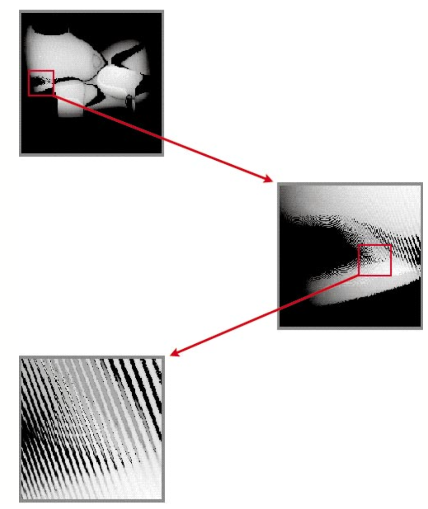
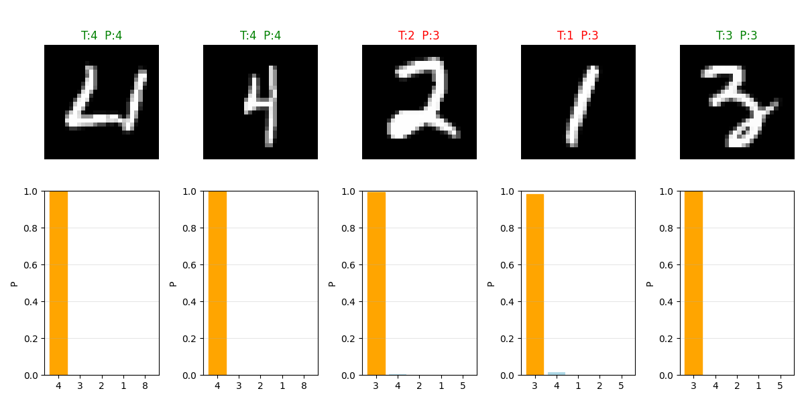
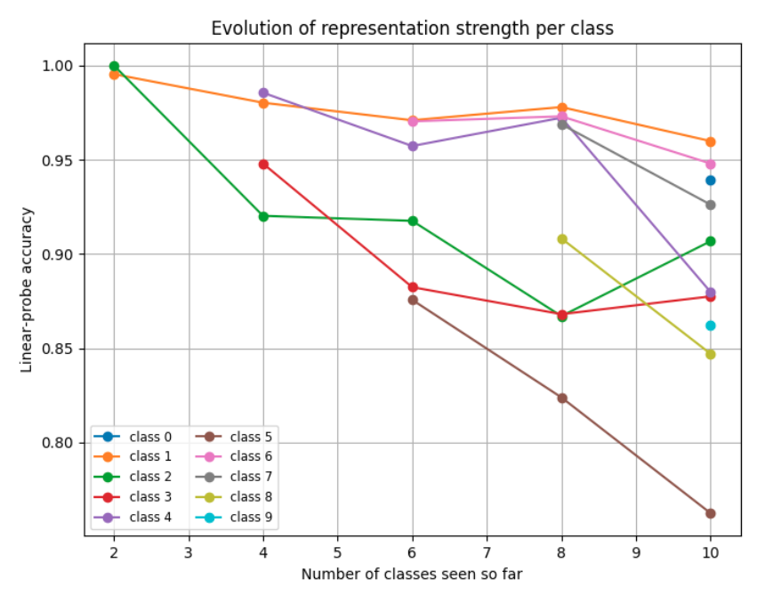

# Catastrophic forgetting

This file goes through my thought process on the subject, starting from the early research,
then current research, benchmarks and state-of-the-art, discussing my experiments so far
and finally the next questions I think are interesting to try to answer next.

## Early research

The problem of catastrophic forgetting (or catastrophic interference) was well research
in the late eighties and nineties. Papers such as `Richard S. Sutton, 1986`, 
`Michael McCloskey & Neal J . Cohen, 1989`, `Roger Ratcliff, 1990` and `Robert M. French, 1999` 
lay much of the fundation of what we know today, and are arguably still the best reference 
we have to understand the phenomenon.

Put it simply, catastrophic forgetting is what happens when we train a neural network to train task A,
and after it we train it to perform a second task B. The expected is the now the network is able to perform
both tasks, but what we get is a network that can perform task B and forgot how to perform task A.

The magnitude of this *forgetting* is most illustrative on the comparison with human subjects: 
`Barnes & Underwood, 1959` taught the subjects of 8 pair of random associated words, list A-B.
After the subjects had successfully learned the pairings, they were taught a second 8 pair, 
now associating the same stimuli A with a second response C, list A-C.

After learning the A-C pairs to varying degrees, the subjects were tested to see how much 
retention they still had of the A-B pairs - that is, the measure of how much *interference* 
or *forgetting* had been caused by the sequence learning protocol.

```
Teach A-B pairs of words

Teach A-C pairs of words

Test on the retention of the A-B pairs
```

As the subjects got better at the recall of the A-C list, their ability for recalling
the A-B list decreased, to about 52%. It is noted that regardless the level of the learning 
in the second list, unlearning the first list is virtually never complete and rarely exceeds 50%.


`Michael McCloskey & Neal J . Cohen, 1989` replicated this experiment using a small neural network,
that would learn to map `stimulus + context` to a `response`. The stimulus represented the A list,
the response the B or C lists, and the context informed the network which list it was on.

The results were pretty remarkable: The network learned the to map the pairs A-B just fine. 
Training on the second task, the network also learn how to do the A-C mapping. But, even 
*before* the network had made any correct prediction on the A-C list, the performance on 
the A-B list had gone to zero.


We replicated this experiment, and got the same result: 


In practice, what happens is that the network learns to the A-B sequence at first,
but after learning the A-C sequence it will not output B, only C, even thought each
`stimulus` is paired with a `context` vector indicating which list pair should be considered.

These early studies identified two causes for this phenomenon:

1. The nature of gradient descent optimization; and
2. The use of distributed representation.

### Gradient descent optimization

`Michael McCloskey & Neal J . Cohen, 1989` illustrated the problem of the gradient descent
learning algorithm in terms of the search in the weight space of a solution region for the 
problem at hand, that we understand as a region of low loss. If we have two tasks two learn,
we want the network to find a solution regions that is good for both. In the weight space, 
that means the intersection of the solution regions for the two problems.

When we train the network for both problems at the same time, both solutions are pulling our 
weights towards their direction, and as a consequence we move to a place that satisfies both
constraints.

Is sequential learning, however, our weights are pulled by just one solution at a time: 
We first move directly to the solution space of the first problem, and when we start training 
on the second problem our weights are pulled directly toward that direction, with nothing holding 
us back to the solution space of problem 1. We may as well finish training farther from solution 1 
than we started.

Therefore, we can say that once training for solution 1 stops and for solution 2 starts, 
there is nothing to cause the weights to go to the overall solution space.


`French, 1999` points that after we found the solution for our first problem, when we train 
for the second problem, even if we move just a little, it may disrupt prior learning: this 
is because the weight space is not *network friendly*, due to the presence of *weight cliffs*.



### Distributed representations

`French, 1999` and a number of other authors suggested that catastrophic forgetting was 
caused by the overlap of internal distributed representations, where changing a set of 
connections to a segment of the representation alters the output for all input examples.
Reduce this overlap could reduce catastrophic forgetting: using sparser representations 
the network could change connections targetting part of the inputs, without changing the 
output for inputs that had zeroes in those segments.

Following this reasoning, one solution for catastrophic forgetting tried for several authors 
were the use of semi-distributed representations, that kept many advantages of the fully 
distributed representations, but were not fully distributed.

However, it is also noted that reducing the overlap between different representations 
(making them sparser) also reduces the exploitation of shared structure between them - 
generalizability can only be achieved with distributed representations.


#### Catastrophic forgetting and sparse representations

main point is that 
This apparent inability of neural networks to learn sequentially when using distributed 
representation, and the presence of the hippocampus as a component of the human memory 
system that uses sparse representations gave inspiration to the Complementary Learning Systems 
theory ` James L. McClelland, Bruce L. McNaughton & Randall C O'Reilly, 1995`.

## Current research

The study of catastrophic forgetting was revived by `Ian J. Goodfellow et al., 2013`, 
with an empirical investigating the effect that different components of neural networks, 
such as dropout and the choice of activation, had in the forgetting effect. After that, 
*many* studies followed.

As it is usually the case, these studies vary a great deal in the protocols used for training 
and evaluation, and several claimed state-of-the-art results over the others. This unsatisfactory 
state of affairs made it very hard to compare different methods, but the work of 
`Gido M. van de Ven, Tinne Tuytelaars & Andreas S. Tolias, 2022` brought some organization:

Their main contribution was divide the sequential learning problem in three different scenarios:

1. Task incremental learning: easiest scenario, where the model is informed which task it should 
perform. It is allowed to train models with task specific components, such as a prediction head.

2. Domain-incremental learning: task identity is not available. The input distribution changes,
but the structure of the task is always the same (for instance, it has always the same number 
of output classes).

3. Class-incremental learning: task identity is not available and the structure of the task 
changes (for instance, the problem of incrementally learning new classes).


Class incremental learning is the most interesting and most challenging scenario.
They identified in the literature four family of methods for this problem:

1. Models that use weight regularization, to encourage important parameters for previous task 
to not change too much in later training.

2. Models that use functional regularization: using set of inputs outputs to anchor the *function* 
not too change too much. This models usually use destillation.

3. Replay based models: New training data is complemented with representative data from the past.

4. Template based models: Multi-stage multi-component methods, where first the task is inferred from the new sample,
and than the task is solved by a specialized model for that task.


They found that, currently, the only methods capable of solving the class-incremental learning scenario 
are replay or template based.


Additionally, two benchmark datasets were used: `Split-MNIST` and `Split-CIFAR100`.

## Experiments

We started doing experiments using the Split-MNIST protocol, to get a feel of how the phenomenon looks like. 

### Concurrent training

First, training a small neural network concurrently on all the classes (the typical training protocol).

```
class MLP(nn.Module):
    def __init__(self, input_dim=784, n_classes=10):
        super().__init__()

        self.fc1 = nn.Linear(input_dim, 120)
        self.fc2 = nn.Linear(120, 84)
        self.fc3 = nn.Linear(84, n_classes)

    def forward(self, x):

        x = F.relu(self.fc1(x))
        z = F.relu(self.fc2(x))
        logits = self.fc3(z)
        return logits, z
```

At 4 epochs we achieve a validation accuracy of `0.9646` - this will be the upper target/bound for the sequential training protocol. Looking at the latent space (representation space before the classification layer), we can see that the classes are well separated, with intra-samples clustered together.


### Sequential training

Now training on the Split-MNIST protocol, two classes at a time (Note: at all times the network has available the same prediction layer with ten outputs).

**Task 1, [1, 2]**

`Epoch 4, train loss 0.010796, train acc 0.996891, val loss 0.008445, val acc 0.996167`


**Task 2, [3, 4]**

`Epoch 4, train loss 0.003716, train acc 0.999099, val loss 11.001564, val acc 0.485862`

Training the second task the behavior typical of catastrophic forgetting appears: the neural network forgets very abruptly what it had learned in the previous task, at the same point it starts making progress in the new task. 


It is noticeable that the network is very confident in predicting the new classes for examples of the previous learned classes, such as 2 and 1, and when in doubt, it is always in doubt between the current classes. *This gets clear looking at the high validation loss: the previous classes get very low probabilities (e.g. $1.10^{-9}$)*



Looking at the latent space, we can see that the network is not very thorough in keeping all the classes separated: the previous class 1 is still very well separated from the others, but 2 got a little bit mingled with 3.


**Task 3, [5, 6]**

`Epoch 4, train loss 0.019041, train acc 0.993537, val loss 10.511510, val acc 0.314396`


**Task 4, [7, 8]**

`Epoch 4, train loss 0.011244, train acc 0.996527, val loss 11.454843, val acc 0.252061`


**Task 5, [9, 0]**

At the end of Task 5, we get an accuracy of aroung 20%, meaning that the network is classifying correctly only the last two classes presented.

`Epoch 4, train loss 0.007458, train acc 0.997570, val loss 12.196303, val acc 0.198500`


Looking at the latent space, we can see that it has some structure (examples from the same classes are generally together), but everything is very close together and a bit mixed.


These first two experiments present us with our upper and lower bounds for the problem.

**Upper bound, concurrent training**: 0.9646

**Lower bound, consecutive training**: 0.1985

#### Growing sparsity

Once several papers from the nineties focused on the sparcity of the representations as a means to curb forgetting (see e.g. `French, 1999`), we were interested in studying its properties. To measure it, we define the metric `population sparsity`: which is the proportion of neurons that fire in response to a given stimulus. 

For us, it is the number of activations that are zero over the total number of examples, averaged over all the training examples.

Interestingly, as we start measuring it in the sequential learning protocol, we see that the *sparsity of the activations grow spontaneously as training progresses*:

**Task 1, [1, 2]**

`Epoch 4, train loss 0.007918, train acc 0.997644, val loss 0.012917, val acc 0.995688`

`Population sparcity: 0.4987`


**Task 2, [3, 4]**

`Epoch 4, train loss 0.006190, train acc 0.998199, val loss 11.244117, val acc 0.485124`

`Population sparcity: 0.7782`


**Task 3, [5, 6]**

`Epoch 4, train loss 0.020671, train acc 0.993432, val loss 10.351263, val acc 0.314899`

`Population sparcity: 0.8593`


**Task 4, [7, 8]**

`Epoch 4, train loss 0.013371, train acc 0.995832, val loss 13.886833, val acc 0.251561`

`Population sparcity: 0.8637`


**Task 5, [9, 0]**

`Epoch 4, train loss 0.010451, train acc 0.996862, val loss 9.311324, val acc 0.19850`

`Population sparcity: 0.90260`


Besides the growing sparsity, other noticeable characteristic is that the remaining features grow rapidly in magnitude. This may be one of the causes for the very low probabilities given to the classes trained in the previous tasks.

#### Investigating the weight and bias changes in relation to the growing sparsity

We investigated what happens to the distribution of the weight and biases of the network as the training progresses. We *could not find any discrepancies in the weight distribution*, but there is a shift in the distribution of the biases.

We can see that both the mean and median of the bias distribution *shift to the left*, but at least one order of magnitude. This shift explains the *turning off* of features as the network learns new task.

| Regime    | Mean | Median | Std | Sparcity|
| -------- | ------- |------- |------- |------- |
| Concurrent  | 0.003    | 0.001 | 0.0487 | 0.5266 |
| Seq, task 1 | 0.005     | 0.008 | 0.0393 | 0.4517 |
| Seq, task 2 | -0.004    | -0.010 | 0.0495 | 0.7382 |
| Seq, task 3 | -0.013    | -0.016 | 0.0483 | 0.8361 |
| Seq, task 4 | -0.017    | -0.018 | 0.0534 | 0.8739 |
| Seq, task 5 | -0.022    | -0.023 | 0.0577 | 0.8965 |

This is like the network saying: *I do not want all these old features firing all the time, I will just turn them off*. By this means, the network curtails its capacity, keeping and learning only the features necessary for the classes at hand.

Another interesting insight from this is that if the biases are turning off the features learned on the weight matrices, there is a good chance they are not unlearned, but are still dormant there.

#### Avoiding the growing sparsity

Evaluating the network with different components, we found that batch normalization is very beneficial to the networks general *health*:

1. It successully avoids the growing sparsity of the network, keeping it feature-full; and
2. It avoids the values of the features growing unchecked.

One effect of this is that the loss of the network decreases significantly - it still presents the same catastrophic forgetting as before, but now the probabilities given for the previous classes are not extremelly low ($0.001$ instead of $1.10^{-9}$).

In practice, the very welcome benefit of batch normalization is that it makes the loss landscape smooth when it normalizes the feature vectors, making it more *network friendly*, as `French, 1999` puts it. Therefore, it should reduce the problem of high loss cliffs.

*Task 1*

`val loss 0.015192, sparcity: 0.5112`


*Task 2*

`val loss 3.735139, sparcity: 0.4764`


*Task 3*

`val loss 4.799133, sparcity: 0.4952`


*Task 4*

`val loss 5.491990, sparcity: 0.5100`


*Task 5*

`val loss 5.838927, sparcity: 0.5421`


| Regime    | Loss | Loss w/ BN | Sparcity | Sparcity w/ BN|
| -------- | ------- |------- |------- |------- |
| Seq, task 1 | 0.008     | 0.015 | 49.87% | 51.12% |
| Seq, task 2 | 11.001    | 3.735 | 77.82% | 47.64% |
| Seq, task 3 | 10.511    | 4.799 | 85.93% | 49.52% |
| Seq, task 4 | 11.454    | 5.491 | 86.37% | 51.00% |
| Seq, task 5 | 12.196    | 5.838 | 90.26% | 54.21% |

Also, note the smoothness of the training as compared with before, as well as the fact that as training progresses, the *forgetting curves* are shifted slightly to the right:

**Task 2, [3, 4]**

`Epoch 4, train loss 0.007366, train acc 0.998099, val loss 3.824531, val acc 0.485862`


**Task 3, [5, 6]**

`Epoch 4, train loss 0.013730, train acc 0.995444, val loss 5.355310, val acc 0.316407`


**Task 4, [7, 8]**

`Epoch 4, train loss 0.008876, train acc 0.997718, val loss 5.718965, val acc 0.253310`


**Task 5, [9, 0]**

`Epoch 4, train loss 0.010084, train acc 0.997267, val loss 5.813504, val acc 0.198700`


See how some of the previous classes get some probabilities:


#### Strength and lifetime of a memory

In computational neuroscience (see `Stefano Fusi, 2021`) it is useful two measure two metrics to quantify the plasticity and stability of a system:

1. The strength of the memory trace right after the memory was stored (reflects the degree of plasticity in the system); and
2. The lifetime of the memory (measures the stability of the system for storing memories over long times).

These measures are also interesting for our sequential learning problem, althought we may not be interested in characteristics of memories, but on how strong a representation is right after it is learned, and how does this measure changes over time, as the network learns new representations.

##### Linear probing

To measure the strength of a representation, or *how good a representation is*, we chose the most intuitive measure of linear probing: taking the latent representations of the neural network (right before the classification layer) and fitting a linear classifier. The accuracy of the linear classifier for each class will be the proxy for the representation strength.

**Regular sequential training**

| Accuracy    | Task 1  | 
|------------|---------  |
| Classifier | 0.9976 |   
| Class 1    | 0.9953 |   
| Class 2    | 1.0000 |   
| Class 3    |        |   
| Class 4    |        |   
| Class 5    |        |   
| Class 6    |        |   
| Class 7    |        |   
| Class 8    |        | 


| Accuracy    | Task 1 | Task 2 | 
|------------|--------- |--------- |
| Classifier | 0.9976 | 0.9459 |  
| Class 1    | 0.9953 | 0.9802 |  
| Class 2    | 1.0000 | 0.9014 |  
| Class 3    |        | 0.9219 |  
| Class 4    |        | 0.9807 |  
| Class 5    |        |        |  
| Class 6    |        |        |  
| Class 7    |        |        |  
| Class 8    |        |        |


| Accuracy    | Task 1 | Task 2 | Task 3 | 
|------------|--------- |--------- |--------- |
| Classifier | 0.9976 | 0.9459 | 0.8643 |  
| Class 1    | 0.9953 | 0.9802 | 0.9612 |  
| Class 2    | 1.0000 | 0.9014 | 0.7526 |  
| Class 3    |        | 0.9219 | 0.7941 |  
| Class 4    |        | 0.9807 | 0.9144 |  
| Class 5    |        |        | 0.8159 |  
| Class 6    |        |        | 0.9455 |  
| Class 7    |        |        |        |  
| Class 8    |        |        |        |  


| Accuracy    | Task 1 | Task 2 | Task 3 | Task 4 |
|------------|--------- |--------- |--------- |--------- |
| Classifier | 0.9976 | 0.9459 | 0.8643 | 0.6941 | 
| Class 1    | 0.9953 | 0.9802 | 0.9612 | 0.8982 | 
| Class 2    | 1.0000 | 0.9014 | 0.7526 | 0.6059 | 
| Class 3    |        | 0.9219 | 0.7941 | 0.3401 | 
| Class 4    |        | 0.9807 | 0.9144 | 0.8009 | 
| Class 5    |        |        | 0.8159 | 0.4318 | 
| Class 6    |        |        | 0.9455 | 0.7676 | 
| Class 7    |        |        |        | 0.9219 | 
| Class 8    |        |        |        | 0.7295 | 


| Accuracy    | Task 1 | Task 2 | Task 3 | Task 4 | Task 5 |
|------------|--------- |--------- |--------- |--------- |--------- |
| Classifier | 0.9976 | 0.9459 | 0.8643 | 0.6941 | 0.7190 |
| Class 1    | 0.9953 | 0.9802 | 0.9612 | 0.8982 | 0.8973 |
| Class 2    | 1.0000 | 0.9014 | 0.7526 | 0.6059 | 0.7876 |
| Class 3    |        | 0.9219 | 0.7941 | 0.3401 | 0.6275 |
| Class 4    |        | 0.9807 | 0.9144 | 0.8009 | 0.6393 |
| Class 5    |        |        | 0.8159 | 0.4318 | 0.3149 |  
| Class 6    |        |        | 0.9455 | 0.7676 | 0.7604 |  
| Class 7    |        |        |        | 0.9219 | 0.8916 |  
| Class 8    |        |        |        | 0.7295 | 0.5902 |  
| Class 9    |        |        |        |        | 0.6987 |  
| Class 0    |        |        |        |        | 0.9141 | 


The highlight here is that the decay is not as bad as expected, and overall the representations learned as a whole are mostly conserved: the classifier overall accuracy is 72% by the end of the fifth task. This is significantly worse than the 97% one can get from training the neural network concurrently, but it is much better than the sequential learning result apparently makes it to be (with its around 19% accuracy).

Particularly, some of the representations are kepts quite strongly, such as for the number 1, that is trained in the first task, and by the fifth task the linear probe still can classify it 89% correctly.

And another striking fact is that this is the result for the network trained with no remediation for the *growing sparsity problem* - so this results are for representations with 90% sparsity by the end of the fifth task. In this case, it is well for us to suspect that we might achieve still better results with we do not have to live with this problem.

**Sequential training without growing sparsity**

We perform the same test, now employing batch normalization to arrest the growing sparsity.


| Accuracy    | Task 1 |
|------------|--------- |
| Classifier | 0.9976 | 
| Class 1    | 0.9953 | 
| Class 2    | 1.0000 | 
| Class 3    |        | 
| Class 4    |        | 
| Class 5    |        | 
| Class 6    |        | 
| Class 7    |        | 
| Class 8    |        | 
| Class 9    |        | 
| Class 0    |        | 


| Accuracy    | Task 1 | Task 2 |
|------------|--------- |--------- |
| Classifier | 0.9976 | 0.9582 | 
| Class 1    | 0.9953 | 0.9802 | 
| Class 2    | 1.0000 | 0.9202 | 
| Class 3    |        | 0.9479 | 
| Class 4    |        | 0.9855 | 
| Class 5    |        |        | 
| Class 6    |        |        | 
| Class 7    |        |        | 
| Class 8    |        |        | 
| Class 9    |        |        | 
| Class 0    |        |        | 


| Accuracy    | Task 1 | Task 2 | Task 3 |
|------------|--------- |--------- |--------- |
| Classifier | 0.9976 | 0.9582 | 0.9288 | 
| Class 1    | 0.9953 | 0.9802 | 0.9709 | 
| Class 2    | 1.0000 | 0.9202 | 0.9175 | 
| Class 3    |        | 0.9479 | 0.8824 | 
| Class 4    |        | 0.9855 | 0.9572 | 
| Class 5    |        |        | 0.8756 | 
| Class 6    |        |        | 0.9703 | 
| Class 7    |        |        |        | 
| Class 8    |        |        |        | 
| Class 9    |        |        |        | 
| Class 0    |        |        |        | 


| Accuracy    | Task 1 | Task 2 | Task 3 | Task 4 |
|------------|--------- |--------- |--------- |--------- |
| Classifier | 0.9976 | 0.9582 | 0.9288 | 0.9220 | 
| Class 1    | 0.9953 | 0.9802 | 0.9709 | 0.9779 | 
| Class 2    | 1.0000 | 0.9202 | 0.9175 | 0.8670 | 
| Class 3    |        | 0.9479 | 0.8824 | 0.8680 | 
| Class 4    |        | 0.9855 | 0.9572 | 0.9722 | 
| Class 5    |        |        | 0.8756 | 0.8239 | 
| Class 6    |        |        | 0.9703 | 0.9730 | 
| Class 7    |        |        |        | 0.9688 | 
| Class 8    |        |        |        | 0.9082 | 
| Class 9    |        |        |        |        | 
| Class 0    |        |        |        |        | 


| Accuracy    | Task 1 | Task 2 | Task 3 | Task 4 | Task 5 |
|------------|--------- |--------- |--------- |--------- |--------- |
| Classifier | 0.9976 | 0.9582 | 0.9288 | 0.9220 | 0.8925 |
| Class 1    | 0.9953 | 0.9802 | 0.9709 | 0.9779 | 0.9598 |
| Class 2    | 1.0000 | 0.9202 | 0.9175 | 0.8670 | 0.9067 |
| Class 3    |        | 0.9479 | 0.8824 | 0.8680 | 0.8775 |
| Class 4    |        | 0.9855 | 0.9572 | 0.9722 | 0.8798 |
| Class 5    |        |        | 0.8756 | 0.8239 | 0.7624 |
| Class 6    |        |        | 0.9703 | 0.9730 | 0.9479 |
| Class 7    |        |        |        | 0.9688 | 0.9261 |
| Class 8    |        |        |        | 0.9082 | 0.8470 |
| Class 9    |        |        |        |        | 0.8619 |
| Class 0    |        |        |        |        | 0.9394 |



This shows that the batch normalization effect on arresting the growing sparsity and keeping the network feature-full is beneficial, and that it does conserve the representations of the classes learned well as new classes are learned.

Comparing:

```
NN with concurrent learning: 0.9646
NN with sequential learning: 0.1985
Representation sequential learning: 0.7190
Representation sequential learning w/ BN: 0.8925 
```

What this suggests for us is that most of the forgetting is taking place on the very last layer of the neural network, at the classification layer: which is probably being updated only to predict the last to classes, ignoring the rich representation below. This is a welcome surprise, and indicates that *the forgetting might be more shallow than expected*.

#### Investigating the gradients

Integrating the gradients for the network trained with batch normalization, taking as example Task 4:

It is clear to see the the output layer is updated considerably more stronly than the other alyers (at least by one order of magnitude). Particularly, its updates are to make the two current classes being trained have larger probabilities, and the previous classes to have lower probabilities.

*The x coordinate represents the input features for the weight matrix, and the y coordinate the output feature*.


#### Shallow forgetting

`Hetherington & Seidenberg, 1989` replied the papers regarding the phenomenon of catastrophic inference, devising a metric called *savings*, which was inspired by the pioneering work of `Ebbinghaus, 1885`.

They argued that after the *catastrophic forgetting* occured in a neural network, it might possible that the solutions to the problem were not completed unlearned by the network. This could be determined by the *savings* accrued when the same task was learned again:

* If the previous problem had been completely unlearned, it should be relearned at the same rate as a completely new problem.
* Savings, or a faster learning time, would indicate that the network still retained relevant information for computing the correct answers, facilitating relearning.

They tested this hyphotesis and found that in general there are *savings* - indicating that global measures may not fully capture all that a model has learned, and that catastrophic forgetting may be improved by a small number of relearning trials.

## Coming up

* Does this shallow forgetting holds for more challenging benchmarks (e.g. Split-CIFAR100)?
* This result suggest that only a small amount of retraining might overcome the forgetting. 
    * How much replay is needed to recover the full accuracy of the network?
    * If there is no data available, how much *pseudo-replay* is needed?
* It also suggests that methods targetting the classification layer could have good results. What has been done and what could be done here?


