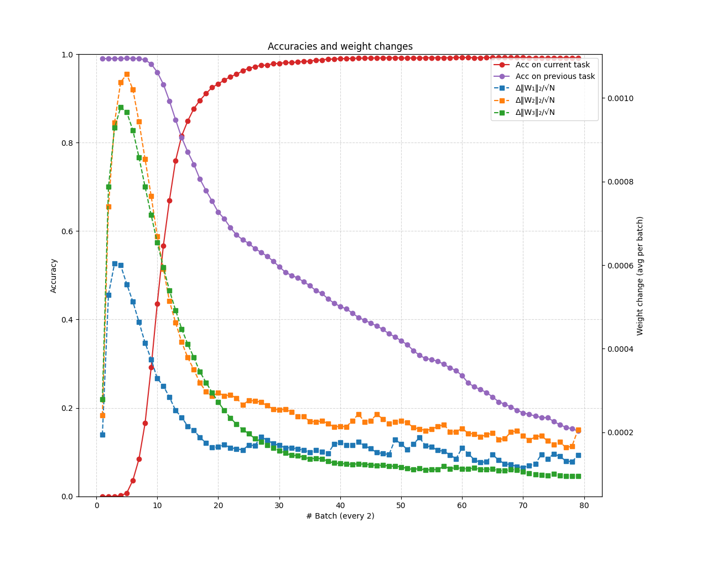
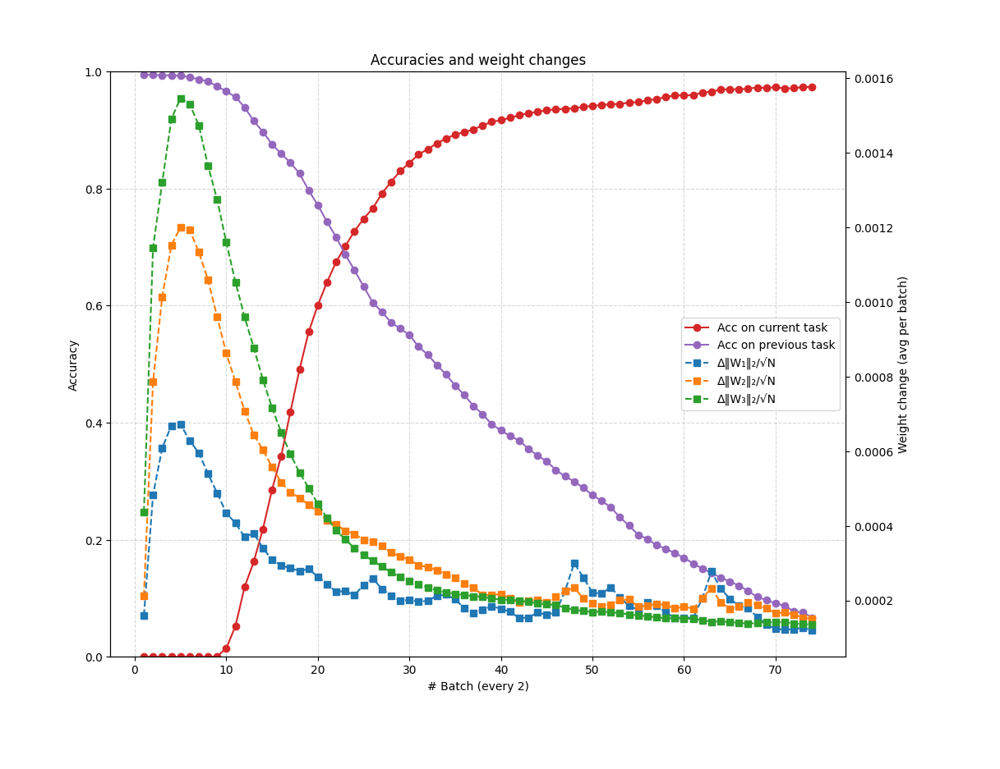

# Catastrophic forgetting

This file goes through my thought process on the subject, starting from the early research,
then current research, benchmarks and state-of-the-art, discussing my experiments so far
and finally the next questions I think are interesting to try to answer next.

## Early research

The problem of catastrophic forgetting (or catastrophic interference) was well research
in the late eighties and nineties. Papers such as `Richard S. Sutton, 1986`, 
`Michael McCloskey & Neal J . Cohen, 1989`, `Roger Ratcliff, 1990` and `Robert M. French, 1999` 
lay much of the fundation of what we know today, and are arguably still the best reference 
we have to understand the phenomenon.

Put it simply, catastrophic forgetting is what happens when we train a neural network to train task A,
and after it we train it to perform a second task B. The expected is the now the network is able to perform
both tasks, but what we get is a network that can perform task B and forgot how to perform task A.

The magnitude of this *forgetting* is most illustrative on the comparison with human subjects: 
`Barnes & Underwood, 1959` taught the subjects of 8 pair of random associated words, list A-B.
After the subjects had successfully learned the pairings, they were taught a second 8 pair, 
now associating the same stimuli A with a second response C, list A-C.

After learning the A-C pairs to varying degrees, the subjects were tested to see how much 
retention they still had of the A-B pairs - that is, the measure of how much *interference* 
or *forgetting* had been caused by the sequence learning protocol.

```
Teach A-B pairs of words

Teach A-C pairs of words

Test on the retention of the A-B pairs
```

As the subjects got better at the recall of the A-C list, their ability for recalling
the A-B list decreased, to about 52%. It is noted that regardless the level of the learning 
in the second list, unlearning the first list is virtually never complete and rarely exceeds 50%.


`Michael McCloskey & Neal J . Cohen, 1989` replicated this experiment using a small neural network,
that would learn to map `stimulus + context` to a `response`. The stimulus represented the A list,
the response the B or C lists, and the context informed the network which list it was on.

The results were pretty remarkable: The network learned the to map the pairs A-B just fine. 
Training on the second task, the network also learn how to do the A-C mapping. But, even 
*before* the network had made any correct prediction on the A-C list, the performance on 
the A-B list had gone to zero.


We replicated this experiment, and got the same result: 


In practice, what happens is that the network learns to the A-B sequence at first,
but after learning the A-C sequence it will not output B, only C, even thought each
`stimulus` is paired with a `context` vector indicating which list pair should be considered.

These early studies identified two causes for this phenomenon:

1. The nature of gradient descent optimization; and
2. The use of distributed representation.

### Gradient descent optimization

`Michael McCloskey & Neal J . Cohen, 1989` illustrated the problem of the gradient descent
learning algorithm in terms of the search in the weight space of a solution region for the 
problem at hand, that we understand as a region of low loss. If we have two tasks two learn,
we want the network to find a solution regions that is good for both. In the weight space, 
that means the intersection of the solution regions for the two problems.

When we train the network for both problems at the same time, both solutions are pulling our 
weights towards their direction, and as a consequence we move to a place that satisfies both
constraints.

Is sequential learning, however, our weights are pulled by just one solution at a time: 
We first move directly to the solution space of the first problem, and when we start training 
on the second problem our weights are pulled directly toward that direction, with nothing holding 
us back to the solution space of problem 1. We may as well finish training farther from solution 1 
than we started.

Therefore, we can say that once training for solution 1 stops and for solution 2 starts, 
there is nothing to cause the weights to go to the overall solution space.


`French, 1999` points that after we found the solution for our first problem, when we train 
for the second problem, even if we move just a little, it may disrupt prior learning: this 
is because the weight space is not *network friendly*, due to the presence of *weight cliffs*.


### Distributed representations

`French, 1999` and a number of other authors suggested that catastrophic forgetting was 
caused by the overlap of internal distributed representations, where changing a set of 
connections to a segment of the representation alters the output for all input examples.
Reduce this overlap could reduce catastrophic forgetting: using sparser representations 
the network could change connections targetting part of the inputs, without changing the 
output for inputs that had zeroes in those segments.

Following this reasoning, one solution for catastrophic forgetting tried for several authors 
were the use of semi-distributed representations, that kept many advantages of the fully 
distributed representations, but were not fully distributed.

However, it is also noted that reducing the overlap between different representations 
(making them sparser) also reduces the exploitation of shared structure between them - 
generalizability can only be achieved with distributed representations.


#### Catastrophic forgetting and sparse representations

main point is that 
This apparent inability of neural networks to learn sequentially when using distributed 
representation, and the presence of the hippocampus as a component of the human memory 
system that uses sparse representations gave inspiration to the Complementary Learning Systems 
theory ` James L. McClelland, Bruce L. McNaughton & Randall C O'Reilly, 1995`.

## Current research

The study of catastrophic forgetting was revived by `Ian J. Goodfellow et al., 2013`, 
with an empirical investigating the effect that different components of neural networks, 
such as dropout and the choice of activation, had in the forgetting effect. After that, 
*many* studies followed.

As it is usually the case, these studies vary a great deal in the protocols used for training 
and evaluation, and several claimed state-of-the-art results over the others. This unsatisfactory 
state of affairs made it very hard to compare different methods, but the work of 
`Gido M. van de Ven, Tinne Tuytelaars & Andreas S. Tolias, 2022` brought some organization:

Their main contribution was divide the sequential learning problem in three different scenarios:

1. Task incremental learning: easiest scenario, where the model is informed which task it should 
perform. It is allowed to train models with task specific components, such as a prediction head.

2. Domain-incremental learning: task identity is not available. The input distribution changes,
but the structure of the task is always the same (for instance, it has always the same number 
of output classes).

3. Class-incremental learning: task identity is not available and the structure of the task 
changes (for instance, the problem of incrementally learning new classes).


Class incremental learning is the most interesting and most challenging scenario.
They identified in the literature four family of methods for this problem:

1. Models that use weight regularization, to encourage important parameters for previous task 
to not change too much in later training.

2. Models that use functional regularization: using set of inputs outputs to anchor the *function* 
not too change too much. This models usually use destillation.

3. Replay based models: New training data is complemented with representative data from the past.

4. Template based models: Multi-stage multi-component methods, where first the task is inferred from the new sample,
and than the task is solved by a specialized model for that task.


They found that, currently, the only methods capable of solving the class-incremental learning scenario 
are replay or template based.


Additionally, two benchmark datasets were used: `Split-MNIST` and `Split-CIFAR100`.

## Experiments

We started doing experiments using the Split-MNIST protocol, to get a feel of how the phenomenon looks like. 

### Concurrent training

First, training a small neural network concurrently on all the classes (the typical training protocol).

```
class MLP(nn.Module):
    def __init__(self, input_dim=784, n_classes=10):
        super().__init__()

        self.fc1 = nn.Linear(input_dim, 120)
        self.fc2 = nn.Linear(120, 84)
        self.fc3 = nn.Linear(84, n_classes)

    def forward(self, x):

        x = F.relu(self.fc1(x))
        z = F.relu(self.fc2(x))
        logits = self.fc3(z)
        return logits, z
```

At 4 epochs we achieve a validation accuracy of `0.9646` - this will be the upper target/bound for the sequential training protocol. Looking at the latent space (representation space before the classification layer), we can see that the classes are well separated, with intra-samples clustered together.


### Sequential training

Now training on the Split-MNIST protocol, two classes at a time (Note: at all times the network has available the same prediction layer with ten outputs).

**Task 1, [1, 2]**

`Epoch 4, train loss 0.010796, train acc 0.996891, val loss 0.008445, val acc 0.996167`


**Task 2, [3, 4]**

`Epoch 4, train loss 0.003716, train acc 0.999099, val loss 11.001564, val acc 0.485862`

Training the second task the behavior typical of catastrophic forgetting appears: the neural network forgets very abruptly what it had learned in the previous task, at the same point it starts making progress in the new task. 


It is noticeable that the network is very confident in predicting the new classes for examples of the previous learned classes, such as 2 and 1, and when in doubt, it is always in doubt between the current classes. *This gets clear looking at the high validation loss: the previous classes get very low probabilities (e.g. $1.10^{-9}$)*


Looking at the latent space, we can see that the network is not very thorough in keeping all the classes separated: the previous class 1 is still very well separated from the others, but 2 got a little bit mingled with 3.


**Task 3, [5, 6]**

`Epoch 4, train loss 0.019041, train acc 0.993537, val loss 10.511510, val acc 0.314396`


**Task 4, [7, 8]**

`Epoch 4, train loss 0.011244, train acc 0.996527, val loss 11.454843, val acc 0.252061`


**Task 5, [9, 0]**

At the end of Task 5, we get an accuracy of aroung 20%, meaning that the network is classifying correctly only the last two classes presented.

`Epoch 4, train loss 0.007458, train acc 0.997570, val loss 12.196303, val acc 0.198500`


Looking at the latent space, we can see that it has some structure (examples from the same classes are generally together), but everything is very close together and a bit mixed.


These first two experiments present us with our upper and lower bounds for the problem.

**Upper bound, concurrent training**: 0.9646

**Lower bound, consecutive training**: 0.1985

#### Growing sparsity

Once several papers from the nineties focused on the sparcity of the representations as a means to curb forgetting (see e.g. `French, 1999`), we were interested in studying its properties. To measure it, we define the metric `population sparsity`: which is the proportion of neurons that fire in response to a given stimulus. 

For us, it is the number of activations that are zero over the total number of examples, averaged over all the training examples.

Interestingly, as we start measuring it in the sequential learning protocol, we see that the *sparsity of the activations grow spontaneously as training progresses*:

**Task 1, [1, 2]**

`Epoch 4, train loss 0.007918, train acc 0.997644, val loss 0.012917, val acc 0.995688`

`Population sparcity: 0.4987`


**Task 2, [3, 4]**

`Epoch 4, train loss 0.006190, train acc 0.998199, val loss 11.244117, val acc 0.485124`

`Population sparcity: 0.7782`


**Task 3, [5, 6]**

`Epoch 4, train loss 0.020671, train acc 0.993432, val loss 10.351263, val acc 0.314899`

`Population sparcity: 0.8593`


**Task 4, [7, 8]**

`Epoch 4, train loss 0.013371, train acc 0.995832, val loss 13.886833, val acc 0.251561`

`Population sparcity: 0.8637`


**Task 5, [9, 0]**

`Epoch 4, train loss 0.010451, train acc 0.996862, val loss 9.311324, val acc 0.19850`

`Population sparcity: 0.90260`


Besides the growing sparsity, other noticeable characteristic is that the remaining features grow rapidly in magnitude. This may be one of the causes for the very low probabilities given to the classes trained in the previous tasks.

#### Investigating the weight and bias changes in relation to the growing sparsity

We investigated what happens to the distribution of the weight and biases of the network as the training progresses. We *could not find any discrepancies in the weight distribution*, but there is a shift in the distribution of the biases.

We can see that both the mean and median of the bias distribution *shift to the left*, but at least one order of magnitude. This shift explains the *turning off* of features as the network learns new task.

| Regime    | Mean | Median | Std | Sparcity|
| -------- | ------- |------- |------- |------- |
| Concurrent  | 0.003    | 0.001 | 0.0487 | 0.5266 |
| Seq, task 1 | 0.005     | 0.008 | 0.0393 | 0.4517 |
| Seq, task 2 | -0.004    | -0.010 | 0.0495 | 0.7382 |
| Seq, task 3 | -0.013    | -0.016 | 0.0483 | 0.8361 |
| Seq, task 4 | -0.017    | -0.018 | 0.0534 | 0.8739 |
| Seq, task 5 | -0.022    | -0.023 | 0.0577 | 0.8965 |

This is like the network saying: *I do not want all these old features firing all the time, I will just turn them off*. By this means, the network curtails its capacity, keeping and learning only the features necessary for the classes at hand.

Another interesting insight from this is that if the biases are turning off the features learned on the weight matrices, there is a good chance they are not unlearned, but are still dormant there.

#### Avoiding the growing sparsity

Evaluating the network with different components, we found that batch normalization is very beneficial to the networks general *health*:

1. It successully avoids the growing sparsity of the network, keeping it feature-full; and
2. It avoids the values of the features growing unchecked.

One effect of this is that the loss of the network decreases significantly - it still presents the same catastrophic forgetting as before, but now the probabilities given for the previous classes are not extremelly low ($0.001$ instead of $1.10^{-9}$).

In practice, the very welcome benefit of batch normalization is that it makes the loss landscape smooth when it normalizes the feature vectors, making it more *network friendly*, as `French, 1999` puts it. Therefore, it should reduce the problem of high loss cliffs.

*Task 1*

`val loss 0.015192, sparcity: 0.5112`


*Task 2*

`val loss 3.735139, sparcity: 0.4764`


*Task 3*

`val loss 4.799133, sparcity: 0.4952`


*Task 4*

`val loss 5.491990, sparcity: 0.5100`


*Task 5*

`val loss 5.838927, sparcity: 0.5421`


| Regime    | Loss | Loss w/ BN | Sparcity | Sparcity w/ BN|
| -------- | ------- |------- |------- |------- |
| Seq, task 1 | 0.008     | 0.015 | 49.87% | 51.12% |
| Seq, task 2 | 11.001    | 3.735 | 77.82% | 47.64% |
| Seq, task 3 | 10.511    | 4.799 | 85.93% | 49.52% |
| Seq, task 4 | 11.454    | 5.491 | 86.37% | 51.00% |
| Seq, task 5 | 12.196    | 5.838 | 90.26% | 54.21% |

Also, note the smoothness of the training as compared with before, as well as the fact that as training progresses, the *forgetting curves* are shifted slightly to the right:

**Task 2, [3, 4]**

`Epoch 4, train loss 0.007366, train acc 0.998099, val loss 3.824531, val acc 0.485862`


**Task 3, [5, 6]**

`Epoch 4, train loss 0.013730, train acc 0.995444, val loss 5.355310, val acc 0.316407`


**Task 4, [7, 8]**

`Epoch 4, train loss 0.008876, train acc 0.997718, val loss 5.718965, val acc 0.253310`


**Task 5, [9, 0]**

`Epoch 4, train loss 0.010084, train acc 0.997267, val loss 5.813504, val acc 0.198700`


See how some of the previous classes get some probabilities:


#### Strength and lifetime of a memory

In computational neuroscience (see `Stefano Fusi, 2021`) it is useful two measure two metrics to quantify the plasticity and stability of a system:

1. The strength of the memory trace right after the memory was stored (reflects the degree of plasticity in the system); and
2. The lifetime of the memory (measures the stability of the system for storing memories over long times).

These measures are also interesting for our sequential learning problem, althought we may not be interested in characteristics of memories, but on how strong a representation is right after it is learned, and how does this measure changes over time, as the network learns new representations.

##### Linear probing

To measure the strength of a representation, or *how good a representation is*, we chose the most intuitive measure of linear probing: taking the latent representations of the neural network (right before the classification layer) and fitting a linear classifier. The accuracy of the linear classifier for each class will be the proxy for the representation strength.

**Regular sequential training**

| Accuracy    | Task 1  | 
|------------|---------  |
| Classifier | 0.9976 |   
| Class 1    | 0.9953 |   
| Class 2    | 1.0000 |   
| Class 3    |        |   
| Class 4    |        |   
| Class 5    |        |   
| Class 6    |        |   
| Class 7    |        |   
| Class 8    |        | 


| Accuracy    | Task 1 | Task 2 | 
|------------|--------- |--------- |
| Classifier | 0.9976 | 0.9459 |  
| Class 1    | 0.9953 | 0.9802 |  
| Class 2    | 1.0000 | 0.9014 |  
| Class 3    |        | 0.9219 |  
| Class 4    |        | 0.9807 |  
| Class 5    |        |        |  
| Class 6    |        |        |  
| Class 7    |        |        |  
| Class 8    |        |        |


| Accuracy    | Task 1 | Task 2 | Task 3 | 
|------------|--------- |--------- |--------- |
| Classifier | 0.9976 | 0.9459 | 0.8643 |  
| Class 1    | 0.9953 | 0.9802 | 0.9612 |  
| Class 2    | 1.0000 | 0.9014 | 0.7526 |  
| Class 3    |        | 0.9219 | 0.7941 |  
| Class 4    |        | 0.9807 | 0.9144 |  
| Class 5    |        |        | 0.8159 |  
| Class 6    |        |        | 0.9455 |  
| Class 7    |        |        |        |  
| Class 8    |        |        |        |  


| Accuracy    | Task 1 | Task 2 | Task 3 | Task 4 |
|------------|--------- |--------- |--------- |--------- |
| Classifier | 0.9976 | 0.9459 | 0.8643 | 0.6941 | 
| Class 1    | 0.9953 | 0.9802 | 0.9612 | 0.8982 | 
| Class 2    | 1.0000 | 0.9014 | 0.7526 | 0.6059 | 
| Class 3    |        | 0.9219 | 0.7941 | 0.3401 | 
| Class 4    |        | 0.9807 | 0.9144 | 0.8009 | 
| Class 5    |        |        | 0.8159 | 0.4318 | 
| Class 6    |        |        | 0.9455 | 0.7676 | 
| Class 7    |        |        |        | 0.9219 | 
| Class 8    |        |        |        | 0.7295 | 


| Accuracy    | Task 1 | Task 2 | Task 3 | Task 4 | Task 5 |
|------------|--------- |--------- |--------- |--------- |--------- |
| Classifier | 0.9976 | 0.9459 | 0.8643 | 0.6941 | 0.7190 |
| Class 1    | 0.9953 | 0.9802 | 0.9612 | 0.8982 | 0.8973 |
| Class 2    | 1.0000 | 0.9014 | 0.7526 | 0.6059 | 0.7876 |
| Class 3    |        | 0.9219 | 0.7941 | 0.3401 | 0.6275 |
| Class 4    |        | 0.9807 | 0.9144 | 0.8009 | 0.6393 |
| Class 5    |        |        | 0.8159 | 0.4318 | 0.3149 |  
| Class 6    |        |        | 0.9455 | 0.7676 | 0.7604 |  
| Class 7    |        |        |        | 0.9219 | 0.8916 |  
| Class 8    |        |        |        | 0.7295 | 0.5902 |  
| Class 9    |        |        |        |        | 0.6987 |  
| Class 0    |        |        |        |        | 0.9141 | 


The highlight here is that the decay is not as bad as expected, and overall the representations learned as a whole are mostly conserved: the classifier overall accuracy is 72% by the end of the fifth task. This is significantly worse than the 97% one can get from training the neural network concurrently, but it is much better than the sequential learning result apparently makes it to be (with its around 19% accuracy).

Particularly, some of the representations are kepts quite strongly, such as for the number 1, that is trained in the first task, and by the fifth task the linear probe still can classify it 89% correctly.

And another striking fact is that this is the result for the network trained with no remediation for the *growing sparsity problem* - so this results are for representations with 90% sparsity by the end of the fifth task. In this case, it is well for us to suspect that we might achieve still better results with we do not have to live with this problem.

**Sequential training without growing sparsity**

We perform the same test, now employing batch normalization to arrest the growing sparsity.


| Accuracy    | Task 1 |
|------------|--------- |
| Classifier | 0.9976 | 
| Class 1    | 0.9953 | 
| Class 2    | 1.0000 | 
| Class 3    |        | 
| Class 4    |        | 
| Class 5    |        | 
| Class 6    |        | 
| Class 7    |        | 
| Class 8    |        | 
| Class 9    |        | 
| Class 0    |        | 


| Accuracy    | Task 1 | Task 2 |
|------------|--------- |--------- |
| Classifier | 0.9976 | 0.9582 | 
| Class 1    | 0.9953 | 0.9802 | 
| Class 2    | 1.0000 | 0.9202 | 
| Class 3    |        | 0.9479 | 
| Class 4    |        | 0.9855 | 
| Class 5    |        |        | 
| Class 6    |        |        | 
| Class 7    |        |        | 
| Class 8    |        |        | 
| Class 9    |        |        | 
| Class 0    |        |        | 


| Accuracy    | Task 1 | Task 2 | Task 3 |
|------------|--------- |--------- |--------- |
| Classifier | 0.9976 | 0.9582 | 0.9288 | 
| Class 1    | 0.9953 | 0.9802 | 0.9709 | 
| Class 2    | 1.0000 | 0.9202 | 0.9175 | 
| Class 3    |        | 0.9479 | 0.8824 | 
| Class 4    |        | 0.9855 | 0.9572 | 
| Class 5    |        |        | 0.8756 | 
| Class 6    |        |        | 0.9703 | 
| Class 7    |        |        |        | 
| Class 8    |        |        |        | 
| Class 9    |        |        |        | 
| Class 0    |        |        |        | 


| Accuracy    | Task 1 | Task 2 | Task 3 | Task 4 |
|------------|--------- |--------- |--------- |--------- |
| Classifier | 0.9976 | 0.9582 | 0.9288 | 0.9220 | 
| Class 1    | 0.9953 | 0.9802 | 0.9709 | 0.9779 | 
| Class 2    | 1.0000 | 0.9202 | 0.9175 | 0.8670 | 
| Class 3    |        | 0.9479 | 0.8824 | 0.8680 | 
| Class 4    |        | 0.9855 | 0.9572 | 0.9722 | 
| Class 5    |        |        | 0.8756 | 0.8239 | 
| Class 6    |        |        | 0.9703 | 0.9730 | 
| Class 7    |        |        |        | 0.9688 | 
| Class 8    |        |        |        | 0.9082 | 
| Class 9    |        |        |        |        | 
| Class 0    |        |        |        |        | 


| Accuracy    | Task 1 | Task 2 | Task 3 | Task 4 | Task 5 |
|------------|--------- |--------- |--------- |--------- |--------- |
| Classifier | 0.9976 | 0.9582 | 0.9288 | 0.9220 | 0.8925 |
| Class 1    | 0.9953 | 0.9802 | 0.9709 | 0.9779 | 0.9598 |
| Class 2    | 1.0000 | 0.9202 | 0.9175 | 0.8670 | 0.9067 |
| Class 3    |        | 0.9479 | 0.8824 | 0.8680 | 0.8775 |
| Class 4    |        | 0.9855 | 0.9572 | 0.9722 | 0.8798 |
| Class 5    |        |        | 0.8756 | 0.8239 | 0.7624 |
| Class 6    |        |        | 0.9703 | 0.9730 | 0.9479 |
| Class 7    |        |        |        | 0.9688 | 0.9261 |
| Class 8    |        |        |        | 0.9082 | 0.8470 |
| Class 9    |        |        |        |        | 0.8619 |
| Class 0    |        |        |        |        | 0.9394 |


This shows that the batch normalization effect on arresting the growing sparsity and keeping the network feature-full is beneficial, and that it does conserve the representations of the classes learned well as new classes are learned.

Comparing:

```
NN with concurrent learning: 0.9646
NN with sequential learning: 0.1985
Representation sequential learning: 0.7190
Representation sequential learning w/ BN: 0.8925 
```

What this suggests for us is that most of the forgetting is taking place on the very last layer of the neural network, at the classification layer: which is probably being updated only to predict the last to classes, ignoring the rich representation below. This is a welcome surprise, and indicates that *the forgetting might be more shallow than expected*.

#### Investigating the gradients

Integrating the gradients for the network trained with batch normalization, taking as example Task 4:

It is clear to see the the output layer is updated considerably more stronly than the other alyers (at least by one order of magnitude). Particularly, its updates are to make the two current classes being trained have larger probabilities, and the previous classes to have lower probabilities.

*The x coordinate represents the input features for the weight matrix, and the y coordinate the output feature*.


#### Shallow forgetting

`Hetherington & Seidenberg, 1989` replied the papers regarding the phenomenon of catastrophic inference, devising a metric called *savings*, which was inspired by the pioneering work of `Ebbinghaus, 1885`.

They argued that after the *catastrophic forgetting* occured in a neural network, it might possible that the solutions to the problem were not completed unlearned by the network. This could be determined by the *savings* accrued when the same task was learned again:

* If the previous problem had been completely unlearned, it should be relearned at the same rate as a completely new problem.
* Savings, or a faster learning time, would indicate that the network still retained relevant information for computing the correct answers, facilitating relearning.

They tested this hyphotesis and found that in general there are *savings* - indicating that global measures may not fully capture all that a model has learned, and that catastrophic forgetting may be improved by a small number of relearning trials.

## Coming up

* Does this shallow forgetting holds for more challenging benchmarks (e.g. Split-CIFAR100)?
* This result suggest that only a small amount of retraining might overcome the forgetting. 
    * How much replay is needed to recover the full accuracy of the network?
    * If there is no data available, how much *pseudo-replay* is needed?
* It also suggests that methods targetting the classification layer could have good results. What has been done and what could be done here?

## 17th September

**Recap:** We found that despite the apparent forgetfullness of the model, its hidden layers were able to preseve good representations of the classes learned previously.

| Accuracy    | Task 1 | Task 2 | Task 3 | Task 4 | Task 5 |
|------------|--------- |--------- |--------- |--------- |--------- |
| Classifier | 0.9976 | 0.9582 | 0.9288 | 0.9220 | 0.8925 |
| Class 1    | 0.9953 | 0.9802 | 0.9709 | 0.9779 | 0.9598 |
| Class 2    | 1.0000 | 0.9202 | 0.9175 | 0.8670 | 0.9067 |
| Class 3    |        | 0.9479 | 0.8824 | 0.8680 | 0.8775 |
| Class 4    |        | 0.9855 | 0.9572 | 0.9722 | 0.8798 |
| Class 5    |        |        | 0.8756 | 0.8239 | 0.7624 |
| Class 6    |        |        | 0.9703 | 0.9730 | 0.9479 |
| Class 7    |        |        |        | 0.9688 | 0.9261 |
| Class 8    |        |        |        | 0.9082 | 0.8470 |
| Class 9    |        |        |        |        | 0.8619 |
| Class 0    |        |        |        |        | 0.9394 |


Comparing:

```
NN with concurrent learning: 0.9646
NN with sequential learning: 0.1985
Representation sequential learning: 0.7190
Representation sequential learning w/ BN: 0.8925 
```

This suggested to us that the forgetting was more *shallow* than previously antecipated, being mostly concentrated on the prediction layer - which was learning to get the current classes right while shutting the other classes off.

### How general are the features extracted

One question that we wanted to answer was: How general are the features the neural network learned to extract? Can it generalize for unseen tasks?

For this, we trained the network on all five tasks, and at each point we evaluated how well it would predict the classes **[9, 0]**, which it would see only at the last task:

**Task 1, [1, 2]**

Evaluating on [0, 9]:

Linear probe overall acc: 0.9774

Class 9 accuracy on linear probing: 0.9848

Class 0 accuracy on linear probing: 0.9703


**Task 2, [3, 4]**

Linear probe overall acc: 0.9950

Class 9 accuracy on linear probing: 0.9949

Class 0 accuracy on linear probing: 0.9950


**Task 3, [5, 6]**

Linear probe overall acc: 0.9900

Class 9 accuracy on linear probing: 0.9898

Class 0 accuracy on linear probing: 0.9901


**Task 4, [7, 8]**

Linear probe overall acc: 0.9950

Class 9 accuracy on linear probing: 0.9949

Class 0 accuracy on linear probing: 0.9950


**Task 5, [9, 0]**

Linear probe overall acc: 0.9975

Class 9 accuracy on linear probing: 1.0000

Class 0 accuracy on linear probing: 0.9950


| Accuracy    | Task 1 | Task 2 | Task 3 | Task 4 | Task 5 |
|------------|-------- |------- |------- |------- |------- |
| Classifier | 0.9774 | 0.9950 | 0.9900 | 0.9950 | 0.9975 |
| Class 0    | 0.9703 | 0.9950 | 0.9901 | 0.9950 | 0.9950 |
| Class 9    | 0.9848 | 0.9949 | 0.9898 | 0.9949 | 1.0000 |


We can see that from the first task the network had pretty much learned the good features to separate digits in general (using 0 and 9 as a proxy). It means that for the next tasks, what was left was to try to make the current classes more far apart - as we can observe was the case for the fifth task, where the digits [9, 0] were finally seen on training - and change the weight in the classification layer, so that the new classes are predicted.

* To make sure this was not because of some charactersitics of 1's and 2's that make them specially good prototypes, the same experiment was done again starting training with [3, 8] and [1, 4], and the same results were obtained.

##### Performance on all classes

How does the performance of the network evolves for the classification of all ten digits, as it trains:

| Accuracy    | Task 1 | Task 2 | Task 3 | Task 4 | Task 5 |
|------------|------- |------- |------- |------- |------- |
| Classifier | 0.8470 | 0.8820 | 0.8835 | 0.8935 | 0.8905 |
| Class 0    | 0.9343 | 0.9293 | 0.8788 | 0.9091 | 0.9596 |
| Class 1    | 0.9688 | 0.9554 | 0.9598 | 0.9688 | 0.9688 |
| Class 2    | 0.8912 | 0.8653 | 0.9067 | 0.9067 | 0.8808 |
| Class 3    | 0.8235 | 0.8284 | 0.8922 | 0.8873 | 0.9020 |
| Class 4    | 0.7869 | 0.9235 | 0.8743 | 0.8579 | 0.8470 |
| Class 5    | 0.8011 | 0.7790 | 0.7624 | 0.8122 | 0.7901 |
| Class 6    | 0.8750 | 0.9323 | 0.9583 | 0.9219 | 0.9375 |
| Class 7    | 0.8276 | 0.9015 | 0.8818 | 0.9261 | 0.9163 |
| Class 8    | 0.7158 | 0.8142 | 0.8470 | 0.8907 | 0.8470 |
| Class 9    | 0.8201 | 0.8745 | 0.8577 | 0.8452 | 0.8410 |

It seems that the features that are important to separate digits in the latent space were for a large part learned during the first task. From task 1 to task 5, around 5 p.p. were gained in performance, showing that there was some refiniment in the representation: probably taking the current digits more far apart. And this change seems no to distress much the representation of the other digits.

**Interpretation**: This result alters my interpretation of previous results. I was thinking that the network was learning to extract features for each class of digit as it was training on them (first only 1's and 2's, then 3's and 4's, and so on), and then as it was learning new classes, somehow it was preserving knowledge of previously learned classes.

But this does not seem the case anymore: The current result suggests that, the network right from the start is learning to extract very generic features that work for the current task, but also work reasonably well for all other feature tasks. Therefore, the conservation of the latent space as the network trains in more tasks is not a preservation of class specific knowledge, but the preservation and improvement of the features already learned by the network, that it has no motivation to forget, once they are the very things allowing it to learn fast how to do the current task, so it only refines and tweaks it for its current goals.

**This may well be a characteristic of this benchmark**, where the same features are useful for all classes. In a sequences of tasks more unrelated there may not exist a set of generic features for them all, and in this case it is possible to have an overwritting of old features (think for instance remembering pairs of words A-B and A-C: there is no sharing of knowledge between the tasks). This would be a more *deep* sort of forgetting.

### Can we tap into the hidden knowledge

If we think that the forgetting is happening more strongly in the prediction layer, we may start to think why that is the case. We use the cross-entropy loss function, that tries to push down the probabilities for all classes but the correct one.

*Gradients for the cross-entropy loss*

```
# for the logit of the correct class
g = - (1 - p_hat)

# for the logits of the other class
g = p_hat
```

This has an exacerbated effect in sequential learning because previous tasks are not seen anymore, and the cross-entropy loss ends shutting off those logits completely - effectively unactivating them.

Would there be a *softer* alternative?

`Mermillod et al., 2013` investigated an complementary phenomenon to catastrophic forgetting: the entrenchment effect (age-limited learning affect) - knowledge acquired early in life are better remembered than items acquired later in life. This phenomenon can be reproduced in neural networks using sigmoid activations - during earlies learning the learn well, but then their activations go closer to the saturation points and it learns less. This is an example of how the loss of plasticity should vary as a function of the transfer function and the error signal computed (ex. cross-entropy vs. mean squared error).

#### Targetting only the correct class

We formulate a `log-sigmoid loss`, which has the same formulation as the cross-entropy, but instead of receiving the probability of the correct class from a `softmax` function, it receives from a `sigmoid`, in this way removing the dependence on all the logits - being dependent only on itself.

```
loss = -torch.log(F.sigmoid(logits[range(n), yb])).sum()/n
```

*Gradients for the log-sigmoid loss*:

The model will try to make the correct probability larger, without changing the probabilities for the other classes.

```
# for the logit of the correct class
g = - (1/p_hat) * p_hat * (1 - p_hat)

# for the logits of the other class
g = 0
```

##### Experiment 1

**Task 1, [1, 2]**

Epoch 1, train loss 0.006407, train acc 0.990672, val loss 0.055343, val acc 0.989938


**Task 2, [3, 4]**

Epoch 1, train loss 0.001526, train acc 0.988992, val loss 1.071949, val acc 0.485616


**Important**: This is not the *effective update* to the weights, but the *raw gradients*.

**Task 3, [5, 6]**

Epoch 8, train loss 0.000160, train acc 0.980189, val loss 2.440988, val acc 0.322272


**Task 4, [7, 8]**

Epoch 7, train loss 0.000124, train acc 0.980153, val loss 2.503215, val acc 0.327504

Sparcity analysis - population sparcity: 0.4394


**Task 5, [9, 0]**

Epoch 11, train loss 0.000036, train acc 0.981474, val loss 3.333156, val acc 0.260000


Regarding the latent space: it is as good as it were before. The network seems no to be trying too much to separate the classes, but rather using the current representations and changing its classification weights to predict the correct class.

| Accuracy    | Task 1 | Task 2 | Task 3 | Task 4 | Task 5 |
|------------|------- |------- |------- |------- |------- |
| Classifier | 0.9952 | 0.9631 | 0.9347 | 0.9032 | 0.8825 |
| Class 1    | 0.9907 | 0.9752 | 0.9757 | 0.9646 | 0.9509 |
| Class 2    | 1.0000 | 0.9484 | 0.9124 | 0.8916 | 0.8912 |
| Class 3    |        | 0.9427 | 0.9020 | 0.8426 | 0.8333 |
| Class 4    |        | 0.9855 | 0.9519 | 0.9352 | 0.8689 |
| Class 5    |        |        | 0.8856 | 0.7898 | 0.7956 |
| Class 6    |        |        | 0.9802 | 0.9676 | 0.9531 |
| Class 7    |        |        |        | 0.9531 | 0.8916 |
| Class 8    |        |        |        | 0.8647 | 0.8306 |
| Class 9    |        |        |        |        | 0.8494 |
| Class 0    |        |        |        |        | 0.9495 |

#### Experiment 2 

Adding regularization on the classification layer - *especifically to the row corresponding to the weights of the classes being trained*:

```
l2_norm = 0.0
for name, param in model.named_parameters():
    if name == "fc3.weight":
        l2_norm += param[task_classes, :].pow(2).sum()
    elif name == "fc3.bias":
        l2_norm += param[task_classes].pow(2).sum()

loss = base_loss + lambda_l2 * l1_norm
```

This mechanism worked, as it can be seen in the values of the norm of the rows of the classification layer at the end of the training, and the value of the bias. It can be seen also in the figure of the weights during training, where it is less obvious now the order of the training just by looking at the weights:

```
Checking norm of the class. layer weights
tensor([0.7591, 0.9982, 0.9560, 1.0066, 1.0327, 0.9257, 0.9601, 0.9410, 0.9158,
        0.7643])

Classification bias vector:
tensor([ 0.0988,  0.1442,  0.0487,  0.0912, -0.0191,  0.0474,  0.0397,  0.1057,
         0.1050,  0.1019], requires_grad=
```

**Task 1, [1, 2]**

1, train loss 0.007180, train acc 0.991991, val loss 0.049660, val acc 0.991375


**Task 2, [3, 4]**

Epoch 1, train loss 0.003378, train acc 0.992595, val loss 1.189711, val acc 0.494468


**Task 3, [5, 6]**

Epoch 19, train loss 0.001550, train acc 0.976798, val loss 2.096942, val acc 0.394503


**Task 4, [7, 8]**

Epoch 1, train loss 0.001641, train acc 0.983825, val loss 2.020045, val acc 0.357982


task 5, [9, 0]

19, train loss 0.001012, train acc 0.882567, val loss 2.232976, val acc 0.408200


*Looking at one example:*

Correct class: 0

| Prob. 0 | Prob. 1 | Prob. 2 | Prob. 3 | Prob. 4 | Prob. 5 |Prob. 6 |Prob. 7 | Prob. 8 | Prob. 9 |  
|------------|------- |------- |------- |------- |------- |------- |------- |------- |------- |
| 0.9997 | 0.9632 | 0.9947 | 0.9974 | 0.9889 | 0.9961 | 0.9987| 0.9965| 0.9922 | 0.9036 |

The current loss sees only the probability for the current class - so makes it as high as possible. But it has no agency over the other probabilities, therefore they can also be arbitrarily large, and the neural net will make no effort to change them. 

This may be the cause of the slow learning and forgetting: for several examples the network may have difficulties making the correct class have probabilities higher than the logits for previous classes.

Looking at the latent representations, it continues the same as before. It suggests that the model is not changing much the latent representation, but focusing its changes on the classification head:

| Accuracy    | Task 1 | Task 2 | Task 3 | Task 4 | Task 5 |
|------------|------- |------- |------- |------- |------- |
| Classifier | 0.9928 | 0.9619 | 0.9380 | 0.9051 | 0.8815 |
| Class 1    | 0.9907 | 0.9752 | 0.9806 | 0.9558 | 0.9598 |
| Class 2    | 0.9951 | 0.9343 | 0.9175 | 0.8768 | 0.9171 |
| Class 3    |        | 0.9479 | 0.8775 | 0.8122 | 0.8333 |
| Class 4    |        | 0.9903 | 0.9679 | 0.9444 | 0.8251 |
| Class 5    |        |        | 0.9204 | 0.8466 | 0.8398 |
| Class 6    |        |        | 0.9653 | 0.9622 | 0.9375 |
| Class 7    |        |        |        | 0.9531 | 0.9163 |
| Class 8    |        |        |        | 0.8792 | 0.8306 |
| Class 9    |        |        |        |        | 0.8075 |
| Class 0    |        |        |        |        | 0.9444 |

We would like the neural net to decrease the logits of the previous classes, but not shutting them off completely on the classification layer (like cross-entropy loss does), but modifying the latent space as to separate the different classes better there.

**Experiment 3**

Can we make the gradients flow through the logits of the incorrect classes, but *make* this gradients change the latent space and not the weights of the classification layer?

* We keep the sigmoid loss on the correct class
* We add sigmoid losses on the incorrect class, to make the reduce the logits values - but we propagate this gradients only to the latent layers, and not to the classification layer (which does not change).

```
            logits, (h1, h2) = model(xb)

            base_loss = -torch.log(F.sigmoid(logits[range(n), yb])).sum()/n
            
            # loss for the incorrect classes
            # do not backprop through the classification layer, only latent layers
            # 1) create fake final layer, whose weights and bias are detached
            fake_logits = F.linear(
                    h2, 
                    model.fc3.weight.detach(),
                    model.fc3.bias.detach())
            fake_probs = F.sigmoid(fake_logits)

            # 2) mask to select only the incorrect classes
            mask = torch.ones_like(fake_probs, dtype=torch.bool)
            mask[range(n), yb] = False
            
            # 3) calculate the loss for the incorrect classes
            repel_loss = -torch.log(1 - fake_probs[mask]).sum()/n

            l1_norm = 0.0
            for name, param in model.named_parameters():
                if name == "fc3.weight":
                    l1_norm += param[task_classes, :].pow(2).sum()
                elif name == "fc3.bias":
                    l1_norm += param[task_classes].pow(2).sum()

            loss = base_loss + lambda_repel * repel_loss + lambda_l2 * l2_norm

            loss.backward()
```

**Task 1, [1, 2]**

Epoch 0, train loss 0.624714, train acc 0.980967, val loss 0.104157, val acc 0.990896

**Task 2, [3, 4]**

Epoch 1, train loss 0.685754, train acc 0.994996, val loss 1.596057, val acc 0.478485


**Task 3, [5, 6]**

Epoch 1, train loss 0.855084, train acc 0.986227, val loss 2.142583, val acc 0.308195


**Task 4, [7, 8]**

Epoch 1, train loss 0.894710, train acc 0.992260, val loss 2.303631, val acc 0.245441

**Task 5, [9, 0]**

Epoch 1, train loss 0.991418, train acc 0.980259, val loss 2.350173, val acc 0.197300


*Looking at one example:*

Correct class: 9

| Prob. 0 | Prob. 1 | Prob. 2 | Prob. 3 | Prob. 4 | Prob. 5 |Prob. 6 |Prob. 7 | Prob. 8 | Prob. 9 |  
|------------|------- |------- |------- |------- |------- |------- |------- |------- |------- |
| 0.6825 | 0.5535 | 0.5289 | 0.6587 | 0.6445 | 0.5925 | 0.6655| 0.6871| 0.7249 | 0.9208 |

How come it forgot everything but it keeps such probabilities for previous classes?
We can see that forcing the gradients back to the latent layers made the network lose a lot of its generic feature extraction capabilities:

| Accuracy    | Task 1 | Task 2 | Task 3 | Task 4 | Task 5 |
|------------|------- |------- |------- |------- |------- |
| Classifier | 0.9952 | 0.9631 | 0.8702 | 0.7216 | 0.4940 |
| Class 1    | 0.9907 | 0.9802 | 0.9417 | 0.8761 | 0.8304 |
| Class 2    | 1.0000 | 0.9343 | 0.7474 | 0.5419 | 0.4145 |
| Class 3    |        | 0.9427 | 0.8431 | 0.6751 | 0.1127 |
| Class 4    |        | 0.9952 | 0.9144 | 0.8472 | 0.2459 |
| Class 5    |        |        | 0.8109 | 0.3750 | 0.2818 |
| Class 6    |        |        | 0.9604 | 0.7622 | 0.4688 |
| Class 7    |        |        |        | 0.8958 | 0.5764 |
| Class 8    |        |        |        | 0.7391 | 0.2678 |
| Class 9    |        |        |        |        | 0.7113 |
| Class 0    |        |        |        |        | 0.8939 |

**And here there is something interesting**:

Comparing the results of the vanilla network trained with cross-entropy loss:

* Task 1, [1, 2]: Train acc 0.994629, val loss 0.016472, val acc 0.996646

* Task 2, [3, 4]: Train acc 0.996397, val loss 2.768203, val acc 0.484878

* Task 3, [5, 6]: Train acc 0.989618, val loss 4.058978, val acc 0.315401

* Task 4, [7, 8]: Train acc 0.993947, val loss 4.382470, val acc 0.253060

* Task 5, [9, 0]: Train acc 0.994331, val loss 4.808394, val acc 0.198300

And the results of the network with sigmoid loss, forcing the gradients to the latent layer:

* Task 1, [1, 2]: Train acc 0.980967, val loss 0.104157, val acc 0.990896

* Task 2, [3, 4]: Train acc 0.994996, val loss 1.596057, val acc 0.478485

* Task 3, [5, 6]: Train acc 0.986227, val loss 2.142583, val acc 0.308195

* Task 4, [7, 8]: Train acc 0.992260, val loss 2.303631, val acc 0.245441

* Task 5, [9, 0]: Train acc 0.980259, val loss 2.350173, val acc 0.197300

On the surface this two training examples seem very similar - except for the lower validation loss for the second one. One may be tempted to say that the same forgetting is happening in both of them.

But if we look at the latent space probing accuracy:

| Accuracy    | Task 1 | Task 2 | Task 3 | Task 4 | Task 5 |
|------------|--------- |--------- |--------- |--------- |--------- |
| Classifier | 0.9976 | 0.9582 | 0.9288 | 0.9220 | 0.8925 |

For the second one: 

| Accuracy    | Task 1 | Task 2 | Task 3 | Task 4 | Task 5 |
|------------|------- |------- |------- |------- |------- |
| Classifier | 0.9952 | 0.9631 | 0.8702 | 0.7216 | 0.4940 |

We can see that the forgetting has a very different character for the two cases: it **seems** to be more deep on the shallow case - where the forgetting happend in the latent representation itself. On the former, the forgetting seems to be more shallow, being more concentrated on the classification layer.

#### Evaluating the causes of different kinds of forgetting

It seems reasonable that these two different kinds of forgetting came to be due to where they are happening in the network:

* Shallow forgetting: prediction layer.
* Deep forgetting: latent layers.

To evaluate if this is the case, we measure the difference in the norm of the weight matrices for the three layers of the neural network.

*Obs: The norm of a matrix grows with the square root of the number of elements in it. So to make this measurement comparable between layers, we normalize by the square root of the number of elements.*

##### Vanilla neural network with cross-entropy loss

**Task 1, [1, 2]**

Epoch 1, train loss 0.026846, train acc 0.994629, val loss 0.016472, val acc 0.996646

**Task 2, [3, 4]**

Epoch 1, train loss 0.019200, train acc 0.996397, val loss 2.768203, val acc 0.484878


**Task 3, [5, 6]**

Epoch 1, train loss 0.041286, train acc 0.989618, val loss 4.058978, val acc 0.315401


**Task 4, [7, 8]**

1, train loss 0.028197, train acc 0.993947, val loss 4.382470, val acc 0.253060


**task 5, [9, 0]**

1, train loss 0.026106, train acc 0.994331, val loss 4.808394, val acc 0.198300


**Interesting**: If we look again at the performance of the linear problem in the representation space of the network for all the classes (classes that it has trained on and also that it hasn't trained on), we have:

| Accuracy    | Task 1 | Task 2 | Task 3 | Task 4 | Task 5 |
|------------|------- |------- |------- |------- |------- |
| Classifier | 0.8470 | 0.8820 | 0.8835 | 0.8935 | 0.8905 |

We see that most of the representation power of the network was learned during the first task, and the second big chunk of knowledge was learned on the second task. For the rest little was added. And looking at the the changes in the neural network matrices, we can see that *on Task 2 is the only one that at some point more updates are being done on a hidden layer than on the classification layer*.

##### Sigmoid loss and gradient forced through the latent layers


**Task 1, [1, 2]**

Epoch 0, train loss 0.624714, train acc 0.980967, val loss 0.104157, val acc 0.990896

**Task 2, [3, 4]**

Epoch 1, train loss 0.685754, train acc 0.994996, val loss 1.596057, val acc 0.478485



**Task 3, [5, 6]**

Epoch 1, train loss 0.855084, train acc 0.986227, val loss 2.142583, val acc 0.308195



**Task 4, [7, 8]**

Epoch 1, train loss 0.894710, train acc 0.992260, val loss 2.303631, val acc 0.245441


**Task 5, [9, 0]**

Epoch 1, train loss 0.991418, train acc 0.980259, val loss 2.350173, val acc 0.197300


We can see that there is a different behavior to the updates happening in the different layers to the network, particularly during Tasks 1 and 2, where updates to the hidden layers are happening at the same or at a larger pace than on the classification layer.

So in this training regime, part of the forgetting happens due to changes in the latent representations, being not so much localized in the classification head.

### Measuring how deep is forgetting

It is reasonable to assume that the more superficial the forgetting is, or the more discriminative remains the representation space for the task you are doing, the easier it will be to recover from the forgetting by means of additional training.

Therefore, we can build the following reasoning:

* Being true that the neural network trained with cross-entropy loss has a more shallow sort of forgetting, localized in the classification layer, and a more discriminative latent space, relative to the neural network trained with sigmoid and forcing gradients to the latent layers.

* It may also be true that the former should more readily relearn the tasks it had forgotten.

The same reasoning can hold for different sequential learning tasks:

* Training on Split-MNIST the network learns very generic features that are useful to discriminate all classes, therefore relearning a past task should be easier than when training on sequential tasks that have a larger degree of independence (i.e., do not have such generic feature extractors available).

To measure how much easier it is to relearn a previously learned task, compared with the learning of the task for the first time, we use the *savings* metric `Ebbinghaus, 1885; Hetherington & Seidenberg, 1989; Ashley & Sutton, 2021`.

* Definition by `Ebbinghaus, 1885`: (...) the amount work saved in the relearning of any series [task] as compared with the work necessary for memorizing a similar but entirely new series [task].

Therefore, if we are correct, the *savings* metric should serve as a proxy for how deep the forgetting is the network:

* Larger savings: shallower forgetting;
* Small savings: deeper forgetting.

We use a version of this comparing how fast it was to relearn the task compared how fast it was to learn it the first time around:

```
savings = (work_during_learning - work_during_relearning) / work_during_learning 
```

Using the protocol:

1. Train on Task 1;
2. Train on Task 2;
3. Train on Task 1.

*Is this the best way? Is not better to compare how fast it was to learn a new task, starting from the same point in weight space? (more aligned with Ebbinghaus)*

##### The question of the optimizer

Testint the neural network trained with cross-entropy loss: expected shallow forgetting and larger savings relative to the network trained with sigmoid loss and gradients through the latent layers.

```
# Parameters
Weight decay: 0.00
lambda L2: 0.0
lambda repel: 0.0
learning rate: 1e-3
optimizer: AdamW

Training on: [[1, 2], [3, 4], [1, 2]]

Performing 25 trials:

Number of updates learning for the first time:
[31, 37, 30, 36, 26, 38, 26, 34, 37, 35, 35, 31, 38, 31, 33, 38, 29, 36, 35, 44, 31, 37, 34, 24, 40]

Number of updates relearning:
[62, 76, 60, 59, 56, 58, 79, 73, 45, 52, 65, 63, 52, 65, 68, 66, 69, 59, 60, 55, 50, 64, 56, 51, 58]

Savings: -0.797872

Updates when learning: 33.840000, std: 4.592864
Updates when relearning: 60.840000, std 8.073066
```

There are two recent papers that study the influence the effect of the **optimizer** in sequential learning and catastrophic forgetting:

`Mirzadeh et al., 2020`: argues for the effectiveness of SGD in continual learning scenario compared to adaptive optimizers, such as Adam. "(...) they are outperformed by SGD at later stages in training due to *generalization issues*".

`Ashley & Sutton, 2021`: Empirical comparison between optimizers. Found that when comparing for *retention* (contrary of forgetting) RMSProp outperformed the other three. When comparing *relearning* (savings), SGD was the best. Adam was particularly poor on all cases.

To check: swapping Adam by SGD, and ***finding the right learning rate***:

```
# Parameters
Weight decay: 0.00
lambda L2: 0.0
lambda repel: 0.0
learning rate: 0.1
optimizer: SGD

Training on: [[1, 2], [3, 4], [1, 2]]

Performing 25 trials:

Number of updates learning for the first time:
[21, 18, 14, 26, 37, 17, 12, 21, 17, 21, 21, 15, 21, 21, 27, 21, 20, 21, 21, 21, 18, 23, 21, 22, 18]

Number of updates relearning:
[8, 9, 3, 13, 7, 8, 7, 5, 13, 12, 14, 8, 10, 7, 13, 11, 9, 13, 11, 7, 4, 5, 5, 5, 6]

Savings: 0.586408

Updates when learning: 20.600000, std: 4.664762
Updates when relearning: 8.520000, std 3.188981
```

###### Why is this the case:

Looking at their algorithms:

```
# SGD
g = L() 
 <-  - lr * g
```

```
# AdamW
g = L() 

m <- 1 * m + (1 - 1) * g
s <- 2 * s + (1 - 2) * g * g

# bias correction for the beginning of training
m_hat <- m / (1 - 1^t)
s_hat <- s / (1 - 2^t)

# update the weights
 <-  - lr * m_hat / (sqrt(s_hat) + eps)

# apply weight penalty
 <-  - lr *  * 

# update the counter
t <- t + 1
```

The way the training procedure was currently set up, the optimizer was initialized once, before training, and would carry its state for all tasks:

```
optimizer = torch.optim.AdamW(model.parameters(), lr=lr, weight_decay=weight_decay)

for task_id, task_classes in enumerate(tasks, 1):

    ...

    for epoch in range(epochs):
    ...

```

This can be set up differently, with the optimizer being initialized for every new task:


```
for task_id, task_classes in enumerate(tasks, 1):

    optimizer = torch.optim.AdamW(model.parameters(), lr=lr, weight_decay=weight_decay)
    ...

    for epoch in range(epochs):
    ...

```

Resetting the optimizer at every new epoch gives the following result for Adam:


```
# Parameters
Weight decay: 0.00
lambda L2: 0.0
lambda repel: 0.0
learning rate: 1e-3
optimizer: AdamW (reset at every task)

Training on: [[1, 2], [3, 4], [1, 2]]

Performing 25 trials:

Number of updates learning for the first time:
[31, 37, 30, 36, 26, 38, 26, 34, 37, 35, 35, 31, 38, 31, 33, 38, 29, 36, 35, 44, 31, 37, 34, 24, 40]

Number of updates relearning:
[38, 17, 27, 32, 41, 41, 34, 8, 40, 40, 32, 32, 9, 45, 27, 26, 33, 30, 15, 32, 32, 28, 26, 28, 31]

Savings: 0.120567

Updates when learning: 33.840000, std: 4.592864
Updates when relearning: 29.760000, std 9.279138

Recalling results initializing it only once:

Savings: -0.797872
Updates when learning: 33.840000, std: 4.592864
Updates when relearning: 60.840000, std 8.073066
```

To investigate why there is this difference, we look at two more optimization algorithms:

```
# SGD with Momentum 
g = L() 

m <-  * m - lr * 

# update the weights
 <-  + m
```

```
# RMSProp
g = L() 

s <-  * s + (1 - ) * g * g

# update the weights
 <-  - lr * g / (sqrt(s_hat + eps))
```

SGD with momentum in this setting is tricky and easy to have non-convergence problems. The follow experiment is with the largest learning rate that it arrived at the end of training uneventful.

```
# SGD with momentum, initialized once
Weight decay: 0.0
Momentum: 0.9
Learning rate: 0.01

Number of updates learning for the first time:
[33, 43, 44, 45, 41, 39, 36, 35, 35, 44, 41, 44, 43, 42, 37, 41, 41, 50, 41, 47, 36, 46, 39, 34, 38]

Number of updates relearning:
[46, 46, 39, 46, 47, 42, 51, 48, 40, 45, 44, 41, 44, 54, 43, 49, 42, 47, 35, 43, 56, 50, 39, 41, 38]

Savings: -0.099507, 

Updates when learning: 40.600000, std: 4.28018
Updates when relearning: 44.640000, std 4.906159
```

```
# SGD with momentum, reset at every task
Weight decay: 0.0
Momentum: 0.9
Learning rate: 0.01

Number of updates learning for the first time:
[33, 43, 44, 45, 41, 39, 36, 35, 35, 44, 41, 44, 43, 42, 37, 41, 41, 50, 41, 47, 36, 46, 39, 34, 38]

Number of updates relearning:
[47, 41, 47, 45, 46, 43, 51, 47, 41, 47, 38, 43, 41, 47, 38, 49, 44, 44, 38, 43, 48, 46, 39, 45, 41]

Savings: -0.082759, 

Updates when learning: 40.600000, std: 4.28018
Updates when relearning: 43.960000, std 3.560674
```

Testing with RMSProp:

```
# RMSProp, initialized once
Weight decay: 0.0
Learning rate: 1e-3

Number of updates learning for the first time:
[25, 24, 11, 35, 17, 17, 24, 23, 21, 21, 21, 29, 30, 18, 19, 32, 18, 33, 19, 23, 10, 33, 29, 15, 19]

Number of updates relearning:
[10, 16, 8, 14, 5, 10, 11, 14, 11, 8, 10, 5, 6, 8, 17, 14, 11, 8, 11, 9, 8, 5, 11, 12, 13]

Savings: 0.549470, 

Updates when learning:: 22.640000, std: 6.656606
Updates when relearning: 10.200000, std 3.237283
```

```
# RMSProp, reset at every task
Weight decay: 0.0
Learning rate: 1e-3

Number of updates learning for the first time:
[25, 24, 11, 35, 17, 17, 24, 23, 21, 21, 21, 29, 30, 18, 19, 32, 18, 33, 19, 23, 10, 33, 29, 15, 19]

Number of updates relearning:
[6, 6, 3, 5, 5, 5, 3, 14, 5, 10, 12, 6, 4, 3, 7, 6, 9, 3, 5, 5, 8, 9, 6, 9, 5]

Savings: 0.719081,

Updates when learning: 22.640000, std: 6.656606
Updates when relearning: 6.360000, std 2.769549
```

Bringing SGD back for comparison:

```
# Parameters
Weight decay: 0.00
lambda L2: 0.0
lambda repel: 0.0
learning rate: 0.1
optimizer: SGD

Training on: [[1, 2], [3, 4], [1, 2]]

Performing 25 trials:

Number of updates learning for the first time:
[21, 18, 14, 26, 37, 17, 12, 21, 17, 21, 21, 15, 21, 21, 27, 21, 20, 21, 21, 21, 18, 23, 21, 22, 18]

Number of updates relearning:
[8, 9, 3, 13, 7, 8, 7, 5, 13, 12, 14, 8, 10, 7, 13, 11, 9, 13, 11, 7, 4, 5, 5, 5, 6]

Savings: 0.586408

Updates when learning: 20.600000, std: 4.664762
Updates when relearning: 8.520000, std 3.188981
```

These initial results suggest that the optimizer has a important role when measuring the *savings* on a previously learning task. 

So far it seems that:

* Resetting the optimizer at each task appears to be beneficial,
* The use of **momentum** seems to be particularly bad for this metric.

But this matter needs a lot more investigation.

**Importantly**, the metric ***savings*** appears not to be a inherent metric of the model (how much it still knows, how deep is forgetting, how stable is its knowledge), but vulnerable to the tooling used with the model.

### Coming

* Continue investigation into the optimizer's influence in sequential learning and forgetting.

