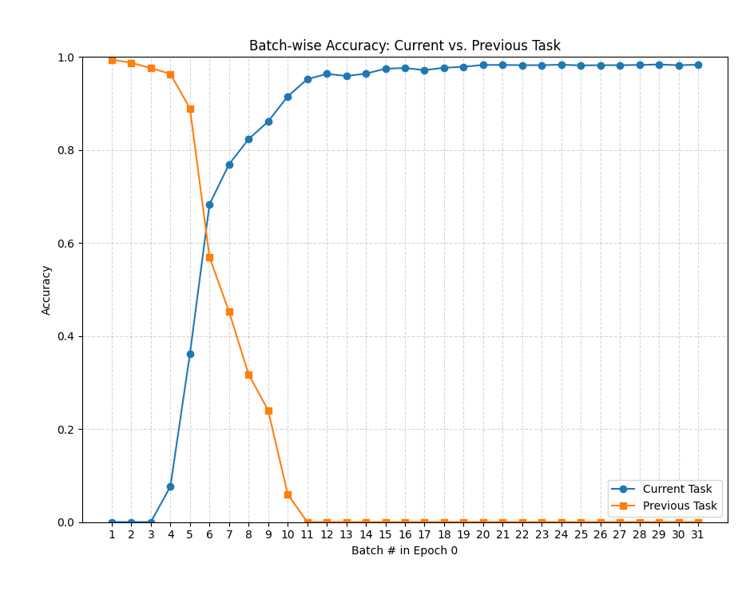
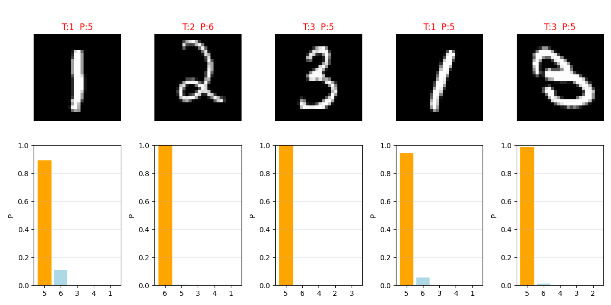
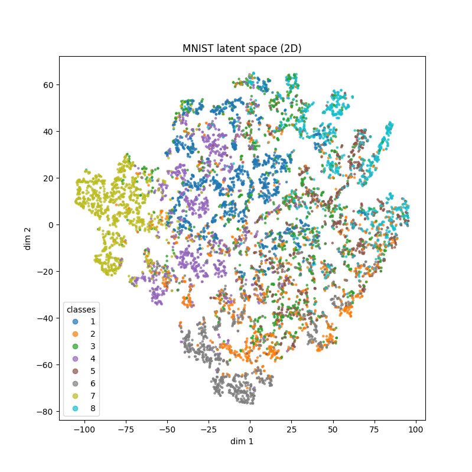
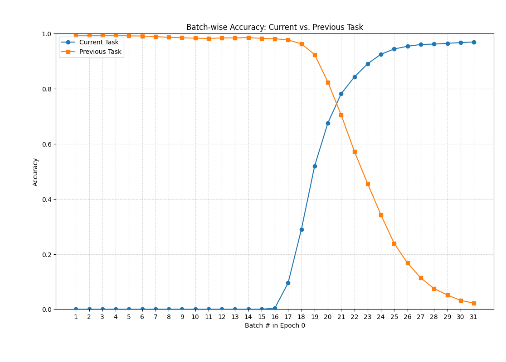

## MNIST MLP Training

### Concurrent Training

Training **concurrently** a small MLP network:

```
class MLP(nn.Module):
    def __init__(self, input_dim=784, n_classes=10):
        super().__init__()

        self.fc1 = nn.Linear(input_dim, 120)
        self.fc2 = nn.Linear(120, 84)
        self.fc3 = nn.Linear(84, n_classes)

    def forward(self, x):

        x = F.relu(self.fc1(x))
        z = F.relu(self.fc2(x))
        logits = self.fc3(z)
        return logits, z
```

Got the following results:
Epoch 4, train loss: 0.0117, val loss: 0.0357, train acc: 0.9786, val acc: 0.9646

And the latent space was well separated (not as good, but close to the latent space using LeNet5):


### Sequential Training

Training in Split-MNIST protocol:


**task 1, [1, 2]**

4, train loss 0.010796, train acc 0.996891, val loss 0.008445, val acc 0.996167


**task 2, [3, 4]**

4, train loss 0.003716, train acc 0.999099, val loss 11.001564, val acc 0.485862

We can see the same behavior we saw using the conv net: the neural net forgets very abruptly what it had learned in the previous task, and at that point it starts learning the new task. What is interesting is that looking at the relative updates of the weights, we cannot see anything special at that point in the training (example, between batches 3 and 11).

The only thing that seems notable is that the updates are generally larger at the beginning of training, when the network is *unlearning* the previous task - it is giving relatively large steps at this period - but in general NN learn faster at the beginning, so it may not be anything particular to this case.




Seems not to have a clue of the previous learned classes: very confident in predicting the new classes for examples of the old classes, such as 2 and 1, and when in doubt, it is always in doubt between the current classes.


Also as happened for the conv net, in the latent space the new classes just learned are well separated, and the previous classes are mingled together.


**task 3, [5, 6]**

4, train loss 0.019041, train acc 0.993537, val loss 10.511510, val acc 0.314396





**task 4, [7, 8]**

4, train loss 0.011244, train acc 0.996527, val loss 11.454843, val acc 0.252061




**task 5, [9, 0]**

4, train loss 0.007458, train acc 0.997570, val loss 12.196303, val acc 0.198500


**Upper bound, concurrent training**: 0.9646

**Lower bound, consecutive training**: 0.1985

### Concurent training with batch norm

```
class MLP(nn.Module):
    def __init__(self, input_dim=784, n_classes=10):
        super().__init__()

        self.fc1 = nn.Linear(input_dim, 120)
        self.bn1 = nn.BatchNorm1d(120)
        self.fc2 = nn.Linear(120, 84)
        self.bn2 = nn.BatchNorm1d(84)
        self.fc3 = nn.Linear(84, n_classes)

    def forward(self, x):

        x = F.relu(self.bn1(self.fc1(x)))
        z = F.relu(self.bn2(self.fc2(x)))
        logits = self.fc3(z)
        return logits, z
```

Epoch 4, train loss: 0.0944, val loss: 0.0522, train acc: 0.9819, val acc: 0.9782


### Sequential training with batch norm

Did not solve the problem the slightest - but something changed: the training (and the forgetting) got very smooth (smoother than before). The relative updates of the weights are smoother, but now we can see the the last layers get updated a little more stronger than the other two. 

Also, there was an interesing site that sometimes the NN would give some probabilities for previous classes.

**task 1, [1, 2]**

4, train loss 0.007517, train acc 0.998210, val loss 0.007921, val acc 0.997604

**task 2, [3, 4]**

4, train loss 0.007366, train acc 0.998099, val loss 3.824531, val acc 0.485862


**task 3, [5, 6]**

4, train loss 0.013730, train acc 0.995444, val loss 5.355310, val acc 0.316407


**task 4, [7, 8]**

4, train loss 0.008876, train acc 0.997718, val loss 5.718965, val acc 0.253310




**task 5, [9, 0]**

4, train loss 0.010084, train acc 0.997267, val loss 5.813504, val acc 0.198700


See how some of the previous classes get some probabilities:


**Changing batch norm to layer norm** did not provide any new insight or interesting behavior, so I did not include these experiments here.

### Sequential training with dropout

Using dropout of 0.5, as follows:

```
class MLP(nn.Module):
    def __init__(self, input_dim=784, n_classes=10, prob=0.5):
        super().__init__()

        self.fc1 = nn.Linear(input_dim, 120)
        self.drop1 = nn.Dropout(prob)
        self.fc2 = nn.Linear(120, 84)
        self.drop2 = nn.Dropout(prob)
        self.fc3 = nn.Linear(84, n_classes)

    def forward(self, x):

        x = self.drop1(F.relu(self.fc1(x)))
        z = self.drop2(F.relu(self.fc2(x)))
        logits = self.fc3(z)
        return logits, z
```

It did not help with the forgetting problem:

**task 1, [1, 2]**

4, train loss 0.022379, train acc 0.994629, val loss 0.012148, val acc 0.995688

**task 2, [3, 4]**

4, train loss 0.037854, train acc 0.985290, val loss 8.545651, val acc 0.484387

**task 3, [5, 6]**

4, train loss 0.224478, train acc 0.879754, val loss 11.920597, val acc 0.312385

**task 4, [7, 8]**

4, train loss 0.549324, train acc 0.739407, val loss 5.314554, val acc 0.250812

**task 5, [9, 0]**

4, train loss 0.235963, train acc 0.942195, val loss 25.727476, val acc 0.196800

But what was funny is that it gave very elongated shapes for the latent space (as plotted using t-sne):


## Trying to increase sparsity

### Concurrent training

Adding sparsity by means of L1 regularization to the *latent representations*:

```
for epoch in range(1, epochs):

    model.train()

    for x, y, _ in train_loader:
        optimizer.zero_grad()
        logits, (h1, h2) = model(x)
        base_loss = criterion(logits, y)

        # compute the l1 norm for the activations
        l1_norm = (h1.abs().mean() + h2.abs().mean())

        loss = base_loss + lambda_l1 * l1_norm

        loss.backward()
        optimizer.step()
```

Varying lambda l1 to get different levels of population sparcity, as measured by:

```
total_size = 0
num_zeros = 0

with torch.no_grad():
    for xb, yb, _ in test_loader:
        logits, latent = model(xb)          # z has shape [batch,84]

        for i, hidden_pt in enumerate(latent, 1):
            hidden = hidden_pt.cpu().numpy()
            total_size += np.prod(hidden.shape)
            num_zeros += (hidden == 0).sum()

population_sparcity = (num_zeros / total_size) # total_size = n_examples * n_neurons
print(f"Sparcity analysis - population sparcity: {population_sparcity:.4f}")
```

**lambda L1: 0.0**

Epoch 4, train loss: 0.0007, val loss: 0.0159, train acc: 0.9792, val acc: 0.9719

Sparcity analysis - population sparcity: 0.5437

**lambda L1: 0.001**

Epoch 4, train loss: 0.0240, val loss: 0.0263, train acc: 0.9793, val acc: 0.9751

Sparcity analysis - population sparcity: 0.5667

**lambda L1: 0.1**

Epoch 4, train loss: 0.1424, val loss: 0.0560, train acc: 0.9815, val acc: 0.9725

Sparcity analysis - population sparcity: 0.8307

**lambda L1: 1.0**

Epoch 4, train loss: 0.5234, val loss: 0.2253, train acc: 0.9533, val acc: 0.9494

Sparcity analysis - population sparcity: 0.9241

**lambda L1: 2.0**

Epoch 4, train loss: 0.8515, val loss: 0.3602, train acc: 0.9108, val acc: 0.9063

Sparcity analysis - population sparcity: 0.9326

#### Looking at the latent representations for the two hidden layers:

**lambda L1: 0.0**

Sparcity analysis - population sparcity: 0.5369


**lambda L1: 1.0**

Sparcity analysis - population sparcity: 0.9236


### Sequential training

Without adding the L1 norm, we could see that the network presents a progressive amount of sparsity as it trains in more tasks:

*lambda L1: 0.0*

**task 1, [1, 2]**

4, train loss 0.007918, train acc 0.997644, val loss 0.012917, val acc 0.995688

Sparcity analysis - population sparcity: 0.4987

**task 2, [3, 4]**

4, train loss 0.006190, train acc 0.998199, val loss 11.244117, val acc 0.485124

Sparcity analysis - population sparcity: 0.7782

**task 3, [5, 6]**

4, train loss 0.020671, train acc 0.993432, val loss 10.351263, val acc 0.314899

Sparcity analysis - population sparcity: 0.8593

**task 4, [7, 8]**

4, train loss 0.013371, train acc 0.995832, val loss 13.886833, val acc 0.251561

Sparcity analysis - population sparcity: 0.8637

**task 5, [9, 0]**

4, train loss 0.010451, train acc 0.996862, val loss 9.311324, val acc 0.19850

Sparcity analysis - population sparcity: 0.90260

Adding the L1 pensalization to the hidden states increased the sparcity, but did not help with forgetting (or changed anything in that regard):

*lambda L1: 1.0*

**task 1, [1, 2]**

4, train loss 0.126483, train acc 0.997927, val loss 0.023806, val acc 0.996646

Sparcity analysis - population sparcity: 0.9440

**task 2, [3, 4]**

4, train loss 0.115641, train acc 0.998299, val loss 3.586066, val acc 0.484878

Sparcity analysis - population sparcity: 0.9353

**task 3, [5, 6]**

4, train loss 0.210337, train acc 0.982519, val loss 4.093104, val acc 0.313055

Sparcity analysis - population sparcity: 0.9565

**task 4, [7, 8]**

4, train loss 0.144630, train acc 0.996130, val loss 4.783073, val acc 0.253185

Sparcity analysis - population sparcity: 0.9720

**task 5, [9, 0]**

4, train loss 0.145485, train acc 0.997570, val loss 4.684452, val acc 0.199900

Sparcity analysis - population sparcity: 0.9657

