# MNIST MLP Training

### Concurrent Training

Training **concurrently** a small MLP network:

```
class MLP(nn.Module):
def __init__(self, input_dim=784, n_classes=10):
    super().__init__()

    self.fc1 = nn.Linear(input_dim, 120)
    self.fc2 = nn.Linear(120, 84)
    self.fc3 = nn.Linear(84, n_classes)

def forward(self, x):

    x = F.relu(self.fc1(x))
    z = F.relu(self.fc2(x))
    logits = self.fc3(z)
        return logits, z
```

Got the following results:
Epoch 4, train loss: 0.0117, val loss: 0.0357, train acc: 0.9786, val acc: 0.9646

And the latent space was well separated (not as good, but close to the latent space using LeNet5):


### Sequential Training

Training in Split-MNIST protocol:


**task 1, [1, 2]**

4, train loss 0.010796, train acc 0.996891, val loss 0.008445, val acc 0.996167


**task 2, [3, 4]**

4, train loss 0.003716, train acc 0.999099, val loss 11.001564, val acc 0.485862

We can see the same behavior we saw using the conv net: the neural net forgets very abruptly what it had learned in the previous task, and at that point it starts learning the new task. What is interesting is that looking at the relative updates of the weights, we cannot see anything special at that point in the training (example, between batches 3 and 11).

The only thing that seems notable is that the updates are generally larger at the beginning of training, when the network is *unlearning* the previous task - it is giving relatively large steps at this period - but in general NN learn faster at the beginning, so it may not be anything particular to this case.


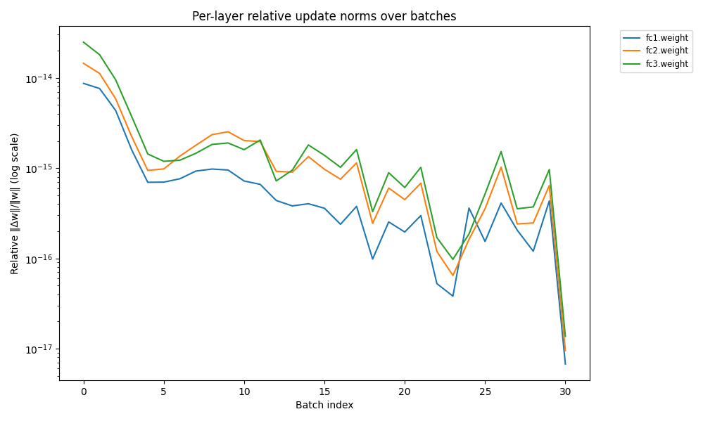

Seems not to have a clue of the previous learned classes: very confident in predicting the new classes for examples of the old classes, such as 2 and 1, and when in doubt, it is always in doubt between the current classes.


Also as happened for the conv net, in the latent space the new classes just learned are well separated, and the previous classes are mingled together.


**task 3, [5, 6]**

4, train loss 0.019041, train acc 0.993537, val loss 10.511510, val acc 0.314396


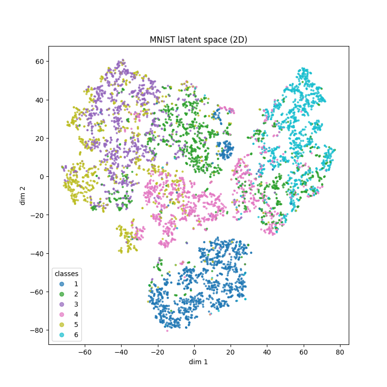

**task 4, [7, 8]**

4, train loss 0.011244, train acc 0.996527, val loss 11.454843, val acc 0.252061


**task 5, [9, 0]**

4, train loss 0.007458, train acc 0.997570, val loss 12.196303, val acc 0.198500


**Upper bound, concurrent training**: 0.9646

**Lower bound, consecutive training**: 0.1985

### Concurent training with batch norm

```
class MLP(nn.Module):
    def __init__(self, input_dim=784, n_classes=10):
        super().__init__()

        self.fc1 = nn.Linear(input_dim, 120)
        self.bn1 = nn.BatchNorm1d(120)
        self.fc2 = nn.Linear(120, 84)
        self.bn2 = nn.BatchNorm1d(84)
        self.fc3 = nn.Linear(84, n_classes)

    def forward(self, x):

        x = F.relu(self.bn1(self.fc1(x)))
        z = F.relu(self.bn2(self.fc2(x)))
        logits = self.fc3(z)
        return logits, z
```

Epoch 4, train loss: 0.0944, val loss: 0.0522, train acc: 0.9819, val acc: 0.9782


### Sequential training with batch norm

Did not solve the problem the slightest - but something changed: the training (and the forgetting) got very smooth (smoother than before). The relative updates of the weights are smoother, but now we can see the the last layers get updated a little more stronger than the other two. 

Also, there was an interesing site that sometimes the NN would give some probabilities for previous classes.

**task 1, [1, 2]**

4, train loss 0.007517, train acc 0.998210, val loss 0.007921, val acc 0.997604

**task 2, [3, 4]**

4, train loss 0.007366, train acc 0.998099, val loss 3.824531, val acc 0.485862


**task 3, [5, 6]**

4, train loss 0.013730, train acc 0.995444, val loss 5.355310, val acc 0.316407


**task 4, [7, 8]**

4, train loss 0.008876, train acc 0.997718, val loss 5.718965, val acc 0.253310


**task 5, [9, 0]**

4, train loss 0.010084, train acc 0.997267, val loss 5.813504, val acc 0.198700

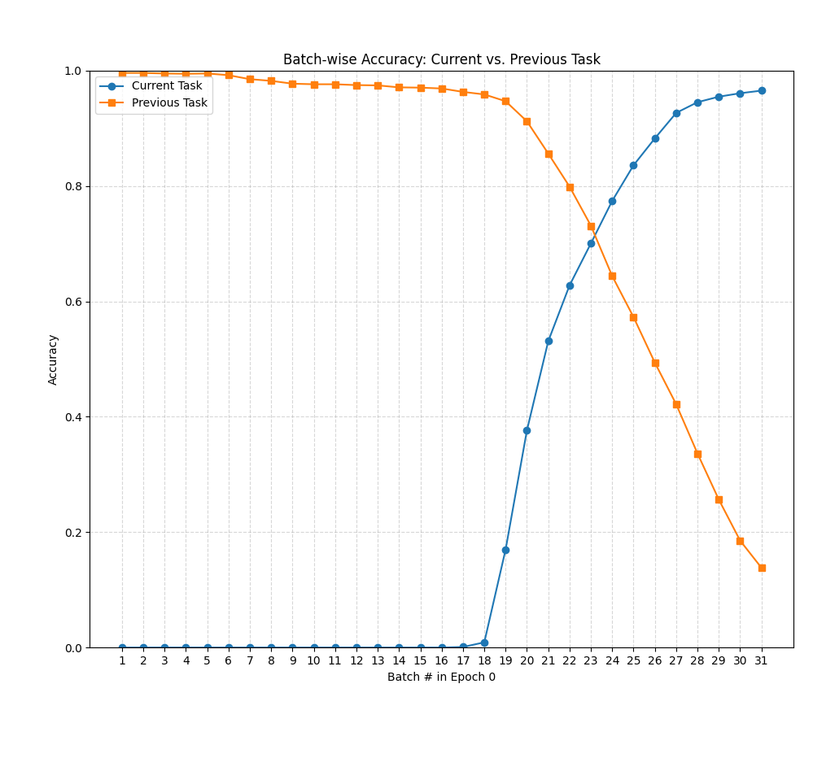

See how some of the previous classes get some probabilities:


**Changing batch norm to layer norm** did not provide any new insight or interesting behavior, so I did not include these experiments here.

### Sequential training with dropout

Using dropout of 0.5, as follows:

```
class MLP(nn.Module):
    def __init__(self, input_dim=784, n_classes=10, prob=0.5):
        super().__init__()

        self.fc1 = nn.Linear(input_dim, 120)
        self.drop1 = nn.Dropout(prob)
        self.fc2 = nn.Linear(120, 84)
        self.drop2 = nn.Dropout(prob)
        self.fc3 = nn.Linear(84, n_classes)

    def forward(self, x):

        x = self.drop1(F.relu(self.fc1(x)))
        z = self.drop2(F.relu(self.fc2(x)))
        logits = self.fc3(z)
        return logits, z
```

It did not help with the forgetting problem:

**task 1, [1, 2]**

4, train loss 0.022379, train acc 0.994629, val loss 0.012148, val acc 0.995688

**task 2, [3, 4]**

4, train loss 0.037854, train acc 0.985290, val loss 8.545651, val acc 0.484387

**task 3, [5, 6]**

4, train loss 0.224478, train acc 0.879754, val loss 11.920597, val acc 0.312385

**task 4, [7, 8]**

4, train loss 0.549324, train acc 0.739407, val loss 5.314554, val acc 0.250812

**task 5, [9, 0]**

4, train loss 0.235963, train acc 0.942195, val loss 25.727476, val acc 0.196800

But what was funny is that it gave very elongated shapes for the latent space (as plotted using t-sne):


### Sequential training with weight decay

The use of weight decay was not very successfull at first, but it may be more to it.

It was not able to arrest the growing sparsity, and resulted in very few feature with high activation values.

The loss of the network was less than using the regular training, but the network also had more difficulty training, specially for high penality values (e.g., 1.0, 5.0).

As the penality values increased, the representation of the latent space got worse (as measured by the linear probe), althought it was better than the one from the regular training at first, with l2 value of 0.1 (instead of the default value of 0.01).

* Lambda l2: 0.1

**task 1, [1, 2]**

1, train loss 0.024787, train acc 0.992274, val loss 0.017167, val acc 0.994729

Sparcity analysis - population sparcity: 0.4906

**task 2, [3, 4]**

1, train loss 0.017797, train acc 0.994896, val loss 9.147215, val acc 0.484632

Sparcity analysis - population sparcity: 0.7679

**task 3, [5, 6]**

1, train loss 0.051606, train acc 0.982413, val loss 10.311390, val acc 0.313558

Sparcity analysis - population sparcity: 0.8402

**task 4, [7, 8]**

1, train loss 0.020093, train acc 0.993649, val loss 9.786181, val acc 0.252186

Sparcity analysis - population sparcity: 0.8803

**task 5, [9, 0]**

1, train loss 0.020455, train acc 0.993622, val loss 10.147829, val acc 0.198200

Sparcity analysis - population sparcity: 0.8938

*This was a little bit of improvement over the version with the default weight decay value: 0.71 acc on task 5*

| Accuracy    | Task 1 | Task 2 | Task 3 | Task 4 | Task 5 |
|------------|------- |------- |------- |------- |------- |
| Classifier | 0.9976 | 0.9521 | 0.8308 | 0.7459 | 0.7660 |
| Class 1    | 0.9953 | 0.9752 | 0.9272 | 0.9027 | 0.9152 |
| Class 2    | 1.0000 | 0.9155 | 0.6959 | 0.5074 | 0.8083 |
| Class 3    |        | 0.9271 | 0.7892 | 0.6701 | 0.6569 |
| Class 4    |        | 0.9903 | 0.8824 | 0.8426 | 0.7268 |
| Class 5    |        |        | 0.8209 | 0.5227 | 0.5856 |
| Class 6    |        |        | 0.8663 | 0.8000 | 0.8750 |
| Class 7    |        |        |        | 0.9271 | 0.8177 |
| Class 8    |        |        |        | 0.7536 | 0.6940 |
| Class 9    |        |        |        |        | 0.6653 |
| Class 0    |        |        |        |        | 0.8990 |

* Lambda l2: 1.0

**task 1, [1, 2]**

1, train loss 0.024242, train acc 0.992556, val loss 0.016717, val acc 0.995208

Sparcity analysis - population sparcity: 0.4586

**task 2, [3, 4]**

1, train loss 0.017370, train acc 0.994996, val loss 4.635416, val acc 0.484878

Sparcity analysis - population sparcity: 0.7733

**task 3, [5, 6]**

1, train loss 0.050839, train acc 0.983473, val loss 6.033093, val acc 0.313055

Sparcity analysis - population sparcity: 0.7696

**task 4, [7, 8]**

1, train loss 0.025013, train acc 0.991664, val loss 6.586073, val acc 0.251811

Sparcity analysis - population sparcity: 0.8913

**task 5, [9, 0]**

1, train loss 0.022257, train acc 0.993420, val loss 7.834760, val acc 0.198200

Sparcity analysis - population sparcity: 0.8903

| Accuracy    | Task 1 | Task 2 | Task 3 | Task 4 | Task 5 |
|------------|------- |------- |------- |------- |------- |
| Classifier | 0.9952 | 0.9545 | 0.7797 | 0.6866 | 0.6815 |
| Class 1    | 0.9907 | 0.9752 | 0.9466 | 0.9159 | 0.8884 |
| Class 2    | 1.0000 | 0.9296 | 0.6392 | 0.5419 | 0.5855 |
| Class 3    |        | 0.9271 | 0.7206 | 0.2944 | 0.6029 |
| Class 4    |        | 0.9855 | 0.8503 | 0.7639 | 0.4809 |
| Class 5    |        |        | 0.6318 | 0.5568 | 0.3812 |
| Class 6    |        |        | 0.8861 | 0.8108 | 0.6875 |
| Class 7    |        |        |        | 0.9219 | 0.8276 |
| Class 8    |        |        |        | 0.6522 | 0.7705 |
| Class 9    |        |        |        |        | 0.6192 |
| Class 0    |        |        |        |        | 0.9192 |

* Lambda l2: 5.0

**task 1, [1, 2]**

1, train loss 0.034112, train acc 0.990106, val loss 0.033527, val acc 0.989459

Accuracy larger than 0.98, breaking from training...

Sparcity analysis - population sparcity: 0.4263

**task 2, [3, 4]**

1, train loss 0.033530, train acc 0.992495, val loss 2.765567, val acc 0.483649

Sparcity analysis - population sparcity: 0.7230

**task 3, [5, 6]**

2, train loss 0.073173, train acc 0.980824, val loss 4.213092, val acc 0.312888

Sparcity analysis - population sparcity: 0.8075

**task 4, [7, 8]**

1, train loss 0.038519, train acc 0.991962, val loss 4.627779, val acc 0.251686

Sparcity analysis - population sparcity: 0.8785

**task 5, [9, 0]**

1, train loss 0.042587, train acc 0.992306, val loss 5.418901, val acc 0.197800

Sparcity analysis - population sparcity: 0.9204

| Accuracy    | Task 1 | Task 2 | Task 3 | Task 4 | Task 5 |
|------------|------- |------- |------- |------- |------- |
| Classifier | 0.9856 | 0.7764 | 0.7035 | 0.5774 | 0.5885 |
| Class 1    | 0.9814 | 0.8911 | 0.9126 | 0.8673 | 0.8661 |
| Class 2    | 0.9901 | 0.4742 | 0.4845 | 0.4433 | 0.4249 |
| Class 3    |        | 0.7760 | 0.7794 | 0.1269 | 0.3382 |
| Class 4    |        | 0.9758 | 0.6471 | 0.7778 | 0.4973 |
| Class 5    |        |        | 0.5075 | 0.3466 | 0.2155 |
| Class 6    |        |        | 0.8713 | 0.4541 | 0.4010 |
| Class 7    |        |        |        | 0.8698 | 0.8177 |
| Class 8    |        |        |        | 0.6473 | 0.6339 |
| Class 9    |        |        |        |        | 0.6695 |
| Class 0    |        |        |        |        | 0.9242 |


## Trying to increase sparsity

### Concurrent training

Adding sparsity by means of L1 regularization to the *latent representations*:

```
for epoch in range(1, epochs):

    model.train()

    for x, y, _ in train_loader:
        optimizer.zero_grad()
        logits, (h1, h2) = model(x)
        base_loss = criterion(logits, y)

        # compute the l1 norm for the activations
        l1_norm = (h1.abs().mean() + h2.abs().mean())

        loss = base_loss + lambda_l1 * l1_norm

        loss.backward()
        optimizer.step()
```

Varying lambda l1 to get different levels of population sparcity, as measured by:

```
total_size = 0
num_zeros = 0

with torch.no_grad():
    for xb, yb, _ in test_loader:
        logits, latent = model(xb)          # z has shape [batch,84]

        for i, hidden_pt in enumerate(latent, 1):
            hidden = hidden_pt.cpu().numpy()
            total_size += np.prod(hidden.shape)
            num_zeros += (hidden == 0).sum()

population_sparcity = (num_zeros / total_size) # total_size = n_examples * n_neurons
print(f"Sparcity analysis - population sparcity: {population_sparcity:.4f}")
```

**lambda L1: 0.0**

Epoch 4, train loss: 0.0007, val loss: 0.0159, train acc: 0.9792, val acc: 0.9719

Sparcity analysis - population sparcity: 0.5437

**lambda L1: 0.001**

Epoch 4, train loss: 0.0240, val loss: 0.0263, train acc: 0.9793, val acc: 0.9751

Sparcity analysis - population sparcity: 0.5667

**lambda L1: 0.1**

Epoch 4, train loss: 0.1424, val loss: 0.0560, train acc: 0.9815, val acc: 0.9725

Sparcity analysis - population sparcity: 0.8307

**lambda L1: 1.0**

Epoch 4, train loss: 0.5234, val loss: 0.2253, train acc: 0.9533, val acc: 0.9494

Sparcity analysis - population sparcity: 0.9241

**lambda L1: 2.0**

Epoch 4, train loss: 0.8515, val loss: 0.3602, train acc: 0.9108, val acc: 0.9063

Sparcity analysis - population sparcity: 0.9326

#### Looking at the latent representations for the two hidden layers:

**lambda L1: 0.0**

Sparcity analysis - population sparcity: 0.5369


**lambda L1: 1.0**

Sparcity analysis - population sparcity: 0.9236


### Sequential training

Without adding the L1 norm, we could see that the network presents a progressive amount of sparsity as it trains in more tasks:

*lambda L1: 0.0*

**task 1, [1, 2]**

4, train loss 0.007918, train acc 0.997644, val loss 0.012917, val acc 0.995688

Sparcity analysis - population sparcity: 0.4987

**task 2, [3, 4]**

4, train loss 0.006190, train acc 0.998199, val loss 11.244117, val acc 0.485124

Sparcity analysis - population sparcity: 0.7782

**task 3, [5, 6]**

4, train loss 0.020671, train acc 0.993432, val loss 10.351263, val acc 0.314899

Sparcity analysis - population sparcity: 0.8593

**task 4, [7, 8]**

4, train loss 0.013371, train acc 0.995832, val loss 13.886833, val acc 0.251561

Sparcity analysis - population sparcity: 0.8637

**task 5, [9, 0]**

4, train loss 0.010451, train acc 0.996862, val loss 9.311324, val acc 0.19850

Sparcity analysis - population sparcity: 0.90260

Adding the L1 pensalization to the hidden states increased the sparcity, but did not help with forgetting (or changed anything in that regard):

*lambda L1: 1.0*

**task 1, [1, 2]**

4, train loss 0.126483, train acc 0.997927, val loss 0.023806, val acc 0.996646

Sparcity analysis - population sparcity: 0.9440

**task 2, [3, 4]**

4, train loss 0.115641, train acc 0.998299, val loss 3.586066, val acc 0.484878

Sparcity analysis - population sparcity: 0.9353

**task 3, [5, 6]**

4, train loss 0.210337, train acc 0.982519, val loss 4.093104, val acc 0.313055

Sparcity analysis - population sparcity: 0.9565

**task 4, [7, 8]**

4, train loss 0.144630, train acc 0.996130, val loss 4.783073, val acc 0.253185

Sparcity analysis - population sparcity: 0.9720

**task 5, [9, 0]**

4, train loss 0.145485, train acc 0.997570, val loss 4.684452, val acc 0.199900

Sparcity analysis - population sparcity: 0.9657


## Some observations

* Batch norm and sparse NN have lower validation losses than the regular and dropout nets. 

The cross-entropy loss is: `loss = y * log(y_hat)`

So this low loss must be because those nets tend to give a smoother output, or something closer to a uniform distribution, less peaky: they do not let the y_hat probability go to very small values, such as something to the e-9.

Comparing the regular net with the batch norm (which we saw has a smoother training):

**Regular net**

*task 1, [1, 2]*: val loss 0.012917, sparcity: 0.4987

*task 2, [3, 4]*: val loss 11.244117, sparcity: 0.7782

*task 3, [5, 6]*: val loss 10.351263, sparcity: 0.8593

*task 4, [7, 8]*: val loss 13.886833, sparcity: 0.8637

*task 5, [9, 0]*: val loss 9.311324, sparcity: 0.90260

It is also apparent the growing sparcity of the neural network.

Asking ChatGPT insights about this growing sparcity, it gave me the following points:

– Units specialize on small subsets of classes,  
– biases go negative to silence them on everything else,  
– previous tasks get overwritten so those units no longer fire even on their “old” classes.

Can test this "biases go negative" to silence features of old classes, and compare this with the use of batch norm, that avoids this growing sparcity (as the follows).

#### Investigating the weights/bias distribution with respect to the sparcity

**Concurrent training**

The histograms for biases and weights are well behaved and like you would have expected:

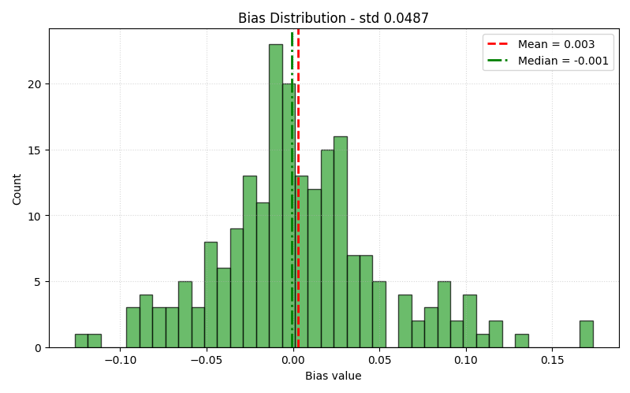
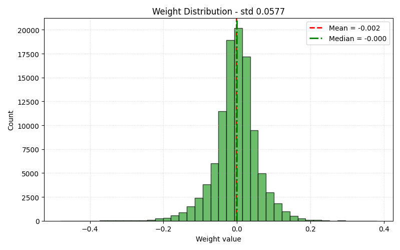

**Sequential**

*Task 1*

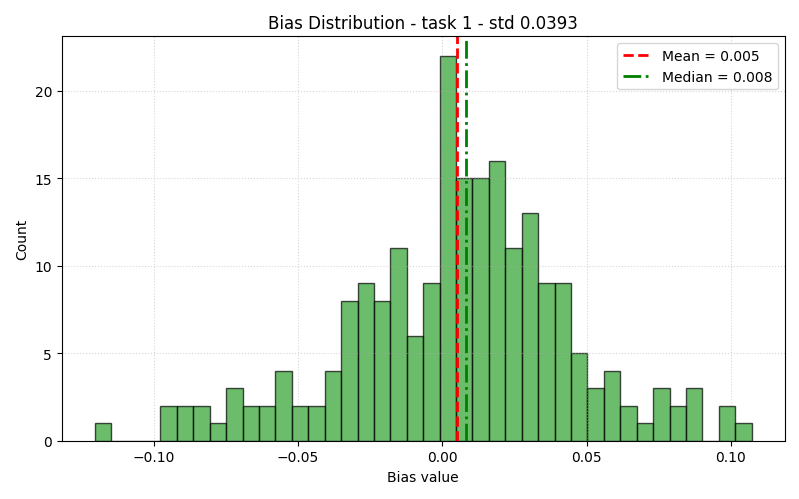


*Task 2*

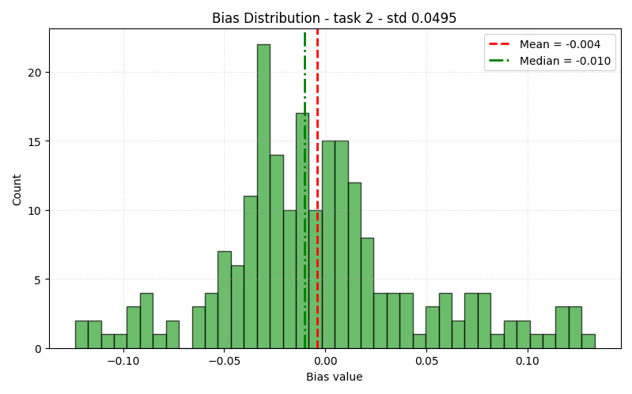


*Task 3*

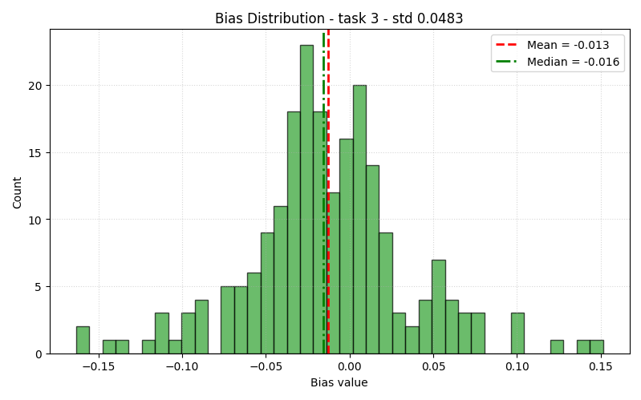
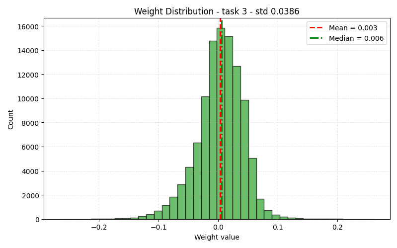

*Task 4*

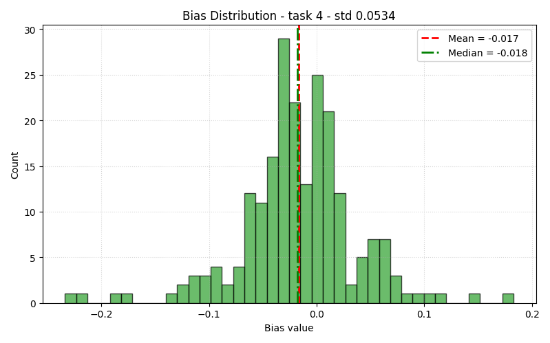


*Task 5*

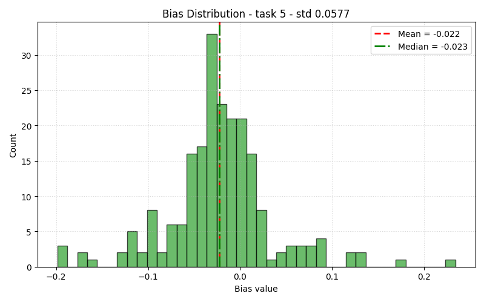


Looking at the plots they seem very similar and offer little insight. The statistics of the weights seem in fact no to cchange meaningfully. But we put down some values for the biases, we start seeing something:

| Regime    | Mean | Median | Std | Sparcity|
| -------- | ------- |------- |------- |------- |
| Concurrent  | 0.003    | 0.001 | 0.0487 | 0.5266 |
| Seq, task 1 | 0.005     | 0.008 | 0.0393 | 0.4517 |
| Seq, task 2 | -0.004    | -0.010 | 0.0495 | 0.7382 |
| Seq, task 3 | -0.013    | -0.016 | 0.0483 | 0.8361 |
| Seq, task 4 | -0.017    | -0.018 | 0.0534 | 0.8739 |
| Seq, task 5 | -0.022    | -0.023 | 0.0577 | 0.8965 |

Even thought the number are all small, the change that happens in the mean, and particularly in the median seem to be important: when the sparcity goes from 0.45 to 0.73 in task 2, the median change signs and increases by an order of magnitude. After this, the median is always negative and one order of magnitude larger for the sequential case than for the concurrent, and the same happens with the mean.

It suggests that it is this slight change in the bias that pushes the values of the activations to the negative part of the relu, making the representations get sparser and sparser.

As ChatGPT puts it:

...emergent mechanism the network uses to reduce catastrophic interference: “I don’t want my old features firing all over the place on new tasks, so I’ll just push their biases down and only use a small subset of units.”

...your bias‐histogram is a smoking gun: the network is solving the new tasks in part by turning down (i.e. deactivating) old units via negative bias shifts, and that is exactly what is driving your rising sparsity numbers.

Looking at the latent representations learned by the model during sequential training, we can see that the network start with many features, but it start shutting them off: By task 3 it is already only using a handfull of features, and most of the neurons are shut off:

*task 1*


*task 2*

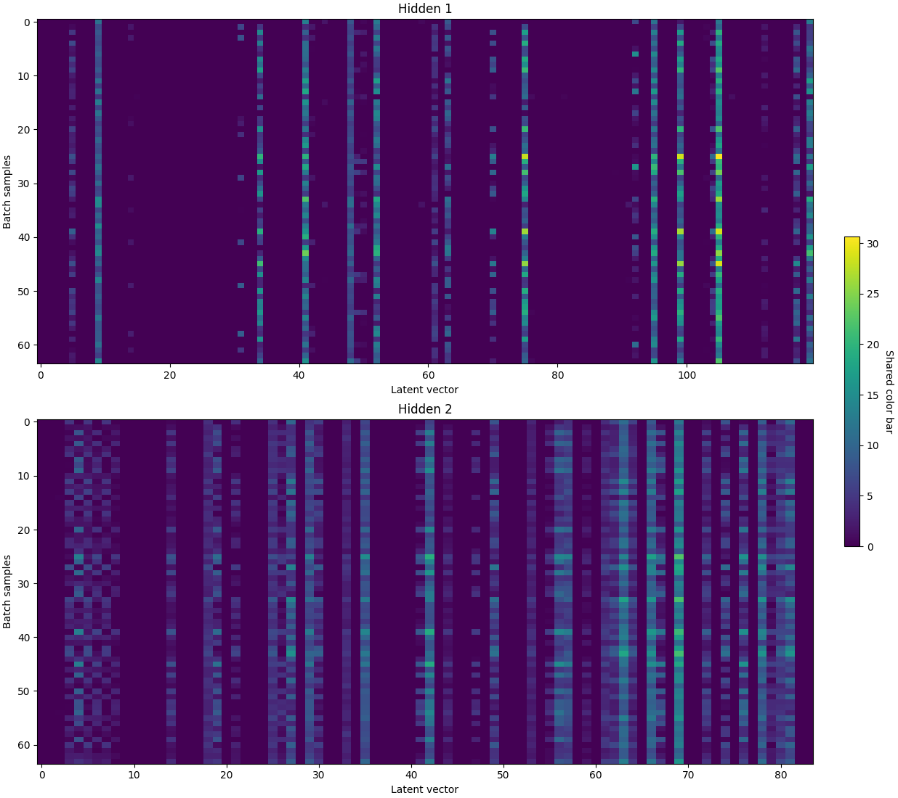

*task 3*

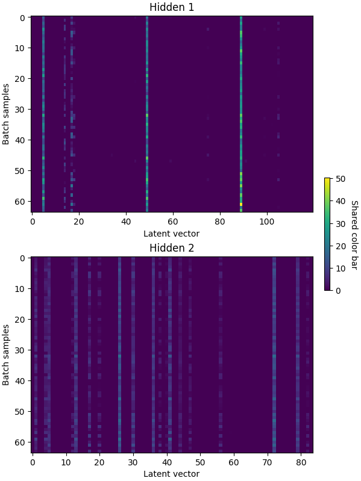

*task 4*

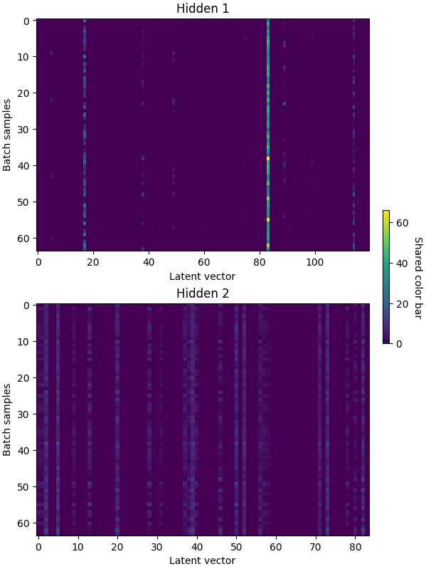

*task 5*


If we force the network to have sparse representations using a penaly, we get the sparse representation from the beginning (task 1), and one thing that is different from this spontanous sparsity is that the values of the non-sparse features are much lower (more well behaved). This is probably a result of using the penalty itself, which does not allow the representation to grow uncheked. For instance, for the features for a batch of examples in the fifth task, the values of the features are about 1/10th of before:

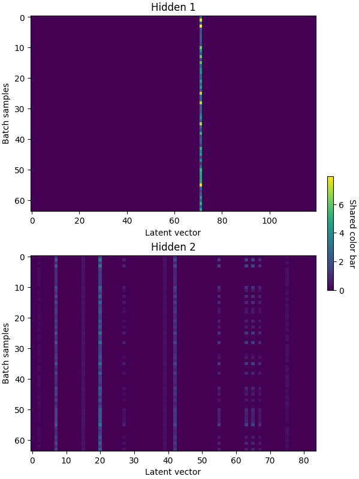

If we use batch norm (no sparsity penalty), and plot the same representations for every task, we can see that the is not allowed to turn off its features. We hyphotese that this is why the loss using batch norm is much lower than without it. The features do not allowed the probabilities for the older classes to go to extremely small values such as 1e-9.

*task 1*


*task 2*


*task 3*


*task 4*


*task 5*

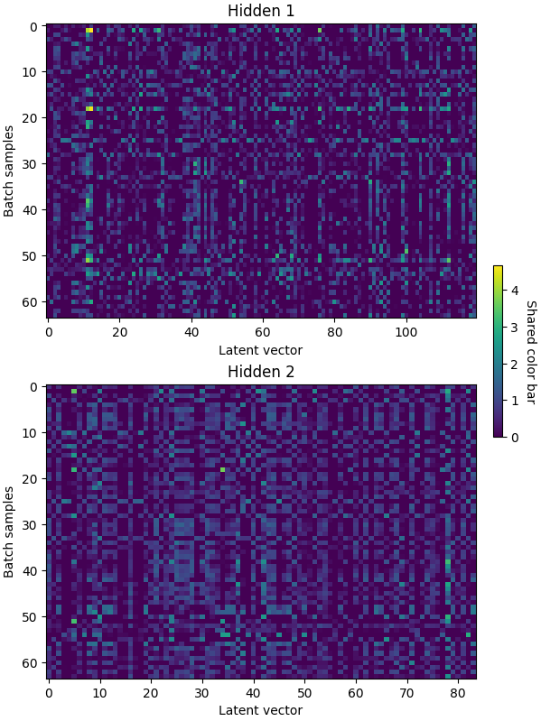


**Batch norm**

*task 1, [1, 2]*: val loss 0.015192, sparcity: 0.5112

*task 2, [3, 4]*: val loss 3.735139, sparcity: 0.4764

*task 3, [5, 6]*: val loss 4.799133, sparcity: 0.4952

*task 4, [7, 8]*: val loss 5.491990, sparcity: 0.5100

*task 5, [9, 0]*: val loss 5.838927, sparcity: 0.5421 

Probably this difference in the loss is more due to a more stable training regime than to anything to do with forgetting itself.

The other interesting thing is that batch norm do not allow the network to grow sparse as it is trained in new tasks.

If we force the batch norm network to be sparse, we get:

*lambda L1: 1.0*

*task 1, [1, 2]*: val loss 0.030630, sparcity: 0.8955

*task 2, [3, 4]*: val loss 2.413128, sparcity: 0.8457

*task 3, [5, 6]*: val loss 3.948847, sparcity: 0.9146

*task 4, [7, 8]*: val loss 5.269120, sparcity: 0.9006

*task 5, [9, 0]*: val loss 5.107574, sparcity: 0.8966

The results are very similar, a little bit better perhaps, and it may be to the final distribution being more like a uniform, and not to something related to forgetting specifically.

### Gradient

Now looking at the gradients accumulated for each task, we can see a reflex of the sparcity of the weights.

For the first task there is nothing out of ordinary:


For the second task some interesting things begin to happen: Mainly, we can see that our output weight matrix is strongly updated (much more strongly than in our first task). We can already see slight traces of dead non-linearities on layer 2, but few yet.


On task 3 we can see a lot of dead neurons, that are not being updated during training. The last layer is updated even more strongly than before. The second layer also have very high updates for the features it still has.


Things get worse in task 4 and 5, with lots of neurons not being trained, and very high updates on all layers, but particurlaly on the second and on the final layers.

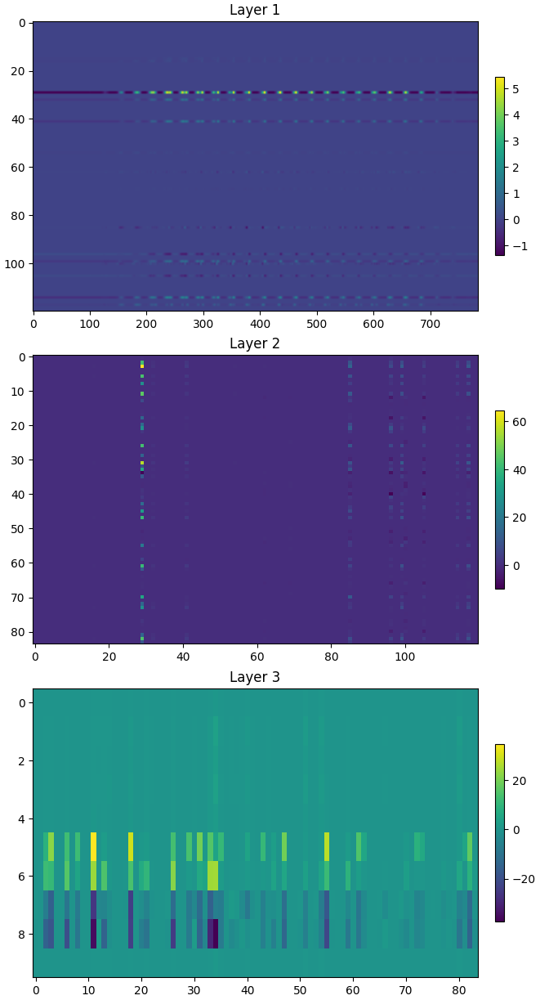


It is interesting to see that in the classification layer the parameters of the current and the past task are being very strongly updated, so that the current classes get higher probabilities and the previous classes smaller ones. The other classes are dormant.

**Looking at the parameters of the network**

(this is without BN. See below to find with BN)

At the first task we cannot see anything to noticeable, the only thing is that in the classfication layer, the row for classes 1 and 2 seem to have more positive values than the others. This theme of the 2 current classes having higher values in the classification layer is consistent, altought perhaps last pronounced than expected.

What is very pronounced and very noticeable is the movement of the biases of layers 1 and 2 to the negative side, starting on task 2. This shows how the growing of the sparsity in the activations came about.

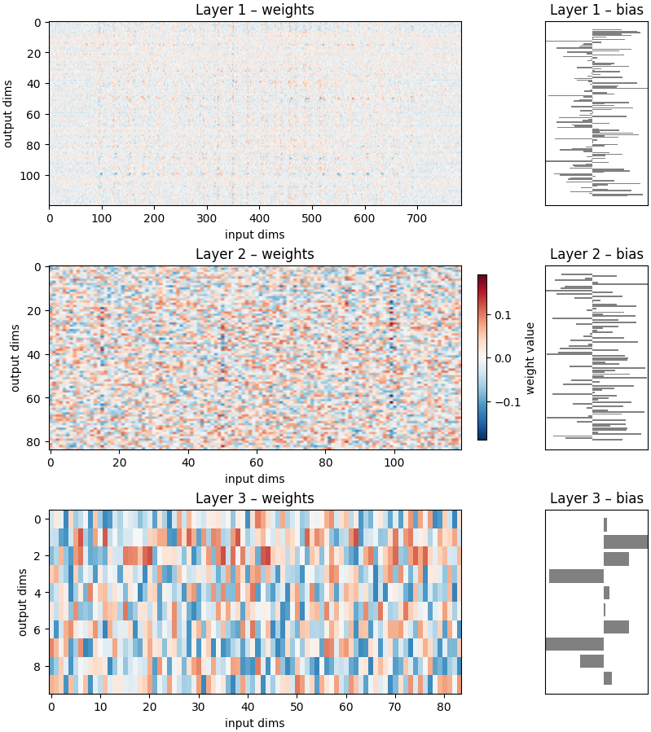

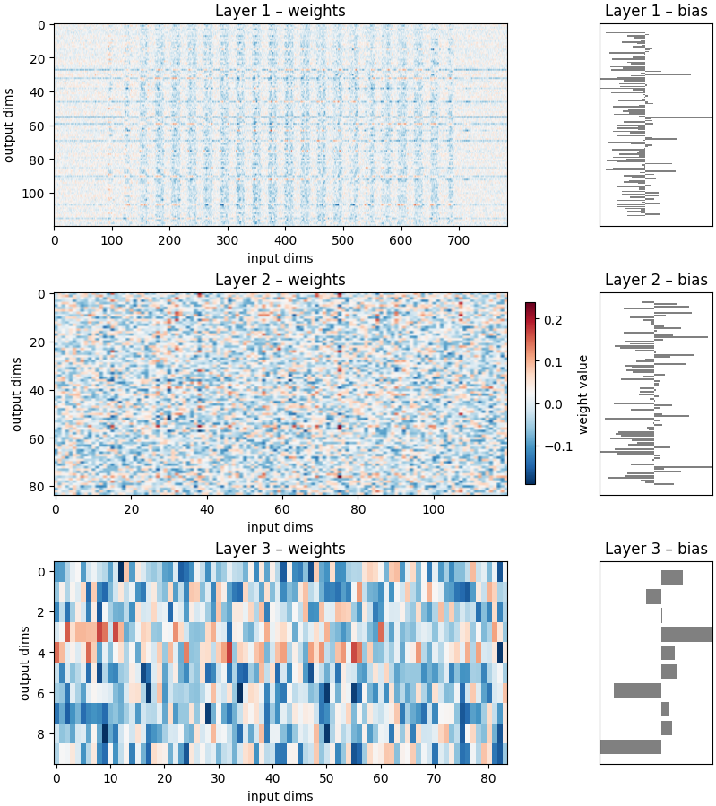

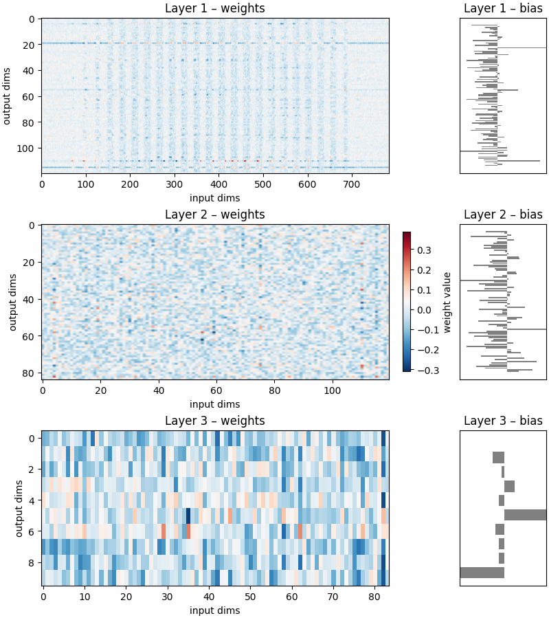

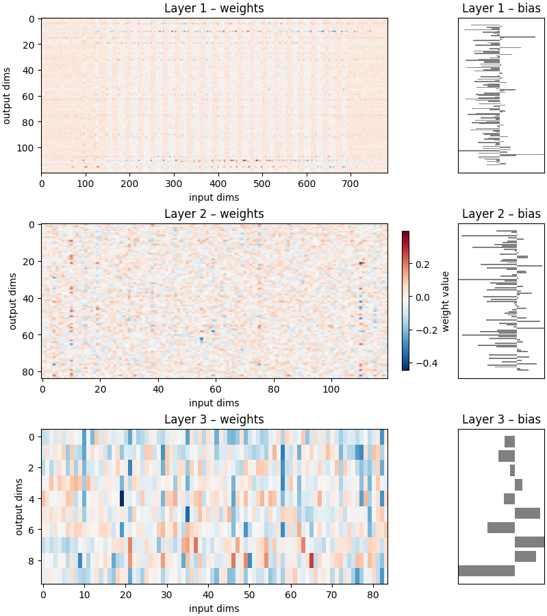

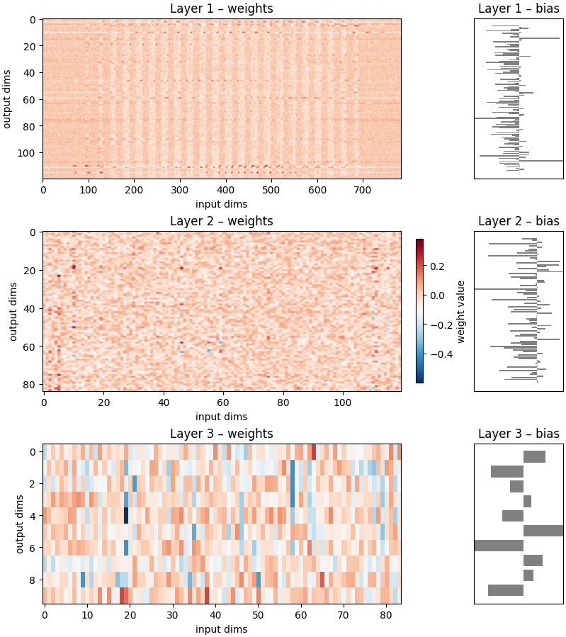

**Comparing with the net with BN**

If we compare the same gradients with the ones from the net with batch norm, for layers 4 and 5 that were the most dramatic:

We can see that the net has a lot of features to learn, particularly on layer 2. Also, the updates for layers 1 and 2 are in a very healthy range, and even thought the updates for layer 3 are in the high side, it is still much lower than before (5 versus 40).


**Looking at the parameters of the network**

It is very interesting to look at the parameters of the network with batch normalization, particularly the last layer. Differently for the case without BN, now it is crystal clear which are the two classes that were just trained.

Another interesting fact is that in the training progresses, it is very easy to differentiate the classes *currently being trained*, *classes already trained*, and *classes not yet trained*.

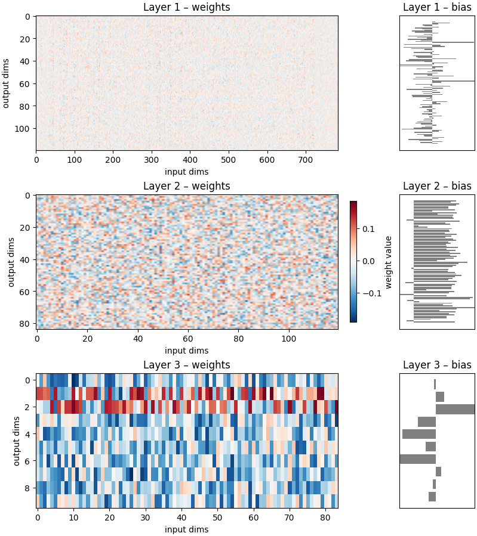

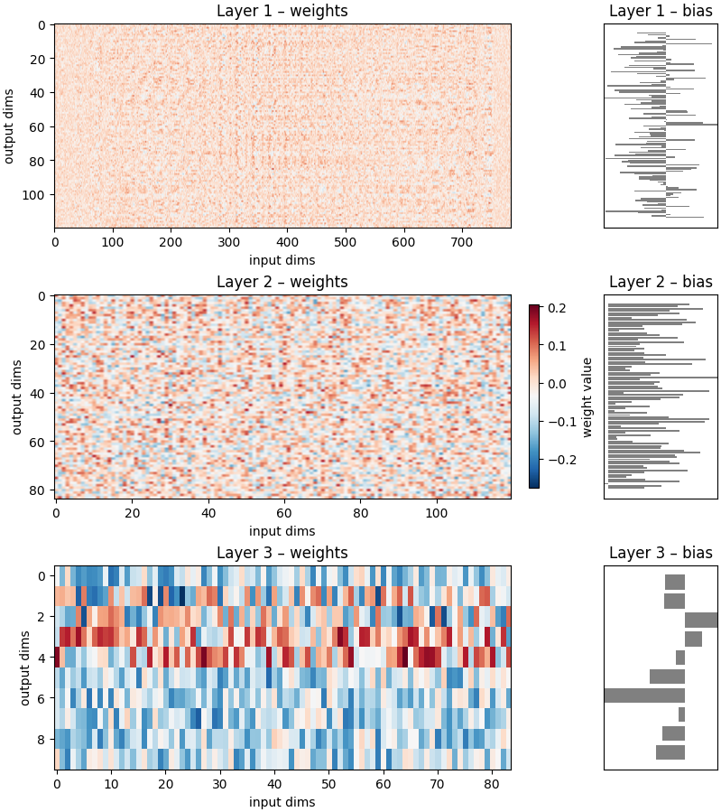

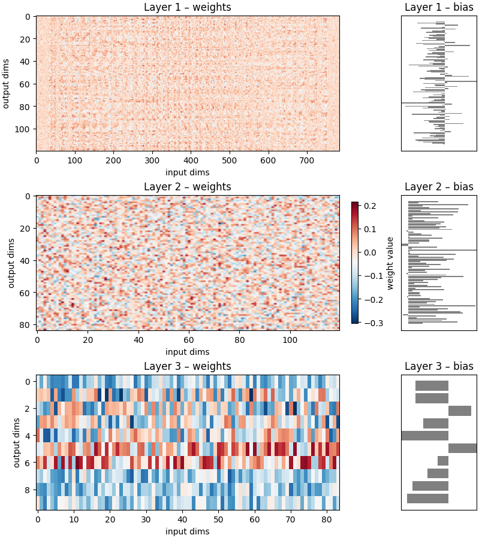

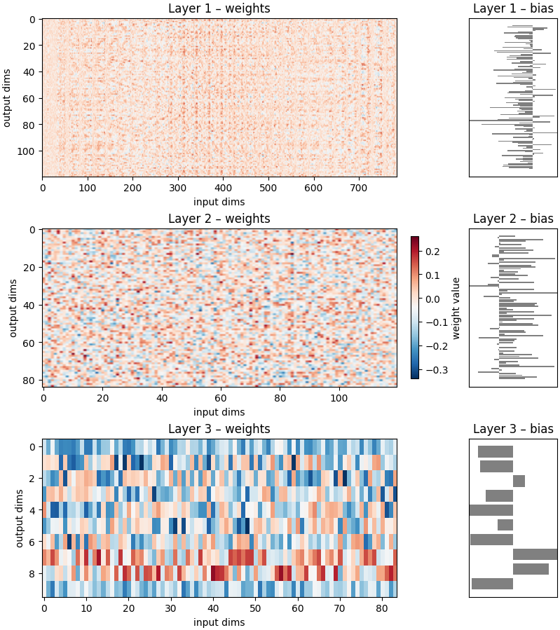

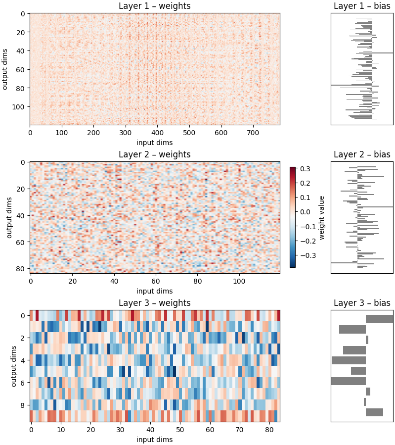

If we do the same analysis for the network trained concurrently (with BN), we get that the classification layer is more smooth, as expected, having no stark difference between the lines with values for different classes:

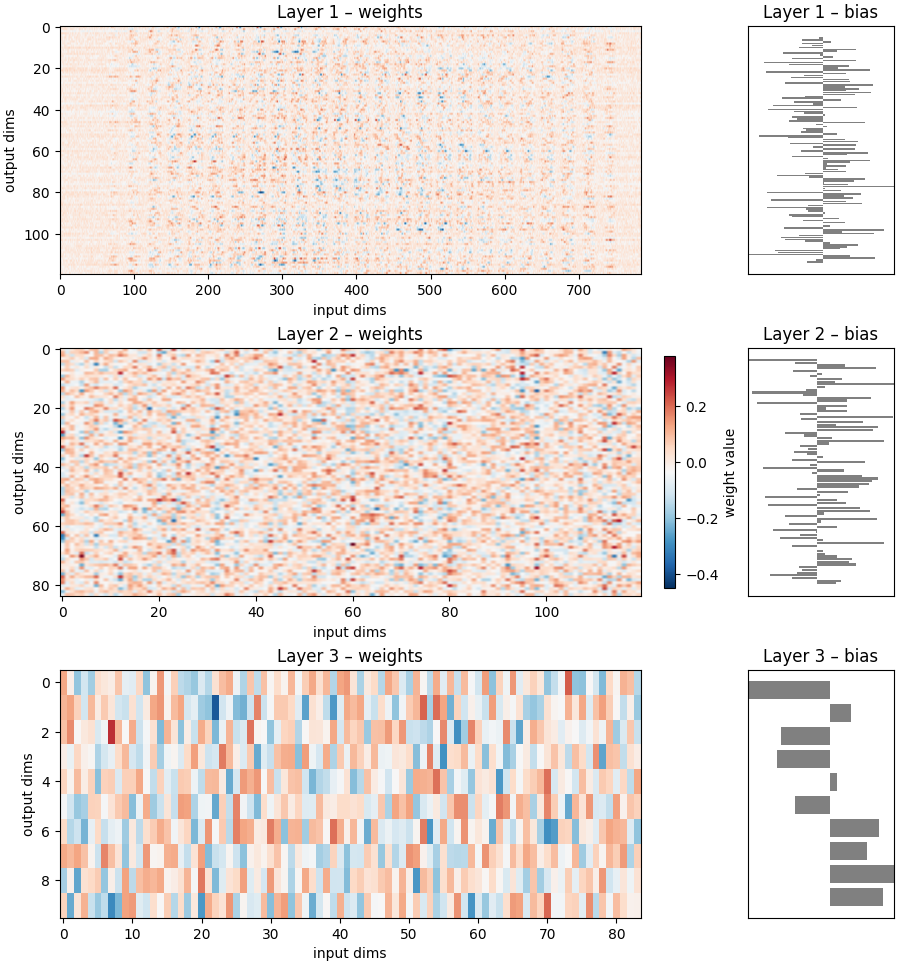

**Sparsity**: If I just add a sparsity penalty for my activations, I get a picture as bad as for the normal training - even though my validation loss gets smaller. If I add sparsity + bn, it gets a little better, with less dead zone in my weight matrix that dont learn anything.

Example of gradients for the fourth task:


### Representation strength and forgetting

I experiment with three different forms of measuring the strength and the decay of the representation as training goes on and more tasks are added:

*Method 1: comparing the representation of a class with the representations of all classes*

```
for c in seen:
    m_all = all_repr.mean(axis=0)
    std_all = all_repr.std(axis=0)
    m_class = all_repr[all_labels==c].mean(axis=0)
    saliency = (m_class - m_all)/(std_all + 1e-9)
    strength = np.linalg.norm(saliency)
```

*Method 2: linear probing - strength of the coefficients*

```
# use the coefficients of the linear classifier to compute per-class strength
W = clf.coef_ # shape (n_classes, feat_dim)

# in the binary case, the strenth of both classes is the same
if W.shape[0] == 1:
    w_c = W[0]
    strength = np.linalg.norm(w_c)
    for c in seen:
        print(f"Class {c}, strength, coeff weight norm: {strength:.4f}")
else:
    for i, c in enumerate(seen):
        w_c = W[i]
        strength = np.linalg.norm(w_c)
        print(f"Class {c}, strength, coeff weight norm: {strength:.4f}")
```

*Method 3: linear probing - classifier accuracy*

```
for c in seen:
    mask = (y_test == c)
    if mask.sum() > 0:
        acc_c = (y_pred[mask] == y_test[mask]).mean()
        print(f"Class {c} accuracy on linear probing: {acc_c:.4f}")
```

The results were inconsistent between the methods, so I chose method 3 which is the most intuitive of the three.

**Basic sequential training**


| Accuracy    | Task 1 | Task 2 | Task 3 | Task 4 | Task 5 |
|------------|--------- |--------- |--------- |--------- |--------- |
| Classifier | 0.9976 | 0.9459 | 0.8643 | 0.6941 | 0.7190 |
| Class 1    | 0.9953 | 0.9802 | 0.9612 | 0.8982 | 0.8973 |
| Class 2    | 1.0000 | 0.9014 | 0.7526 | 0.6059 | 0.7876 |
| Class 3    |        | 0.9219 | 0.7941 | 0.3401 | 0.6275 |
| Class 4    |        | 0.9807 | 0.9144 | 0.8009 | 0.6393 |
| Class 5    |        |        | 0.8159 | 0.4318 | 0.3149 |  
| Class 6    |        |        | 0.9455 | 0.7676 | 0.7604 |  
| Class 7    |        |        |        | 0.9219 | 0.8916 |  
| Class 8    |        |        |        | 0.7295 | 0.5902 |  
| Class 9    |        |        |        |        | 0.6987 |  
| Class 0    |        |        |        |        | 0.9141 | 

What is very interesting is that the decay is not as bad as I expected, and overall the representations learned are not too bad: the classifier can get around 72% accuracy. Which is worse than the 98% one can get training the neural net concurrently, but is much better than the sequential learning result.

Particularly, the representations of the classes remain in the network, some of them strongly, such as for the number 1, that is trained in the first task, and by the fifth task the linear probe still can classify it 89% correctly.

This suggests that the representation still exist in the network, but the prediction head ignores them, in favor of predicting only the classes presented in the last class. This effect could be seen in the gradients observed from task to task, where the last task is highly modified in order to classify the current classes and ignore the classes from the previous task.


**Training with Batch Normalization**

| Accuracy    | Task 1 | Task 2 | Task 3 | Task 4 | Task 5 |
|------------|--------- |--------- |--------- |--------- |--------- |
| Classifier | 0.9976 | 0.9582 | 0.9288 | 0.9220 | 0.8925 |
| Class 1    | 0.9953 | 0.9802 | 0.9709 | 0.9779 | 0.9598 |
| Class 2    | 1.0000 | 0.9202 | 0.9175 | 0.8670 | 0.9067 |
| Class 3    |        | 0.9479 | 0.8824 | 0.8680 | 0.8775 |
| Class 4    |        | 0.9855 | 0.9572 | 0.9722 | 0.8798 |
| Class 5    |        |        | 0.8756 | 0.8239 | 0.7624 |
| Class 6    |        |        | 0.9703 | 0.9730 | 0.9479 |
| Class 7    |        |        |        | 0.9688 | 0.9261 |
| Class 8    |        |        |        | 0.9082 | 0.8470 |
| Class 9    |        |        |        |        | 0.8619 |
| Class 0    |        |        |        |        | 0.9394 |

The result with batch norm is very interesting: we can see that the network does conserve significantly its hidden representation, considerably better than without batch norm: from 0.7190 to 0.8925, reducing the difference to the 0.9646 achieved in concurrent learning.

This suggest the conservation of the features resulting from the BN acting is beneficial to the keeping of the representational power of the network, and that in this case the forgetting of the network is even more a role of the prediction head - therefore of a more shallow form.

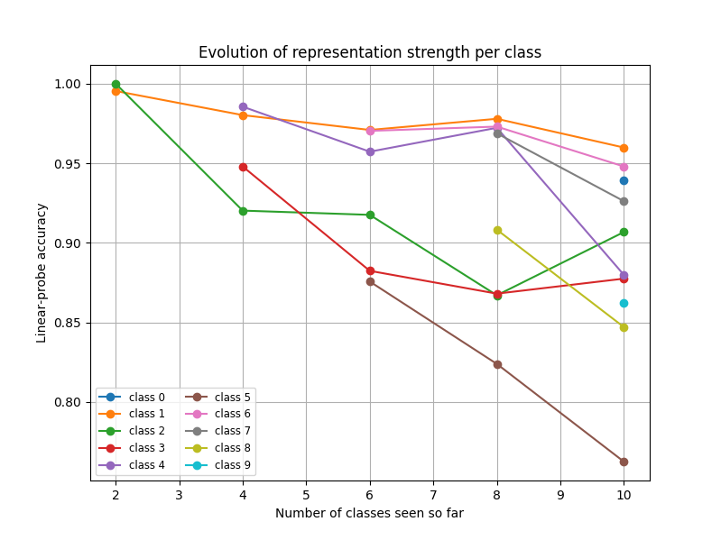

**Training with sparsity**

If we add a sparse penalty `l1=1.0` to the representations, we see that the forgetting is more complete: The network cannot keep good representations of past classes. In fact, 3 classes have zero accuracy at the end of the fifth task, and the overall accuracy of the classifies is 0.3140, and the network consistently does considerably better on the newly introduced classes (the class 5 is the exception, that seems to be specially hard to predict).

It suggest that forcing the sparcity from the beginning in the network does not allow it to learn features reach enough or numerous enough to represent the several classes without overwritting it.

| Accuracy    | Task 1 | Task 2 | Task 3 | Task 4 | Task 5 |
|------------|--------- |--------- |--------- |--------- |--------- |
| Classifier | 0.9952 | 0.6450 | 0.5938 | 0.4863 | 0.3140 |
| Class 1    | 0.9907 | 0.4901 | 0.8592 | 0.7832 | 0.1830 |
| Class 2    | 1.0000 | 0.2394 | 0.3144 | 0.0739 | 0.4093 |
| Class 3    |        | 0.8802 | 0.7451 | 0.4365 | 0.0196 |
| Class 4    |        | 0.9952 | 0.4973 | 0.5602 | 0.0000 |
| Class 5    |        |        | 0.2338 | 0.0398 | 0.0000 |
| Class 6    |        |        | 0.8861 | 0.1189 | 0.3750 |
| Class 7    |        |        |        | 0.9323 | 0.5123 |
| Class 8    |        |        |        | 0.8309 | 0.0000 |
| Class 9    |        |        |        |        | 0.6360 |
| Class 0    |        |        |        |        | 0.8889 |


**Training with BN + sparsity**

Adding batch norm and sparsity is considerably better than sparsity alone. Batch norm seems to counter-balance, not allowing it to shrink all information. But the result is considerably be worse than BN alone, and slighly worse than just training the basic net.

| Accuracy    | Task 1 | Task 2 | Task 3 | Task 4 | Task 5 |
|------------|--------- |--------- |--------- |--------- |--------- |
| Classifier | 0.9976 | 0.9533 | 0.8802 | 0.7984 | 0.6920 |
| Class 1    | 0.9953 | 0.9752 | 0.9515 | 0.9204 | 0.9420 |
| Class 2    | 1.0000 | 0.9014 | 0.8041 | 0.6355 | 0.6943 |
| Class 3    |        | 0.9427 | 0.8284 | 0.8274 | 0.6471 |
| Class 4    |        | 0.9952 | 0.9305 | 0.8750 | 0.4754 |
| Class 5    |        |        | 0.7910 | 0.5341 | 0.2983 |
| Class 6    |        |        | 0.9752 | 0.8649 | 0.7604 |
| Class 7    |        |        |        | 0.9583 | 0.7488 |
| Class 8    |        |        |        | 0.7343 | 0.5902 |
| Class 9    |        |        |        |        | 0.7155 |
| Class 0    |        |        |        |        | 0.9545 |


**Training with dropout**

Adding dropout `p=0.2` with the basic training made things worse. The network showed it usual sign of increasing sparsity with training, and dropout cutting its capacity even more suggests for us the cause of the worse performance.

| Accuracy    | Task 1 | Task 2 | Task 3 | Task 4 | Task 5 |
|------------|--------- |--------- |--------- |--------- |--------- |
| Classifier | 0.9976 | 0.9595 | 0.7580 | 0.6142 | 0.6415 |
| Class 1    | 0.9953 | 0.9802 | 0.9126 | 0.8761 | 0.9241 |
| Class 2    | 1.0000 | 0.9577 | 0.7268 | 0.1921 | 0.6062 |
| Class 3    |        | 0.9115 | 0.7108 | 0.5584 | 0.5637 |
| Class 4    |        | 0.9855 | 0.8182 | 0.7454 | 0.3497 |
| Class 5    |        |        | 0.5124 | 0.3693 | 0.3646 |
| Class 6    |        |        | 0.8663 | 0.6595 | 0.8542 |
| Class 7    |        |        |        | 0.9062 | 0.5567 |
| Class 8    |        |        |        | 0.5556 | 0.6612 |
| Class 9    |        |        |        |        | 0.5732 |
| Class 0    |        |        |        |        | 0.9040 |


**Training with BN + dropout**

We postulate that dropout might be beneficial in conjunction with BN - once BN avoids the growing sparcity in the network, allowing capacity enough for the dropping of features of dropout, and also avoiding features to grow to unduly values, as it happens in the basic training and happend with dropout as well - which may make generalization for previous classes harder.

The results suggest that dropout + BN did ripped most of the benefits we thought it would. The result was in line if a little worse than using BN alone, but it may have other benefits resulting from avoiding the co-adaptation of neurons that we cannot observe just yet.

| Accuracy    | Task 1 | Task 2 | Task 3 | Task 4 | Task 5 |
|------------|--------- |--------- |--------- |--------- |--------- |
| Classifier | 0.9952 | 0.9693 | 0.9363 | 0.9170 | 0.8835 |
| Class 1    | 0.9953 | 0.9851 | 0.9563 | 0.9735 | 0.9598 |
| Class 2    | 0.9951 | 0.9343 | 0.9175 | 0.8621 | 0.8860 |
| Class 3    |        | 0.9688 | 0.9020 | 0.8883 | 0.8676 |
| Class 4    |        | 0.9903 | 0.9786 | 0.9583 | 0.8634 |
| Class 5    |        |        | 0.8806 | 0.8125 | 0.7845 |
| Class 6    |        |        | 0.9851 | 0.9730 | 0.9271 |
| Class 7    |        |        |        | 0.9635 | 0.8966 |
| Class 8    |        |        |        | 0.8889 | 0.8525 |
| Class 9    |        |        |        |        | 0.8494 |
| Class 0    |        |        |        |        | 0.9343 |


**Training with BN + dropout + sparsity**

For completeness, we did the same thing with BN, dropout and sparsity. The results were worse, suggesting that dropout and sparcity may have reduced the capacity of the net too much to keep good representations for everything.

| Accuracy    | Task 1 | Task 2 | Task 3 | Task 4 | Task 5 |
|------------|--------- |--------- |--------- |--------- |--------- |
| Classifier | 0.9976 | 0.9521 | 0.8727 | 0.8196 | 0.7065 |
| Class 1    | 0.9953 | 0.9802 | 0.9272 | 0.9159 | 0.9107 |
| Class 2    | 1.0000 | 0.8967 | 0.7938 | 0.6355 | 0.6528 |
| Class 3    |        | 0.9427 | 0.8627 | 0.8173 | 0.5392 |
| Class 4    |        | 0.9903 | 0.8770 | 0.8241 | 0.5191 |
| Class 5    |        |        | 0.8060 | 0.7159 | 0.4420 |
| Class 6    |        |        | 0.9653 | 0.8919 | 0.8333 |
| Class 7    |        |        |        | 0.9375 | 0.8768 |
| Class 8    |        |        |        | 0.8068 | 0.5902 |
| Class 9    |        |        |        |        | 0.6987 |
| Class 0    |        |        |        |        | 0.9343 |

#### Forward transfer - representation strength for future tasks

We can see in this experiment that the network had pretty much learned the features necessary to separate unseen digits (using 0 and 9 as a proxy) from the first task. It means that for the next tasks, the most it had to do was to try to make the current classes more far apart - as we can observe was the case for the fifth task, where the digits [9, 0] were finally seen on training - and change the weight in the classification layer, so that the new classes are predicted.

* To make sure this was not because of some charactersitics of 1's and 2's that make them specially good prototypes, the same experiment was done again starting training with [3, 8] and [1, 4], and the same results were obtained. 

**Task 1, [1, 2]**

Linear probe overall acc: 0.9774

Class 9 accuracy on linear probing: 0.9848

Class 0 accuracy on linear probing: 0.9703

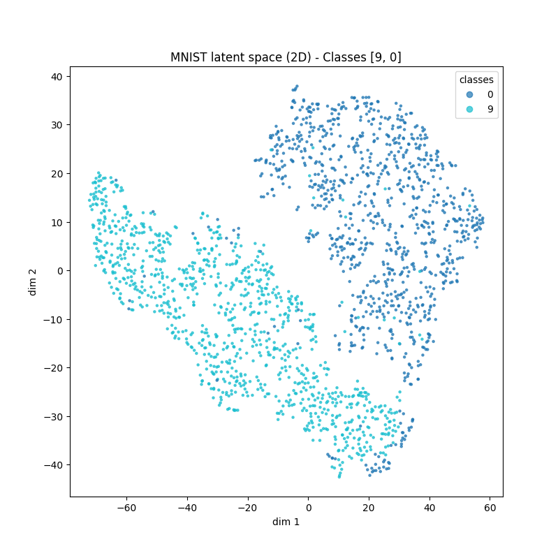

**Task 2, [3, 4]**

Linear probe overall acc: 0.9950

Class 9 accuracy on linear probing: 0.9949

Class 0 accuracy on linear probing: 0.9950


**Task 3, [5, 6]**

Linear probe overall acc: 0.9900

Class 9 accuracy on linear probing: 0.9898

Class 0 accuracy on linear probing: 0.9901


**Task 4, [7, 8]**

Linear probe overall acc: 0.9950

Class 9 accuracy on linear probing: 0.9949

Class 0 accuracy on linear probing: 0.9950

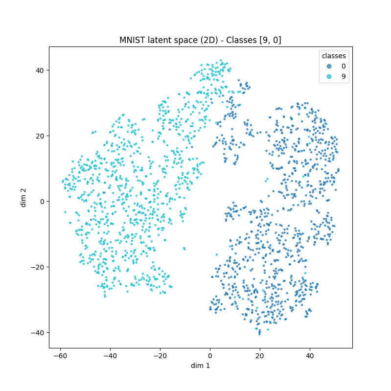

**Task 5, [9, 0]**

Linear probe overall acc: 0.9975

Class 9 accuracy on linear probing: 1.0000

Class 0 accuracy on linear probing: 0.9950

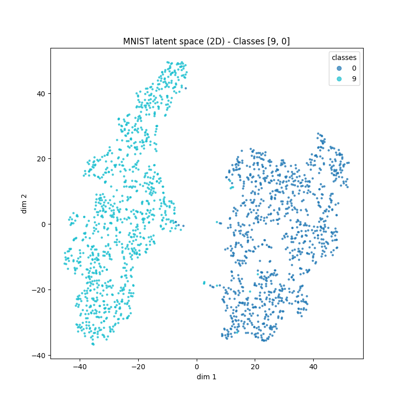

| Accuracy    | Task 1 | Task 2 | Task 3 | Task 4 | Task 5 |
|------------|-------- |------- |------- |------- |------- |
| Classifier | 0.9774 | 0.9950 | 0.9900 | 0.9950 | 0.9975 |
| Class 0    | 0.9703 | 0.9950 | 0.9901 | 0.9950 | 0.9950 |
| Class 9    | 0.9848 | 0.9949 | 0.9898 | 0.9949 | 1.0000 |


##### Performance on all classes

It seems that the features that are important to separate digits in the latent space were for a large part learned during the first task. From task 1 to task 5, around 5 p.p. were gained in performance, showing that there was some refiniment in the representation.

| Accuracy    | Task 1 | Task 2 | Task 3 | Task 4 | Task 5 |
|------------|------- |------- |------- |------- |------- |
| Classifier | 0.8470 | 0.8820 | 0.8835 | 0.8935 | 0.8905 |
| Class 0    | 0.9343 | 0.9293 | 0.8788 | 0.9091 | 0.9596 |
| Class 1    | 0.9688 | 0.9554 | 0.9598 | 0.9688 | 0.9688 |
| Class 2    | 0.8912 | 0.8653 | 0.9067 | 0.9067 | 0.8808 |
| Class 3    | 0.8235 | 0.8284 | 0.8922 | 0.8873 | 0.9020 |
| Class 4    | 0.7869 | 0.9235 | 0.8743 | 0.8579 | 0.8470 |
| Class 5    | 0.8011 | 0.7790 | 0.7624 | 0.8122 | 0.7901 |
| Class 6    | 0.8750 | 0.9323 | 0.9583 | 0.9219 | 0.9375 |
| Class 7    | 0.8276 | 0.9015 | 0.8818 | 0.9261 | 0.9163 |
| Class 8    | 0.7158 | 0.8142 | 0.8470 | 0.8907 | 0.8470 |
| Class 9    | 0.8201 | 0.8745 | 0.8577 | 0.8452 | 0.8410 |

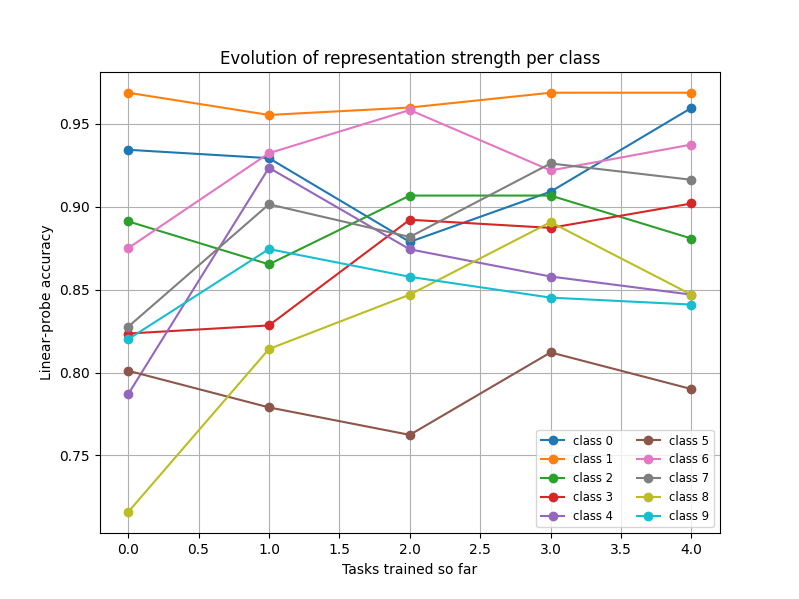

### Changing the loss function

Once we observed that most of the forgetting is happening in the classification layer, and not on the features or the representations, we investigate if we can act directly on the classification layer to mitigate the problem.

#### Negative log of the probability of the correct class

Usually in the multi-class classification problem, the softmax is used, once it pushes up the probability of the correct class and pushes down the probabilities of the incorrect classes. This is a problem in the sequential learning scenario because not all classes are seen at each task. Therefore, the classes trained previously have their probabilities pushed down a disproportionate amount in order to decrease the loss for the classes being currently trained.

We change the loss function to be:

```
base_loss = -torch.log(F.sigmoid(logits[range(n), yb])).sum()/n
```

Where now the loss relies only on the probability given to the correct class. The model will try to make this probability larger, without making the other probabilities smaller (in fact, it will not change anything of the other probabilities).

Therefore, for a given task where two classes are being trained, only the weights responsible for the calculation of the logits for those two classes will be updated.

This formulation keeps the representations learned as good as when trained with cross-entropy, and we are able to get a 7 p.p. improvement in the accuracy of the model, finally getting better than the lower bound (this network is trained with batch normalization).

But this formulation has several problems:

* It does not make any effort to separate the classes, it is only worried in making the correct label get a larger probability (as close to one as possible).
* One effect of this is that the weights for classes trained in later tasks get larger than weights for classes in previous tasks, as a way to get larger probabilities than them.

As it is the case that the weights in the output layer are much larger than in the rest of the network, a larger weight decay might be beneficial here.

Weight decay: 0.01

lambda L1: 0.0

task 1, [1, 2]

1, train loss 0.006407, train acc 0.990672, val loss 0.055343, val acc 0.989938

Sparcity analysis - population sparcity: 0.5092

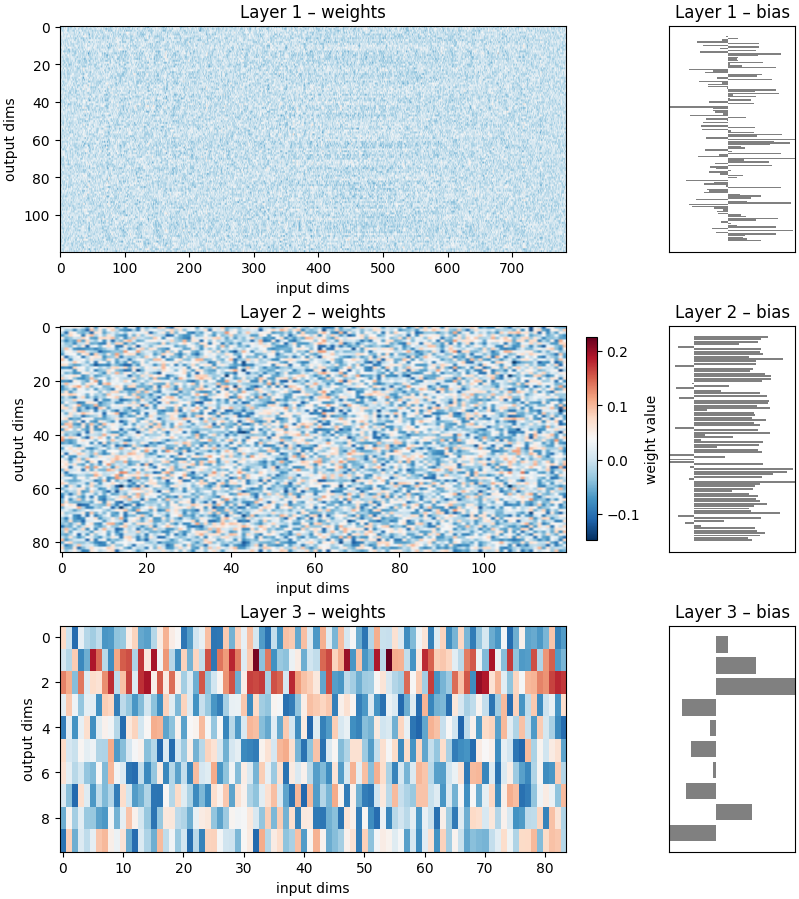

task 2, [3, 4]

1, train loss 0.001526, train acc 0.988992, val loss 1.071949, val acc 0.485616

Sparcity analysis - population sparcity: 0.4712


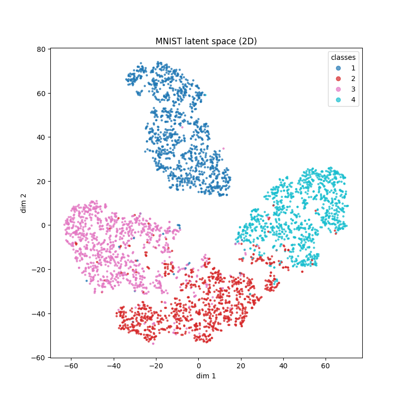


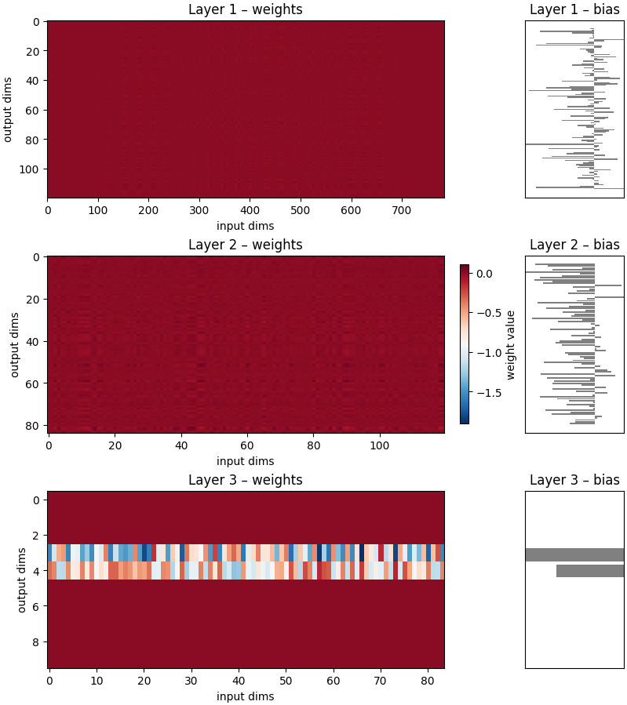

task 3, [5, 6]

8, train loss 0.000160, train acc 0.980189, val loss 2.440988, val acc 0.322272

Sparcity analysis - population sparcity: 0.4651

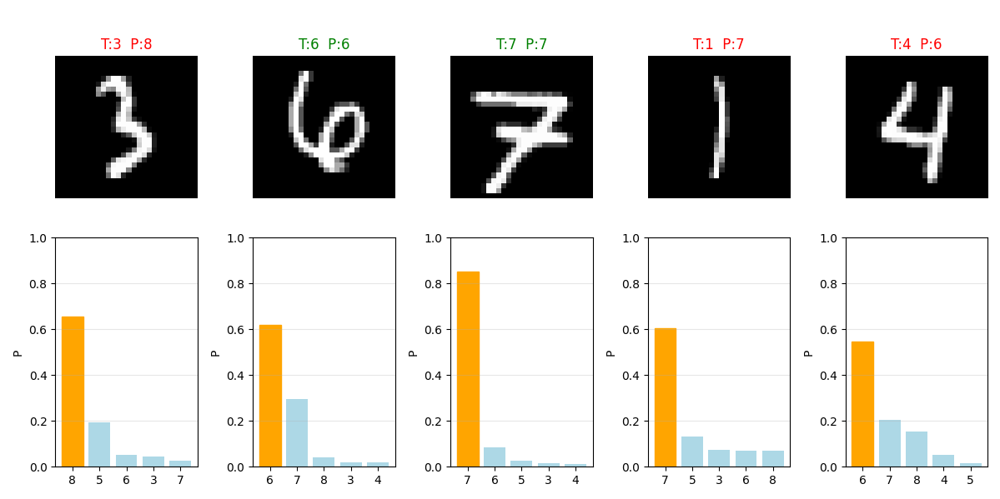

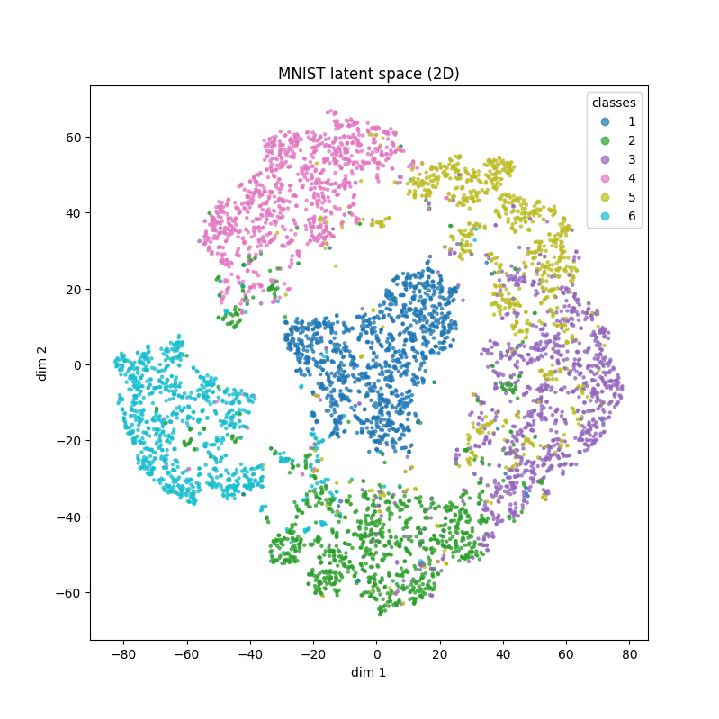


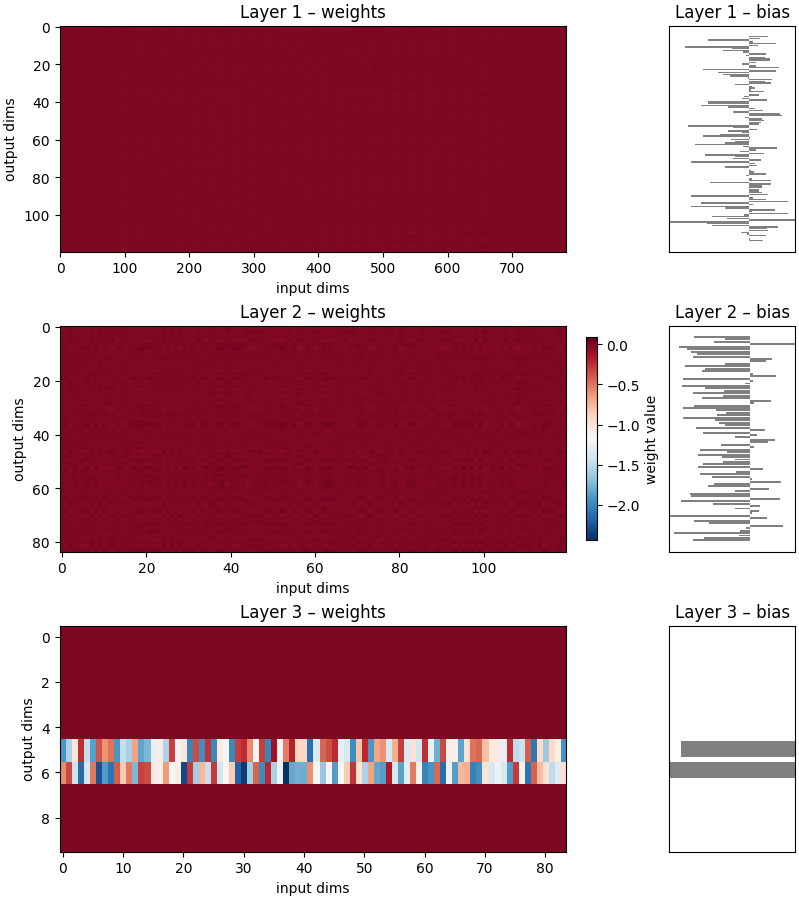

task 4, [7, 8]

7, train loss 0.000124, train acc 0.980153, val loss 2.503215, val acc 0.327504

Sparcity analysis - population sparcity: 0.4394

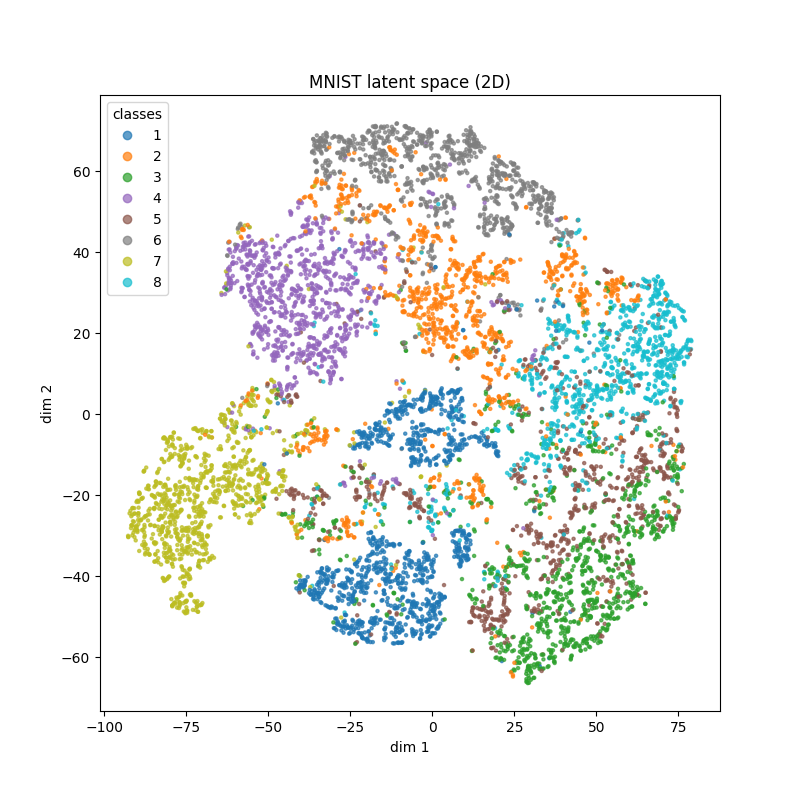


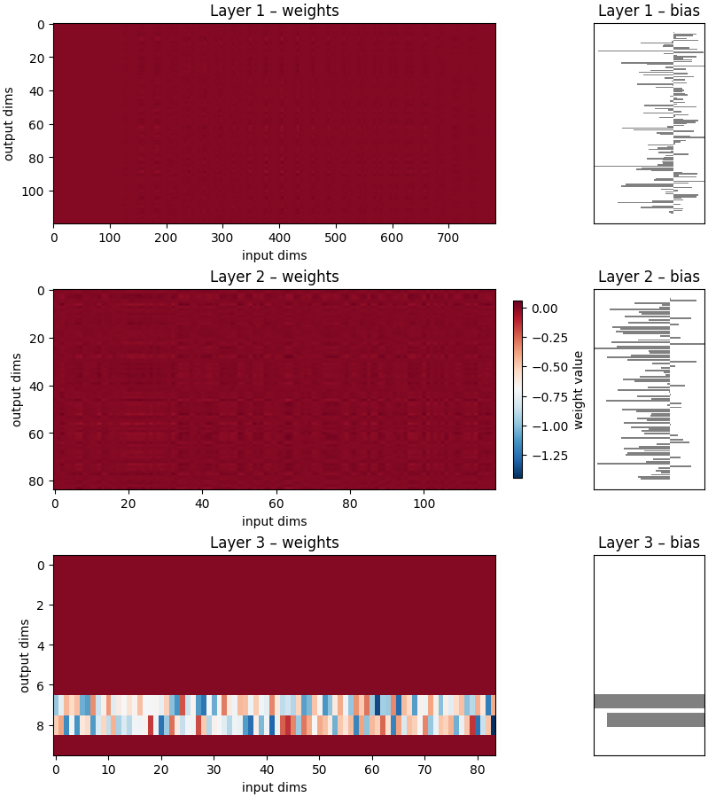

**task 5, [9, 0]**

11, train loss 0.000036, train acc 0.981474, val loss 3.333156, val acc 0.260000

Sparcity analysis - population sparcity: 0.4243


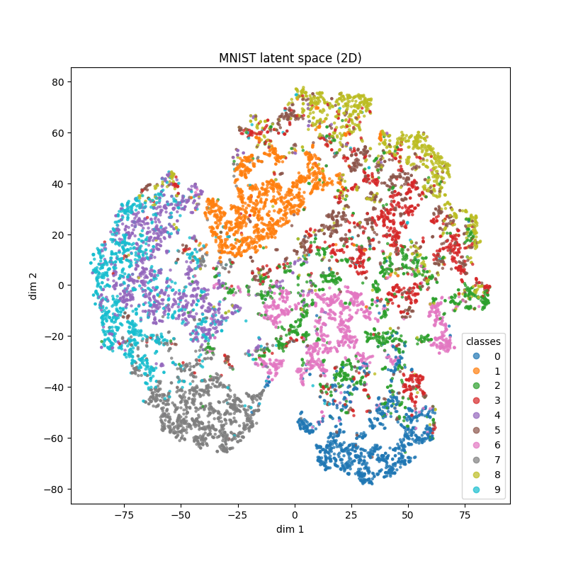

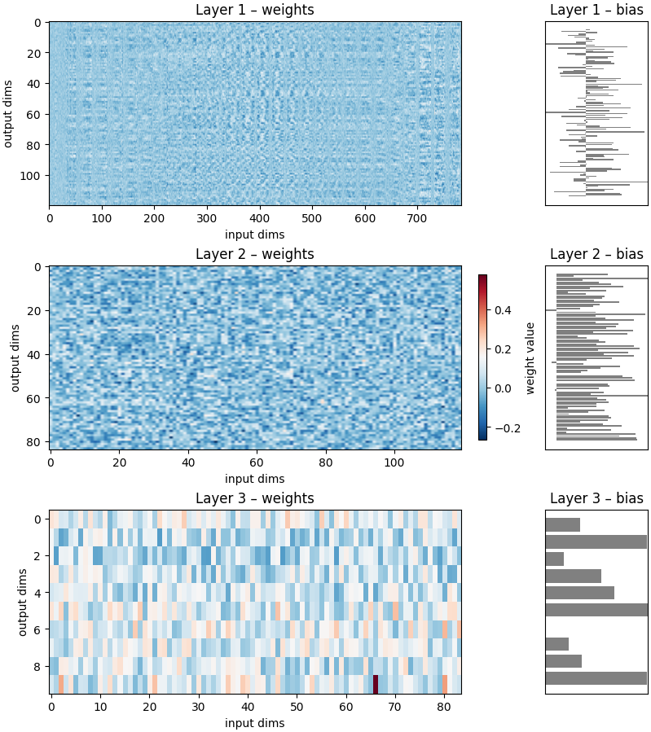

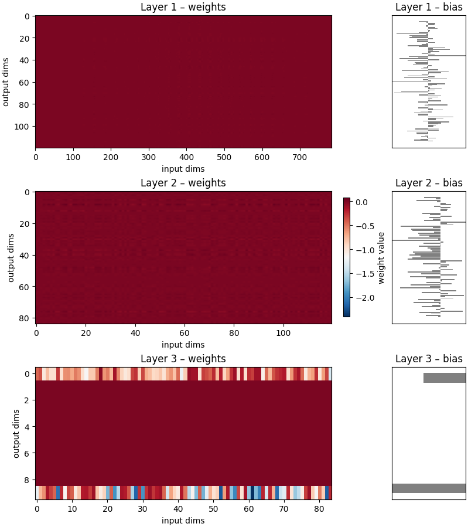

| Accuracy    | Task 1 | Task 2 | Task 3 | Task 4 | Task 5 |
|------------|------- |------- |------- |------- |------- |
| Classifier | 0.9952 | 0.9631 | 0.9347 | 0.9032 | 0.8825 |
| Class 1    | 0.9907 | 0.9752 | 0.9757 | 0.9646 | 0.9509 |
| Class 2    | 1.0000 | 0.9484 | 0.9124 | 0.8916 | 0.8912 |
| Class 3    |        | 0.9427 | 0.9020 | 0.8426 | 0.8333 |
| Class 4    |        | 0.9855 | 0.9519 | 0.9352 | 0.8689 |
| Class 5    |        |        | 0.8856 | 0.7898 | 0.7956 |
| Class 6    |        |        | 0.9802 | 0.9676 | 0.9531 |
| Class 7    |        |        |        | 0.9531 | 0.8916 |
| Class 8    |        |        |        | 0.8647 | 0.8306 |
| Class 9    |        |        |        |        | 0.8494 |
| Class 0    |        |        |        |        | 0.9495 |

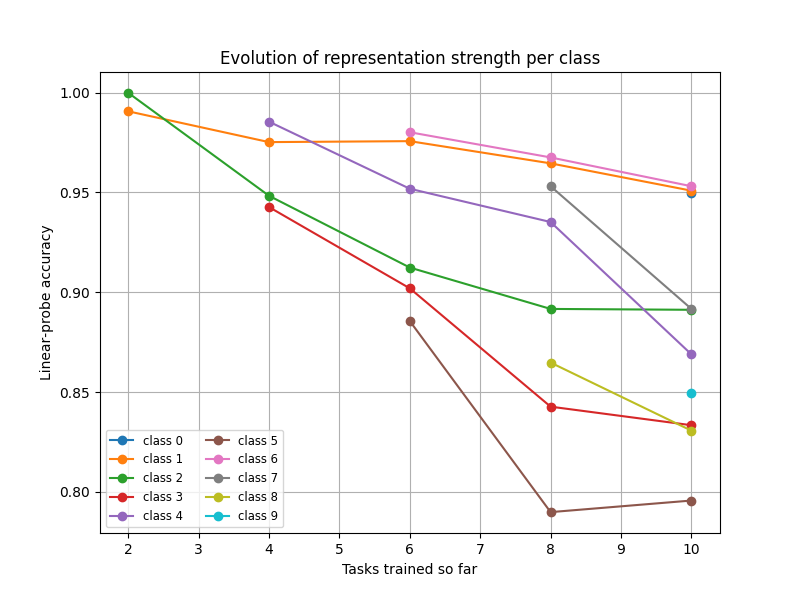

#### Experiment 2

To try and fix the problem of the weights in the classification layer growing for the new classes being trained, we added a l2 weight decay penalty *only in the rows of the classes being trained*. This was necessary because if the penalty was on the classification layer as a whole, the network would start decreasing the weights of the classes already trained.

The value for this parameter was very sensitive also. If it was to big, the network would prefer to decrease the weights of the classification instead of optimize the accuracy for the class.

```
l1_norm = 0.0
for name, param in model.named_parameters():
    if name == "fc3.weight":
        l1_norm += param[task_classes, :].pow(2).sum()
    elif name == "fc3.bias":
        l1_norm += param[task_classes].pow(2).sum()

loss = base_loss + lambda_l1 * l1_norm
```

This mechanism was successful in its end, as it can be seen in the values of the norm of the rows of the classification layer at the end of the training, and the value of the bias. It can be seen also in the figure of the weights during training, where it is less obvious now the order of the training just by looking at the weights:

```
Checking norm of the class. layer weights
tensor([0.7591, 0.9982, 0.9560, 1.0066, 1.0327, 0.9257, 0.9601, 0.9410, 0.9158,
        0.7643])

Classification bias vector:
tensor([ 0.0988,  0.1442,  0.0487,  0.0912, -0.0191,  0.0474,  0.0397,  0.1057,
         0.1050,  0.1019], requires_grad=True)
```

If we look at the linear probe performance, we see that it did not change from the previous experiment, and it also did not change significantly from the experiment with BN and the regular cross-entropy loss. Additionally, looking at gradients of the network, we can see that the gradients of the weight layers are very small - the network is basically not updating its weights, relying only on its classification layer to improve its prediction.

The effect of this is that both the forgetting and the training are much slower now. In fact, in the last task the network is not able to achieve the accuracy of 98% by 20 epochs.

This suggests to us that the best thing now is to study how can we make the gradients flow more thoroughly through the network, in a way that it can improve its latent space, hopefully separating better the classes. 

Training:

Weight decay: 1e-05 # this is the l2 penalty on the entire net

lambda L1: 0.0007 # this is the penalty only on the classification layer, rows of the classes being evaluated

task 1, [1, 2]

1, train loss 0.007180, train acc 0.991991, val loss 0.049660, val acc 0.991375


task 2, [3, 4]

1, train loss 0.003378, train acc 0.992595, val loss 1.189711, val acc 0.494468

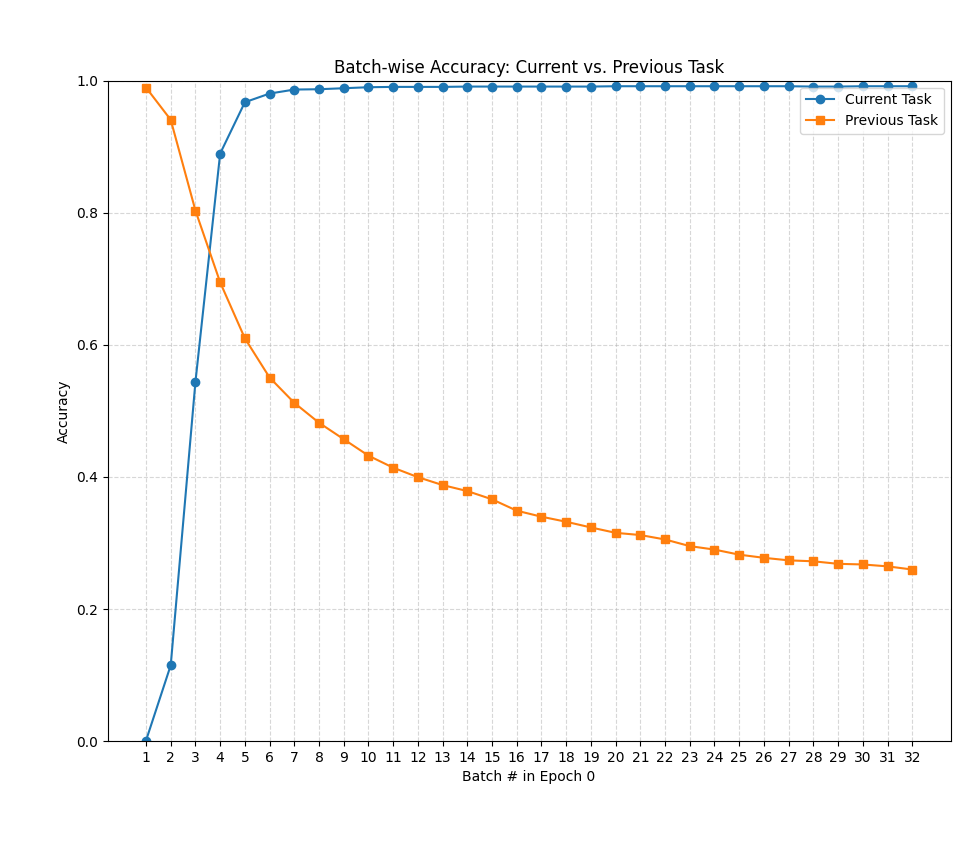

task 3, [5, 6]

19, train loss 0.001550, train acc 0.976798, val loss 2.096942, val acc 0.394503

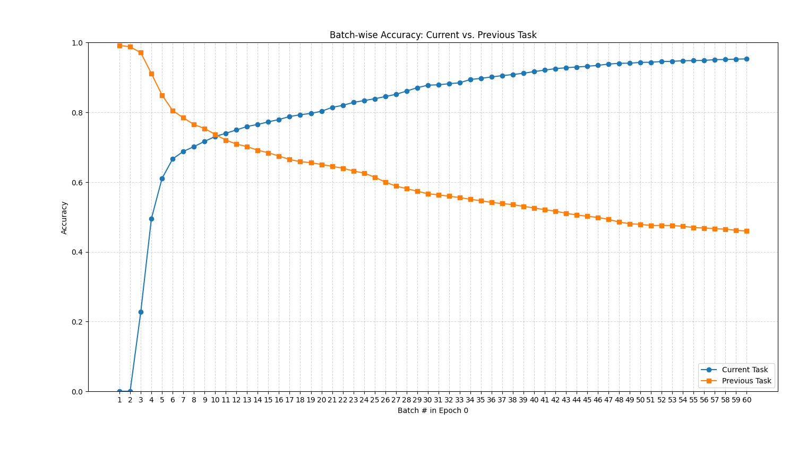

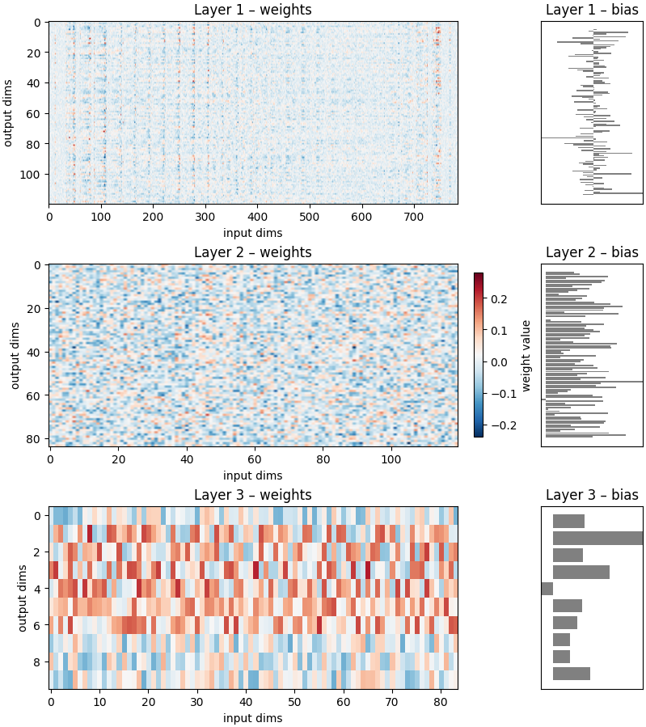

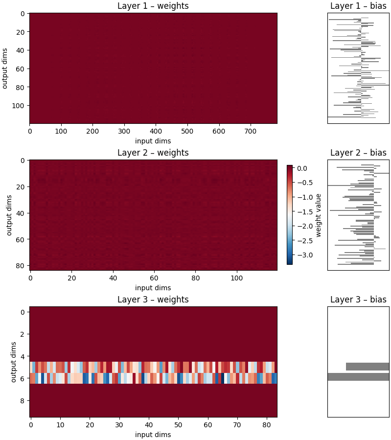

task 4, [7, 8]

1, train loss 0.001641, train acc 0.983825, val loss 2.020045, val acc 0.357982

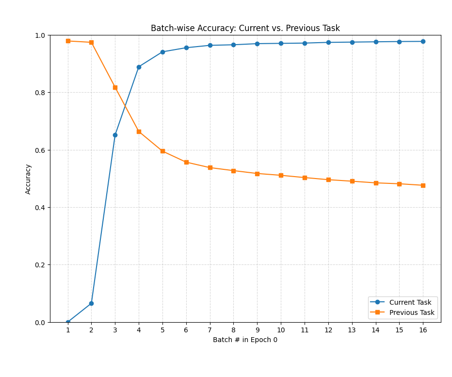


task 5, [9, 0]

19, train loss 0.001012, train acc 0.882567, val loss 2.232976, val acc 0.408200


Checking norm of the class. layer weights
tensor([0.7591, 0.9982, 0.9560, 1.0066, 1.0327, 0.9257, 0.9601, 0.9410, 0.9158,
        0.7643])

Classification bias vector:
tensor([ 0.0988,  0.1442,  0.0487,  0.0912, -0.0191,  0.0474,  0.0397,  0.1057,
         0.1050,  0.1019], requires_grad=True)

| Accuracy    | Task 1 | Task 2 | Task 3 | Task 4 | Task 5 |
|------------|------- |------- |------- |------- |------- |
| Classifier | 0.9928 | 0.9619 | 0.9380 | 0.9051 | 0.8815 |
| Class 1    | 0.9907 | 0.9752 | 0.9806 | 0.9558 | 0.9598 |
| Class 2    | 0.9951 | 0.9343 | 0.9175 | 0.8768 | 0.9171 |
| Class 3    |        | 0.9479 | 0.8775 | 0.8122 | 0.8333 |
| Class 4    |        | 0.9903 | 0.9679 | 0.9444 | 0.8251 |
| Class 5    |        |        | 0.9204 | 0.8466 | 0.8398 |
| Class 6    |        |        | 0.9653 | 0.9622 | 0.9375 |
| Class 7    |        |        |        | 0.9531 | 0.9163 |
| Class 8    |        |        |        | 0.8792 | 0.8306 |
| Class 9    |        |        |        |        | 0.8075 |
| Class 0    |        |        |        |        | 0.9444 |

### Training with binary cross-entropy

The binary cross-entropy does has some advantages over the previous approach of just making the correct class try to go to probability 1, even though both seem to have similar results.

The advantage is that the binary cross-entropy tries at the very least push the classes that are present at that very moment away from each other, while the former approach does not do this explicitly. 

Even though, we can see examples that several classes have very high probabilities, that does not happen with cross-entropy loss, that shuts off all the classes not present in the current training.

Weight decay: 1e-05

lambda L1: 0.001

task 1, [1, 2]

1, train loss 0.022902, train acc 0.995006, val loss 0.074298, val acc 0.995208


task 2, [3, 4]

1, train loss 0.016119, train acc 0.988792, val loss 1.450340, val acc 0.684780


task 3, [5, 6]

example

tensor(5)

tensor([5.7073e-01, 8.9323e-01, 2.0173e-01, 9.9754e-01, 2.7074e-03, 9.9934e-01,
        9.7141e-04, 7.8263e-01, 6.2857e-01, 2.6208e-01],
       grad_fn=<SigmoidBackward0>)

tensor(0.9993, grad_fn=<SigmoidBackward0>)


4, train loss 0.013546, train acc 0.980189, val loss 2.612441, val acc 0.376236

task 4, [7, 8]

example

tensor(7)

tensor([0.4523, 0.3075, 0.7426, 0.8765, 0.0876, 0.8423, 0.2329, 0.9987, 0.0015,
        0.3272], grad_fn=<SigmoidBackward0>)

tensor(0.9987, grad_fn=<SigmoidBackward0>)


3, train loss 0.009136, train acc 0.982038, val loss 2.827072, val acc 0.403822

task 5, [9, 0]

example

tensor(9)

tensor([1.6988e-02, 9.7836e-01, 4.1281e-02, 9.9889e-01, 2.1949e-03, 9.9996e-01,
        5.6240e-05, 9.5735e-01, 5.3388e-02, 9.7941e-01],
       grad_fn=<SigmoidBackward0>)

tensor(0.9794, grad_fn=<SigmoidBackward0>)

14, train loss 0.003554, train acc 0.924377, val loss 3.599995, val acc 0.384800

Checking norm of the class. layer weights

tensor([1.0331, 1.1766, 1.1883, 1.2521, 1.2254, 1.3361, 1.3228, 1.2668, 1.2774,
        1.0406])

Sparcity analysis - population sparcity: 0.4777


| Accuracy    | Task 1 | Task 2 | Task 3 | Task 4 | Task 5 |
|------------|------- |------- |------- |------- |------- |
| Classifier | 0.9976 | 0.9779 | 0.9296 | 0.9295 | 0.8970 |
| Class 1    | 0.9953 | 0.9851 | 0.9612 | 0.9602 | 0.9598 |
| Class 2    | 1.0000 | 0.9577 | 0.8763 | 0.9261 | 0.9171 |
| Class 3    |        | 0.9740 | 0.9069 | 0.9036 | 0.8480 |
| Class 4    |        | 0.9952 | 0.9786 | 0.9398 | 0.8525 |
| Class 5    |        |        | 0.9055 | 0.8352 | 0.8011 |
| Class 6    |        |        | 0.9505 | 0.9784 | 0.9219 |
| Class 7    |        |        |        | 0.9583 | 0.9409 |
| Class 8    |        |        |        | 0.9227 | 0.8907 |
| Class 9    |        |        |        |        | 0.8703 |
| Class 0    |        |        |        |        | 0.9545 |

#### Binary cross-entropy + repel loss

```
            logits, (h1, h2) = model(xb)
            
            # apply binary cross-entropy loss
            task_logits = logits[:, task_classes]
            tc = torch.tensor(task_classes) # tensor([1, 2])
            yb_expand = yb.unsqueeze(1) # (batch, 1)
            targets = (yb_expand == tc).float() # (batch, 2)
            base_loss = F.binary_cross_entropy_with_logits(task_logits, targets)
            
            # loss for the incorrect classes: attracts it to 0.1
            # do not backprop through the classification layer, only latent layers
            # 1) create fake final layer, whose weights and bias are detached
            fake_logits = F.linear(
                    h2, 
                    model.fc3.weight.detach(),
                    model.fc3.bias.detach())
            fake_probs = F.sigmoid(fake_logits)
            # 2) mask to select only the incorrect classes
            mask = torch.ones_like(fake_probs, dtype=torch.bool)
            mask[range(n), yb] = False
            # 3) calculate the loss for the incorrect classes
            #repel_loss = (fake_probs[mask] - 0.1).pow(2).sum() / n
            repel_loss = -torch.log((1 - fake_probs[mask]).clamp(min=1e-6)).sum()/n

            # compute the l1 norm for the activations
            #l1_norm = (h1.abs().mean() + h2.abs().mean())
            l1_norm = 0.0
            for name, param in model.named_parameters():
                if name == "fc3.weight":
                    l1_norm += param[task_classes, :].pow(2).sum()
                elif name == "fc3.bias":
                    l1_norm += param[task_classes].pow(2).sum()

            if counter % 100 == 0 and counter != 0:
                print(base_loss)
                print(repel_loss)
                print(l1_norm)

            loss = base_loss + lambda_repel * repel_loss + lambda_l1 * l1_norm
```


lambda_l1 = 0.001

print(f"lambda L1: {lambda_l1}")

lambda_repel = 0.001

print(f"lambda repel: {lambda_repel}")

Task 5, [9, 0]

lambda l1: 0.001

example

tensor(0)

tensor([9.9932e-01, 4.5660e-01, 3.9632e-01, 2.4827e-01, 8.7718e-01, 4.4422e-02,
        9.1367e-01, 1.2432e-01, 8.9207e-01, 6.9047e-04],
       grad_fn=<SigmoidBackward0>)

1, train loss 0.021530, train acc 0.947661, val loss 2.440863, val acc 0.408900

example

tensor(0)

tensor([0.9480, 0.4144, 0.5023, 0.4627, 0.7121, 0.3262, 0.6547, 0.0220, 0.9764,
        0.0567], grad_fn=<SigmoidBackward0>)

Epoch 3, train loss 0.015301, train acc 0.985017, val loss 2.712776, val acc 0.352400

Linear probe overall acc: 0.9095

| Accuracy    | Task 1 | Task 2 | Task 3 | Task 4 | Task 5 |
|------------|------- |------- |------- |------- |------- |
| Classifier | 0.9976 | 0.9668 | 0.9389 | 0.9251 | 0.9095 |
| Class 1    | 0.9953 | 0.9901 | 0.9709 | 0.9735 | 0.9688 |
| Class 2    | 1.0000 | 0.9390 | 0.9278 | 0.8571 | 0.8860 |
| Class 3    |        | 0.9531 | 0.8971 | 0.9239 | 0.8725 |
| Class 4    |        | 0.9855 | 0.9626 | 0.9676 | 0.9126 |
| Class 5    |        |        | 0.9055 | 0.8068 | 0.7845 |
| Class 6    |        |        | 0.9703 | 0.9676 | 0.9583 |
| Class 7    |        |        |        | 0.9531 | 0.9458 |
| Class 8    |        |        |        | 0.9324 | 0.9016 |
| Class 9    |        |        |        |        | 0.9121 |
| Class 0    |        |        |        |        | 0.9343 |

### Training using MSE

Experiments using the MSE loss with a target of 0.9 for the correct class were not successfull.

```
base_loss = (F.sigmoid(logits[range(n), yb]) - 0.9).pow(2).sum() / n
```

Just using the loss in the correct class proved ineffective, as seen below. The network is unable to get good accuracies for the current classes. This happens because several classes are receiving accuracies close to 0.9.

We tried to change the latent space, using a loss on the incorrect classes and skipping the update on the classification layer. But this, on the other hard, resulted in fast forgetting - the prediction connections for the other classes not being able to adapt to the change of the representations below:

```
# loss for the incorrect classes: attracts it to 0.1
# do not backprop through the classification layer, only latent layers
# 1) create fake final layer, whose weights and bias are detached
fake_logits = F.linear(
        h2, 
        model.fc3.weight.detach(),
        model.fc3.bias.detach())
fake_probs = F.sigmoid(fake_logits)
# 2) mask to select only the incorrect classes
mask = torch.ones_like(fake_probs, dtype=torch.bool)
mask[range(n), yb] = False
# 3) calculate the loss for the incorrect classes
repel_loss = (fake_probs[mask] - 0.1).pow(2).sum() / n
```

To make the neural net change the latent space, we also tried to make it have a higher learning rate than the prediction head. This resulted in a prediction head with smaller weights than the rest of the network, and also resulted in fast forgetting:

```
lr1 = 1e-2
lr2 = 1e-3

optimizer = torch.optim.AdamW([
    { 'params': list(model.fc1.parameters()) + list(model.fc2.parameters()), 'lr': lr1, 'weight_decay': weight_decay },
    { 'params': list(model.bn1.parameters()) + list(model.bn2.parameters()), 'lr': lr1, 'weight_decay': 0.0 },
    { 'params': model.fc3.parameters(), 'lr': lr2, 'weight_decay': weight_decay },
])
```


Weight decay: 0.0001

lambda L1: 0.0001

task 1, [1, 2]

1, train loss 0.000327, train acc 0.985678, val loss 0.791317, val acc 0.986104

task 2, [3, 4]

1, train loss 0.000276, train acc 0.986691, val loss 1.368430, val acc 0.495697

task 3, [5, 6]

9, train loss 0.000123, train acc 0.748490, val loss 1.686097, val acc 0.471426

task 4, [7, 8]

9, train loss 0.000116, train acc 0.602064, val loss 2.035264, val acc 0.240570

task 5, [9, 0]

9, train loss 0.000096, train acc 0.357360, val loss 2.251420, val acc 0.248100

| Accuracy    | Task 1 | Task 2 | Task 3 | Task 4 | Task 5 |
|------------|------- |------- |------- |------- |------- |
| Classifier | 0.9904 | 0.9533 | 0.9288 | 0.9032 | 0.8845 |
| Class 1    | 0.9907 | 0.9703 | 0.9757 | 0.9779 | 0.9554 |
| Class 2    | 0.9901 | 0.9343 | 0.9227 | 0.8768 | 0.8912 |
| Class 3    |        | 0.9271 | 0.9069 | 0.8985 | 0.8480 |
| Class 4    |        | 0.9807 | 0.9572 | 0.9259 | 0.8962 |
| Class 5    |        |        | 0.8607 | 0.8239 | 0.8177 |
| Class 6    |        |        | 0.9505 | 0.9568 | 0.9531 |
| Class 7    |        |        |        | 0.9323 | 0.9064 |
| Class 8    |        |        |        | 0.8213 | 0.8087 |
| Class 9    |        |        |        |        | 0.8494 |
| Class 0    |        |        |        |        | 0.9091 |

### Investigating the amount of change in the weight space versus forgetting

Testing hyphothesis that I can correlate some kinds of forgetting to where the changes happen in the neural network architecture. For instance, some forgetting will be shallow, like when training with cross-entropy, where most changes are localized at the classification head. Other forgettings may be deeper, for instance if forcing more changes to the latent space.

This could in turn be correlated with the *savings* metric, where more savings would indicate a latent space more preserved (or with more general features), and therefore a shallower sort of forgetting.

I want to test if I can see this looking at the weight changes.

All training unless otherwised stated use the 3-layer network with BN.

#### Cross-entropy training

The usual approach:

Weight decay: 0.01

lambda L1: 0.0

task 1, [1, 2]

1, train loss 0.026846, train acc 0.994629, val loss 0.016472, val acc 0.996646

task 2, [3, 4]

1, train loss 0.019200, train acc 0.996397, val loss 2.768203, val acc 0.484878


task 3, [5, 6]

1, train loss 0.041286, train acc 0.989618, val loss 4.058978, val acc 0.315401


task 4, [7, 8]

1, train loss 0.028197, train acc 0.993947, val loss 4.382470, val acc 0.253060


task 5, [9, 0]

1, train loss 0.026106, train acc 0.994331, val loss 4.808394, val acc 0.198300


tensor([1.0656, 1.6441, 1.5086, 1.4410, 1.4004, 1.3496, 1.2717, 1.2006, 1.3006,
        1.0420])

Sparcity analysis - population sparcity: 0.5206

Classification bias vector:

tensor([ 0.0332,  0.0100, -0.0765, -0.0136, -0.1652,  0.0224, -0.1575, -0.0593,
         0.0142,  0.0010], requires_grad=True)

| Accuracy    | Task 1 | Task 2 | Task 3 | Task 4 | Task 5 |
|------------|------- |------- |------- |------- |------- |
| Classifier | 0.9976 | 0.9644 | 0.9389 | 0.9170 | 0.8815 |
| Class 1    | 0.9953 | 0.9802 | 0.9660 | 0.9646 | 0.9598 |
| Class 2    | 1.0000 | 0.9531 | 0.9227 | 0.8916 | 0.8653 |
| Class 3    |        | 0.9271 | 0.8824 | 0.8629 | 0.8480 |
| Class 4    |        | 0.9952 | 0.9679 | 0.9630 | 0.8251 |
| Class 5    |        |        | 0.9104 | 0.8295 | 0.7901 |
| Class 6    |        |        | 0.9851 | 0.9676 | 0.9479 |
| Class 7    |        |        |        | 0.9583 | 0.9261 |
| Class 8    |        |        |        | 0.8841 | 0.8415 |
| Class 9    |        |        |        |        | 0.8410 |
| Class 0    |        |        |        |        | 0.9545 |

### Sigmoid - Cross-entropy only in the correct class

Weight decay: 0.01

lambda L1: 0.0007 # l2 norm only in the line of the correct class on the classication layer

task 1, [1, 2]

0, train loss 0.047578, train acc 0.980778, val loss 0.096569, val acc 0.989938

task 2, [3, 4]

1, train loss 0.003808, train acc 0.990593, val loss 0.986332, val acc 0.552987


task 3, [5, 6]

9, train loss 0.002000, train acc 0.980083, val loss 2.228415, val acc 0.338529


task 4, [7, 8]

example

Correct class

tensor(7)

All probs

tensor([0.5992, 0.9228, 0.9853, 0.9943, 0.9892, 0.9904, 0.9967, 0.9998, 0.8598,
        0.6661], grad_fn=<SigmoidBackward0>)

Cross-entropy loss for correct class only

tensor(0.9998, grad_fn=<SigmoidBackward0>)

MSE loss for correct class only

tensor(0.0100, grad_fn=<PowBackward0>)

14, train loss 0.001341, train acc 0.939367, val loss 2.274370, val acc 0.360105


task 5, [9, 0]

example

Correct class

tensor(0)

All probs

tensor([0.9997, 0.9632, 0.9947, 0.9974, 0.9889, 0.9961, 0.9987, 0.9965, 0.9922,
        0.9036], grad_fn=<SigmoidBackward0>)

Cross-entropy loss for correct class only

tensor(0.9997, grad_fn=<SigmoidBackward0>)

MSE loss for correct class only

tensor(0.0099, grad_fn=<PowBackward0>)

14, train loss 0.001068, train acc 0.958392, val loss 2.454173, val acc 0.329800

Checking norm of the class. layer weights
tensor([0.7771, 0.8450, 0.8739, 0.9778, 0.9404, 1.0107, 1.0209, 0.8739, 0.8307,
        0.7832])

Classification bias vector:

tensor([ 0.0632,  0.0803,  0.0562,  0.1646, -0.0313,  0.0242,  0.1453,  0.1242,
         0.0778,  0.1131], requires_grad=True)


| Accuracy    | Task 1 | Task 2 | Task 3 | Task 4 | Task 5 |
|------------|------- |------- |------- |------- |------- |
| Classifier | 0.9928 | 0.9644 | 0.9213 | 0.9089 | 0.8760 |
| Class 1    | 0.9907 | 0.9901 | 0.9757 | 0.9735 | 0.9509 |
| Class 2    | 0.9951 | 0.9437 | 0.9124 | 0.8522 | 0.8756 |
| Class 3    |        | 0.9323 | 0.8627 | 0.8477 | 0.8333 |
| Class 4    |        | 0.9903 | 0.9626 | 0.9630 | 0.8361 |
| Class 5    |        |        | 0.8607 | 0.8295 | 0.7569 |
| Class 6    |        |        | 0.9554 | 0.9568 | 0.9323 |
| Class 7    |        |        |        | 0.9479 | 0.8916 |
| Class 8    |        |        |        | 0.8841 | 0.8415 |
| Class 9    |        |        |        |        | 0.8619 |
| Class 0    |        |        |        |        | 0.9596 |

### Sigmoid - Cross-entropy on the correct class + repel loss on the incorrect class

Now we can force changes in the latent layers, by adding a loss function to decrease the logits in the incorrect classes:

* We keep the sigmoid loss on the correct class
* We add sigmoid losses on the incorrect class, to make the reduce the logits values - but we propagate this gradients only to the latent layers, and not to the classification layer (which cannot change)

```
            logits, (h1, h2) = model(xb)

            base_loss = -torch.log(F.sigmoid(logits[range(n), yb])).sum()/n
            
            # loss for the incorrect classes
            # do not backprop through the classification layer, only latent layers
            # 1) create fake final layer, whose weights and bias are detached
            fake_logits = F.linear(
                    h2, 
                    model.fc3.weight.detach(),
                    model.fc3.bias.detach())
            fake_probs = F.sigmoid(fake_logits)
            # 2) mask to select only the incorrect classes
            mask = torch.ones_like(fake_probs, dtype=torch.bool)
            mask[range(n), yb] = False
            # 3) calculate the loss for the incorrect classes
            repel_loss = -torch.log(1 - fake_probs[mask]).sum()/n

            l1_norm = 0.0
            for name, param in model.named_parameters():
                if name == "fc3.weight":
                    l1_norm += param[task_classes, :].pow(2).sum()
                elif name == "fc3.bias":
                    l1_norm += param[task_classes].pow(2).sum()

            loss = base_loss + lambda_repel * repel_loss + lambda_l1 * l1_norm

            loss.backward()
```

Now we can see what effect changes in the latent layer have on the learning. What is see is fast forgetting, and also growing sparsity (BN is not able to stop it here). This sparsity (on the activations) is probably the easy way the network have to reduce the logits of the incorrect classes, and we can see how it comes about: most of the biases of the latent layers are negative. This is probably also the cause the norm of the classification layer grows for lines (classes) that are trained later: because they need to receive more sparse inputs. 

Also as a consequence of all this, the representational power of the latent space is very much reduced.

This is definetely a more deep forgetting than just using regular cross-entropy, even though on the surface they have the *same resulting accuracies*. Therefore, we would expect that the *savings* metric would be smaller for this case.

Accuracies for cross-entropy:

task 1, [1, 2]

1, train loss 0.026846, train acc 0.994629, val loss 0.016472, val acc 0.996646

task 2, [3, 4]

1, train loss 0.019200, train acc 0.996397, val loss 2.768203, val acc 0.484878

task 3, [5, 6]

1, train loss 0.041286, train acc 0.989618, val loss 4.058978, val acc 0.315401

task 4, [7, 8]

1, train loss 0.028197, train acc 0.993947, val loss 4.382470, val acc 0.253060

task 5, [9, 0]

1, train loss 0.026106, train acc 0.994331, val loss 4.808394, val acc 0.198300

Accuracies for sigmoid accuracy on correct and incorrect classes (forcing gradients to the latent layers):

task 1, [1, 2]

0, train loss 0.624714, train acc 0.980967, val loss 0.104157, val acc 0.990896

task 2, [3, 4]

1, train loss 0.685754, train acc 0.994996, val loss 1.596057, val acc 0.478485

task 3, [5, 6]

1, train loss 0.855084, train acc 0.986227, val loss 2.142583, val acc 0.308195

Task 4:

1, train loss 0.894710, train acc 0.992260, val loss 2.303631, val acc 0.245441

Task 5:

1, train loss 0.991418, train acc 0.980259, val loss 2.350173, val acc 0.197300

Experiment:

Weight decay: 0.01

lambda L1: 0.0007

lambda repel: 0.1

task 1, [1, 2]

0, train loss 0.624714, train acc 0.980967, val loss 0.104157, val acc 0.990896

task 2, [3, 4]

1, train loss 0.685754, train acc 0.994996, val loss 1.596057, val acc 0.478485


task 3, [5, 6]

1, train loss 0.855084, train acc 0.986227, val loss 2.142583, val acc 0.308195


task 4, [7, 8]

example

Correct class

tensor(8)

All probs

tensor([0.5274, 0.5533, 0.5196, 0.6691, 0.6659, 0.6594, 0.6436, 0.6813, 0.9309,
        0.4694], grad_fn=<SigmoidBackward0>)

Cross-entropy loss for correct class only

tensor(0.9309, grad_fn=<SigmoidBackward0>)

MSE loss for correct class only

tensor(0.0010, grad_fn=<PowBackward0>)

1, train loss 0.894710, train acc 0.992260, val loss 2.303631, val acc 0.245441

Sparcity analysis - population sparcity: 0.7527


task 5, [9, 0]

example

Correct class

tensor(9)

All probs

tensor([0.6825, 0.5535, 0.5289, 0.6587, 0.6445, 0.5925, 0.6655, 0.6871, 0.7249,
        0.9208], grad_fn=<SigmoidBackward0>)

Cross-entropy loss for correct class only

tensor(0.9208, grad_fn=<SigmoidBackward0>)

MSE loss for correct class only

tensor(0.0004, grad_fn=<PowBackward0>)

1, train loss 0.991418, train acc 0.980259, val loss 2.350173, val acc 0.197300

tensor([1.6967, 0.8886, 0.8768, 1.2190, 1.2046, 1.6922, 1.6655, 1.8190, 2.0558,
        1.8166])

Sparcity analysis - population sparcity: 0.7856

Classification bias vector:

tensor([0.5852, 0.1374, 0.0780, 0.1814, 0.1944, 0.1765, 0.2142, 0.4880, 0.4428,
        0.3810], requires_grad=True)


| Accuracy    | Task 1 | Task 2 | Task 3 | Task 4 | Task 5 |
|------------|------- |------- |------- |------- |------- |
| Classifier | 0.9952 | 0.9631 | 0.8702 | 0.7216 | 0.4940 |
| Class 1    | 0.9907 | 0.9802 | 0.9417 | 0.8761 | 0.8304 |
| Class 2    | 1.0000 | 0.9343 | 0.7474 | 0.5419 | 0.4145 |
| Class 3    |        | 0.9427 | 0.8431 | 0.6751 | 0.1127 |
| Class 4    |        | 0.9952 | 0.9144 | 0.8472 | 0.2459 |
| Class 5    |        |        | 0.8109 | 0.3750 | 0.2818 |
| Class 6    |        |        | 0.9604 | 0.7622 | 0.4688 |
| Class 7    |        |        |        | 0.8958 | 0.5764 |
| Class 8    |        |        |        | 0.7391 | 0.2678 |
| Class 9    |        |        |        |        | 0.7113 |
| Class 0    |        |        |        |        | 0.8939 |

### Cross-entropy - different learning rates

We tried have the network suffer *deep* forgetting by changing the learning rates, making the latent layers be updated more than the classification layer.

This made the network forget slower, but it seemed that the forgetting still was localized in the classification head. Even though it learned slowly, it did learn just enough to modify its distribution to predict the current training classes and shut off the rest.

This is indicated by the fact that the latent representation continued to be as good as it was before. Also, this might be the case of the choice of learning rates: making them larger to the latent layers and even smaller to the latent layers might have done a different result.

Experiment:

Weight decay: 0.01

lr1: 0.001, lr2: 1e-05

lambda L1: 0.0007

lambda repel: 0.0

task 1, [1, 2]

0, train loss 1.070318, train acc 0.958541, val loss 0.786608, val acc 0.992333

task 2, [3, 4]

1, train loss 0.301710, train acc 0.995097, val loss 1.671277, val acc 0.484878


task 3, [5, 6]

1, train loss 0.421450, train acc 0.986969, val loss 2.079249, val acc 0.314899


task 4, [7, 8]

1, train loss 0.217794, train acc 0.993748, val loss 2.467439, val acc 0.252810


task 5, [9, 0]

example

Correct class

tensor(9)

All probs

tensor([0.0539, 0.4056, 0.4499, 0.4979, 0.5305, 0.5100, 0.3572, 0.5102, 0.2929,
        0.9047], grad_fn=<SigmoidBackward0>)

Cross-entropy loss for correct class only

tensor(0.9047, grad_fn=<SigmoidBackward0>)

MSE loss for correct class only

tensor(2.2461e-05, grad_fn=<PowBackward0>)

1, train loss 0.326901, train acc 0.992812, val loss 2.746435, val acc 0.201800

tensor([0.6455, 0.6389, 0.5406, 0.5894, 0.6304, 0.5588, 0.6111, 0.6101, 0.6074,
        0.5813])

Sparcity analysis - population sparcity: 0.4454


| Accuracy    | Task 1 | Task 2 | Task 3 | Task 4 | Task 5 |
|------------|------- |------- |------- |------- |------- |
| Classifier | 0.9976 | 0.9717 | 0.9389 | 0.9195 | 0.8870 |
| Class 1    | 0.9953 | 0.9851 | 0.9757 | 0.9690 | 0.9554 |
| Class 2    | 1.0000 | 0.9531 | 0.9175 | 0.9015 | 0.9016 |
| Class 3    |        | 0.9531 | 0.9020 | 0.8376 | 0.8382 |
| Class 4    |        | 0.9952 | 0.9679 | 0.9537 | 0.8579 |
| Class 5    |        |        | 0.8905 | 0.8466 | 0.7624 |
| Class 6    |        |        | 0.9802 | 0.9784 | 0.9583 |
| Class 7    |        |        |        | 0.9688 | 0.9212 |
| Class 8    |        |        |        | 0.8889 | 0.8634 |
| Class 9    |        |        |        |        | 0.8368 |
| Class 0    |        |        |        |        | 0.9646 |


### Cross-entropy - learning rate only on latent layers

To force the network to have a *deep* forgetting, I zeroed the learning rate for the classification head, so that it would learn only on the latent layers. What is surprising is that, even though the forgetting was somewhat slower (but not much), the neural did forget as before, perhaps just a little less. But once this forgetting was happening on the hidden layers, you would guess the neural net would have to change the generalizability of its feature extractors, but, they continued to be as good as before. So it seems to be an example of a deeper forgetting, but without loss in the representation space.

One thing that is apparent is that it does not care (I cannot care) about putting down too much the probabilities of the other classes, once it has no control of each classification layer. So it fiddles its parameters just enough so the correct class gets a good value, and the other can stay about 0.6 or 0.7 (it is a much smooth distribution). This can be seen in this example predicting the number 8 in the 4th task:

ChatGPT on why this is the case:

Why that doesn’t destroy your old “linear probe” separability  
  •  **Overcomplete / null‐space trick.**  In 84 dimensions there is an enormous subspace “orthogonal” to all the old task hyperplanes.  You only need to move h₂ along a *few* directions (essentially the difference vectors W₄–Wᵢ, W₅–Wᵢ for the new task).  Everything orthogonal to that can remain untouched.  
  •  **Minimal‐effort updates.**  The network is lazy: it finds the smallest perturbation of h₂ that makes W₄·h₂ large enough, etc.  Those minimal shifts need not wreck the margins on the old digits 0–3, 6–9.  
  •  **BatchNorm adaptation.**  Don’t forget that bn2’s running mean/var will also adjust, subtly rescaling axes so that your pushes for new classes come “for free” while leaving much of the old structure intact.

The *representations* themselves remain linearly separable because the network only nudges them in a tiny subspace needed to satisfy the frozen‐head constraints for the new task.

All probs

tensor([0.4664, 0.2677, 0.7572, 0.6573, 0.6563, 0.6851, 0.5284, 0.0161, 0.9801,
        0.5029], grad_fn=<SigmoidBackward0>)

Experiment:

Weight decay: 0.01

lr1: 0.001, lr2: 0.0

lambda L1: 0.0

lambda repel: 0.0

task 1, [1, 2]

1, train loss 0.518907, train acc 0.992462, val loss 0.425977, val acc 0.991854

task 2, [3, 4]

1, train loss 0.585812, train acc 0.993996, val loss 1.642325, val acc 0.486108


task 3, [5, 6]

1, train loss 0.361501, train acc 0.988028, val loss 2.197215, val acc 0.315066


task 4, [7, 8]

example

Correct class

tensor(8)

All probs

tensor([0.4664, 0.2677, 0.7572, 0.6573, 0.6563, 0.6851, 0.5284, 0.0161, 0.9801,
        0.5029], grad_fn=<SigmoidBackward0>)

Cross-entropy loss for correct class only

tensor(0.9801, grad_fn=<SigmoidBackward0>)

MSE loss for correct class only

tensor(0.0064, grad_fn=<PowBackward0>)

1, train loss 0.390421, train acc 0.993847, val loss 2.343677, val acc 0.259306


task 5, [9, 0]

example

Correct class

tensor(0)

All probs

tensor([0.9825, 0.5331, 0.6986, 0.6113, 0.2206, 0.8472, 0.6221, 0.4549, 0.5668,
        0.0090], grad_fn=<SigmoidBackward0>)

Cross-entropy loss for correct class only

tensor(0.9825, grad_fn=<SigmoidBackward0>)

MSE loss for correct class only

tensor(0.0068, grad_fn=<PowBackward0>)

1, train loss 0.244753, train acc 0.994635, val loss 2.845946, val acc 0.199900

Sparcity analysis - population sparcity: 0.4450


| Accuracy    | Task 1 | Task 2 | Task 3 | Task 4 | Task 5 |
|------------|------- |------- |------- |------- |------- |
| Classifier | 0.9976 | 0.9730 | 0.9456 | 0.9157 | 0.8905 |
| Class 1    | 0.9953 | 0.9851 | 0.9757 | 0.9779 | 0.9598 |
| Class 2    | 1.0000 | 0.9624 | 0.9536 | 0.8719 | 0.8912 |
| Class 3    |        | 0.9479 | 0.8971 | 0.8629 | 0.8725 |
| Class 4    |        | 0.9952 | 0.9626 | 0.9583 | 0.8470 |
| Class 5    |        |        | 0.9154 | 0.7955 | 0.7956 |
| Class 6    |        |        | 0.9703 | 0.9514 | 0.9583 |
| Class 7    |        |        |        | 0.9479 | 0.9163 |
| Class 8    |        |        |        | 0.9372 | 0.8525 |
| Class 9    |        |        |        |        | 0.8410 |
| Class 0    |        |        |        |        | 0.9596 |


### Savings

I started to measure savings using AdamW as I have being doing so far, without resetting it between tasks, but I soon started to see negative or negligible result in savings. So I believe the question of the optimizer tends to need more consideration here.

#### AdamW

Looking at experiments, it seems clear that using AdamW, it should be reset on each task if to have some "savings" benefit. Otherwise, it takes more time the second time, once it carries the state of the task before.

Also, it is suggested that resetting the state of BN may be beneficial when evaluating a task alone - but if we intead want that the model is able to perform anyone task, resetting the state of batch norm at each time does not make sense.

All experiments used the same learning rate of 1e-3.

#### Setting Adam only once

##### Experiment 1

Usual setup used on most experiments:

Weight decay: 0.01

lambda L1: 0.0

lambda repel: 0.0

Training on: [[1, 2], [3, 4], [1, 2]]

List of updates for first and second time task is done:

[31, 37, 30, 36, 26, 38, 26, 34, 37, 35, 35, 31, 38, 31, 33, 38, 29, 36, 35, 45, 31, 37, 34, 24, 40]

[62, 76, 61, 59, 51, 44, 54, 73, 46, 52, 66, 66, 53, 65, 68, 66, 69, 59, 60, 56, 50, 63, 56, 51, 59]

Savings: -0.753247, first try mean: 33.880000, first try std: 4.684613, second try mean: 59.400000, second try std 8.014986

##### Experiment 2

Setting weight decay equal to 0, to see if it may have an influence:

Weight decay: 0.00

lambda L1: 0.0

lambda repel: 0.0

Training on: [[1, 2], [3, 4], [1, 2]]

List of updates for first and second time task is done:

[31, 37, 30, 36, 26, 38, 26, 34, 37, 35, 35, 31, 38, 31, 33, 38, 29, 36, 35, 44, 31, 37, 34, 24, 40]

[62, 76, 60, 59, 56, 58, 79, 73, 45, 52, 65, 63, 52, 65, 68, 66, 69, 59, 60, 55, 50, 64, 56, 51, 58]

Savings: -0.797872, first try mean: 33.840000, first try std: 4.592864, second try mean: 60.840000, second try std 8.073066

##### Experiment 3

Resetting the state of BN batch to zero at the beginning of each task:

Weight decay: 0.01

lambda L1: 0.0

lambda repel: 0.0

Training on: [[1, 2], [3, 4], [1, 2]]

List of updates for first and second time task is done:

[31, 37, 30, 36, 26, 38, 26, 34, 37, 35, 35, 31, 38, 31, 33, 38, 29, 36, 35, 45, 31, 37, 34, 24, 40]

[62, 76, 51, 53, 53, 52, 64, 60, 41, 55, 59, 56, 63, 60, 56, 70, 62, 74, 50, 54, 50, 63, 65, 53, 51]

Savings: -0.715466, first try mean: 33.880000, first try std: 4.684613, second try mean: 58.120000, second try std 7.895923


#### Resetting at each run

##### Experiment 1

Weight decay: 0.01

lambda L1: 0.0

lambda repel: 0.0

Training on: [[1, 2], [3, 4], [1, 2]]

List of updates for first and second time task is done:

[31, 37, 30, 36, 26, 38, 26, 34, 37, 35, 35, 31, 38, 31, 33, 38, 29, 36, 35, 45, 31, 37, 34, 24, 40]

[35, 17, 27, 32, 41, 40, 33, 8, 40, 40, 32, 32, 9, 48, 27, 27, 33, 38, 21, 32, 33, 23, 22, 27, 32]

Savings: 0.115702, first try mean: 33.880000, first try std: 4.684613, second try mean: 29.960000, second try std 9.391400

##### Experiment 2

Setting weight decay to zero:

Weight decay: 0.0

lambda L1: 0.0

lambda repel: 0.0

Training on: [[1, 2], [3, 4], [1, 2]]

List of updates for first and second time task is done:

[31, 37, 30, 36, 26, 38, 26, 34, 37, 35, 35, 31, 38, 31, 33, 38, 29, 36, 35, 44, 31, 37, 34, 24, 40]

[38, 17, 27, 32, 41, 41, 34, 8, 40, 40, 32, 32, 9, 45, 27, 26, 33, 30, 15, 32, 32, 28, 26, 28, 31]

Savings: 0.120567, first try mean: 33.840000, first try std: 4.592864, second try mean: 29.760000, second try std 9.279138

##### Experiment 3

Resetting batch norm state to zero at each new task:

Weight decay: 0.01

lambda L1: 0.00

lambda repel: 0.0

Training on: [[1, 2], [3, 4], [1, 2]]

List of updates for first and second time task is done:

[31, 37, 30, 36, 26, 38, 26, 34, 37, 35, 35, 31, 38, 31, 33, 38, 29, 36, 35, 44, 31, 37, 34, 24, 40]

[45, 17, 27, 24, 42, 33, 36, 6, 22, 34, 32, 26, 9, 30, 27, 22, 33, 38, 22, 31, 32, 23, 30, 24, 30]

Savings: 0.178487, first try mean: 33.840000, first try std: 4.592864, second try mean: 27.800000, second try std 8.772685

#### Experiment 4

Larger learning rate:

Weight decay: 0.01

Momentum: 0.0

Learning rate: 0.01

lambda L1: 0.0

lambda repel: 0.0

List of updates for first and second time task is done:

[13, 25, 6, 17, 15, 10, 12, 25, 13, 19, 12, 10, 14, 11, 11, 15, 13, 14, 10, 11, 19, 13, 14, 15, 22]

[34, 18, 18, 18, 18, 23, 22, 19, 10, 16, 27, 16, 26, 28, 11, 19, 16, 19, 24, 19, 19, 21, 18, 22, 20]

Savings: -0.395543, first try mean: 14.360000, first try std: 4.542070, second try mean: 20.040000, second try std 5.031739

### SGD

#### Experiment 1

Starting with no decay or momentum, learning rate equal to the one used at Adam:

Weight decay: 0.0

Momentum: 0.0

Learning rate: 0.001

Takes much longer, this learning rate in impractical:

Training on: [[1, 2], [3, 4], [1, 2]]

Task 0, [1, 2]
Accuracy larger than 0.98, breaking from training with 1295 updates...

Task 1, [3, 4]
Accuracy larger than 0.98, breaking from training with 359 updates...

Task 2, [1, 2]
Accuracy larger than 0.98, breaking from training with 408 updates...

### Experiment 2

Increasing the learning rate by one order of magnitude:

Weight decay: 0.0

Momentum: 0.0

Learning rate: 0.01

lambda L1: 0.0

lambda repel: 0.0

Training on: [[1, 2], [3, 4], [1, 2]]

List of updates for first and second time task is done:

[194, 159, 207, 231, 165, 165, 160, 133, 186, 187, 158, 122, 184, 203, 206, 159, 190, 186, 179, 235, 167, 211, 235, 218, 161]

[44, 26, 25, 35, 48, 56, 26, 32, 38, 44, 52, 67, 56, 42, 60, 45, 26, 34, 33, 33, 26, 23, 32, 23, 37]

Savings: 0.790698, first try mean: 184.040000, first try std: 29.212983, second try mean: 38.520000, second try std 12.234770

### Experiment 3

Weight decay: 0.0

Momentum: 0.0

Learning rate: 0.1

lambda L1: 0.0

lambda repel: 0.0

List of updates for first and second time task is done:

[21, 18, 14, 26, 37, 17, 12, 21, 17, 21, 21, 15, 21, 21, 27, 21, 20, 21, 21, 21, 18, 23, 21, 22, 18]

[8, 9, 3, 13, 7, 8, 7, 5, 13, 12, 14, 8, 10, 7, 13, 11, 9, 13, 11, 7, 4, 5, 5, 5, 6]

Savings: 0.586408, first try mean: 20.600000, first try std: 4.664762, second try mean: 8.520000, second try std 3.188981

Increase the loss to 0.5 lead to non-convergence.

### Experiment 4

Reducing in half to see the result:

Weight decay: 0.0

Momentum: 0.0

Learning rate: 0.05

lambda L1: 0.0

lambda repel: 0.0

List of updates for first and second time task is done:

[25, 36, 36, 44, 31, 39, 25, 29, 33, 42, 34, 37, 37, 34, 35, 32, 34, 34, 37, 44, 33, 49, 36, 32, 34]

[15, 11, 10, 18, 9, 4, 11, 9, 10, 24, 16, 9, 19, 21, 10, 19, 5, 6, 10, 15, 8, 8, 9, 13, 13]

Savings: 0.657596, first try mean: 35.280000, first try std: 5.362984, second try mean: 12.080000, second try std 5.019323

### Experiment 5

Adding `momentum=0.9`, and resetting its state at each time: Does not converge.

Weight decay: 0.0

Momentum: 0.9

Learning rate: 0.1

### Experiment 6

Adding `momentum=0.9`, but **NOT** resetting its state at each time: Does not converge.

Weight decay: 0.0

Momentum: 0.9

Learning rate: 0.1

### Experiment 7

Keeping the moment, but decreasing the learning rate:

Weight decay: 0.0

Momentum: 0.9

Learning rate: 0.05

Also did not converge (for some tries)

### Experiment 8

Keeping the moment, but decreasing the learning rate to see if are able to train without getting nan values. It worked, but took considerably more time (resetting the state each time):

OBS: the optimizer state is being updated at every new task.

Weight decay: 0.0

Momentum: 0.9

Learning rate: 0.01

List of updates for first and second time task is done:

[33, 43, 44, 45, 41, 39, 36, 35, 35, 44, 41, 44, 43, 42, 37, 41, 41, 50, 41, 47, 36, 46, 39, 34, 38]

[47, 41, 47, 45, 46, 43, 51, 47, 41, 47, 38, 43, 41, 47, 38, 49, 44, 44, 38, 43, 48, 46, 39, 45, 41]

Savings: -0.082759, first try mean: 40.600000, first try std: 4.280187, second try mean: 43.960000, second try std 3.560674

### Experiment 9

For curiosity, allowing Nesterov momentum. It gave slightly better results - but even though worst than for without momentum.

Weight decay: 0.0

Momentum: 0.9

Learning rate: 0.01

List of updates for first and second time task is done:

[38, 42, 34, 45, 31, 38, 35, 34, 33, 44, 35, 42, 42, 39, 36, 37, 37, 42, 39, 45, 32, 37, 37, 33, 37]

[36, 39, 31, 44, 40, 37, 44, 47, 36, 42, 40, 40, 37, 34, 32, 37, 36, 40, 33, 31, 40, 24, 31, 34, 45]

Savings: 0.014831, first try mean: 37.760000, first try std: 3.962625, second try mean: 37.200000, second try std 5.192302

### Experiment 10

Same as experiment 8, but with SGD being initialized only once:

Momentum: 0.9

Learning rate: 0.01

List of updates for first and second time task is done:

[33, 43, 44, 45, 41, 39, 36, 35, 35, 44, 41, 44, 43, 42, 37, 41, 41, 50, 41, 47, 36, 46, 39, 34, 38]

[46, 46, 39, 46, 47, 42, 51, 48, 40, 45, 44, 41, 44, 54, 43, 49, 42, 47, 35, 43, 56, 50, 39, 41, 38]

Savings: -0.099507, first try mean: 40.600000, first try std: 4.280187, second try mean: 44.640000, second try std 4.906159

### Experiment 11

Back to regular momentum, state updated every time, now changing the learning rate to be the same as with Adam and RMSProp:

Momentum: 0.9

Learning rate: 0.001

Takes a long time:


Task 0, [1, 2]
Accuracy larger than 0.98, breaking from training with 217 updates...

Task 1, [3, 4]
Accuracy larger than 0.98, breaking from training with 81 updates...

Task 2, [1, 2]
Accuracy larger than 0.98, breaking from training with 58 updates...

Running test: 1
Training on: [[1, 2], [3, 4], [1, 2]]

Task 0, [1, 2]
Accuracy larger than 0.98, breaking from training with 182 updates...

Task 1, [3, 4]
Accuracy larger than 0.98, breaking from training with 89 updates...

Task 2, [1, 2]
Accuracy larger than 0.98, breaking from training with 65 updates...

### RMSProp

#### Experiment 1

Updating at each task:

Weight decay: 0.0

Learning rate: 0.001

lambda L1: 0.0

lambda repel: 0.0

List of updates for first and second time task is done:

[25, 24, 11, 35, 17, 17, 24, 23, 21, 21, 21, 29, 30, 18, 19, 32, 18, 33, 19, 23, 10, 33, 29, 15, 19]

[6, 6, 3, 5, 5, 5, 3, 14, 5, 10, 12, 6, 4, 3, 7, 6, 9, 3, 5, 5, 8, 9, 6, 9, 5]

Savings: 0.719081, first try mean: 22.640000, first try std: 6.656606, second try mean: 6.360000, second try std 2.769549

### Experiment 2

Same setup, with RMSProp being initialized only once:

Learning rate: 0.001

List of updates for first and second time task is done:

[25, 24, 11, 35, 17, 17, 24, 23, 21, 21, 21, 29, 30, 18, 19, 32, 18, 33, 19, 23, 10, 33, 29, 15, 19]

[10, 16, 8, 14, 5, 10, 11, 14, 11, 8, 10, 5, 6, 8, 17, 14, 11, 8, 11, 9, 8, 5, 11, 12, 13]

Savings: 0.549470, first try mean: 22.640000, first try std: 6.656606, second try mean: 10.200000, second try std 3.237283

### Experiment 3

Keeping RMSProp being initialized only once, and increasing the learning rate:

Weight decay: 0.0

Momentum: 0.0

Learning rate: 0.01

List of updates for first and second time task is done:

[48, 75, 29, 139, 27, 22, 20, 118, 61, 69, 95, 49, 21, 27, 32, 28, 44, 54, 71, 31, 67, 16, 67, 24, 32]

[6, 56, 20, 15, 18, 8, 43, 53, 17, 41, 31, 87, 119, 6, 66, 24, 10, 27, 40, 22, 22, 57, 29, 33, 9]

Savings: 0.321485, first try mean: 50.640000, first try std: 31.043041, second try mean: 34.360000, second try std 26.543368

### Experiment 4

Weight decay: 0.0

Momentum: 0.0

Learning rate: 0.01

Now keeping the learning rate high, but reseting the optimizer at every task:

List of updates for first and second time task is done:

[48, 75, 29, 139, 27, 22, 20, 118, 61, 69, 95, 49, 21, 27, 32, 28, 44, 54, 71, 31, 67, 16, 67, 24, 32]

[14, 7, 12, 15, 9, 19, 9, 9, 8, 13, 8, 12, 9, 10, 10, 11, 6, 8, 18, 10, 13, 10, 20, 8, 14]

Savings: 0.777251, first try mean: 50.640000, first try std: 31.043041, second try mean: 11.280000, second try std 3.649877

### Trying to see the big picture with the optimizers

Removing weight decay, using the best configuration for each:

#### Adam

Weight decay: 0.0

lambda L1: 0.0

lambda repel: 0.0

task 1, [1, 2]

1, train loss 0.024557, train acc 0.995100, val loss 0.016028, val acc 0.995688

Checking norm of the class. layer weights

tensor([0.8039, 0.9723, 0.9244, 0.8060, 0.7545, 0.6931, 0.7622, 0.8546, 0.8539,
        0.8350])


task 2, [3, 4]

1, train loss 0.019101, train acc 0.995697, val loss 3.074304, val acc 0.485370


task 3, [5, 6]

1, train loss 0.039961, train acc 0.990147, val loss 4.188488, val acc 0.315401


task 4, [7, 8]

1, train loss 0.028492, train acc 0.992260, val loss 4.351372, val acc 0.253060

tensor([1.4029, 1.3819, 1.3620, 1.2553, 1.1562, 1.1182, 1.1828, 1.0418, 0.9943,
        1.4437])

tensor([-0.2551,  0.0081, -0.0708,  0.0416, -0.1025,  0.0132, -0.0318,  0.0448,
         0.1050, -0.1019], requires_grad=True)


task 5, [9, 0]

example

Correct class

tensor(9)

All probs

tensor([0.0429, 0.0352, 0.0055, 0.0207, 0.0237, 0.0382, 0.0194, 0.0337, 0.0837,
        0.9893], grad_fn=<SigmoidBackward0>)

1, train loss 0.027037, train acc 0.994837, val loss 4.632474, val acc 0.198400

Checking norm of the class. layer weights

tensor([1.1393, 1.5266, 1.5174, 1.4094, 1.3142, 1.2556, 1.3222, 1.2720, 1.2185,
        1.0136])

Sparcity analysis - population sparcity: 0.5273

Classification bias vector:

tensor([-0.0452, -0.0130, -0.0928,  0.0237, -0.1226, -0.0081, -0.0538, -0.0601,
        -0.0113,  0.1013], requires_grad=True)


| Accuracy    | Task 1 | Task 2 | Task 3 | Task 4 | Task 5 |
|------------|------- |------- |------- |------- |------- |
| Classifier | 0.9952 | 0.9656 | 0.9414 | 0.9182 | 0.8755 |
| Class 1    | 0.9953 | 0.9802 | 0.9806 | 0.9690 | 0.9732 |
| Class 2    | 0.9951 | 0.9390 | 0.9175 | 0.9064 | 0.8860 |
| Class 3    |        | 0.9479 | 0.9069 | 0.8376 | 0.8529 |
| Class 4    |        | 0.9952 | 0.9626 | 0.9676 | 0.7923 |
| Class 5    |        |        | 0.9005 | 0.8125 | 0.7569 |
| Class 6    |        |        | 0.9802 | 0.9730 | 0.9427 |
| Class 7    |        |        |        | 0.9583 | 0.9212 |
| Class 8    |        |        |        | 0.9034 | 0.8142 |
| Class 9    |        |        |        |        | 0.8494 |
| Class 0    |        |        |        |        | 0.9394 |

### Adam (Resetting for every new task)

Weight decay: 0.0

lambda L1: 0.0

lambda repel: 0.0

task 1, [1, 2]

0, train loss 0.210614, train acc 0.981532, val loss 0.026556, val acc 0.996167

task 2, [3, 4]

1, train loss 0.033173, train acc 0.995997, val loss 2.184403, val acc 0.485124


task 3, [5, 6]

1, train loss 0.067398, train acc 0.990889, val loss 3.039928, val acc 0.316072


task 4, [7, 8]

1, train loss 0.062663, train acc 0.994145, val loss 3.894152, val acc 0.253310


task 5, [9, 0]

1, train loss 0.087557, train acc 0.994331, val loss 4.253892, val acc 0.200100

tensor([2.6787, 3.9515, 4.1026, 3.4629, 3.5826, 3.0791, 3.1667, 2.8415, 2.9532,
        2.7330])

tensor([-0.1471, -0.3646, -0.3844, -0.4281, -0.3293, -0.2089, -0.3077, -0.3079,
        -0.3510, -0.2119], requires_grad=True)


| Accuracy    | Task 1 | Task 2 | Task 3 | Task 4 | Task 5 |
|------------|------- |------- |------- |------- |------- |
| Classifier | 0.9976 | 0.9742 | 0.9472 | 0.9157 | 0.8790 |
| Class 1    | 0.9953 | 0.9752 | 0.9757 | 0.9867 | 0.9598 |
| Class 2    | 1.0000 | 0.9624 | 0.9175 | 0.8670 | 0.8653 |
| Class 3    |        | 0.9688 | 0.9363 | 0.8426 | 0.8235 |
| Class 4    |        | 0.9903 | 0.9572 | 0.9583 | 0.8415 |
| Class 5    |        |        | 0.9154 | 0.8011 | 0.7514 |
| Class 6    |        |        | 0.9802 | 0.9568 | 0.9479 |
| Class 7    |        |        |        | 0.9635 | 0.9212 |
| Class 8    |        |        |        | 0.9275 | 0.8251 |
| Class 9    |        |        |        |        | 0.8703 |
| Class 0    |        |        |        |        | 0.9596 |

### RMSProp resetting for every new task

Weight decay: 0.0

lambda L1: 0.0

lambda repel: 0.0

task 1, [1, 2]

0, train loss 0.083314, train acc 0.986243, val loss 0.018845, val acc 0.994250

task 2, [3, 4]

1, train loss 0.015376, train acc 0.997198, val loss 2.718404, val acc 0.485370


task 3, [5, 6]

1, train loss 0.037566, train acc 0.991419, val loss 4.244790, val acc 0.315066


task 4, [7, 8]

1, train loss 0.027247, train acc 0.995137, val loss 5.135630, val acc 0.253185


task 5, [9, 0]

1, train loss 0.031067, train acc 0.996760, val loss 5.697281, val acc 0.198700

Checking norm of the class. layer weights

tensor([3.2332, 4.6071, 4.7770, 4.0955, 4.2362, 3.7274, 3.7302, 3.4191, 3.3435,
        3.0641])

Sparcity analysis - population sparcity: 0.5144

Classification bias vector:

tensor([-0.4008, -0.5701, -0.4966, -0.4345, -0.3934, -0.3507, -0.3413, -0.2750,
        -0.2327, -0.3069], requires_grad=True)


| Accuracy    | Task 1 | Task 2 | Task 3 | Task 4 | Task 5 |
|------------|------- |------- |------- |------- |------- |
| Classifier | 0.9976 | 0.9730 | 0.9288 | 0.9276 | 0.8950 |
| Class 1    | 0.9953 | 0.9950 | 0.9515 | 0.9602 | 0.9598 |
| Class 2    | 1.0000 | 0.9484 | 0.9381 | 0.8818 | 0.9016 |
| Class 3    |        | 0.9583 | 0.8676 | 0.9137 | 0.8676 |
| Class 4    |        | 0.9903 | 0.9626 | 0.9815 | 0.8852 |
| Class 5    |        |        | 0.8856 | 0.8239 | 0.7845 |
| Class 6    |        |        | 0.9703 | 0.9568 | 0.9427 |
| Class 7    |        |        |        | 0.9635 | 0.9163 |
| Class 8    |        |        |        | 0.9227 | 0.8415 |
| Class 9    |        |        |        |        | 0.8828 |
| Class 0    |        |        |        |        | 0.9495 |

### SGD

lr: 0.1

Weight decay: 0.0

lambda L1: 0.0

lambda repel: 0.0

task 1, [1, 2]

0, train loss 0.074505, train acc 0.985772, val loss 0.014793, val acc 0.996167


task 2, [3, 4]

1, train loss 0.012042, train acc 0.997098, val loss 3.227723, val acc 0.485862


task 3, [5, 6]

1, train loss 0.025241, train acc 0.991948, val loss 4.169854, val acc 0.313893


task 4, [7, 8]

1, train loss 0.014452, train acc 0.996428, val loss 5.333196, val acc 0.253685


task 5, [9, 0]

1, train loss 0.012324, train acc 0.997064, val loss 5.434277, val acc 0.198200

tensor([1.5674, 1.0982, 0.9751, 1.0316, 1.0869, 1.1861, 1.0769, 0.9918, 1.0354,
        1.4772])

Sparcity analysis - population sparcity: 0.4797


| Accuracy    | Task 1 | Task 2 | Task 3 | Task 4 | Task 5 |
|------------|------- |------- |------- |------- |------- |
| Classifier | 0.9976 | 0.9754 | 0.9456 | 0.9320 | 0.9125 |
| Class 1    | 0.9953 | 0.9851 | 0.9951 | 0.9779 | 0.9866 |
| Class 2    | 1.0000 | 0.9484 | 0.9381 | 0.9163 | 0.8964 |
| Class 3    |        | 0.9896 | 0.8971 | 0.8883 | 0.8873 |
| Class 4    |        | 0.9807 | 0.9626 | 0.9491 | 0.8579 |
| Class 5    |        |        | 0.9005 | 0.8352 | 0.8564 |
| Class 6    |        |        | 0.9802 | 0.9459 | 0.9479 |
| Class 7    |        |        |        | 0.9740 | 0.9261 |
| Class 8    |        |        |        | 0.9517 | 0.9071 |
| Class 9    |        |        |        |        | 0.8996 |
| Class 0    |        |        |        |        | 0.9444 |

### SGD with momentum (no resets)

Weight decay: 0.0, lr: 0.01, momentu: 0.9

lambda L1: 0.0

lambda repel: 0.0

task 1, [1, 2]

1, train loss 0.014211, train acc 0.996419, val loss 0.008228, val acc 0.998083

task 2, [3, 4]

1, train loss 0.013009, train acc 0.995697, val loss 5.492000, val acc 0.485616


task 3, [5, 6]

1, train loss 0.031586, train acc 0.990995, val loss 7.185903, val acc 0.315066


task 4, [7, 8]

1, train loss 0.020824, train acc 0.994145, val loss 6.203802, val acc 0.253185


task 5, [9, 0]

1, train loss 0.021193, train acc 0.994432, val loss 5.943451, val acc 0.198200

Checking norm of the class. layer weights

tensor([2.3800, 1.1061, 0.9169, 0.9459, 0.9708, 1.1732, 1.0424, 1.2044, 1.2446,
        2.5759])

Sparcity analysis - population sparcity: 0.5574

tensor([ 0.9196, -0.0823, -0.3366, -0.2981, -0.1764, -0.2080, -0.2490, -0.1221,
        -0.1970,  0.8053], requires_grad=True)


| Accuracy    | Task 1 | Task 2 | Task 3 | Task 4 | Task 5 |
|------------|------- |------- |------- |------- |------- |
| Classifier | 1.0000 | 0.9693 | 0.9414 | 0.9182 | 0.8945 |
| Class 1    | 1.0000 | 0.9901 | 0.9806 | 0.9823 | 0.9688 |
| Class 2    | 1.0000 | 0.9624 | 0.9330 | 0.9163 | 0.9223 |
| Class 3    |        | 0.9375 | 0.8922 | 0.8680 | 0.8039 |
| Class 4    |        | 0.9855 | 0.9626 | 0.9537 | 0.8634 |
| Class 5    |        |        | 0.8955 | 0.8466 | 0.8508 |
| Class 6    |        |        | 0.9851 | 0.9622 | 0.9323 |
| Class 7    |        |        |        | 0.9479 | 0.9261 |
| Class 8    |        |        |        | 0.8551 | 0.8415 |
| Class 9    |        |        |        |        | 0.8745 |
| Class 0    |        |        |        |        | 0.9495 |

*Updating SGD with momentum at every iteration gives a very similar result as not updating it.*

#### Evolution of first and second moment

Taking a look first at Adam and RMSProp, at the evolution of the weight changes, and then the first and second moments. These are plots when model is training on task 2, the the shapes are the same for the other tasks as well.

**Adam**

Changes in weights:


Evolution of the first moment:


Evolution of the second moment:


**RMSProp**

Changes in weights:


Evolution of the first moment:


**Adadelta** (resetting at each task)

This are the graphs resetting the optimizer. But even if you do not do it, the result is pretty much the same, because the state of the numerator and denominator start from zero.

Plots for task 2 (the rest was on the same line):

Plot of the changes in the weights:


Evolution of the numerator:


Evolution of the denominator (second moment):


At the end of training: 

| Accuracy    | Task 1 | Task 2 | Task 3 | Task 4 | Task 5 |
|------------|------- |------- |------- |------- |------- |
| Classifier | 1.0000 | 0.9767 | 0.9456 | 0.9220 | 0.9095 |
| Class 1    | 1.0000 | 0.9950 | 0.9854 | 0.9690 | 0.9643 |
| Class 2    | 1.0000 | 0.9531 | 0.9330 | 0.8867 | 0.9119 |
| Class 3    |        | 0.9740 | 0.9265 | 0.9239 | 0.8676 |
| Class 4    |        | 0.9855 | 0.9626 | 0.9444 | 0.8689 |
| Class 5    |        |        | 0.8756 | 0.8011 | 0.8508 |
| Class 6    |        |        | 0.9901 | 0.9568 | 0.9531 |
| Class 7    |        |        |        | 0.9688 | 0.9507 |
| Class 8    |        |        |        | 0.9082 | 0.8743 |
| Class 9    |        |        |        |        | 0.8912 |
| Class 0    |        |        |        |        | 0.9495 |

Looking at the whole graph of the weight updates, numerator and denominator for Adadelta, we can see the bumps as new classes are addade. This are the graphs without resetting for each task, but they are very similar (though not identical) if we reset each time:


Numerator:


Denominator:


Comparing with Adam (without resetting):

We can see that the numerator in Adadelta has much closer values for the three layers (in adadelta the numerator is the exponential average of the updates, in Adam the exponential average of the gradient). This must be well compensated by the denominator of Adam, that also has a huge difference between the layers - this means a greater gradient gap between layers when optimizing with Adam.


Numerator:


Denominator:


Adam (with resetting):

Adam with resetting has this weird discontinuous behavior because of the correction the first and second moments undergo when they are initialized. The moments goes considerably high, and takes a while to come down, and therefore adam has some persistent update in the parameters, even though the magnitude is small.


Numerator:


Denominator:


Doing the same for RMSProp (without resetting). Note that the numerator for RMSProp is only the learning rate.

The denominator of RMSProp has somewhat the same behavior as that of Adam, but with larger variations. And it is interesting to see that RMSProp leads to larger weight updates than the other two:


Denominator:


RMSProp (with resetting):

The biggest difference with resetting is that it can lead to larger updates in the beginning of each task (as far as I can see).


Denominator:


### Changing the setup

Changing the setup to see how close the final solution is to the place you want to be, the joing solution.

So we train on a number of tasks: [1, 2], [2, 3], ...

After this we train on the joint solution: [1, 2, 3, 4, 5, 6, 7, 8, 9, 0]

And we check how long did it take us to get there: which optimizer let us closer to there?

#### SGD:

learning rate: 0.1

momentum: 0.0

Running test: 0

Training on: [[1, 2], [3, 4], [5, 6], [7, 8], [9, 0], [1, 2, 3, 4, 5, 6, 7, 8, 9, 0]]

Task 0, [1, 2]

Accuracy larger than 0.95, breaking from training with 1 updates...

Epoch 0, val loss 1.884970, val acc 0.961667

Task 1, [3, 4]

Accuracy larger than 0.95, breaking from training with 2 updates...

Epoch 0, val loss 1.252110, val acc 0.951515

Task 2, [5, 6]

Accuracy larger than 0.95, breaking from training with 11 updates...

Epoch 0, val loss 0.234893, val acc 0.957368

Task 3, [7, 8]

Accuracy larger than 0.95, breaking from training with 5 updates...

Epoch 0, val loss 0.174090, val acc 0.963217

Task 4, [9, 0]

Accuracy larger than 0.95, breaking from training with 5 updates...

Epoch 0, val loss 0.153933, val acc 0.966901

Task 5, [1, 2, 3, 4, 5, 6, 7, 8, 9, 0]

Accuracy larger than 0.95, breaking from training with 472 updates...

Epoch 0, val loss 0.162608, val acc 0.950300

{0: 1, 1: 2, 2: 11, 3: 5, 4: 5, 5: 472}

Running test: 1

{0: 5, 1: 4, 2: 10, 3: 4, 4: 3, 5: 493}

Running test: 2

{0: 2, 1: 4, 2: 8, 3: 8, 4: 4, 5: 436}

Running test: 3

{0: 1, 1: 10, 2: 11, 3: 9, 4: 4, 5: 464}

Running test: 4

{0: 1, 1: 2, 2: 10, 3: 10, 4: 4, 5: 425}

Running test: 5

{0: 2, 1: 3, 2: 6, 3: 4, 4: 4, 5: 473}

**Average result: 460.5**

#### SGD with Momentum (initializing once)

Momentum: 0.9

Learning rate: 0.01

Running test: 0

Training on: [[1, 2], [3, 4], [5, 6], [7, 8], [9, 0], [1, 2, 3, 4, 5, 6, 7, 8, 9, 0]]

Task 0, [1, 2]

Accuracy larger than 0.95, breaking from training with 9 updates...

Epoch 0, val loss 0.775151, val acc 0.950647

Task 1, [3, 4]

Accuracy larger than 0.95, breaking from training with 11 updates...

Epoch 0, val loss 0.291203, val acc 0.951010

Task 2, [5, 6]

Accuracy larger than 0.95, breaking from training with 24 updates...

Epoch 0, val loss 0.129304, val acc 0.952632

Task 3, [7, 8]

Accuracy larger than 0.95, breaking from training with 24 updates...

Epoch 0, val loss 0.121726, val acc 0.961256

Task 4, [9, 0]

Accuracy larger than 0.95, breaking from training with 15 updates...

Epoch 0, val loss 0.238178, val acc 0.965396

Task 5, [1, 2, 3, 4, 5, 6, 7, 8, 9, 0]

Accuracy larger than 0.95, breaking from training with 718 updates...

Epoch 0, val loss 0.159698, val acc 0.950400

{0: 9, 1: 11, 2: 24, 3: 24, 4: 15, 5: 718}

Running test: 1

{0: 10, 1: 11, 2: 22, 3: 25, 4: 17, 5: 647}

Running test: 2

{0: 5, 1: 8, 2: 15, 3: 18, 4: 13, 5: 558}

Running test: 3

{0: 5, 1: 10, 2: 18, 3: 17, 4: 15, 5: 679}

Running test: 4

{0: 13, 1: 14, 2: 27, 3: 23, 4: 19, 5: 661}

**Average result: 652.6**

#### SGD with Momentum (resetting every task)

Momentum: 0.9

Learning rate: 0.01

Running test: 0

{0: 9, 1: 12, 2: 22, 3: 21, 4: 14, 5: 652}

Running test: 1

{0: 10, 1: 7, 2: 16, 3: 14, 4: 15, 5: 573}

Running test: 2

{0: 5, 1: 6, 2: 14, 3: 12, 4: 11, 5: 553}

Running test: 3

{0: 5, 1: 9, 2: 24, 3: 11, 4: 9, 5: 506}

Running test: 4

{0: 13, 1: 14, 2: 23, 3: 20, 4: 15, 5: 653}

List of updates for final task:

[652, 573, 553, 506, 653]

**mean: 587.400000**

#### Adam (initializing once)

Running test: 0

Task 5, [1, 2, 3, 4, 5, 6, 7, 8, 9, 0]

{0: 2, 1: 6, 2: 19, 3: 27, 4: 24, 5: 584}

Running test: 1

Task 5, [1, 2, 3, 4, 5, 6, 7, 8, 9, 0]

{0: 3, 1: 11, 2: 20, 3: 26, 4: 15, 5: 526}

Running test: 2

Task 5, [1, 2, 3, 4, 5, 6, 7, 8, 9, 0]

{0: 3, 1: 12, 2: 27, 3: 29, 4: 30, 5: 558}

Running test: 3

Task 5, [1, 2, 3, 4, 5, 6, 7, 8, 9, 0]

{0: 2, 1: 7, 2: 17, 3: 22, 4: 25, 5: 499}

Running test: 4

Task 5, [1, 2, 3, 4, 5, 6, 7, 8, 9, 0]

{0: 11, 1: 17, 2: 25, 3: 24, 4: 22, 5: 556}

List of updates for final task:

[584, 526, 558, 499, 556]

**mean: 544.600000**

#### Adam (resetting every task)

Running test: 0

{0: 2, 1: 3, 2: 5, 3: 6, 4: 5, 5: 450}

Running test: 1

{0: 3, 1: 4, 2: 6, 3: 9, 4: 8, 5: 462}

Running test: 2

{0: 3, 1: 5, 2: 12, 3: 13, 4: 9, 5: 440}

Running test: 3

{0: 2, 1: 3, 2: 8, 3: 6, 4: 8, 5: 429}

Running test: 4

{0: 11, 1: 12, 2: 9, 3: 8, 4: 14, 5: 455}

List of updates for final task:

[450, 462, 440, 429, 455]

**mean: 447.200000**

#### RMSProp (initializing once)

Running test: 0

{0: 1, 1: 5, 2: 5, 3: 5, 4: 5, 5: 472}

Running test: 1

{0: 8, 1: 8, 2: 9, 3: 9, 4: 5, 5: 474}

Running test: 2

{0: 2, 1: 6, 2: 10, 3: 6, 4: 4, 5: 403}

Running test: 3

{0: 7, 1: 7, 2: 11, 3: 7, 4: 5, 5: 397}

Running test: 4

{0: 2, 1: 4, 2: 4, 3: 5, 4: 7, 5: 360}

List of updates for final task:

[472, 474, 403, 397, 360]

**mean: 421.200000**

#### RMSProp (resetting every task)

Running test: 0

{0: 1, 1: 2, 2: 6, 3: 3, 4: 3, 5: 316}

Running test: 1

{0: 8, 1: 3, 2: 6, 3: 3, 4: 3, 5: 333}

Running test: 2

{0: 2, 1: 6, 2: 7, 3: 6, 4: 2, 5: 333}

Running test: 3

{0: 7, 1: 6, 2: 7, 3: 4, 4: 3, 5: 331}

Running test: 4

{0: 2, 1: 3, 2: 7, 3: 7, 4: 3, 5: 295}

List of updates for final task:

[316, 333, 333, 331, 295]

**mean: 321.600000**

#### Adadelta (initializing once)

Running test: 0

{0: 1, 1: 2, 2: 3, 3: 8, 4: 3, 5: 334}

Running test: 1

{0: 2, 1: 2, 2: 8, 3: 4, 4: 4, 5: 302}

Running test: 2

{0: 2, 1: 3, 2: 4, 3: 11, 4: 4, 5: 307}

Running test: 3

{0: 2, 1: 3, 2: 3, 3: 9, 4: 3, 5: 341}

Running test: 4

{0: 8, 1: 7, 2: 8, 3: 5, 4: 4, 5: 305}

List of updates for final task:

[334, 302, 307, 341, 305]

**mean: 317.800000**

#### Adadelta (with resets)

Running test: 0

{0: 1, 1: 2, 2: 3, 3: 8, 4: 3, 5: 346}

Running test: 1

{0: 2, 1: 2, 2: 8, 3: 8, 4: 4, 5: 278}

Running test: 2

{0: 2, 1: 3, 2: 4, 3: 9, 4: 3, 5: 316}

Running test: 3

{0: 2, 1: 3, 2: 3, 3: 3, 4: 3, 5: 345}

Running test: 4

{0: 8, 1: 7, 2: 5, 3: 9, 4: 4, 5: 293}

List of updates for final task:

[346, 278, 316, 345, 293]

**mean: 315.600000**

#### Lookahead + RMSProp (reset at every task)

lr = 1e-3

List of updates for final task:

[515, 545, 556, 510, 546]

**mean: 534.400000, std: 18.358649**

#### Lookahead + RMSProp (reset at every task)

lr = 1e-2

List of updates for final task:

[515, 490, 461, 530, 540]

mean: 507.200000, std: 28.589509

(trying  a large learning rate of 0.1, it got very slow)

#### Lookahead + RMSProp (reset at every task)

lr = 0.1

List of updates for final task:

[660, 660, 696, 760, 702]

mean: 695.600000, std: 36.669333

(trying  a larger learning rates did not converge)

### Using 4 previous tasks

#### SGD

List of updates for final task:

[469, 463, 466, 488, 403]

mean: 457.800000, std: 28.756912

#### SGD with momentum (with resets)

List of updates for final task:

[581, 671, 549, 533, 689]

mean: 604.600000, std: 63.729428

#### Adadelta (no resets)

Running test: 0

Training on: [[1, 2], [3, 4], [5, 6], [7, 8], [1, 2, 3, 4, 5, 6, 7, 8, 9, 0]]

{0: 1, 1: 2, 2: 3, 3: 8, 4: 348}

Running test: 1

{0: 2, 1: 2, 2: 8, 3: 4, 4: 329}

Running test: 2

{0: 2, 1: 3, 2: 4, 3: 11, 4: 348}

Running test: 3

{0: 2, 1: 3, 2: 3, 3: 9, 4: 332}

Running test: 4

{0: 8, 1: 7, 2: 8, 3: 5, 4: 369}

List of updates for final task:

[348, 329, 348, 332, 369]

mean: 345.200000, std: 14.274453


#### Adadelta (with resets)

Running test: 0

Training on: [[1, 2], [3, 4], [5, 6], [7, 8], [1, 2, 3, 4, 5, 6, 7, 8, 9, 0]]

Task 4, [1, 2, 3, 4, 5, 6, 7, 8, 9, 0]

{0: 1, 1: 2, 2: 3, 3: 8, 4: 291}

Running test: 1

{0: 2, 1: 2, 2: 8, 3: 8, 4: 342}

Running test: 2

{0: 2, 1: 3, 2: 4, 3: 9, 4: 300}

Running test: 3

{0: 2, 1: 3, 2: 3, 3: 3, 4: 318}

Running test: 4

{0: 8, 1: 7, 2: 5, 3: 9, 4: 287}

List of updates for final task:

[291, 342, 300, 318, 287]

**mean: 307.600000**

#### RMSProp (with resets)

List of updates for final task:

[345, 325, 292, 330, 315]

mean: 321.400000, std: 17.602273

#### Adam (with resets)

List of updates for final task:

[448, 470, 488, 436, 347]

mean: 437.800000, std: 48.803279

### Using 3 previous tasks

#### SGD

List of updates for final task:

[438, 468, 454, 490, 493]

mean: 468.600000, std: 20.991427

#### SGD with momentum

List of updates for final task:

[647, 581, 546, 733, 590]

mean: 619.400000, std: 65.411314

#### Adadelta (no resets)

Running test: 0

Training on: [[1, 2], [3, 4], [5, 6], [1, 2, 3, 4, 5, 6, 7, 8, 9, 0]]

{0: 1, 1: 2, 2: 3, 3: 331}

Running test: 1

{0: 2, 1: 2, 2: 8, 3: 348}

Running test: 2

{0: 2, 1: 3, 2: 4, 3: 307}

Running test: 3

{0: 2, 1: 3, 2: 3, 3: 341}

Running test: 4

{0: 8, 1: 7, 2: 8, 3: 351}

List of updates for final task:

[331, 348, 307, 341, 351]

**mean: 335.600000, std: 15.869468**

#### Adadelta (with resets)

Running test: 0

Training on: [[1, 2], [3, 4], [5, 6], [1, 2, 3, 4, 5, 6, 7, 8, 9, 0]]

{0: 1, 1: 2, 2: 3, 3: 331}

Running test: 1

{0: 2, 1: 2, 2: 8, 3: 313}

Running test: 2

{0: 2, 1: 3, 2: 4, 3: 311}

Running test: 3

{0: 2, 1: 3, 2: 3, 3: 318}

Running test: 4

{0: 8, 1: 7, 2: 5, 3: 270}

List of updates for final task:

[331, 313, 311, 318, 270]

mean: 308.600000, std: 20.519259

#### RMSProp (with resets)

List of updates for final task:

[348, 340, 285, 348, 312]

mean: 326.600000, std: 24.654411

#### Adam (with resets)

List of updates for final task:

[470, 492, 452, 391, 420]

mean: 445.000000, std: 35.844107

### Using 2 previous tasks

#### Adadelta (no resets)

Running test: 0

Training on: [[1, 2], [3, 4], [1, 2, 3, 4, 5, 6, 7, 8, 9, 0]]

{0: 1, 1: 2, 2: 335}

Running test: 1

{0: 2, 1: 2, 2: 306}

Running test: 2

{0: 2, 1: 3, 2: 318}

Running test: 3

{0: 2, 1: 3, 2: 318}

Running test: 4

{0: 8, 1: 7, 2: 306}

List of updates for final task:

[335, 306, 318, 318, 306]

mean: 316.600000, std: 10.650822

#### Adadelta (with resets)

Running test: 0

Training on: [[1, 2], [3, 4], [1, 2, 3, 4, 5, 6, 7, 8, 9, 0]]

{0: 1, 1: 2, 2: 336}

Running test: 1

{0: 2, 1: 2, 2: 306}

Running test: 2

{0: 2, 1: 3, 2: 318}

Running test: 3

{0: 2, 1: 3, 2: 349}

Running test: 4

{0: 8, 1: 7, 2: 312}

List of updates for final task:

[336, 306, 318, 349, 312]

**mean: 324.200000, std: 15.954937**

#### SGD

List of updates for final task:

[493, 516, 465, 470, 453]

mean: 479.400000, std: 22.437469


#### RMSProp (with resets)

List of updates for final task:

[340, 339, 364, 329, 363]

mean: 347.000000, std: 14.014278

#### Adam (with resets)

List of updates for final task:

[520, 507, 535, 560, 479]

mean: 520.200000, std: 27.110146

#### SGD with momentum (with resets)

List of updates for final task:

[622, 522, 566, 548, 674]

mean: 586.400000, std: 54.734267

### Using 1 previous tasks

#### Adadelta (no resets)

Running test: 0

{0: 1, 1: 346}

Running test: 1

{0: 2, 1: 353}

Running test: 2

{0: 2, 1: 303}

Running test: 3

{0: 2, 1: 307}

Running test: 4

{0: 8, 1: 336}

List of updates for final task:

[346, 353, 303, 307, 336]

mean: 329.000000, std: 20.366639

#### Adadelta (with resets)

Running test: 0

Training on: [[1, 2], [1, 2, 3, 4, 5, 6, 7, 8, 9, 0]]

{0: 1, 1: 352}

Running test: 1

{0: 2, 1: 303}

Running test: 3

{0: 2, 1: 307}

Running test: 4

{0: 8, 1: 328}

List of updates for final task:

[352, 337, 303, 307, 328]

**mean: 325.400000, std: 18.380424**

#### RMSProp (with resets)

List of updates for final task:

[393, 396, 391, 367, 359]

mean: 381.200000, std: 15.157836

#### Adam (with resets)

List of updates for final task:

[527, 517, 468, 553, 475]

mean: 508.000000, std: 32.112303

#### SGD

List of updates for final task:

[509, 557, 527, 519, 521]

mean: 526.600000, std: 16.267760


#### SGD with momentum (with resets)

List of updates for final task:

[618, 608, 564, 547, 641]

mean: 595.600000, std: 34.863161

### No pretraining

#### SGD

Running test: 0

Training on: [1, 2, 3, 4, 5, 6, 7, 8, 9, 0]

Task 0, [1, 2, 3, 4, 5, 6, 7, 8, 9, 0]

{0: 564}

Running test: 1

{0: 527}

Running test: 2

{0: 539}

Running test: 3

{0: 581}

Running test: 4

{0: 541}

List of updates for final task:

[564, 527, 539, 581, 541]

**mean: 550.400000, std: 19.427815**

#### SGD with momentum

Running test: 0

Training on: [1, 2, 3, 4, 5, 6, 7, 8, 9, 0]

{0: 650}

Running test: 1

{0: 562}

Running test: 2

{0: 655}

Running test: 3

{0: 623}

Running test: 4

{0: 612}

List of updates for final task:

[650, 562, 655, 623, 612]

**mean: 620.400000, std: 33.350262**

#### Adam

Running test: 0

Task 0, [1, 2, 3, 4, 5, 6, 7, 8, 9, 0]

{0: 573}

Running test: 1

{0: 512}

Running test: 2

{0: 538}

Running test: 3

{0: 573}

Running test: 4

{0: 574}

List of updates for final task:

[573, 512, 538, 573, 574]

**mean: 554.000000, std: 25.067908**

#### RMSProp

Running test: 0

{0: 443}

Running test: 1

{0: 364}

Running test: 2

{0: 458}

Running test: 3

{0: 444}

Running test: 4

{0: 395}

List of updates for final task:

[443, 364, 458, 444, 395]

**mean: 420.800000, std: 35.515630**

#### Adadelta

Running test: 0

Training on: [1, 2, 3, 4, 5, 6, 7, 8, 9, 0]

{0: 333}

Running test: 1

{0: 296}

Running test: 2

{0: 350}

Running test: 3

{0: 344}

Running test: 4

{0: 323}

List of updates for final task:

[333, 296, 350, 344, 323]

**mean: 329.200000, std: 19.009471**

## Orthogonal Gradient Descent

Train the neural net until it achieves 0.98 accuracy on each task.

The method is hard to get it right, because the learning rate needs to be very small for it to work, and SGD seems to be preferable than Adam. Using the simple net, without normalization, it did not make any difference for the validation accuracy, but the losses were somehow smaller, because the net is giving more probability for the correct classes (even though not enough probability to pick them)

Because of the learning rate and the SGD, the method also takes considerably longer to train.

**task 1, [1, 2]**

10, train loss 0.069403, train acc 0.980684, val loss 0.072960, val acc 0.977480

Accuracy larger than 0.98, breaking from training...

registering gradients for the task

1 gradients stored

Sparcity analysis - population sparcity: 0.4305


**task 2, [3, 4]**

21, train loss 0.392691, train acc 0.980086, val loss 1.397583, val acc 0.513892

Accuracy larger than 0.98, breaking from training...

registering gradients for the task

2 gradients stored

Sparcity analysis - population sparcity: 0.4125


**task 3, [5, 6]**

29, train loss 0.277512, train acc 0.943214, val loss 3.300617, val acc 0.303000

registering gradients for the task

3 gradients stored

Sparcity analysis - population sparcity: 0.3909


**task 4, [7, 8]**

29, train loss 0.256513, train acc 0.948695, val loss 3.648200, val acc 0.239695

registering gradients for the task

4 gradients stored

Sparcity analysis - population sparcity: 0.3855

It is interesting that it did not allow the network to grow sparse over time, as it happened with the normal training. My intuition is that it has a relation with the probabilities of the previous classes not shrinking to very small sizes (e.g. 10e-9), a consequently resulting in the smaller loss)

**task 5, [9, 0]**

29, train loss 0.128153, train acc 0.979652, val loss 4.095770, val acc 0.195600

registering gradients for the task

5 gradients stored


**Working with Adam**

Working with Adam gives a much faster converge, but it may not be ideal, once you probably are violating more stronly the locality assumption. Training until the net achieves 98% on the current task does not afford any improvement in the overall accuracy than using the regular training, but a feel interesting things can be observed.

```
lr = 1e-4
optimizer = torch.optim.AdamW(model.parameters(), lr=lr)

lambda_l1 = 0.0

for task in tasks:
    ...
    # decreasing lr for tasks other than the first
    if previous is not None:
        for group in optimizer.param_groups:
            group['lr'] = lr / 5
```

1. The method does not allow sparcity to grow:

task 1, [3, 4]

Sparcity analysis - population sparcity: 0.3378

task 2, [3, 4]

Sparcity analysis - population sparcity: 0.2514

task 3, [5, 6]

Sparcity analysis - population sparcity: 0.2317

task 4, [7, 8]

Sparcity analysis - population sparcity: 0.2496

task 5, [9, 0]

Sparcity analysis - population sparcity: 0.2805

We can observe it clearly looking at the features of the net at the fifth task:


2. The method retains well information, but as the net is overtrained in the current task, the performance in the previous task do not have a plateou where they stop decreasing. So as long as you are training in the current task, the performance on the previous tasks will continue approaching zero. This is different from humans, who have a plateou, and usually do not forget all the information.

This may be do the network continue updating the classification layer, decreasing ever more the probabilities of predicting a class that is not present in the current task. But if this is the case, the representation of the older classes are still lingering inside the network, are just not been expressed.

This can be seen at the forgetting curves:

Task 1:


Task 2:


Task 3:


Task 4:


Looking at the stength of the representation was pretty remarkable:

| Accuracy    | Task 1 | Task 2 | Task 3 | Task 4 | Task 5 |
|------------|--------- |--------- |--------- |--------- |--------- |
| Classifier | 0.9928 | 0.9693 | 0.9447 | 0.9201 | 0.9165 |
| Class 1    | 0.9907 | 0.9901 | 0.9903 | 0.9867 | 0.9732 |
| Class 2    | 0.9951 | 0.9390 | 0.9588 | 0.8818 | 0.9067 |
| Class 3    |        | 0.9635 | 0.8873 | 0.8883 | 0.8775 |
| Class 4    |        | 0.9855 | 0.9572 | 0.9583 | 0.9235 |
| Class 5    |        |        | 0.9154 | 0.8636 | 0.8785 |
| Class 6    |        |        | 0.9604 | 0.9514 | 0.9531 |
| Class 7    |        |        |        | 0.9323 | 0.9360 |
| Class 8    |        |        |        | 0.8841 | 0.8907 |
| Class 9    |        |        |        |        | 0.9038 |
| Class 0    |        |        |        |        | 0.9141 |

The results were better than with BN with the regular training (which was the best result so far), and it showed how much the representation is still held in the NN - and that the orthogonalization indeed helps the network not to remove/overwrite features important for previous task - altought it is not strong enough to avoid it changing the output layer.


Comparing with the final network accuracies between the network and the linear probing we see a big gap, that is much concentrated on the prediction head, and therefore there is a suggestion that it is shallow sort:

task 1, [1, 2]

1, train loss 0.048748, train acc 0.985961, val loss 0.040498, val acc 0.989938

task 2, [3, 4]

4, train loss 0.088861, train acc 0.983989, val loss 1.716111, val acc 0.478485

task 3, [5, 6]

13, train loss 0.061551, train acc 0.980295, val loss 4.737431, val acc 0.312720

task 4, [7, 8]

5, train loss 0.084525, train acc 0.981145, val loss 3.660242, val acc 0.250187

task 5, [9, 0]

3, train loss 0.094343, train acc 0.981575, val loss 3.720836, val acc 0.196400

### Adding batch normalization

Adding batch norm makes the training much more stable, and we are able to get a 10 percentual points improvement over the baseline, and we can see that the model is capable of getting some predictions right for old tasks, as well as giving old classes non negligible probabilities, even if the class chosen is wrong.

Some hyperparemeters:

```
class MLPSparse(nn.Module):
    def __init__(self, input_dim=784, n_classes=10, prob=0.5):
        super().__init__()

        self.fc1 = nn.Linear(input_dim, 120)
        self.bn1 = nn.BatchNorm1d(120)
        #self.drop1 = nn.Dropout(prob)
        self.fc2 = nn.Linear(120, 84)
        self.bn2 = nn.BatchNorm1d(84)
        #self.drop2 = nn.Dropout(prob)
        self.fc3 = nn.Linear(84, n_classes)

    def forward(self, x):

        h1 = F.relu(self.bn1(self.fc1(x)))
        h2 = F.relu(self.bn2(self.fc2(h1)))
        logits = self.fc3(h2)
        return logits, (h1, h2)
```

```
lr = 1e-4

    # for subsequent tasks, decreases the learning rate
    if previous is not None:
        for group in optimizer.param_groups:
            group['lr'] = lr / 5

```

```
    # for subsequent tasks, decreases the learning rate
    if previous is not None:
        for group in optimizer.param_groups:
            group['lr'] = lr / 5

```

lambda L1: 0.0

**task 1, [1, 2]**

1, train loss 0.404343, train acc 0.988976, val loss 0.274081, val acc 0.991854

1 gradients stored

Sparcity analysis - population sparcity: 0.5183


**task 2, [3, 4]**

7, train loss 0.533705, train acc 0.981387, val loss 0.961941, val acc 0.660192

2 gradients stored

Sparcity analysis - population sparcity: 0.4967

We can see here thatit gets right the classification of 2, and that 1 has a high probability.


**task 3, [5, 6]**

11, train loss 0.406581, train acc 0.980718, val loss 1.568797, val acc 0.378582

3 gradients stored

Sparcity analysis - population sparcity: 0.4893

It still is able to give high probability for 1, and got right the class 3 of the previous task.


**task 4, [7, 8]**

9, train loss 0.557092, train acc 0.981443, val loss 1.754179, val acc 0.366850

4 gradients stored

Sparcity analysis - population sparcity: 0.4957

It was able to get right 6, which learned in the previous task, and 1, which learned in the first task.


**task 5, [9, 0]**

11, train loss 0.573457, train acc 0.982486, val loss 1.969253, val acc 0.291900

5 gradients stored

Sparcity analysis - population sparcity: 0.4759

Different than for the other experiments, several classes trained on old tasks have non-negligible probabilities - even though the latent space does not look great.


If we compare the losses of the regular training, training with bn, and training with orthogonal gradients + batch norm:


**Regular net** --- **BN** --- **Ortho + BN**

*task 1, val loss*: 0.012 --- 0.015 --- 0.274

*task 2*, val loss*: 11.244 --- 3.735 --- 0.961

*task 3*, val loss*: 10.351 --- 4.799 --- 1.568

*task 4*, val loss*: 13.886 --- 5.491 --- 1.754

*task 5*, val loss*: 9.311 --- 5.838 --- 1.969

So we can see there is a definite improvement here.

**Working with Batch Norm and Adam**

Evaluating the strenth of the representation, we can see that the linear probe got a slighter smaller accuracy from the representations of the model.

| Accuracy    | Task 1 | Task 2 | Task 3 | Task 4 | Task 5 |
|------------|--------- |--------- |--------- |--------- |--------- |
| Classifier | 0.9880 | 0.9668 | 0.9397 | 0.9151 | 0.8900 |
| Class 1    | 0.9860 | 0.9950 | 0.9709 | 0.9735 | 0.9643 |
| Class 2    | 0.9901 | 0.9437 | 0.9227 | 0.9163 | 0.8860 |
| Class 3    |        | 0.9479 | 0.8971 | 0.8376 | 0.8480 |
| Class 4    |        | 0.9807 | 0.9733 | 0.9630 | 0.8415 |
| Class 5    |        |        | 0.9104 | 0.8239 | 0.8011 |
| Class 6    |        |        | 0.9653 | 0.9676 | 0.9531 |
| Class 7    |        |        |        | 0.9531 | 0.9163 |
| Class 8    |        |        |        | 0.8696 | 0.8251 |
| Class 9    |        |        |        |        | 0.8787 |
| Class 0    |        |        |        |        | 0.9646 |


But batch norm gave much smoother forgetting curves, and it allowed the model for the first time to retain some information and get a final accuracy better than the baseline (around 10 p.p., the same as trainig with SGD):

task 1, [1, 2]

1, train loss 0.406158, train acc 0.989258, val loss 0.272051, val acc 0.988979

task 2, [3, 4]

6, train loss 0.548262, train acc 0.981587, val loss 0.821321, val acc 0.746988

Looking at the forgetting curve, we can see much more resilience than before to forgetting - it forgets surely, but slowly. This suggest that BN is providing a smoother loss landscape, where moving the the direction of the new minima is not outright a bad position for the last task.


task 3, [5, 6]

12, train loss 0.380191, train acc 0.982625, val loss 1.631609, val acc 0.379923


task 4, [7, 8]

8, train loss 0.625929, train acc 0.981641, val loss 1.653679, val acc 0.364726


task 5, [9, 0]

10, train loss 0.602138, train acc 0.981980, val loss 1.969599, val acc 0.295300


**BN + Sparcity**

Adding sparcity `lambda_l1 = 1.0`:

The classification accuracy with the linear probe was pretty much the same, and the validation accuracy of the network was slightly better.

| Accuracy    | Task 1 | Task 2 | Task 3 | Task 4 | Task 5 |
|------------|--------- |--------- |--------- |--------- |--------- |
| Classifier | 0.9904 | 0.9717 | 0.9405 | 0.9139 | 0.8890 |
| Class 1    | 0.9814 | 0.9802 | 0.9709 | 0.9690 | 0.9688 |
| Class 2    | 1.0000 | 0.9671 | 0.9433 | 0.8916 | 0.9119 |
| Class 3    |        | 0.9479 | 0.8971 | 0.8528 | 0.8088 |
| Class 4    |        | 0.9903 | 0.9733 | 0.9444 | 0.8142 |
| Class 5    |        |        | 0.8905 | 0.8295 | 0.8674 |
| Class 6    |        |        | 0.9703 | 0.9784 | 0.9271 |
| Class 7    |        |        |        | 0.9688 | 0.9163 |
| Class 8    |        |        |        | 0.8647 | 0.8579 |
| Class 9    |        |        |        |        | 0.8452 |
| Class 0    |        |        |        |        | 0.9646 |

task 5, [9, 0]

14, train loss 1.253531, train acc 0.983296, val loss 1.983489, val acc 0.304800

**BN + Dropout**

Using BN and dropout gave similar results in the linear probe test, but slightly worse network accuracy:

task 5, [9, 0]

17, train loss 0.343513, train acc 0.980462, val loss 2.239344, val acc 0.265100

| Accuracy    | Task 1 | Task 2 | Task 3 | Task 4 | Task 5 |
|------------|--------- |--------- |--------- |--------- |--------- |
| Classifier | 0.9856 | 0.9631 | 0.9322 | 0.9064 | 0.8915 |
| Class 1    | 0.9814 | 0.9802 | 0.9757 | 0.9735 | 0.9554 |
| Class 2    | 0.9901 | 0.9437 | 0.8608 | 0.8818 | 0.8860 |
| Class 3    |        | 0.9375 | 0.9216 | 0.8274 | 0.8382 |
| Class 4    |        | 0.9903 | 0.9733 | 0.9583 | 0.8579 |
| Class 5    |        |        | 0.8856 | 0.7955 | 0.8177 |
| Class 6    |        |        | 0.9752 | 0.9622 | 0.9531 |
| Class 7    |        |        |        | 0.9635 | 0.9212 |
| Class 8    |        |        |        | 0.8696 | 0.8634 |
| Class 9    |        |        |        |        | 0.8577 |
| Class 0    |        |        |        |        | 0.9545 |


**Second experiment**

If we do not force the net to go above 95% accuracy on the training set of every task, the final validation accuracy on the fifth task 36.9%, and the latent space looks nices:

5, train loss 0.917523, train acc 0.961328, val loss 1.804248, val acc 0.369000

Accuracy larger than 0.95, breaking from training...

Sparcity analysis - population sparcity: 0.4807


**Adding sparcity to the model**

Forcing some sparcity in the hidden representations from the model helps get some improvoment still over this result:

lambda L1: 5.0

task 1, [1, 2]

1, train loss 4.096504, train acc 0.991237, val loss 0.552659, val acc 0.991854

Accuracy larger than 0.95, breaking from training...

Sparcity analysis - population sparcity: 0.5472

task 2, [3, 4]

8, train loss 4.151971, train acc 0.959171, val loss 0.810917, val acc 0.865995

Sparcity analysis - population sparcity: 0.5299

task 3, [5, 6]

11, train loss 3.755616, train acc 0.951266, val loss 1.377856, val acc 0.541981

Sparcity analysis - population sparcity: 0.5381


task 4, [7, 8]

11, train loss 3.569125, train acc 0.950481, val loss 1.676593, val acc 0.445666

Accuracy larger than 0.95, breaking from training...

Sparcity analysis - population sparcity: 0.5533


**task 5, [9, 0]**

9, train loss 3.899263, train acc 0.808463, val loss 1.882602, val acc 0.473100

10, train loss 3.759052, train acc 0.861612, val loss 1.884961, val acc 0.455300

11, train loss 3.667446, train acc 0.896335, val loss 1.874089, val acc 0.450700

12, train loss 3.557602, train acc 0.921543, val loss 1.882073, val acc 0.433800

13, train loss 3.458467, train acc 0.941182, val loss 1.875224, val acc 0.424300

14, train loss 3.370600, train acc 0.948876, val loss 1.882908, val acc 0.416500

15, train loss 3.272219, train acc 0.960316, val loss 1.909718, val acc 0.388300

Accuracy larger than 0.95, breaking from training...

Sparcity analysis - population sparcity: 0.5646


**Dropout**

Adding dropout to the net (already with BN) did not help to improve its performance.

With dropout of 0.2:

task 5, [9, 0]

13, train loss 0.567077, train acc 0.957886, val loss 2.023252, val acc 0.290400

With dropout of 0.2:

task 5, [9, 0]

29, train loss 0.314577, train acc 0.951407, val loss 2.482809, val acc 0.265200

With dropout of 0.2 AND trying to force sparcity (l1 penalty = 5.0):

Dropout makes the training take considerably longer (once we train until achievieng 0.95 on the training set)

29, train loss 2.549706, train acc 0.953533, val loss 2.097130, val acc 0.371600

A little lower than without sparcity, and considerably better than dropout alone. So we consider that dropout is not helping here.

***Observations***

This method requires a lot of approximations and hypothesis that do not hold in the training. For instance, we calculate the gradient for a task once, and we use forever after. But that gradient is true only close to the weight space it was calculated - therefore for most of the training it is wrong, and gets more wrong overtime. That is why it is critical to use a small learning rate, so you do not get too farther away from the point the gradient use for orthogonalization were calculated, and therefore do not get too wrong in your calculations.

Even with this approximation, the method is able to get a nice improvement over the baseline, just holding on memory one gradient vector for every past task.

The code is:

```
# orthogonal gradient descen
class OGDProjector:
    def __init__(self, model, eps=1e-8):
        self.model = model
        # list of torch tensors, each is a unit-norm flattened gradient
        self.basis = []
        self.eps = eps

    def __len__(self):
        return len(self.basis)
    
    def _flatten_grads(self):
        flats = []
        for p in self.model.parameters():
            if p.grad is not None:
                flats.append(p.grad.detach().view(-1))
        if len(flats) == 0:
            return None
        return torch.cat(flats)

    def project_current_gradients(self):
        # call after loss.backward() and before optimizer.step()
        grads = self._flatten_grads()
        if grads is None or len(self.basis) == 0:
            return
        # project grads onto orthogonal complement of the basis
        g = grads.clone()
        for b in self.basis:
            g -= b * (b @ g)

        # write g back into parameter gradients
        idx = 0
        for p in self.model.parameters():
            if p.grad is not None:
                numel = p.grad.numel() # total number of elements in the tensor
                new_grad = g[idx:idx+numel].view_as(p.grad)
                p.grad.data.copy_(new_grad)
                idx += numel

for every task:
    
    ...
    
    # during training

    for epoch in range(epochs):
    
        model.train()

        for xb, yb, _ in train_loader:

            optimizer.zero_grad()
            
            logits, (h1, h2) = model(xb)
            base_loss = criterion(logits, yb)

            # compute the l1 norm for the activations
            l1_norm = (h1.abs().mean() + h2.abs().mean())

            loss = base_loss + lambda_l1 * l1_norm

            loss.backward()

            ogd.project_current_gradients()

            optimizer.step()
        ...

    # at the end of every task
    # register a prototype gradient for the class
    model.train()
    print("registering gradients for the task")
    running_g = 0
    count = 0
    for idx, (xb, yb, _) in enumerate(train_loader):

        optimizer.zero_grad()
        logits, _ = model(xb)
        loss = criterion(logits, yb)
        loss.backward()

        flat_g = ogd._flatten_grads()
        running_g += flat_g
        count += 1
        #ogd.register_task_gradients()
            
    running_g /= float(count)

    # Gram-Schmidt
    for b in ogd.basis:
        running_g -= b * (b @ running_g)
    ng = running_g.norm()
    if ng > ogd.eps:
       ogd.basis.append(running_g / ng)
```

## Rehearsal

### 1%

Weight decay: 0.01, lr: 0.001, momentum: 0.0

lambda L1: 0.0

lambda repel: 0.0

task 1, [1, 2]

1, train loss 0.032545, train acc 0.994869, val loss 0.020847, val acc 0.995688

Accuracy larger than 0.98, breaking from training...

Checking norm of the class. layer weights

tensor([0.7731, 0.8693, 0.8586, 0.7902, 0.8006, 0.8060, 0.7937, 0.7793, 0.7537,
        0.7140])

Sparcity analysis - population sparcity: 0.5133

Classification bias vector:

tensor([ 0.0258,  0.0172, -0.0017, -0.1152, -0.0332, -0.1359, -0.0988, -0.1459,
        -0.1624, -0.0470], requires_grad=True)


Linear probe overall acc: 0.9976

task 2, [3, 4]

1, train loss 0.040827, train acc 0.991776, val loss 1.092570, val acc 0.485862

Accuracy larger than 0.98, breaking from training...

Checking norm of the class. layer weights

tensor([0.9884, 1.0343, 0.9709, 0.8754, 0.9171, 1.0070, 1.0058, 0.9908, 0.9533,
        0.9114])

Sparcity analysis - population sparcity: 0.4860

Classification bias vector:

tensor([-0.0044, -0.0416, -0.0677, -0.0185,  0.0582, -0.1679, -0.1310, -0.1752,
        -0.1925, -0.0748], requires_grad=True)


Linear probe overall acc: 0.9791

task 3, [5, 6]

1, train loss 0.075970, train acc 0.980176, val loss 2.089462, val acc 0.342383

Accuracy larger than 0.98, breaking from training...

Checking norm of the class. layer weights

tensor([1.1982, 1.1817, 1.1322, 1.0046, 1.0695, 0.9325, 0.9053, 1.2003, 1.1545,
        1.1135])

Sparcity analysis - population sparcity: 0.5126

Classification bias vector:

tensor([-0.0334, -0.0604, -0.0904, -0.0976, -0.0214, -0.0339,  0.0013, -0.2039,
        -0.2216, -0.1024], requires_grad=True)


Linear probe overall acc: 0.9472

task 4, [7, 8]

1, train loss 0.063371, train acc 0.986540, val loss 2.411193, val acc 0.253810

Accuracy larger than 0.98, breaking from training...

Checking norm of the class. layer weights

tensor([1.3459, 1.3019, 1.2510, 1.1160, 1.1915, 1.1090, 1.0818, 0.9735, 0.9255,
        1.2624])

Sparcity analysis - population sparcity: 0.5027

Classification bias vector:

tensor([-0.0534, -0.0757, -0.1062, -0.1151, -0.0372, -0.1194, -0.0804, -0.0416,
        -0.0779, -0.1232], requires_grad=True)


Linear probe overall acc: 0.9320

task 5, [9, 0]

1, train loss 0.071016, train acc 0.985767, val loss 3.004889, val acc 0.198000

Accuracy larger than 0.98, breaking from training...

Checking norm of the class. layer weights

tensor([0.9668, 1.4211, 1.3643, 1.2403, 1.3075, 1.2257, 1.2023, 1.1521, 1.1202,
        0.9992])

Sparcity analysis - population sparcity: 0.5201

Classification bias vector:

tensor([ 0.1258, -0.0899, -0.1229, -0.1290, -0.0512, -0.1368, -0.1003, -0.1331,
        -0.1694,  0.0447], requires_grad=True)


Linear probe overall acc: 0.9100

| Accuracy    | Task 1 | Task 2 | Task 3 | Task 4 | Task 5 |
|------------|------- |------- |------- |------- |------- |
| Classifier | 0.9976 | 0.9791 | 0.9472 | 0.9320 | 0.9100 |
| Class 1    | 0.9953 | 0.9901 | 0.9854 | 0.9823 | 0.9598 |
| Class 2    | 1.0000 | 0.9531 | 0.9278 | 0.8818 | 0.9119 |
| Class 3    |        | 0.9792 | 0.9167 | 0.8985 | 0.9069 |
| Class 4    |        | 0.9952 | 0.9572 | 0.9630 | 0.8907 |
| Class 5    |        |        | 0.9104 | 0.8636 | 0.8122 |
| Class 6    |        |        | 0.9851 | 0.9676 | 0.9375 |
| Class 7    |        |        |        | 0.9635 | 0.9163 |
| Class 8    |        |        |        | 0.9227 | 0.8798 |
| Class 9    |        |        |        |        | 0.9038 |
| Class 0    |        |        |        |        | 0.9646 |

### 2%

Weight decay: 0.01, lr: 0.001, momentum: 0.0

lambda L1: 0.0

lambda repel: 0.0

task 1, [1, 2]

1, train loss 0.035274, train acc 0.994366, val loss 0.024770, val acc 0.994250

Accuracy larger than 0.98, breaking from training...

Checking norm of the class. layer weights

tensor([0.6835, 0.9699, 0.8810, 0.7416, 0.7685, 0.7052, 0.7807, 0.7749, 0.7743,
        0.8159])

Sparcity analysis - population sparcity: 0.5117

Classification bias vector:

Parameter containing:

tensor([-0.0475,  0.1461,  0.1379, -0.1548, -0.0347, -0.1425, -0.0389,  0.0483,
        -0.1526, -0.1175], requires_grad=True)


Linear probe overall acc: 0.9976

task 2, [3, 4]

1, train loss 0.043665, train acc 0.990876, val loss 0.500175, val acc 0.802557

Accuracy larger than 0.98, breaking from training...

Checking norm of the class. layer weights

tensor([0.8935, 1.1395, 0.9693, 0.8331, 0.8833, 0.9155, 1.0064, 0.9981, 0.9796,
        1.0727])

Sparcity analysis - population sparcity: 0.4926

Classification bias vector:

Parameter containing:

tensor([-0.0784,  0.0832,  0.0692, -0.0587,  0.0612, -0.1740, -0.0702,  0.0163,
        -0.1837, -0.1488], requires_grad=True)


Linear probe overall acc: 0.9717


task 3, [5, 6]

2, train loss 0.056171, train acc 0.984837, val loss 1.053867, val acc 0.593431

Accuracy larger than 0.98, breaking from training...

Checking norm of the class. layer weights

tensor([1.1235, 1.3270, 1.1365, 0.9890, 1.1070, 0.9428, 0.9985, 1.2411, 1.2077,
        1.3395])

Sparcity analysis - population sparcity: 0.5240

tensor([-0.1128,  0.0624,  0.0453, -0.1342, -0.0133, -0.0485,  0.0643, -0.0202,
        -0.2178, -0.1838], requires_grad=True)


Linear probe overall acc: 0.9573


task 4, [7, 8]

2, train loss 0.060347, train acc 0.982586, val loss 1.431611, val acc 0.424557

Accuracy larger than 0.98, breaking from training...

Checking norm of the class. layer weights

tensor([1.2852, 1.4776, 1.2616, 1.1231, 1.2614, 1.1318, 1.1806, 0.9885, 1.0250,
        1.5177])

Sparcity analysis - population sparcity: 0.5180

Classification bias vector:

Parameter containing:

tensor([-0.1353,  0.0474,  0.0252, -0.1520, -0.0310, -0.1374, -0.0196,  0.1352,
        -0.0678, -0.2052], requires_grad=True)


Linear probe overall acc: 0.9451

task 5, [9, 0]

2, train loss 0.070927, train acc 0.982136, val loss 1.961472, val acc 0.325400

Accuracy larger than 0.98, breaking from training...

Checking norm of the class. layer weights

tensor([1.0885, 1.6809, 1.4090, 1.2853, 1.4143, 1.2885, 1.3293, 1.3011, 1.2993,
        1.0234])

Sparcity analysis - population sparcity: 0.5316

Classification bias vector:

tensor([ 0.0266,  0.0199,  0.0041, -0.1684, -0.0544, -0.1615, -0.0402,  0.0413,
        -0.1656, -0.0013], requires_grad=True)


Linear probe overall acc: 0.9275

| Accuracy    | Task 1 | Task 2 | Task 3 | Task 4 | Task 5 |
|------------|------- |------- |------- |------- |------- |
| Classifier | 0.9976 | 0.9717 | 0.9573 | 0.9451 | 0.9275 |
| Class 0    |        |        |        |        | 0.9495 |
| Class 1    | 0.9953 | 0.9851 | 0.9660 | 0.9823 | 0.9688 |
| Class 2    | 1.0000 | 0.9484 | 0.9433 | 0.9261 | 0.9171 |
| Class 3    |        | 0.9688 | 0.9216 | 0.9137 | 0.8971 |
| Class 4    |        | 0.9855 | 0.9626 | 0.9583 | 0.9016 |
| Class 5    |        |        | 0.9552 | 0.8807 | 0.8619 |
| Class 6    |        |        | 0.9950 | 0.9784 | 0.9740 |
| Class 7    |        |        |        | 0.9740 | 0.9458 |
| Class 8    |        |        |        | 0.9372 | 0.9290 |
| Class 9    |        |        |        |        | 0.9205 |

### 3%

Weight decay: 0.01, lr: 0.001, momentum: 0.0

lambda L1: 0.0

lambda repel: 0.0

task 1, [1, 2]

1, train loss 0.033887, train acc 0.995519, val loss 0.021459, val acc 0.995688

Accuracy larger than 0.98, breaking from training...

Checking norm of the class. layer weights

tensor([0.7358, 0.8951, 0.8774, 0.8805, 0.8386, 0.7677, 0.8702, 0.7610, 0.8138,
        0.7998])

Sparcity analysis - population sparcity: 0.5137

Classification bias vector:

tensor([ 0.0185,  0.1522,  0.1293,  0.0078, -0.1457, -0.0844,  0.0042, -0.1397,
        -0.0011,  0.0089], requires_grad=True)


Linear probe overall acc: 0.9976

task 2, [3, 4]

1, train loss 0.050290, train acc 0.988925, val loss 0.375992, val acc 0.882223

Accuracy larger than 0.98, breaking from training...

Checking norm of the class. layer weights

tensor([0.9138, 1.0858, 1.0201, 0.9291, 0.9090, 0.9541, 1.0863, 0.9659, 1.0271,
        1.0147])

Sparcity analysis - population sparcity: 0.5033

Classification bias vector:

Parameter containing:

tensor([-0.0100,  0.0907,  0.0698,  0.0979, -0.0504, -0.1124, -0.0247, -0.1680,
        -0.0311, -0.0204], requires_grad=True)


Linear probe overall acc: 0.9791

task 3, [5, 6]


2, train loss 0.064396, train acc 0.983752, val loss 0.751999, val acc 0.714262

Accuracy larger than 0.98, breaking from training...

Checking norm of the class. layer weights

tensor([1.1240, 1.2986, 1.2298, 1.1099, 1.0730, 0.9434, 1.0166, 1.1983, 1.2601,
        1.2531])

Sparcity analysis - population sparcity: 0.5341

Classification bias vector:

Parameter containing:

tensor([-0.0410,  0.0703,  0.0485,  0.0244, -0.1220,  0.0036,  0.1119, -0.1987,
        -0.0620, -0.0520], requires_grad=True)


Linear probe overall acc: 0.9615

task 4, [7, 8]

2, train loss 0.062827, train acc 0.981696, val loss 1.041621, val acc 0.596428

Accuracy larger than 0.98, breaking from training...

Checking norm of the class. layer weights

tensor([1.3030, 1.4690, 1.4081, 1.2669, 1.2443, 1.1810, 1.3224, 0.9476, 0.9308,
        1.4475])

Sparcity analysis - population sparcity: 0.5279

Classification bias vector:

Parameter containing:

tensor([-0.0676,  0.0528,  0.0300,  0.0082, -0.1385, -0.0835,  0.0326, -0.0536,
         0.0910, -0.0789], requires_grad=True)


Linear probe overall acc: 0.9507

task 5, [9, 0]

2, train loss 0.073972, train acc 0.981229, val loss 1.407761, val acc 0.506100

Accuracy larger than 0.98, breaking from training...

Checking norm of the class. layer weights

tensor([1.0339, 1.6357, 1.5595, 1.4248, 1.3575, 1.3174, 1.4629, 1.1979, 1.2845,
        0.9847])

Sparcity analysis - population sparcity: 0.5250

Classification bias vector:


tensor([ 0.0809,  0.0380,  0.0141, -0.0084, -0.1558, -0.1008,  0.0146, -0.1411,
        -0.0030,  0.1053], requires_grad=True)


Linear probe overall acc: 0.9345

| Accuracy    | Task 1 | Task 2 | Task 3 | Task 4 | Task 5 |
|------------|------- |------- |------- |------- |------- |
| Classifier | 0.9976 | 0.9791 | 0.9615 | 0.9507 | 0.9345 |
| Class 0    |        |        |        |        | 0.9747 |
| Class 1    | 0.9953 | 0.9950 | 0.9709 | 0.9823 | 0.9643 |
| Class 2    | 1.0000 | 0.9484 | 0.9330 | 0.9261 | 0.9067 |
| Class 3    |        | 0.9844 | 0.9412 | 0.9137 | 0.9216 |
| Class 4    |        | 0.9903 | 0.9679 | 0.9769 | 0.9016 |
| Class 5    |        |        | 0.9652 | 0.8864 | 0.8895 |
| Class 6    |        |        | 0.9901 | 0.9730 | 0.9792 |
| Class 7    |        |        |        | 0.9688 | 0.9507 |
| Class 8    |        |        |        | 0.9662 | 0.9180 |
| Class 9    |        |        |        |        | 0.9289 |

### 4%

Weight decay: 0.01, lr: 0.001, momentum: 0.0

lambda L1: 0.0

lambda repel: 0.0

task 1, [1, 2]

1, train loss 0.035965, train acc 0.994837, val loss 0.022555, val acc 0.996646

Accuracy larger than 0.98, breaking from training...

Checking norm of the class. layer weights

tensor([0.7650, 0.9128, 0.8745, 0.8126, 0.8169, 0.7371, 0.8101, 0.7948, 0.7157,
        0.8390])

Sparcity analysis - population sparcity: 0.5181

Classification bias vector:

tensor([ 0.0437, -0.0093,  0.0445, -0.1612,  0.0108,  0.0421,  0.0258,  0.0485,
        -0.0673,  0.0109], requires_grad=True)


Linear probe overall acc: 0.9952

task 2, [3, 4]

1, train loss 0.050500, train acc 0.989512, val loss 0.344223, val acc 0.894763

Accuracy larger than 0.98, breaking from training...

Checking norm of the class. layer weights

tensor([1.0082, 1.1238, 0.9990, 0.8461, 0.9313, 0.9564, 1.0690, 1.0341, 0.9405,
        1.0961])

Sparcity analysis - population sparcity: 0.5089

Classification bias vector:

tensor([ 0.0110, -0.0665, -0.0233, -0.0590,  0.1024,  0.0094, -0.0067,  0.0132,
        -0.1008, -0.0205], requires_grad=True)

Linear probe overall acc: 0.9754


task 3, [5, 6]

2, train loss 0.059095, train acc 0.985335, val loss 0.491661, val acc 0.854366

Accuracy larger than 0.98, breaking from training...

Checking norm of the class. layer weights

tensor([1.2365, 1.3191, 1.1717, 1.0483, 1.1476, 0.9023, 0.9513, 1.2576, 1.1574,
        1.3380])

Sparcity analysis - population sparcity: 0.5356

Classification bias vector:


tensor([-0.0201, -0.0832, -0.0490, -0.1297,  0.0298,  0.1240,  0.1324, -0.0199,
        -0.1333, -0.0510], requires_grad=True)


Linear probe overall acc: 0.9665


task 4, [7, 8]

2, train loss 0.057762, train acc 0.984543, val loss 0.686352, val acc 0.780290

Accuracy larger than 0.98, breaking from training...

Checking norm of the class. layer weights

tensor([1.4044, 1.4776, 1.3112, 1.2173, 1.3113, 1.1812, 1.2661, 1.0109, 0.9503,
        1.5148])

Sparcity analysis - population sparcity: 0.5307

Classification bias vector:

tensor([-0.0421, -0.0969, -0.0661, -0.1488,  0.0107,  0.0395,  0.0549,  0.1306,
         0.0068, -0.0727], requires_grad=True)


Linear probe overall acc: 0.9488

task 5, [9, 0]

2, train loss 0.072176, train acc 0.980047, val loss 1.049496, val acc 0.603400

Accuracy larger than 0.98, breaking from training...

Checking norm of the class. layer weights

tensor([1.0316, 1.6627, 1.4861, 1.4052, 1.4340, 1.3266, 1.4383, 1.3534, 1.2728,
        1.0789])

Sparcity analysis - population sparcity: 0.5501

Classification bias vector:

tensor([ 0.1289, -0.1150, -0.0888, -0.1659, -0.0023,  0.0199,  0.0333,  0.0441,
        -0.0879,  0.0989], requires_grad=True)


Linear probe overall acc: 0.9300

| Accuracy    | Task 1 | Task 2 | Task 3 | Task 4 | Task 5 |
|------------|------- |------- |------- |------- |------- |
| Classifier | 0.9952 | 0.9754 | 0.9665 | 0.9488 | 0.9300 |
| Class 0    |        |        |        |        | 0.9646 |
| Class 1    | 0.9953 | 0.9802 | 0.9806 | 0.9779 | 0.9688 |
| Class 2    | 0.9951 | 0.9577 | 0.9742 | 0.9310 | 0.9119 |
| Class 3    |        | 0.9740 | 0.9265 | 0.9086 | 0.9069 |
| Class 4    |        | 0.9903 | 0.9679 | 0.9583 | 0.9180 |
| Class 5    |        |        | 0.9602 | 0.8977 | 0.8840 |
| Class 6    |        |        | 0.9901 | 0.9676 | 0.9531 |
| Class 7    |        |        |        | 0.9792 | 0.9409 |
| Class 8    |        |        |        | 0.9614 | 0.9071 |
| Class 9    |        |        |        |        | 0.9331 |

### 5%

Weight decay: 0.01, lr: 0.001, momentum: 0.0

lambda L1: 0.0

lambda repel: 0.0

task 1, [1, 2]

1, train loss 0.031321, train acc 0.994887, val loss 0.021701, val acc 0.996167

Accuracy larger than 0.98, breaking from training...

Checking norm of the class. layer weights

tensor([0.7682, 0.9271, 0.8819, 0.7103, 0.7714, 0.7705, 0.7745, 0.7721, 0.7692,
        0.6741])

Sparcity analysis - population sparcity: 0.5136

Classification bias vector:

Parameter containing:

tensor([-0.0121,  0.0351,  0.1067, -0.1078, -0.0885,  0.0058, -0.1485, -0.0078,
        -0.0651, -0.0393], requires_grad=True)

Linear probe overall acc: 0.9952

task 2, [3, 4]

1, train loss 0.050317, train acc 0.988945, val loss 0.283751, val acc 0.906319

Accuracy larger than 0.98, breaking from training...

Checking norm of the class. layer weights

tensor([1.0374, 1.0794, 1.0002, 0.8804, 0.8649, 1.0124, 1.0295, 1.0120, 1.0111,
        0.8975])

Sparcity analysis - population sparcity: 0.4991

Classification bias vector:

tensor([-0.0492, -0.0281,  0.0405, -0.0216,  0.0159, -0.0295, -0.1822, -0.0443,
        -0.1002, -0.0762], requires_grad=True)


Linear probe overall acc: 0.9828

task 3, [5, 6]

2, train loss 0.067538, train acc 0.981642, val loss 0.424707, val acc 0.869616

Accuracy larger than 0.98, breaking from training...

Checking norm of the class. layer weights

tensor([1.2907, 1.2849, 1.2185, 1.0548, 1.1065, 0.9573, 0.9967, 1.2560, 1.2567,
        1.1351])

Sparcity analysis - population sparcity: 0.5240

Classification bias vector:

tensor([-0.0801, -0.0516,  0.0161, -0.0999, -0.0526,  0.0969, -0.0476, -0.0777,
        -0.1320, -0.1109], requires_grad=True)


Linear probe overall acc: 0.9657

task 4, [7, 8]

2, train loss 0.062381, train acc 0.983557, val loss 0.625434, val acc 0.795154

Accuracy larger than 0.98, breaking from training...

Checking norm of the class. layer weights

tensor([1.4804, 1.4415, 1.3612, 1.2136, 1.2794, 1.1730, 1.2259, 1.0526, 0.9953,
        1.3050])

Sparcity analysis - population sparcity: 0.5334

Classification bias vector:

tensor([-0.1059, -0.0671, -0.0027, -0.1187, -0.0673,  0.0144, -0.1277,  0.0783,
         0.0105, -0.1367], requires_grad=True)


Linear probe overall acc: 0.9494

task 5, [9, 0]

2, train loss 0.070342, train acc 0.981683, val loss 0.767493, val acc 0.732400

Accuracy larger than 0.98, breaking from training...

Checking norm of the class. layer weights

tensor([1.2315, 1.6102, 1.5568, 1.3863, 1.4324, 1.3335, 1.3853, 1.4074, 1.3698,
        0.9826])

Sparcity analysis - population sparcity: 0.5380

Classification bias vector:

tensor([ 0.0817, -0.0886, -0.0266, -0.1412, -0.0830, -0.0110, -0.1486, -0.0055,
        -0.0787,  0.0155], requires_grad=True)


Linear probe overall acc: 0.9380

| Accuracy    | Task 1 | Task 2 | Task 3 | Task 4 | Task 5 |
|------------|------- |------- |------- |------- |------- |
| Classifier | 0.9952 | 0.9828 | 0.9657 | 0.9494 | 0.9380 |
| Class 1    | 0.9953 | 0.9851 | 0.9757 | 0.9823 | 0.9688 |
| Class 2    | 0.9951 | 0.9718 | 0.9536 | 0.9261 | 0.9171 |
| Class 3    |        | 0.9792 | 0.9461 | 0.9340 | 0.8922 |
| Class 4    |        | 0.9952 | 0.9786 | 0.9583 | 0.9235 |
| Class 5    |        |        | 0.9453 | 0.9148 | 0.8785 |
| Class 6    |        |        | 0.9950 | 0.9622 | 0.9792 |
| Class 7    |        |        |        | 0.9688 | 0.9606 |
| Class 8    |        |        |        | 0.9420 | 0.9290 |
| Class 9    |        |        |        |        | 0.9414 |
| Class 0    |        |        |        |        | 0.9798 |

### 10%

Vanilla training up to 98% on each task, using BN, AdamW, cross-entropy loss.

Weight decay: 0.01, lr: 0.001, momentum: 0.0

lambda L1: 0.0

lambda repel: 0.0

task 1, [1, 2]

1, train loss 0.030235, train acc 0.994950, val loss 0.021208, val acc 0.996646

Accuracy larger than 0.98, breaking from training...

Checking norm of the class. layer weights

tensor([0.7502, 0.8854, 0.8965, 0.8020, 0.7937, 0.8108, 0.7884, 0.7272, 0.7430,
        0.6934])

Sparcity analysis - population sparcity: 0.5097

Classification bias vector:

tensor([-0.1217,  0.0398,  0.0143,  0.0424,  0.0138, -0.0477, -0.1167, -0.1238,
        -0.0539,  0.0548], requires_grad=True)

Linear probe overall acc: 0.9976

task 2, [3, 4]

1, train loss 0.053380, train acc 0.988356, val loss 0.184475, val acc 0.945906

Accuracy larger than 0.98, breaking from training...

Checking norm of the class. layer weights

tensor([0.9880, 1.0589, 1.0531, 0.8837, 0.8875, 1.0710, 1.0447, 0.9813, 0.9939,
        0.9252])

Sparcity analysis - population sparcity: 0.4937

Classification bias vector:

tensor([-0.1561, -0.0234, -0.0475,  0.1344,  0.1114, -0.0850, -0.1532, -0.1587,
        -0.0905,  0.0195], requires_grad=True)


Linear probe overall acc: 0.9767


task 3, [5, 6]

2, train loss 0.066859, train acc 0.984022, val loss 0.280552, val acc 0.915368

Accuracy larger than 0.98, breaking from training...

Checking norm of the class. layer weights

tensor([1.2532, 1.2891, 1.2950, 1.1257, 1.1771, 0.9847, 1.0165, 1.2528, 1.2644,
        1.1779])

Sparcity analysis - population sparcity: 0.5259

Classification bias vector:

tensor([-0.1936, -0.0493, -0.0749,  0.0583,  0.0377,  0.0523, -0.0206, -0.1946,
        -0.1293, -0.0159], requires_grad=True)


Linear probe overall acc: 0.9724


task 4, [7, 8]

2, train loss 0.068062, train acc 0.985028, val loss 0.417902, val acc 0.875468

Accuracy larger than 0.98, breaking from training...

Checking norm of the class. layer weights

tensor([1.4497, 1.5076, 1.5005, 1.3347, 1.3870, 1.3195, 1.3150, 1.0024, 1.0014,
        1.3723])

Sparcity analysis - population sparcity: 0.5176

Classification bias vector:

tensor([-0.2188, -0.0709, -0.0967,  0.0371,  0.0163, -0.0281, -0.1037, -0.0396,
         0.0247, -0.0410], requires_grad=True)


Linear probe overall acc: 0.9594


task 5, [9, 0]

2, train loss 0.076921, train acc 0.981321, val loss 0.452993, val acc 0.849400

Accuracy larger than 0.98, breaking from training...

Checking norm of the class. layer weights
tensor([1.1562, 1.6764, 1.6740, 1.5199, 1.5331, 1.4828, 1.4790, 1.3312, 1.3777,
        1.1271])

Sparcity analysis - population sparcity: 0.5198

Classification bias vector:

tensor([-0.0470, -0.0906, -0.1140,  0.0147,  0.0049, -0.0458, -0.1210, -0.1232,
        -0.0585,  0.1157], requires_grad=True)


Linear probe overall acc: 0.9455

| Accuracy    | Task 1 | Task 2 | Task 3 | Task 4 | Task 5 |
|------------|------- |------- |------- |------- |------- |
| Classifier | 0.9976 | 0.9767 | 0.9724 | 0.9594 | 0.9455 |
| Class 0    |        |        |        |        | 0.9646 |
| Class 1    | 0.9953 | 0.9802 | 0.9709 | 0.9779 | 0.9688 |
| Class 2    | 1.0000 | 0.9624 | 0.9639 | 0.9212 | 0.9275 |
| Class 3    |        | 0.9792 | 0.9559 | 0.9492 | 0.9216 |
| Class 4    |        | 0.9855 | 0.9733 | 0.9676 | 0.9290 |
| Class 5    |        |        | 0.9751 | 0.9318 | 0.9282 |
| Class 6    |        |        | 0.9950 | 0.9838 | 0.9531 |
| Class 7    |        |        |        | 0.9740 | 0.9803 |
| Class 8    |        |        |        | 0.9662 | 0.9235 |
| Class 9    |        |        |        |        | 0.9498 |


### 20%

Weight decay: 0.01, lr: 0.001, momentum: 0.0

lambda L1: 0.0

lambda repel: 0.0

task 1, [1, 2]

1, train loss 0.032932, train acc 0.995609, val loss 0.025779, val acc 0.996646

Accuracy larger than 0.98, breaking from training...

Checking norm of the class. layer weights

tensor([0.7994, 0.8845, 0.8918, 0.8148, 0.7963, 0.8512, 0.8249, 0.7874, 0.7440,
        0.7643])

Sparcity analysis - population sparcity: 0.5135

Classification bias vector:

Parameter containing:

tensor([-0.1121,  0.0331,  0.0681, -0.1332, -0.1613, -0.0881, -0.0019, -0.0806,
        -0.0827, -0.0784], requires_grad=True)


Linear probe overall acc: 0.9976

task 2, [3, 4]

1, train loss 0.053515, train acc 0.987576, val loss 0.138480, val acc 0.961888

Accuracy larger than 0.98, breaking from training...

Checking norm of the class. layer weights

tensor([1.0465, 1.0585, 1.0146, 0.8852, 0.9347, 1.0826, 1.0625, 1.0063, 0.9734,
        1.0002])

Sparcity analysis - population sparcity: 0.4958

Classification bias vector:

Parameter containing:

tensor([-0.1449, -0.0229,  0.0005, -0.0297, -0.0729, -0.1230, -0.0384, -0.1143,
        -0.1164, -0.1105], requires_grad=True)


Linear probe overall acc: 0.9828


task 3, [5, 6]

2, train loss 0.065121, train acc 0.983508, val loss 0.201737, val acc 0.939501

Accuracy larger than 0.98, breaking from training...

Checking norm of the class. layer weights

tensor([1.3170, 1.2879, 1.2478, 1.1079, 1.1550, 1.0377, 1.0364, 1.2509, 1.2191,
        1.2525])

Sparcity analysis - population sparcity: 0.5236

Classification bias vector:

Parameter containing:

tensor([-0.1820, -0.0489, -0.0259, -0.1002, -0.1489,  0.0175,  0.0926, -0.1498,
        -0.1507, -0.1447], requires_grad=True)


Linear probe overall acc: 0.9765


task 4, [7, 8]

2, train loss 0.065310, train acc 0.985120, val loss 0.242852, val acc 0.928554

Accuracy larger than 0.98, breaking from training...

Checking norm of the class. layer weights

tensor([1.5033, 1.4804, 1.4511, 1.3065, 1.3604, 1.3137, 1.3331, 1.1088, 1.0408,
        1.4351])

Sparcity analysis - population sparcity: 0.5205

Classification bias vector:

Parameter containing:

tensor([-2.0677e-01, -7.1834e-02, -4.9529e-02, -1.2094e-01, -1.6972e-01,
        -5.8790e-02,  1.5482e-02, -1.8628e-04,  2.6482e-07, -1.6836e-01],
       requires_grad=True)


Linear probe overall acc: 0.9563


task 5, [9, 0]

2, train loss 0.081478, train acc 0.980688, val loss 0.297897, val acc 0.910800

Accuracy larger than 0.98, breaking from training...

Checking norm of the class. layer weights

tensor([1.1905, 1.6895, 1.6660, 1.5074, 1.5398, 1.5282, 1.5298, 1.4815, 1.4112,
        1.1355])

Sparcity analysis - population sparcity: 0.5223

Classification bias vector:

Parameter containing:

tensor([-0.0258, -0.0961, -0.0748, -0.1383, -0.1896, -0.0813, -0.0113, -0.0799,
        -0.0900, -0.0044], requires_grad=True)


Linear probe overall acc: 0.9520

| Accuracy    | Task 1 | Task 2 | Task 3 | Task 4 | Task 5 |
|------------|------- |------- |------- |------- |------- |
| Classifier | 0.9976 | 0.9828 | 0.9765 | 0.9563 | 0.9520 |
| Class 1    | 0.9953 | 0.9851 | 0.9757 | 0.9779 | 0.9688 |
| Class 2    | 1.0000 | 0.9671 | 0.9742 | 0.9163 | 0.9326 |
| Class 3    |        | 0.9844 | 0.9608 | 0.9239 | 0.9412 |
| Class 4    |        | 0.9952 | 0.9679 | 0.9583 | 0.9180 |
| Class 5    |        |        | 0.9851 | 0.9545 | 0.9282 |
| Class 6    |        |        | 0.9950 | 0.9730 | 0.9792 |
| Class 7    |        |        |        | 0.9792 | 0.9754 |
| Class 8    |        |        |        | 0.9662 | 0.9508 |
| Class 9    |        |        |        |        | 0.9540 |
| Class 0    |        |        |        |        | 0.9646 |

## 30%

Weight decay: 0.01, lr: 0.001, momentum: 0.0

lambda L1: 0.0

lambda repel: 0.0

task 1, [1, 2]

1, train loss 0.027479, train acc 0.996232, val loss 0.021073, val acc 0.995688

Accuracy larger than 0.98, breaking from training...

Checking norm of the class. layer weights

tensor([0.7667, 0.9539, 0.8978, 0.7987, 0.7285, 0.8014, 0.7020, 0.7464, 0.8079,
        0.7612])

Sparcity analysis - population sparcity: 0.5134

Classification bias vector:

Parameter containing:

tensor([ 0.0369,  0.0504, -0.0420,  0.0424, -0.0862,  0.0037, -0.0166, -0.0523,
         0.0089, -0.1027], requires_grad=True)

Linear probe overall acc: 0.9952

task 2, [3, 4]

1, train loss 0.054482, train acc 0.986916, val loss 0.112327, val acc 0.967790

Accuracy larger than 0.98, breaking from training...

Checking norm of the class. layer weights

tensor([0.9958, 1.1603, 0.9737, 0.9512, 0.9157, 1.0292, 0.9106, 0.9686, 1.0534,
        1.0159])

Sparcity analysis - population sparcity: 0.5103

Classification bias vector:

Parameter containing:

tensor([ 0.0014, -0.0047, -0.1072,  0.1387,  0.0034, -0.0330, -0.0517, -0.0880,
        -0.0255, -0.1378], requires_grad=True)

Linear probe overall acc: 0.9840


task 3, [5, 6]

2, train loss 0.063388, train acc 0.983807, val loss 0.154177, val acc 0.953913

Accuracy larger than 0.98, breaking from training...

Checking norm of the class. layer weights

tensor([1.2364, 1.4059, 1.2057, 1.1692, 1.1281, 1.0935, 0.9914, 1.2074, 1.3101,
        1.2794])

Sparcity analysis - population sparcity: 0.5211

Classification bias vector:

tensor([-0.0338, -0.0321, -0.1287,  0.0709, -0.0654,  0.1004,  0.0636, -0.1227,
        -0.0614, -0.1745], requires_grad=True)

Linear probe overall acc: 0.9724


task 4, [7, 8]

2, train loss 0.074673, train acc 0.983215, val loss 0.206507, val acc 0.938921

Accuracy larger than 0.98, breaking from training...

Checking norm of the class. layer weights

tensor([1.4471, 1.6499, 1.3991, 1.3914, 1.3676, 1.3987, 1.2619, 1.0987, 1.0831,
        1.5010])

Sparcity analysis - population sparcity: 0.5230

Classification bias vector:

Parameter containing:

tensor([-0.0639, -0.0587, -0.1512,  0.0458, -0.0897,  0.0251, -0.0227,  0.0259,
         0.1014, -0.2056], requires_grad=True)


Linear probe overall acc: 0.9619


task 5, [9, 0]

3, train loss 0.065725, train acc 0.983344, val loss 0.231665, val acc 0.930300

Accuracy larger than 0.98, breaking from training...

Checking norm of the class. layer weights

tensor([1.3054, 1.9098, 1.6669, 1.6400, 1.6142, 1.6457, 1.4991, 1.5224, 1.4720,
        1.2511])

Sparcity analysis - population sparcity: 0.5259

Classification bias vector:

tensor([ 0.0998, -0.0863, -0.1781,  0.0203, -0.1111, -0.0015, -0.0541, -0.0509,
         0.0147, -0.0131], requires_grad=True)


Linear probe overall acc: 0.9605

| Accuracy    | Task 1 | Task 2 | Task 3 | Task 4 | Task 5 |
|------------|------- |------- |------- |------- |------- |
| Classifier | 0.9952 | 0.9840 | 0.9724 | 0.9619 | 0.9605 |
| Class 0    |        |        |        |        | 0.9747 |
| Class 1    | 0.9953 | 0.9901 | 0.9757 | 0.9867 | 0.9732 |
| Class 2    | 0.9951 | 0.9671 | 0.9742 | 0.9261 | 0.9326 |
| Class 3    |        | 0.9844 | 0.9461 | 0.9695 | 0.9608 |
| Class 4    |        | 0.9952 | 0.9733 | 0.9583 | 0.9563 |
| Class 5    |        |        | 0.9751 | 0.9318 | 0.9337 |
| Class 6    |        |        | 0.9901 | 0.9784 | 0.9896 |
| Class 7    |        |        |        | 0.9635 | 0.9655 |
| Class 8    |        |        |        | 0.9758 | 0.9454 |
| Class 9    |        |        |        |        | 0.9665 |

### 40%

Weight decay: 0.01, lr: 0.001, momentum: 0.0

lambda L1: 0.0

lambda repel: 0.0

task 1, [1, 2]

1, train loss 0.028978, train acc 0.996030, val loss 0.020414, val acc 0.996646

Checking norm of the class. layer weights

tensor([0.7473, 0.8640, 0.8794, 0.7700, 0.7917, 0.7305, 0.6989, 0.7226, 0.7839,
        0.7699])

Sparcity analysis - population sparcity: 0.5181

Classification bias vector:

tensor([-0.1369,  0.0074,  0.0596, -0.0254,  0.0450,  0.0366, -0.1114, -0.1290,
        -0.0456, -0.1060], requires_grad=True)

Linear probe overall acc: 0.9976

task 2, [3, 4]

1, train loss 0.055445, train acc 0.987065, val loss 0.096964, val acc 0.972707

Checking norm of the class. layer weights

tensor([0.9822, 1.0824, 1.0149, 0.8693, 0.9735, 0.9457, 0.8924, 0.9571, 1.0378,
        1.0068])

Sparcity analysis - population sparcity: 0.5203

Classification bias vector:

tensor([-0.1745, -0.0432,  0.0023,  0.0723,  0.1326,  0.0016, -0.1460, -0.1658,
        -0.0830, -0.1450], requires_grad=True)


Linear probe overall acc: 0.9828

task 3, [5, 6]

2, train loss 0.066781, train acc 0.983458, val loss 0.156836, val acc 0.953746

Checking norm of the class. layer weights

tensor([1.2212, 1.3498, 1.2782, 1.1331, 1.2069, 1.0677, 1.0175, 1.1837, 1.2813,
        1.2368])

Sparcity analysis - population sparcity: 0.5349

Classification bias vector:

tensor([-0.2118, -0.0681, -0.0195,  0.0126,  0.0644,  0.1328, -0.0375, -0.1971,
        -0.1165, -0.1778], requires_grad=True)


Linear probe overall acc: 0.9749

task 4, [7, 8]

2, train loss 0.072679, train acc 0.981866, val loss 0.170776, val acc 0.950912

Checking norm of the class. layer weights

tensor([1.4305, 1.6272, 1.5204, 1.3739, 1.4466, 1.3714, 1.2486, 1.0600, 1.0577,
        1.4440])

Sparcity analysis - population sparcity: 0.5305

Classification bias vector:

tensor([-0.2439, -0.0977, -0.0382, -0.0122,  0.0373,  0.0523, -0.1117, -0.0547,
         0.0485, -0.2088], requires_grad=True)

Linear probe overall acc: 0.9625

task 5, [9, 0]

2, train loss 0.080294, train acc 0.980489, val loss 0.216132, val acc 0.938100

Checking norm of the class. layer weights

tensor([1.2106, 1.8392, 1.7480, 1.6320, 1.6715, 1.5963, 1.4570, 1.4477, 1.4427,
        1.1607])

Sparcity analysis - population sparcity: 0.5206

Classification bias vector:

tensor([-0.0792, -0.1190, -0.0585, -0.0365,  0.0189,  0.0310, -0.1409, -0.1270,
        -0.0297, -0.0396], requires_grad=True)

Linear probe overall acc: 0.9615

| Accuracy    | Task 1 | Task 2 | Task 3 | Task 4 | Task 5 |
|------------|------- |------- |------- |------- |------- |
| Classifier | 0.9976 | 0.9828 | 0.9749 | 0.9625 | 0.9615 |
| Class 0    |        |        |        |        | 0.9697 |
| Class 1    | 0.9953 | 0.9851 | 0.9806 | 0.9867 | 0.9732 |
| Class 2    | 1.0000 | 0.9718 | 0.9691 | 0.9458 | 0.9534 |
| Class 3    |        | 0.9896 | 0.9657 | 0.9492 | 0.9755 |
| Class 4    |        | 0.9855 | 0.9679 | 0.9676 | 0.9508 |
| Class 5    |        |        | 0.9652 | 0.9318 | 0.9282 |
| Class 6    |        |        | 1.0000 | 0.9784 | 0.9635 |
| Class 7    |        |        |        | 0.9688 | 0.9655 |
| Class 8    |        |        |        | 0.9662 | 0.9563 |
| Class 9    |        |        |        |        | 0.9707 |

### 50%

Weight decay: 0.01, lr: 0.001, momentum: 0.0

lambda L1: 0.0

lambda repel: 0.0

task 1, [1, 2]


1, train loss 0.026790, train acc 0.996352, val loss 0.021333, val acc 0.995688


Checking norm of the class. layer weights

tensor([0.7168, 0.9123, 0.8452, 0.7773, 0.7999, 0.8523, 0.7782, 0.7961, 0.8099,
        0.7702])

Sparcity analysis - population sparcity: 0.5089

Classification bias vector:

tensor([-0.0391,  0.1160,  0.1448, -0.0074, -0.1250, -0.1019, -0.1085, -0.0078,
        -0.1340, -0.0662], requires_grad=True)


Linear probe overall acc: 0.9976

task 2, [3, 4]

1, train loss 0.058868, train acc 0.986891, val loss 0.098433, val acc 0.973937

Checking norm of the class. layer weights

tensor([0.9254, 1.1991, 0.9634, 0.8959, 0.9264, 1.1072, 0.9896, 0.9957, 1.0309,
        1.0076])

Sparcity analysis - population sparcity: 0.5204

Classification bias vector:

tensor([-0.0768,  0.0684,  0.0833,  0.0947, -0.0421, -0.1423, -0.1461, -0.0454,
        -0.1702, -0.1029], requires_grad=True)

Linear probe overall acc: 0.9803


task 3, [5, 6]

2, train loss 0.062908, train acc 0.984002, val loss 0.138871, val acc 0.959276

Checking norm of the class. layer weights

tensor([1.1721, 1.5090, 1.2448, 1.1801, 1.1209, 1.0530, 1.0496, 1.2359, 1.2913,
        1.2687])

Sparcity analysis - population sparcity: 0.5241

Classification bias vector:

tensor([-0.1211,  0.0372,  0.0608,  0.0347, -0.1110,  0.0103, -0.0387, -0.0865,
        -0.2140, -0.1446], requires_grad=True)


Linear probe overall acc: 0.9724


task 4, [7, 8]

2, train loss 0.064429, train acc 0.984134, val loss 0.167207, val acc 0.949913

Checking norm of the class. layer weights

tensor([1.3533, 1.7829, 1.4912, 1.3903, 1.3689, 1.3596, 1.3210, 1.2034, 1.1176,
        1.4627])

Sparcity analysis - population sparcity: 0.5367

Classification bias vector:

tensor([-0.1492,  0.0116,  0.0375,  0.0133, -0.1372, -0.0571, -0.1109,  0.0518,
        -0.0587, -0.1730], requires_grad=True)


Linear probe overall acc: 0.9650


task 5, [9, 0]

3, train loss 0.062135, train acc 0.984556, val loss 0.176856, val acc 0.949300

Checking norm of the class. layer weights

tensor([1.2815, 2.0375, 1.7441, 1.6684, 1.6559, 1.6105, 1.5784, 1.5829, 1.5223,
        1.3262])

Sparcity analysis - population sparcity: 0.5288

Classification bias vector:

tensor([ 0.0046, -0.0157,  0.0158, -0.0074, -0.1579, -0.0832, -0.1398, -0.0221,
        -0.1323,  0.0059], requires_grad=True)


Linear probe overall acc: 0.9670

| Accuracy    | Task 1 | Task 2 | Task 3 | Task 4 | Task 5 |
|------------|------- |------- |------- |------- |------- |
| Classifier | 0.9976 | 0.9803 | 0.9724 | 0.9650 | 0.9670 |
| Class 0    |        |        |        |        | 0.9646 |
| Class 1    | 0.9953 | 0.9901 | 0.9806 | 0.9867 | 0.9777 |
| Class 2    | 1.0000 | 0.9624 | 0.9639 | 0.9507 | 0.9482 |
| Class 3    |        | 0.9844 | 0.9510 | 0.9594 | 0.9657 |
| Class 4    |        | 0.9855 | 0.9786 | 0.9769 | 0.9563 |
| Class 5    |        |        | 0.9652 | 0.9205 | 0.9503 |
| Class 6    |        |        | 0.9950 | 0.9730 | 0.9792 |
| Class 7    |        |        |        | 0.9792 | 0.9901 |
| Class 8    |        |        |        | 0.9662 | 0.9617 |
| Class 9    |        |        |        |        | 0.9707 |

#### Decreasing rehearsal

Starting with rehearsal of 100%, and decreasing it with training, to see if it gets rid off the "forgetting" and "relearning" of old data behavior:

```
ramp_down_rehearsal = True
rehearsal_multiplier = 0.998
rehearsal_minimum = 0.20
rehearsal_initial = 1.0

rehearsal_percentage = 1.0

for task_id, task_classes in enumerate(tasks, 1):

    print(f"task {task_id}, {task_classes}")
    
    seen += task_classes

    if ramp_down_rehearsal:
        # re-initialize the rehearsal percentage
        rehearsal_percentage = rehearsal_initial
    
    if rehearsal_percentage > 0. and previous is not None:
        #rehearsal_loader = make_task_loader(test_ds, seen, int(batch_size * rehearsal_percentage), shuffle=True)
        rehearsal_loader = make_task_loader(train_ds, [x for x in seen if x not in task_classes], int(batch_size * rehearsal_percentage), shuffle=True)

    for epoch in range(epochs):
   
        tot_loss, tot_correct, tot_samples = 0.0, 0, 0

        if rehearsal_percentage > 0. and previous is not None:
            # make an infinite iterator over rehearsal data
            rehearsal_iter = itertools.cycle(rehearsal_loader)

        for counter, (xb, yb, _) in enumerate(train_loader):

            model.train()
            # pull one rehearsal batch

            rehearsal_percentage *= rehearsal_multiplier

            if rehearsal_percentage > 0. and previous is not None:
                x_reh, y_reh, _ = next(rehearsal_iter)

                if ramp_down_rehearsal == False:
                    xb = torch.cat([xb, x_reh])
                    yb = torch.cat([yb, y_reh])
                else:
                    # the total batch size will be the batch size of rehearsal
                    if rehearsal_percentage < rehearsal_minimum:
                        rehearsal_percentage = rehearsal_minimum

                    rehearsal_batch = int(x_reh.size(0) * rehearsal_percentage)
                    current_task_batch = int(x_reh.size(0) * (1 - rehearsal_percentage))

                    xb = torch.cat([xb[:current_task_batch], x_reh[:rehearsal_batch]])
                    yb = torch.cat([yb[:current_task_batch], y_reh[:rehearsal_batch]])

                # reshuffle
                perm = torch.randperm(xb.size(0))
                xb, yb = xb[perm], yb[perm]

```


Weight decay: 0.01, lr: 0.001, momentum: 0.0

task 1, [1, 2]

1, train loss 0.029112, train acc 0.995760, val loss 0.020127, val acc 0.996646


task 2, [3, 4]

1, train loss 0.060301, train acc 0.983939, val loss 0.072939, val acc 0.977379


task 3, [5, 6]

3, train loss 0.059051, train acc 0.982749, val loss 0.059547, val acc 0.979889


task 4, [7, 8]

4, train loss 0.053601, train acc 0.983598, val loss 0.087405, val acc 0.971771


task 5, [9, 0]

0, train loss 0.190855, train acc 0.948475, val loss 0.139647, val acc 0.958500

1, train loss 0.107209, train acc 0.968983, val loss 0.109213, val acc 0.967000

2, train loss 0.087835, train acc 0.973166, val loss 0.103404, val acc 0.968600

3, train loss 0.075681, train acc 0.978676, val loss 0.112186, val acc 0.964700

4, train loss 0.061095, train acc 0.980920, val loss 0.103769, val acc 0.967500

Checking norm of the class. layer weights

tensor([1.4408, 1.8173, 1.6151, 1.7506, 1.8743, 1.7031, 1.7848, 1.5784, 1.6594,
        1.4898])

Sparcity analysis - population sparcity: 0.5031

Classification bias vector:

tensor([ 0.0522, -0.0508, -0.0145, -0.0429,  0.0316,  0.0708, -0.0386,  0.0059,
         0.0476,  0.1280], requires_grad=True)


Representation for the second layer

Linear probe overall acc: 0.9780

| Accuracy    | Task 1 | Task 2 | Task 3 | Task 4 | Task 5 |
|------------|------- |------- |------- |------- |------- |
| Classifier | 0.9976 | 0.9865 | 0.9799 | 0.9757 | 0.9780 |
| Class 0    |        |        |        |        | 0.9747 |
| Class 1    | 0.9953 | 1.0000 | 0.9854 | 0.9956 | 1.0000 |
| Class 2    | 1.0000 | 0.9765 | 0.9845 | 0.9557 | 0.9741 |
| Class 3    |        | 0.9740 | 0.9657 | 0.9746 | 0.9706 |
| Class 4    |        | 0.9952 | 0.9893 | 0.9676 | 0.9727 |
| Class 5    |        |        | 0.9602 | 0.9489 | 0.9834 |
| Class 6    |        |        | 0.9950 | 0.9892 | 0.9844 |
| Class 7    |        |        |        | 0.9844 | 0.9704 |
| Class 8    |        |        |        | 0.9855 | 0.9727 |
| Class 9    |        |        |        |        | 0.9749 |

Representation for the first layer

Linear probe overall acc: 0.9770

| Accuracy    | Task 1 | Task 2 | Task 3 | Task 4 | Task 5 |
|------------|------- |------- |------- |------- |------- |
| Classifier | 0.9976 | 0.9877 | 0.9807 | 0.9738 | 0.9770 |
| Class 0    |        |        |        |        | 0.9697 |
| Class 1    | 0.9953 | 0.9950 | 0.9854 | 0.9912 | 0.9821 |
| Class 2    | 1.0000 | 0.9812 | 0.9845 | 0.9606 | 0.9793 |
| Class 3    |        | 0.9792 | 0.9657 | 0.9695 | 0.9902 |
| Class 4    |        | 0.9952 | 0.9840 | 0.9815 | 0.9727 |
| Class 5    |        |        | 0.9701 | 0.9545 | 0.9558 |
| Class 6    |        |        | 0.9950 | 0.9838 | 0.9896 |
| Class 7    |        |        |        | 0.9688 | 0.9655 |
| Class 8    |        |        |        | 0.9758 | 0.9781 |
| Class 9    |        |        |        |        | 0.9833 |

### Results


## Measuring how deep is the forgetting


**Training sequentially**

*Representation for the second layer*

Linear probe overall acc: 0.8905

| Accuracy    | Task 1 | Task 2 | Task 3 | Task 4 | Task 5 |
|------------|------- |------- |------- |------- |------- |
| Classifier | 0.9976 | 0.9693 | 0.9229 | 0.9145 | 0.8905 |
| Class 0    |        |        |        |        | 0.9697 |
| Class 1    | 0.9953 | 0.9851 | 0.9757 | 0.9690 | 0.9554 |
| Class 2    | 1.0000 | 0.9531 | 0.8814 | 0.8867 | 0.8808 |
| Class 3    |        | 0.9479 | 0.8873 | 0.8731 | 0.8529 |
| Class 4    |        | 0.9903 | 0.9626 | 0.9583 | 0.8689 |
| Class 5    |        |        | 0.8557 | 0.7955 | 0.8011 |
| Class 6    |        |        | 0.9752 | 0.9730 | 0.9583 |
| Class 7    |        |        |        | 0.9635 | 0.9212 |
| Class 8    |        |        |        | 0.8792 | 0.8306 |
| Class 9    |        |        |        |        | 0.8536 |

*Representation for the first layer*

Linear probe overall acc: 0.9205

| Accuracy    | Task 1 | Task 2 | Task 3 | Task 4 | Task 5 |
|------------|------- |------- |------- |------- |------- |
| Classifier | 0.9976 | 0.9730 | 0.9590 | 0.9482 | 0.9205 |
| Class 0    |        |        |        |        | 0.9545 |
| Class 1    | 0.9953 | 0.9901 | 0.9903 | 0.9823 | 0.9688 |
| Class 2    | 1.0000 | 0.9531 | 0.9485 | 0.9310 | 0.9275 |
| Class 3    |        | 0.9583 | 0.9069 | 0.9289 | 0.9020 |
| Class 4    |        | 0.9903 | 0.9626 | 0.9722 | 0.8962 |
| Class 5    |        |        | 0.9602 | 0.9091 | 0.8895 |
| Class 6    |        |        | 0.9851 | 0.9730 | 0.9688 |
| Class 7    |        |        |        | 0.9479 | 0.9163 |
| Class 8    |        |        |        | 0.9324 | 0.8634 |
| Class 9    |        |        |        |        | 0.9079 |


**Training concurrently**

Epoch 4, train loss: 0.0963, val loss: 0.0066, train acc: 0.9813, val acc: 0.9777

*Representation for the second layer*

Linear probe overall acc: 0.9800

Class 0 accuracy on linear probing: 0.9848

Class 1 accuracy on linear probing: 1.0000

Class 2 accuracy on linear probing: 0.9896

Class 3 accuracy on linear probing: 0.9804

Class 4 accuracy on linear probing: 0.9508

Class 5 accuracy on linear probing: 0.9779

Class 6 accuracy on linear probing: 0.9948

Class 7 accuracy on linear probing: 0.9754

Class 8 accuracy on linear probing: 0.9727

Class 9 accuracy on linear probing: 0.9707

*Representation for the first layer*

Linear probe overall acc: 0.9800

Class 0 accuracy on linear probing: 0.9848

Class 1 accuracy on linear probing: 0.9911

Class 2 accuracy on linear probing: 0.9948

Class 3 accuracy on linear probing: 0.9853

Class 4 accuracy on linear probing: 0.9508

Class 5 accuracy on linear probing: 0.9669

Class 6 accuracy on linear probing: 0.9948

Class 7 accuracy on linear probing: 0.9803

Class 8 accuracy on linear probing: 0.9727

Class 9 accuracy on linear probing: 0.9749

### EWC


#### Experiment 1

**lambda ewc: 100**

task 1, [1, 2]

0, train loss 0.263372, ewc train loss: 0.000000, train acc 0.972204, val loss 0.045748, val acc 0.992813

1, train loss 0.030510, ewc train loss: 0.000000, train acc 0.995383, val loss 0.020359, val acc 0.996167

task 2, [3, 4]

0, train loss 0.650034, ewc train loss: 0.000012, train acc 0.839788, val loss 2.107273, val acc 0.484387

1, train loss 0.028247, ewc train loss: 0.000012, train acc 0.995597, val loss 2.610292, val acc 0.485370

task 3, [5, 6]

0, train loss 1.032969, ewc train loss: 0.000014, train acc 0.785147, val loss 2.888141, val acc 0.314731

1, train loss 0.053433, ewc train loss: 0.000015, train acc 0.989618, val loss 3.534970, val acc 0.315737

task 4, [7, 8]

0, train loss 0.927085, ewc train loss: 0.000057, train acc 0.799940, val loss 3.538885, val acc 0.252311

1, train loss 0.041965, ewc train loss: 0.000058, train acc 0.993153, val loss 4.061694, val acc 0.252561


task 5, [9, 0]

0, train loss 1.328228, ewc train loss: 0.000099, train acc 0.753493, val loss 3.675617, val acc 0.197500

1, train loss 0.051669, ewc train loss: 0.000101, train acc 0.993825, val loss 4.314540, val acc 0.198200

Linear probe overall acc: 0.8970

| Accuracy    | Task 1 | Task 2 | Task 3 | Task 4 | Task 5 |
|------------|------- |------- |------- |------- |------- |
| Classifier | 0.9976 | 0.9668 | 0.9288 | 0.9164 | 0.8970 |
| Class 0    |        |        |        |        | 0.9394 |
| Class 1    | 0.9953 | 0.9950 | 0.9757 | 0.9823 | 0.9643 |
| Class 2    | 1.0000 | 0.9390 | 0.8969 | 0.8818 | 0.9275 |
| Class 3    |        | 0.9427 | 0.8971 | 0.8782 | 0.8725 |
| Class 4    |        | 0.9903 | 0.9519 | 0.9630 | 0.8907 |
| Class 5    |        |        | 0.8706 | 0.8068 | 0.8122 |
| Class 6    |        |        | 0.9802 | 0.9622 | 0.9792 |
| Class 7    |        |        |        | 0.9688 | 0.8966 |
| Class 8    |        |        |        | 0.8696 | 0.8415 |
| Class 9    |        |        |        |        | 0.8410 |


Linear probe overall acc: 0.9305

| Accuracy    | Task 1 | Task 2 | Task 3 | Task 4 | Task 5 |
|------------|------- |------- |------- |------- |------- |
| Classifier | 0.9976 | 0.9791 | 0.9615 | 0.9413 | 0.9305 |
| Class 0    |        |        |        |        | 0.9495 |
| Class 1    | 0.9953 | 0.9950 | 0.9903 | 0.9912 | 0.9598 |
| Class 2    | 1.0000 | 0.9624 | 0.9639 | 0.9261 | 0.9482 |
| Class 3    |        | 0.9688 | 0.9216 | 0.9086 | 0.9069 |
| Class 4    |        | 0.9903 | 0.9786 | 0.9583 | 0.9071 |
| Class 5    |        |        | 0.9254 | 0.8920 | 0.9116 |
| Class 6    |        |        | 0.9901 | 0.9568 | 0.9740 |
| Class 7    |        |        |        | 0.9740 | 0.9310 |
| Class 8    |        |        |        | 0.9130 | 0.9180 |
| Class 9    |        |        |        |        | 0.8996 |


#### Experiment 2

**lambda ewc: 1000**

task 5, [9, 0]

0, train loss 1.277213, ewc train loss: 0.000795, train acc 0.768982, val loss 3.423864, val acc 0.197700

1, train loss 0.135944, ewc train loss: 0.000709, train acc 0.993116, val loss 4.099246, val acc 0.198100


Linear probe overall acc: 0.8855

| Accuracy    | Task 1 | Task 2 | Task 3 | Task 4 | Task 5 |
|------------|------- |------- |------- |------- |------- |
| Classifier | 0.9952 | 0.9730 | 0.9464 | 0.9288 | 0.8855 |
| Class 0    |        |        |        |        | 0.9444 |
| Class 1    | 0.9953 | 0.9802 | 0.9854 | 0.9823 | 0.9598 |
| Class 2    | 0.9951 | 0.9531 | 0.9227 | 0.9064 | 0.8912 |
| Class 3    |        | 0.9635 | 0.9069 | 0.8731 | 0.8627 |
| Class 4    |        | 0.9952 | 0.9679 | 0.9769 | 0.8798 |
| Class 5    |        |        | 0.9104 | 0.8011 | 0.7845 |
| Class 6    |        |        | 0.9851 | 0.9784 | 0.9688 |
| Class 7    |        |        |        | 0.9688 | 0.8867 |
| Class 8    |        |        |        | 0.9227 | 0.7923 |
| Class 9    |        |        |        |        | 0.8661 |

Linear probe overall acc: 0.9285

| Accuracy    | Task 1 | Task 2 | Task 3 | Task 4 | Task 5 |
|------------|------- |------- |------- |------- |------- |
| Classifier | 0.9976 | 0.9791 | 0.9531 | 0.9401 | 0.9285 |
| Class 0    |        |        |        |        | 0.9747 |
| Class 1    | 0.9953 | 0.9851 | 0.9903 | 0.9867 | 0.9688 |
| Class 2    | 1.0000 | 0.9671 | 0.9433 | 0.9310 | 0.9171 |
| Class 3    |        | 0.9740 | 0.9069 | 0.9188 | 0.9069 |
| Class 4    |        | 0.9903 | 0.9733 | 0.9630 | 0.9290 |
| Class 5    |        |        | 0.9204 | 0.8580 | 0.8785 |
| Class 6    |        |        | 0.9851 | 0.9676 | 0.9740 |
| Class 7    |        |        |        | 0.9583 | 0.9212 |
| Class 8    |        |        |        | 0.9227 | 0.8852 |
| Class 9    |        |        |        |        | 0.9205 |

#### Experiment 3

**lambda_ewc = 10000**

task 5, [9, 0]

0, train loss 1.584461, ewc train loss: 0.002035, train acc 0.779308, val loss 2.732780, val acc 0.213800

1, train loss 0.260887, ewc train loss: 0.001345, train acc 0.994736, val loss 3.208678, val acc 0.201800

| Accuracy    | Task 1 | Task 2 | Task 3 | Task 4 | Task 5 |
|------------|------- |------- |------- |------- |------- |
| Classifier | 0.9976 | 0.9693 | 0.9523 | 0.9295 | 0.9045 |
| Class 0    |        |        |        |        | 0.9444 |
| Class 1    | 0.9953 | 0.9851 | 0.9951 | 0.9735 | 0.9688 |
| Class 2    | 1.0000 | 0.9437 | 0.9485 | 0.9113 | 0.9016 |
| Class 3    |        | 0.9531 | 0.9118 | 0.9188 | 0.8775 |
| Class 4    |        | 0.9952 | 0.9733 | 0.9815 | 0.8852 |
| Class 5    |        |        | 0.9055 | 0.8011 | 0.8453 |
| Class 6    |        |        | 0.9802 | 0.9784 | 0.9635 |
| Class 7    |        |        |        | 0.9427 | 0.9113 |
| Class 8    |        |        |        | 0.9082 | 0.8634 |
| Class 9    |        |        |        |        | 0.8745 |

Representation for the first layer

Linear probe overall acc: 0.9330

| Accuracy    | Task 1 | Task 2 | Task 3 | Task 4 | Task 5 |
|------------|------- |------- |------- |------- |------- |
| Classifier | 0.9976 | 0.9779 | 0.9631 | 0.9419 | 0.9330 |
| Class 0    |        |        |        |        | 0.9444 |
| Class 1    | 0.9953 | 0.9950 | 0.9951 | 0.9912 | 0.9777 |
| Class 2    | 1.0000 | 0.9624 | 0.9588 | 0.8916 | 0.9482 |
| Class 3    |        | 0.9583 | 0.9265 | 0.9137 | 0.9069 |
| Class 4    |        | 0.9952 | 0.9733 | 0.9722 | 0.9344 |
| Class 5    |        |        | 0.9453 | 0.8920 | 0.8674 |
| Class 6    |        |        | 0.9802 | 0.9784 | 0.9740 |
| Class 7    |        |        |        | 0.9635 | 0.9360 |
| Class 8    |        |        |        | 0.9227 | 0.9071 |
| Class 9    |        |        |        |        | 0.9247 |

#### Experiment 4

lambda ewc: 100000

task 1, [1, 2]
0, train loss 0.304186, ewc train loss: 0.000000, train acc 0.967587, val loss 0.043807, val acc 0.994250
1, train loss 0.031915, ewc train loss: 0.000000, train acc 0.994818, val loss 0.020551, val acc 0.997125

task 2, [3, 4]
0, train loss 0.931434, ewc train loss: 0.001210, train acc 0.840889, val loss 1.059028, val acc 0.525203
1, train loss 0.161202, ewc train loss: 0.000820, train acc 0.995797, val loss 1.374290, val acc 0.511925

task 3, [5, 6]
0, train loss 1.378552, ewc train loss: 0.001142, train acc 0.795847, val loss 1.506428, val acc 0.421820
1, train loss 0.363825, ewc train loss: 0.001005, train acc 0.984638, val loss 1.950803, val acc 0.361656

task 4, [7, 8]
0, train loss 1.875676, ewc train loss: 0.003927, train acc 0.745956, val loss 2.266120, val acc 0.364477
1, train loss 0.628024, ewc train loss: 0.003612, train acc 0.985015, val loss 3.050178, val acc 0.275418

task 5, [9, 0]
0, train loss 2.840576, ewc train loss: 0.005325, train acc 0.594351, val loss 3.436232, val acc 0.263400
1, train loss 0.783099, ewc train loss: 0.004855, train acc 0.985118, val loss 4.203403, val acc 0.212100

Linear probe overall acc: 0.8980

| Accuracy    | Task 1 | Task 2 | Task 3 | Task 4 | Task 5 |
|------------|------- |------- |------- |------- |------- |
| Classifier | 0.9976 | 0.9754 | 0.9489 | 0.9245 | 0.8980 |
| Class 0    |        |        |        |        | 0.9242 |
| Class 1    | 0.9953 | 0.9851 | 0.9854 | 0.9823 | 0.9688 |
| Class 2    | 1.0000 | 0.9624 | 0.9330 | 0.9113 | 0.8860 |
| Class 3    |        | 0.9583 | 0.9069 | 0.9036 | 0.8676 |
| Class 4    |        | 0.9952 | 0.9786 | 0.9491 | 0.8907 |
| Class 5    |        |        | 0.9104 | 0.8409 | 0.8619 |
| Class 6    |        |        | 0.9802 | 0.9676 | 0.9531 |
| Class 7    |        |        |        | 0.9479 | 0.9064 |
| Class 8    |        |        |        | 0.8792 | 0.8306 |
| Class 9    |        |        |        |        | 0.8787 |

Representation for the first layer

Linear probe overall acc: 0.9105

| Accuracy    | Task 1 | Task 2 | Task 3 | Task 4 | Task 5 |
|------------|------- |------- |------- |------- |------- |
| Classifier | 0.9976 | 0.9730 | 0.9581 | 0.9320 | 0.9105 |
| Class 0    |        |        |        |        | 0.9192 |
| Class 1    | 0.9953 | 0.9950 | 0.9854 | 0.9779 | 0.9643 |
| Class 2    | 1.0000 | 0.9624 | 0.9433 | 0.9113 | 0.9067 |
| Class 3    |        | 0.9375 | 0.9461 | 0.8934 | 0.8873 |
| Class 4    |        | 0.9952 | 0.9840 | 0.9491 | 0.9126 |
| Class 5    |        |        | 0.9104 | 0.8580 | 0.8785 |
| Class 6    |        |        | 0.9802 | 0.9784 | 0.9427 |
| Class 7    |        |        |        | 0.9583 | 0.9212 |
| Class 8    |        |        |        | 0.9179 | 0.8689 |
| Class 9    |        |        |        |        | 0.8954 |

#### Experiment 5

lambda ewc: 200000.0
task 1, [1, 2]
0, train loss 0.267286, ewc train loss: 0.000000, train acc 0.970508, val loss 0.043390, val acc 0.995208
1, train loss 0.029223, ewc train loss: 0.000000, train acc 0.995666, val loss 0.017655, val acc 0.996167

task 2, [3, 4]
0, train loss 1.032050, ewc train loss: 0.001338, train acc 0.836085, val loss 1.021260, val acc 0.525695
1, train loss 0.182780, ewc train loss: 0.000938, train acc 0.994596, val loss 1.424449, val acc 0.485862

task 3, [5, 6]
0, train loss 1.714882, ewc train loss: 0.001465, train acc 0.737896, val loss 1.496931, val acc 0.435059
1, train loss 0.450081, ewc train loss: 0.001207, train acc 0.984638, val loss 1.971320, val acc 0.393498

task 4, [7, 8]
0, train loss 2.274402, ewc train loss: 0.005227, train acc 0.672522, val loss 2.749855, val acc 0.327754
1, train loss 0.863538, ewc train loss: 0.005212, train acc 0.973802, val loss 3.306531, val acc 0.303522
2, train loss 0.820001, ewc train loss: 0.005031, train acc 0.978764, val loss 3.434536, val acc 0.290532
3, train loss 0.801656, ewc train loss: 0.005060, train acc 0.980649, val loss 3.580254, val acc 0.287909
| Class 9    |        |        |        |        |

task 5, [9, 0]
0, train loss 3.585022, ewc train loss: 0.007517, train acc 0.519336, val loss 4.173564, val acc 0.209100
1, train loss 1.093742, ewc train loss: 0.007264, train acc 0.980664, val loss 4.769477, val acc 0.197000

Linear probe overall acc: 0.8955

| Accuracy    | Task 1 | Task 2 | Task 3 | Task 4 | Task 5 |
|------------|------- |------- |------- |------- |------- |
| Classifier | 0.9976 | 0.9767 | 0.9330 | 0.9195 | 0.8955 |
| Class 0    |        |        |        |        | 0.9293 |
| Class 1    | 0.9953 | 1.0000 | 0.9903 | 0.9823 | 0.9777 |
| Class 2    | 1.0000 | 0.9671 | 0.8918 | 0.9261 | 0.9067 |
| Class 3    |        | 0.9531 | 0.9069 | 0.8782 | 0.8431 |
| Class 4    |        | 0.9855 | 0.9519 | 0.9537 | 0.9071 |
| Class 5    |        |        | 0.8955 | 0.7955 | 0.8287 |
| Class 6    |        |        | 0.9604 | 0.9730 | 0.9427 |
| Class 7    |        |        |        | 0.9427 | 0.9015 |
| Class 8    |        |        |        | 0.8841 | 0.8306 |
| Class 9    |        |        |        |        | 0.8745 |

Representation for the first layer

Linear probe overall acc: 0.9200

| Accuracy    | Task 1 | Task 2 | Task 3 | Task 4 | Task 5 |
|------------|------- |------- |------- |------- |------- |
| Classifier | 0.9976 | 0.9730 | 0.9598 | 0.9451 | 0.9200 |
| Class 0    |        |        |        |        | 0.9495 |
| Class 1    | 0.9953 | 0.9950 | 0.9903 | 0.9867 | 0.9777 |
| Class 2    | 1.0000 | 0.9577 | 0.9536 | 0.9409 | 0.8964 |
| Class 3    |        | 0.9583 | 0.9118 | 0.9340 | 0.9069 |
| Class 4    |        | 0.9807 | 0.9786 | 0.9583 | 0.9563 |
| Class 5    |        |        | 0.9453 | 0.9034 | 0.8619 |
| Class 6    |        |        | 0.9802 | 0.9730 | 0.9688 |
| Class 7    |        |        |        | 0.9635 | 0.9458 |
| Class 8    |        |        |        | 0.8937 | 0.8689 |
| Class 9    |        |        |        |        | 0.8661 |

### Uniform noise

#### Enforcing uniform output distribution

Weight KL div loss: 10.0

Weight decay: 0.01, lr: 0.001, momentum: 0.0

task 1, [1, 2]

0, train loss 0.546328, train acc 0.959766, val loss 0.150101, val acc 0.981313

Base train loss 0.392854, noise train loss 0.153474

1, train loss 0.161279, train acc 0.993310, val loss 0.134305, val acc 0.985625

Base train loss 0.086533, noise train loss 0.074746


Sparcity analysis - population sparcity: 0.5288

task 2, [3, 4]

0, train loss 2.648746, train acc 0.874812, val loss 0.918217, val acc 0.651340

Base train loss 0.869506, noise train loss 1.779240

1, train loss 0.431997, train acc 0.993195, val loss 0.920459, val acc 0.644947

Base train loss 0.294790, noise train loss 0.137206

Accuracy larger than 0.98, breaking from training...


task 3, [5, 6]


0, train loss 2.586030, train acc 0.836000, val loss 1.394268, val acc 0.486509

Base train loss 1.125732, noise train loss 1.460298

1, train loss 0.474935, train acc 0.986015, val loss 1.417173, val acc 0.455505

Base train loss 0.342129, noise train loss 0.132806

Accuracy larger than 0.98, breaking from training...


task 4, [7, 8]

0, train loss 2.259879, train acc 0.848864, val loss 1.884410, val acc 0.264926

Base train loss 1.147221, noise train loss 1.112659

1, train loss 0.376166, train acc 0.992458, val loss 1.865292, val acc 0.254809

Base train loss 0.260656, noise train loss 0.115510

Accuracy larger than 0.98, breaking from training...

Sparcity analysis - population sparcity: 0.4973


task 5, [9, 0]

0, train loss 2.220547, train acc 0.846224, val loss 2.119347, val acc 0.202200

Base train loss 1.211581, noise train loss 1.008965

1, train loss 0.298203, train acc 0.994331, val loss 2.116951, val acc 0.200000

Base train loss 0.213639, noise train loss 0.084565

Checking norm of the class. layer weights
tensor([1.5265, 0.9462, 0.8937, 1.0172, 1.0092, 1.1923, 1.2138, 1.4158, 1.3334,
        1.5131])

Sparcity analysis - population sparcity: 0.5052


Second layer:

Linear probe overall acc: 0.8375

| Accuracy    | Task 1 | Task 2 | Task 3 | Task 4 | Task 5 |
|------------|------- |------- |------- |------- |------- |
| Classifier | 0.9880 | 0.9705 | 0.9263 | 0.8870 | 0.8375 |
| Class 0    |        |        |        |        | 0.9545 |
| Class 1    | 0.9860 | 0.9851 | 0.9757 | 0.9381 | 0.9509 |
| Class 2    | 0.9901 | 0.9296 | 0.9175 | 0.8867 | 0.8187 |
| Class 3    |        | 0.9792 | 0.8480 | 0.7817 | 0.7892 |
| Class 4    |        | 0.9903 | 0.9519 | 0.9398 | 0.7869 |
| Class 5    |        |        | 0.8905 | 0.7670 | 0.6740 |
| Class 6    |        |        | 0.9752 | 0.9514 | 0.9010 |
| Class 7    |        |        |        | 0.9427 | 0.9064 |
| Class 8    |        |        |        | 0.8696 | 0.7869 |
| Class 9    |        |        |        |        | 0.7824 |

Representation for the first layer

Linear probe overall acc: 0.9075

| Accuracy    | Task 1 | Task 2 | Task 3 | Task 4 | Task 5 |
|------------|------- |------- |------- |------- |------- |
| Classifier | 0.9904 | 0.9717 | 0.9439 | 0.9232 | 0.9075 |
| Class 0    |        |        |        |        | 0.9646 |
| Class 1    | 0.9860 | 0.9901 | 0.9854 | 0.9735 | 0.9643 |
| Class 2    | 0.9951 | 0.9531 | 0.9021 | 0.9015 | 0.9119 |
| Class 3    |        | 0.9583 | 0.8971 | 0.8782 | 0.8775 |
| Class 4    |        | 0.9855 | 0.9679 | 0.9537 | 0.8907 |
| Class 5    |        |        | 0.9303 | 0.8807 | 0.8122 |
| Class 6    |        |        | 0.9802 | 0.9514 | 0.9635 |
| Class 7    |        |        |        | 0.9479 | 0.9015 |
| Class 8    |        |        |        | 0.8889 | 0.8798 |
| Class 9    |        |        |        |        | 0.8954 |


### Pattern matching

10 patterns used:


Intra pattern variability


#### Concurrent


Epoch 1, train mnist loss: 0.2739, train pt loss: 0.1263, train acc mnist: 0.9273
val mnist loss: 0.1611, val pt loss: 0.0864, val acc mnist: 0.9508, val acc pt: 0.9803

Epoch 2, train mnist loss: 0.1070, train pt loss: 0.0398, train acc mnist: 0.9672
val mnist loss: 0.1478, val pt loss: 0.0439, val acc mnist: 0.9519, val acc pt: 0.9876

Epoch 3, train mnist loss: 0.0768, train pt loss: 0.0376, train acc mnist: 0.9764
val mnist loss: 0.1205, val pt loss: 0.0363, val acc mnist: 0.9602, val acc pt: 0.9885

Epoch 4, train mnist loss: 0.0615, train pt loss: 0.0349, train acc mnist: 0.9803
val mnist loss: 0.1646, val pt loss: 0.0400, val acc mnist: 0.9445, val acc pt: 0.9861

Epoch 5, train mnist loss: 0.0496, train pt loss: 0.0317, train acc mnist: 0.9841
val mnist loss: 0.1429, val pt loss: 0.0400, val acc mnist: 0.9508, val acc pt: 0.9880

Epoch 6, train mnist loss: 0.0414, train pt loss: 0.0313, train acc mnist: 0.9870
val mnist loss: 0.1643, val pt loss: 0.0357, val acc mnist: 0.9427, val acc pt: 0.9892

Epoch 7, train mnist loss: 0.0364, train pt loss: 0.0311, train acc mnist: 0.9885
val mnist loss: 0.1614, val pt loss: 0.0346, val acc mnist: 0.9493, val acc pt: 0.9880

Epoch 8, train mnist loss: 0.0331, train pt loss: 0.0299, train acc mnist: 0.9895
val mnist loss: 0.1333, val pt loss: 0.0344, val acc mnist: 0.9544, val acc pt: 0.9893

Epoch 9, train mnist loss: 0.0290, train pt loss: 0.0289, train acc mnist: 0.9904
val mnist loss: 0.1564, val pt loss: 0.0460, val acc mnist: 0.9494, val acc pt: 0.9861

Second layer:

Linear probe overall acc: 0.9765

Representation for the first layer

Linear probe overall acc: 0.9775

###### Using a contrastive loss to push same class together


Constrastive loss term: 1.0

Epoch 1, train mnist loss: 0.2861, train pt loss: 0.1286, contrast loss: -0.8456067461013794, train acc mnist: 0.9235
val mnist loss: 0.1535, val pt loss: 0.0500, val acc mnist: 0.9562, val acc pt: 0.9833

Epoch 2, train mnist loss: 0.1149, train pt loss: 0.0410, contrast loss: -0.9147069723320007, train acc mnist: 0.9665
val mnist loss: 0.1498, val pt loss: 0.0354, val acc mnist: 0.9502, val acc pt: 0.9876

Epoch 3, train mnist loss: 0.0866, train pt loss: 0.0379, contrast loss: -0.928199403591156, train acc mnist: 0.9740
val mnist loss: 0.1110, val pt loss: 0.0480, val acc mnist: 0.9656, val acc pt: 0.9836

Epoch 4, train mnist loss: 0.0692, train pt loss: 0.0352, contrast loss: -0.936788376121521, train acc mnist: 0.9792
val mnist loss: 0.1370, val pt loss: 0.0343, val acc mnist: 0.9589, val acc pt: 0.9877

Epoch 5, train mnist loss: 0.0568, train pt loss: 0.0328, contrast loss: -0.9426090757369995, train acc mnist: 0.9827
val mnist loss: 0.1249, val pt loss: 0.0282, val acc mnist: 0.9607, val acc pt: 0.9908

Epoch 6, train mnist loss: 0.0527, train pt loss: 0.0335, contrast loss: -0.9469910465431214, train acc mnist: 0.9837
val mnist loss: 0.1286, val pt loss: 0.0256, val acc mnist: 0.9597, val acc pt: 0.9913

Epoch 7, train mnist loss: 0.0460, train pt loss: 0.0313, contrast loss: -0.9511850103187561, train acc mnist: 0.9856
val mnist loss: 0.1377, val pt loss: 0.0323, val acc mnist: 0.9548, val acc pt: 0.9891

Epoch 8, train mnist loss: 0.0377, train pt loss: 0.0319, contrast loss: -0.9560186160087586, train acc mnist: 0.9882
val mnist loss: 0.1220, val pt loss: 0.0266, val acc mnist: 0.9602, val acc pt: 0.9908

Epoch 9, train mnist loss: 0.0365, train pt loss: 0.0301, contrast loss: -0.9582451774787902, train acc mnist: 0.9878
val mnist loss: 0.1254, val pt loss: 0.0291, val acc mnist: 0.9578, val acc pt: 0.9892

Sparcity analysis - population sparcity: 0.5850

Representation for the second layer

Linear probe overall acc: 0.9835

Representation for the first layer

Linear probe overall acc: 0.9820

##### Two input layers

Patterns and images going to different input layers


Epoch 1, train mnist loss: 0.2618, train pt loss: 0.1228, train acc mnist: 0.9307
val mnist loss: 0.1149, val pt loss: 0.0334, val acc mnist: 0.9652, val acc pt: 0.9879

Epoch 2, train mnist loss: 0.1044, train pt loss: 0.0408, train acc mnist: 0.9688
val mnist loss: 0.1001, val pt loss: 0.0356, val acc mnist: 0.9708, val acc pt: 0.9872

Epoch 3, train mnist loss: 0.0745, train pt loss: 0.0351, train acc mnist: 0.9767
val mnist loss: 0.0878, val pt loss: 0.0309, val acc mnist: 0.9725, val acc pt: 0.9885

Epoch 4, train mnist loss: 0.0591, train pt loss: 0.0339, train acc mnist: 0.9811
val mnist loss: 0.0788, val pt loss: 0.0335, val acc mnist: 0.9777, val acc pt: 0.9882

Epoch 5, train mnist loss: 0.0476, train pt loss: 0.0333, train acc mnist: 0.9853
val mnist loss: 0.0845, val pt loss: 0.0358, val acc mnist: 0.9753, val acc pt: 0.9878

Epoch 6, train mnist loss: 0.0404, train pt loss: 0.0334, train acc mnist: 0.9869
val mnist loss: 0.0843, val pt loss: 0.0261, val acc mnist: 0.9741, val acc pt: 0.9899

Epoch 7, train mnist loss: 0.0349, train pt loss: 0.0321, train acc mnist: 0.9888
val mnist loss: 0.0808, val pt loss: 0.0293, val acc mnist: 0.9750, val acc pt: 0.9893

Epoch 8, train mnist loss: 0.0324, train pt loss: 0.0307, train acc mnist: 0.9892
val mnist loss: 0.0740, val pt loss: 0.0268, val acc mnist: 0.9786, val acc pt: 0.9898

Epoch 9, train mnist loss: 0.0255, train pt loss: 0.0300, train acc mnist: 0.9917
val mnist loss: 0.0792, val pt loss: 0.0288, val acc mnist: 0.9773, val acc pt: 0.9896

Representation for second layer

Linear probe overall acc: 0.9840

Representation for the first layer

Linear probe overall acc: 0.9790

##### Using contrastive loss

###### To approximate positive items


**Constrastive loss term: 1.0**

Epoch 1, train mnist loss: 0.2706, train pt loss: 0.1212, contrast loss: -0.8551947089004517, train acc mnist: 0.9288
val mnist loss: 0.1182, val pt loss: 0.0298, val acc mnist: 0.9643, val acc pt: 0.9896

Epoch 2, train mnist loss: 0.1112, train pt loss: 0.0413, contrast loss: -0.9191685096931458, train acc mnist: 0.9663
val mnist loss: 0.0917, val pt loss: 0.0312, val acc mnist: 0.9720, val acc pt: 0.9894

Epoch 3, train mnist loss: 0.0816, train pt loss: 0.0394, contrast loss: -0.9309775996780395, train acc mnist: 0.9748
val mnist loss: 0.0842, val pt loss: 0.0278, val acc mnist: 0.9752, val acc pt: 0.9896

Epoch 4, train mnist loss: 0.0657, train pt loss: 0.0347, contrast loss: -0.9381955443572998, train acc mnist: 0.9801
val mnist loss: 0.0841, val pt loss: 0.0391, val acc mnist: 0.9738, val acc pt: 0.9865

Epoch 5, train mnist loss: 0.0540, train pt loss: 0.0331, contrast loss: -0.9445680721473694, train acc mnist: 0.9835
val mnist loss: 0.0744, val pt loss: 0.0312, val acc mnist: 0.9776, val acc pt: 0.9893

Epoch 6, train mnist loss: 0.0460, train pt loss: 0.0350, contrast loss: -0.9477641638183594, train acc mnist: 0.9866
val mnist loss: 0.0749, val pt loss: 0.0321, val acc mnist: 0.9787, val acc pt: 0.9875

Epoch 7, train mnist loss: 0.0441, train pt loss: 0.0325, contrast loss: -0.9514302819442749, train acc mnist: 0.9862
val mnist loss: 0.0752, val pt loss: 0.0320, val acc mnist: 0.9773, val acc pt: 0.9891

Epoch 8, train mnist loss: 0.0388, train pt loss: 0.0305, contrast loss: -0.9547779578590393, train acc mnist: 0.9882
val mnist loss: 0.0725, val pt loss: 0.0304, val acc mnist: 0.9780, val acc pt: 0.9874

Epoch 9, train mnist loss: 0.0343, train pt loss: 0.0324, contrast loss: -0.9577497134971619, train acc mnist: 0.9895
val mnist loss: 0.0737, val pt loss: 0.0317, val acc mnist: 0.9789, val acc pt: 0.9889

Linear probe overall acc: 0.9865

Representation for the first layer

Linear probe overall acc: 0.9835

**Constrastive loss term: 0.5**


Epoch 1, train mnist loss: 0.2651, train pt loss: 0.1166, contrast loss: -0.8305395063400268, train acc mnist: 0.9277
val mnist loss: 0.1207, val pt loss: 0.0415, val acc mnist: 0.9644, val acc pt: 0.9850

Epoch 2, train mnist loss: 0.1124, train pt loss: 0.0415, contrast loss: -0.8993176351737976, train acc mnist: 0.9661
val mnist loss: 0.0950, val pt loss: 0.0327, val acc mnist: 0.9711, val acc pt: 0.9891

Epoch 3, train mnist loss: 0.0794, train pt loss: 0.0391, contrast loss: -0.9139200057792664, train acc mnist: 0.9767
val mnist loss: 0.0851, val pt loss: 0.0256, val acc mnist: 0.9735, val acc pt: 0.9899

Epoch 4, train mnist loss: 0.0640, train pt loss: 0.0345, contrast loss: -0.9218384918403626, train acc mnist: 0.9798
val mnist loss: 0.0840, val pt loss: 0.0284, val acc mnist: 0.9737, val acc pt: 0.9895

Epoch 5, train mnist loss: 0.0543, train pt loss: 0.0335, contrast loss: -0.9268907043266297, train acc mnist: 0.9830
val mnist loss: 0.0768, val pt loss: 0.0342, val acc mnist: 0.9769, val acc pt: 0.9880

Epoch 6, train mnist loss: 0.0463, train pt loss: 0.0328, contrast loss: -0.9316125977134705, train acc mnist: 0.9854
val mnist loss: 0.0736, val pt loss: 0.0257, val acc mnist: 0.9778, val acc pt: 0.9915

Epoch 7, train mnist loss: 0.0374, train pt loss: 0.0304, contrast loss: -0.9354243953895569, train acc mnist: 0.9884
val mnist loss: 0.0755, val pt loss: 0.0270, val acc mnist: 0.9766, val acc pt: 0.9901

Epoch 8, train mnist loss: 0.0344, train pt loss: 0.0322, contrast loss: -0.9382015075874328, train acc mnist: 0.9893
val mnist loss: 0.0699, val pt loss: 0.0264, val acc mnist: 0.9787, val acc pt: 0.9909

Epoch 9, train mnist loss: 0.0327, train pt loss: 0.0311, contrast loss: -0.9412337171173095, train acc mnist: 0.9893
val mnist loss: 0.0737, val pt loss: 0.0307, val acc mnist: 0.9770, val acc pt: 0.9885

Linear probe overall acc: 0.9845

Representation for the first layer

Linear probe overall acc: 0.9840

**Constrastive loss term: 1.0**

With a term to repel negative classes:


Epoch 1, train mnist loss: 0.2767, train pt loss: 0.1231, contrast loss: -0.7628932695960998, train acc mnist: 0.9264
val mnist loss: 0.1224, val pt loss: 0.0316, val acc mnist: 0.9642, val acc pt: 0.9881

Epoch 2, train mnist loss: 0.1163, train pt loss: 0.0454, contrast loss: -0.8517876470184326, train acc mnist: 0.9659
val mnist loss: 0.0984, val pt loss: 0.0389, val acc mnist: 0.9724, val acc pt: 0.9859

Epoch 3, train mnist loss: 0.0880, train pt loss: 0.0386, contrast loss: -0.8767498255157471, train acc mnist: 0.9742
val mnist loss: 0.0932, val pt loss: 0.0334, val acc mnist: 0.9729, val acc pt: 0.9871

Epoch 4, train mnist loss: 0.0740, train pt loss: 0.0375, contrast loss: -0.8916089986228943, train acc mnist: 0.9793
val mnist loss: 0.0891, val pt loss: 0.0327, val acc mnist: 0.9734, val acc pt: 0.9885

Epoch 5, train mnist loss: 0.0628, train pt loss: 0.0363, contrast loss: -0.9021346948814392, train acc mnist: 0.9812
val mnist loss: 0.0928, val pt loss: 0.0290, val acc mnist: 0.9754, val acc pt: 0.9900

Epoch 6, train mnist loss: 0.0553, train pt loss: 0.0353, contrast loss: -0.9125907045173645, train acc mnist: 0.9836
val mnist loss: 0.0781, val pt loss: 0.0245, val acc mnist: 0.9784, val acc pt: 0.9920

Epoch 7, train mnist loss: 0.0499, train pt loss: 0.0348, contrast loss: -0.9190295234489441, train acc mnist: 0.9855
val mnist loss: 0.0850, val pt loss: 0.0231, val acc mnist: 0.9762, val acc pt: 0.9925

Epoch 8, train mnist loss: 0.0460, train pt loss: 0.0299, contrast loss: -0.9250723829460143, train acc mnist: 0.9868
val mnist loss: 0.0788, val pt loss: 0.0220, val acc mnist: 0.9792, val acc pt: 0.9907

Epoch 9, train mnist loss: 0.0434, train pt loss: 0.0336, contrast loss: -0.9286726270675659, train acc mnist: 0.9875
val mnist loss: 0.0889, val pt loss: 0.0229, val acc mnist: 0.9771, val acc pt: 0.9905


Linear probe overall acc: 0.9835

Linear probe overall acc: 0.9805

**Constrastive loss term: 1.0**

* No term pushing negative classes apart
* Cross-entropy loss weighted less

```
loss = 0.5 * (loss_mnist + loss_pattern) + lambda_contrast * loss_contrast
```


Epoch 9, train mnist loss: 0.0364, train pt loss: 0.0319, contrast loss: -0.9722786557579041, train acc mnist: 0.9890
val mnist loss: 0.0762, val pt loss: 0.0255, val acc mnist: 0.9771, val acc pt: 0.9914

Second layer:

Linear probe overall acc: 0.9820

Representation for the first layer

Linear probe overall acc: 0.9790

**Constrastive loss term: 1.0**

* WITH term pushing negative classes apart
* Cross-entropy loss weighted less

```
loss_contrast = -avg_pos_sim + avg_neg_sim * 0.1

loss = 0.5 * (loss_mnist + loss_pattern) + lambda_contrast * loss_contrast
```


Epoch 9, train mnist loss: 0.0373, train pt loss: 0.0320, contrast loss: -0.9554709620285035, train acc mnist: 0.9891
val mnist loss: 0.0785, val pt loss: 0.0272, val acc mnist: 0.9793, val acc pt: 0.9907

Second layer:

Linear probe overall acc: 0.9840

Representation for the first layer

Linear probe overall acc: 0.9825

### Sequential learning

#### Experiment 1

* Two input layers
* cross entropy losses with weight 1.
* contrastive loss with weight 1.
* contrastive loss only with term to approximate positive class (no term for negative classes)

Constrastive loss term: 1.0

task 1, [1, 2]

Epoch 1, train mnist loss: 0.2042, train pt loss: 0.1701, contrast loss: -0.8890609299834416, train acc mnist: 0.9806
val mnist loss: 0.0286, val pt loss: 0.0159, val acc mnist: 0.9947, val acc pt: 1.0000


task 2, [3, 4]


Epoch 3, train mnist loss: 0.0200, train pt loss: 0.0037, contrast loss: -0.982741982851207, train acc mnist: 0.9961
val mnist loss: 3.3944, val pt loss: 1.1698, val acc mnist: 0.4856, val acc pt: 0.4985


task 3, [5, 6]

Epoch 3, train mnist loss: 0.0441, train pt loss: 0.0060, contrast loss: -0.9046006264897749, train acc mnist: 0.9876
val mnist loss: 4.7739, val pt loss: 3.6214, val acc mnist: 0.3151, val acc pt: 0.3333


task 4, [7, 8]


Epoch 3, train mnist loss: 0.0317, train pt loss: 0.0139, contrast loss: -0.7910934157275463, train acc mnist: 0.9905
val mnist loss: 5.3936, val pt loss: 4.2701, val acc mnist: 0.2524, val acc pt: 0.2541


task 5, [9, 0]

Epoch 3, train mnist loss: 0.0746, train pt loss: 0.0757, contrast loss: -0.9372042713075496, train acc mnist: 0.9931
val mnist loss: 4.0930, val pt loss: 3.6659, val acc mnist: 0.2118, val acc pt: 0.2086

Training accuracy MNIST larger than 0.98, breaking from training...

Sparcity analysis - population sparcity: 0.4465


Representation for the second layer


Linear probe overall acc: 0.7325

| Accuracy    | Task 1 | Task 2 | Task 3 | Task 4 | Task 5 |
|------------|------- |------- |------- |------- |------- |
| Classifier | 0.9928 | 0.9705 | 0.9305 | 0.8964 | 0.7325 |
| Class 0    |        |        |        |        | 0.9596 |
| Class 1    | 0.9907 | 0.9851 | 0.9709 | 0.9602 | 0.7455 |
| Class 2    | 0.9951 | 0.9390 | 0.8969 | 0.8325 | 0.8497 |
| Class 3    |        | 0.9635 | 0.8922 | 0.8477 | 0.6863 |
| Class 4    |        | 0.9952 | 0.9572 | 0.9583 | 0.4372 |
| Class 5    |        |        | 0.8955 | 0.8352 | 0.7403 |
| Class 6    |        |        | 0.9703 | 0.9514 | 0.9531 |
| Class 7    |        |        |        | 0.9531 | 0.7291 |
| Class 8    |        |        |        | 0.8213 | 0.7322 |
| Class 9    |        |        |        |        | 0.5230 |

Representation for the first layer

Linear probe overall acc: 0.9315

| Accuracy    | Task 1 | Task 2 | Task 3 | Task 4 | Task 5 |
|------------|------- |------- |------- |------- |------- |
| Classifier | 1.0000 | 0.9779 | 0.9598 | 0.9395 | 0.9315 |
| Class 0    |        |        |        |        | 0.9646 |
| Class 1    | 1.0000 | 0.9901 | 0.9854 | 0.9779 | 0.9688 |
| Class 2    | 1.0000 | 0.9671 | 0.9485 | 0.9212 | 0.9067 |
| Class 3    |        | 0.9635 | 0.9216 | 0.9036 | 0.9118 |
| Class 4    |        | 0.9903 | 0.9840 | 0.9630 | 0.9399 |
| Class 5    |        |        | 0.9254 | 0.8977 | 0.8895 |
| Class 6    |        |        | 0.9950 | 0.9730 | 0.9583 |
| Class 7    |        |        |        | 0.9583 | 0.9212 |
| Class 8    |        |        |        | 0.9130 | 0.8962 |
| Class 9    |        |        |        |        | 0.9456 |


# Experiment 2

* Continue training on all seen patterns
* 2 input layers
* weighting less the cross-entropy: 0.1 
* with a term to separate negative patters in latent space

```
            # optionally pairs of different classes can be pushed far apart
            mask_neg = 1.0 - mask_pos

            # average positive similarity
            pos_pairs = mask_pos.sum()
            neg_pairs = mask_neg.sum()
            
            if pos_pairs.item() > 0:
                avg_pos_sim = (sim_mat * mask_pos).sum() / (pos_pairs + 1e-8)
                avg_neg_sim = (sim_mat * mask_neg).sum() / (neg_pairs + 1e-8)
                loss_contrast = -avg_pos_sim 
                loss_contrast = -avg_pos_sim + avg_neg_sim * 0.1
            else:
                loss_contrast = torch.tensor(0.0, device=device)

            loss = 0.1*(loss_mnist + loss_pattern) + lambda_contrast * loss_contrast

```

task 1, [1, 2]

Epoch 2, train mnist loss: 0.0398, train pt loss: 0.0088, contrast loss: -0.9915288927349981, train acc mnist: 0.9937
val mnist loss: 0.0246, val pt loss: 0.0067, val acc mnist: 0.9957, val acc pt: 1.0000

task 2, [3, 4]

Epoch 3, train mnist loss: 0.0377, train pt loss: 0.0403, contrast loss: -0.970664125680327, train acc mnist: 0.9941
val mnist loss: 2.4708, val pt loss: 0.0634, val acc mnist: 0.4859, val acc pt: 1.0000

task 3, [5, 6]

Epoch 3, train mnist loss: 0.0739, train pt loss: 0.0871, contrast loss: -0.9498181573123873, train acc mnist: 0.9882
val mnist loss: 4.5063, val pt loss: 0.1111, val acc mnist: 0.3157, val acc pt: 0.9853


task 4, [7, 8]

Epoch 3, train mnist loss: 0.0538, train pt loss: 0.0677, contrast loss: -0.9226944796312917, train acc mnist: 0.9935
val mnist loss: 6.1078, val pt loss: 0.0569, val acc mnist: 0.2608, val acc pt: 0.9901


task 5, [9, 0]


Epoch 3, train mnist loss: 0.0525, train pt loss: 0.0800, contrast loss: -0.9535008805752476, train acc mnist: 0.9946
val mnist loss: 4.6860, val pt loss: 0.0730, val acc mnist: 0.1994, val acc pt: 0.9895


Sparcity analysis - population sparcity: 0.5338

Representation for the second layer


Linear probe overall acc: 0.8105

| Accuracy    | Task 1 | Task 2 | Task 3 | Task 4 | Task 5 |
|------------|------- |------- |------- |------- |------- |
| Classifier | 0.9928 | 0.9386 | 0.9003 | 0.8583 | 0.8105 |
| Class 0    |        |        |        |        | 0.9444 |
| Class 1    | 0.9907 | 0.9653 | 0.9369 | 0.9204 | 0.9152 |
| Class 2    | 0.9951 | 0.8779 | 0.8660 | 0.8128 | 0.7979 |
| Class 3    |        | 0.9219 | 0.8039 | 0.7766 | 0.7696 |
| Class 4    |        | 0.9903 | 0.9679 | 0.8750 | 0.7049 |
| Class 5    |        |        | 0.8607 | 0.7670 | 0.6464 |
| Class 6    |        |        | 0.9703 | 0.9243 | 0.9219 |
| Class 7    |        |        |        | 0.9427 | 0.8768 |
| Class 8    |        |        |        | 0.8357 | 0.7486 |
| Class 9    |        |        |        |        | 0.7531 |

Representation for the first layer


Linear probe overall acc: 0.9170

| Accuracy    | Task 1 | Task 2 | Task 3 | Task 4 | Task 5 |
|------------|------- |------- |------- |------- |------- |
| Classifier | 0.9928 | 0.9582 | 0.9556 | 0.9270 | 0.9170 |
| Class 0    |        |        |        |        | 0.9444 |
| Class 1    | 0.9907 | 0.9851 | 0.9903 | 0.9779 | 0.9732 |
| Class 2    | 0.9951 | 0.9296 | 0.9433 | 0.8867 | 0.9326 |
| Class 3    |        | 0.9219 | 0.8922 | 0.8883 | 0.8676 |
| Class 4    |        | 0.9952 | 0.9679 | 0.9583 | 0.8962 |
| Class 5    |        |        | 0.9453 | 0.8580 | 0.8508 |
| Class 6    |        |        | 0.9950 | 0.9676 | 0.9688 |
| Class 7    |        |        |        | 0.9635 | 0.9409 |
| Class 8    |        |        |        | 0.9034 | 0.8743 |
| Class 9    |        |        |        |        | 0.9079 |

#### Experiment 3

* Continue training on all seen patterns
* 2 input layers
* weighting less the cross-entropy: 0.1 
* no term to separate negative classes

Epoch 2, train mnist loss: 0.0441, train pt loss: 0.0112, contrast loss: -0.9921189853060676, train acc mnist: 0.9934
val mnist loss: 0.0277, val pt loss: 0.0065, val acc mnist: 0.9933, val acc pt: 1.0000


task 2, [3, 4]

Epoch 3, train mnist loss: 0.0397, train pt loss: 0.0285, contrast loss: -0.991889601938123, train acc mnist: 0.9944
val mnist loss: 2.1510, val pt loss: 0.0335, val acc mnist: 0.4871, val acc pt: 1.0000


task 3, [5, 6]

Epoch 3, train mnist loss: 0.0687, train pt loss: 0.0788, contrast loss: -0.9793274154955078, train acc mnist: 0.9881
val mnist loss: 4.6286, val pt loss: 0.0946, val acc mnist: 0.3147, val acc pt: 0.9802


task 4, [7, 8]

Epoch 3, train mnist loss: 0.0399, train pt loss: 0.0590, contrast loss: -0.989848388605344, train acc mnist: 0.9946
val mnist loss: 4.9435, val pt loss: 0.0698, val acc mnist: 0.2661, val acc pt: 0.9892

task 5, [9, 0]


Epoch 3, train mnist loss: 0.0406, train pt loss: 0.0714, contrast loss: -0.9878029626350843, train acc mnist: 0.9960
val mnist loss: 4.9659, val pt loss: 0.0695, val acc mnist: 0.2022, val acc pt: 0.9861

Training accuracy MNIST larger than 0.98, breaking from training...

Sparcity analysis - population sparcity: 0.4738

Representation for the second layer


Linear probe overall acc: 0.8270

| Accuracy    | Task 1 | Task 2 | Task 3 | Task 4 | Task 5 |
|------------|------- |------- |------- |------- |------- |
| Classifier | 0.9928 | 0.9521 | 0.8953 | 0.8777 | 0.8270 |
| Class 0    |        |        |        |        | 0.9545 |
| Class 1    | 0.9907 | 0.9802 | 0.9563 | 0.9248 | 0.9196 |
| Class 2    | 0.9951 | 0.8873 | 0.8608 | 0.7980 | 0.8549 |
| Class 3    |        | 0.9531 | 0.8137 | 0.8325 | 0.6814 |
| Class 4    |        | 0.9903 | 0.9412 | 0.9167 | 0.7923 |
| Class 5    |        |        | 0.8209 | 0.7443 | 0.6630 |
| Class 6    |        |        | 0.9802 | 0.9514 | 0.9323 |
| Class 7    |        |        |        | 0.9688 | 0.8424 |
| Class 8    |        |        |        | 0.8696 | 0.7814 |
| Class 9    |        |        |        |        | 0.8243 |

Representation for the first layer


Linear probe overall acc: 0.9195

| Accuracy    | Task 1 | Task 2 | Task 3 | Task 4 | Task 5 |
|------------|------- |------- |------- |------- |------- |
| Classifier | 0.9952 | 0.9668 | 0.9523 | 0.9320 | 0.9195 |
| Class 0    |        |        |        |        | 0.9596 |
| Class 1    | 0.9907 | 0.9802 | 0.9806 | 0.9779 | 0.9732 |
| Class 2    | 1.0000 | 0.9484 | 0.9433 | 0.8867 | 0.9016 |
| Class 3    |        | 0.9531 | 0.9118 | 0.9188 | 0.8971 |
| Class 4    |        | 0.9855 | 0.9679 | 0.9676 | 0.9235 |
| Class 5    |        |        | 0.9254 | 0.8636 | 0.8674 |
| Class 6    |        |        | 0.9851 | 0.9730 | 0.9635 |
| Class 7    |        |        |        | 0.9688 | 0.9113 |
| Class 8    |        |        |        | 0.8889 | 0.8852 |
| Class 9    |        |        |        |        | 0.9038 |


#### Experiment 4


task 1, [1, 2]

Epoch 2, train mnist loss: 0.0374, train pt loss: 0.0105, contrast loss: -0.9922685335170623, train acc mnist: 0.9943
val mnist loss: 0.0235, val pt loss: 0.0083, val acc mnist: 0.9966, val acc pt: 1.0000

task 2, [3, 4]

Epoch 3, train mnist loss: 0.0375, train pt loss: 0.0381, contrast loss: -0.9910776407215481, train acc mnist: 0.9953
val mnist loss: 2.0625, val pt loss: 0.0725, val acc mnist: 0.4861, val acc pt: 1.0000


task 3, [5, 6]

Epoch 3, train mnist loss: 0.1347, train pt loss: 0.1855, contrast loss: -0.9776450669200937, train acc mnist: 0.9863
val mnist loss: 3.8486, val pt loss: 0.4384, val acc mnist: 0.3112, val acc pt: 0.8807


task 4, [7, 8]

Epoch 3, train mnist loss: 0.0444, train pt loss: 0.0664, contrast loss: -0.9879261440992757, train acc mnist: 0.9927
val mnist loss: 5.7233, val pt loss: 0.3684, val acc mnist: 0.2616, val acc pt: 0.9030


task 5, [9, 0]

Epoch 3, train mnist loss: 0.0374, train pt loss: 0.0749, contrast loss: -0.9861444186213335, train acc mnist: 0.9955
val mnist loss: 3.9805, val pt loss: 0.2116, val acc mnist: 0.2000, val acc pt: 0.9713

Sparcity analysis - population sparcity: 0.4448

Representation for the second layer


Linear probe overall acc: 0.8080

| Accuracy    | Task 1 | Task 2 | Task 3 | Task 4 | Task 5 |
|------------|------- |------- |------- |------- |------- |
| Classifier | 0.9952 | 0.9398 | 0.9028 | 0.8689 | 0.8080 |
| Class 0    |        |        |        |        | 0.9242 |
| Class 1    | 0.9907 | 0.9851 | 0.9272 | 0.9336 | 0.9286 |
| Class 2    | 1.0000 | 0.8498 | 0.8505 | 0.8030 | 0.7565 |
| Class 3    |        | 0.9375 | 0.8431 | 0.8173 | 0.6716 |
| Class 4    |        | 0.9903 | 0.9305 | 0.9259 | 0.8033 |
| Class 5    |        |        | 0.9005 | 0.7784 | 0.6354 |
| Class 6    |        |        | 0.9653 | 0.9351 | 0.8229 |
| Class 7    |        |        |        | 0.9531 | 0.9163 |
| Class 8    |        |        |        | 0.7923 | 0.7322 |
| Class 9    |        |        |        |        | 0.8452 |

Representation for the first layer


Linear probe overall acc: 0.9155

| Accuracy    | Task 1 | Task 2 | Task 3 | Task 4 | Task 5 |
|------------|------- |------- |------- |------- |------- |
| Classifier | 0.9976 | 0.9779 | 0.9548 | 0.9301 | 0.9155 |
| Class 0    |        |        |        |        | 0.9545 |
| Class 1    | 0.9953 | 0.9950 | 0.9806 | 0.9867 | 0.9732 |
| Class 2    | 1.0000 | 0.9624 | 0.9433 | 0.9064 | 0.9223 |
| Class 3    |        | 0.9635 | 0.9020 | 0.8934 | 0.8725 |
| Class 4    |        | 0.9903 | 0.9626 | 0.9444 | 0.8689 |
| Class 5    |        |        | 0.9453 | 0.8693 | 0.8674 |
| Class 6    |        |        | 0.9950 | 0.9622 | 0.9792 |
| Class 7    |        |        |        | 0.9740 | 0.9409 |
| Class 8    |        |        |        | 0.8937 | 0.8525 |
| Class 9    |        |        |        |        | 0.9079 |


### Contrastive learning, sequential learning

#### No rehearsal, vanilla training

As expected, the model only makes some effort to separate in latent space the last two classes (and their patterns):

**Task 1, [1, 2]**


**Task 2, [3, 4]**


**Task 3, [5, 6]**


**Task 4, [7, 8]**


**Task 5, [9, 0]**


Comparing with the training on cross-entropy, in that case the forgetting happened in the prediction head itself, so it sheltered the inner representations. Here the forgetting happens directly in the representations.

Linear probe overall acc: 0.6895

| Accuracy    | Task 1 | Task 2 | Task 3 | Task 4 | Task 5 |
|------------|------- |------- |------- |------- |------- |
| Classifier | 0.9928 | 0.9177 | 0.8032 | 0.7253 | 0.6895 |
| Class 0    |        |        |        |        | 0.8838 |
| Class 1    | 0.9907 | 0.9604 | 0.8786 | 0.8540 | 0.8616 |
| Class 2    | 0.9951 | 0.8263 | 0.8505 | 0.6995 | 0.6839 |
| Class 3    |        | 0.9219 | 0.7304 | 0.5939 | 0.5931 |
| Class 4    |        | 0.9662 | 0.8075 | 0.7593 | 0.6885 |
| Class 5    |        |        | 0.6716 | 0.4886 | 0.4144 |
| Class 6    |        |        | 0.8812 | 0.7459 | 0.7292 |
| Class 7    |        |        |        | 0.9062 | 0.7980 |
| Class 8    |        |        |        | 0.7150 | 0.6120 |
| Class 9    |        |        |        |        | 0.5983 |

#### Free access to previous data (digits and patterns)

**Task 1, [1, 2]**


**Task 2, [3, 4]**


**Task 3, [5, 6]**


**Task 4, [7, 8]**


**Task 5, [9, 0]**


Linear probe overall acc: 0.9680

| Accuracy    | Task 1 | Task 2 | Task 3 | Task 4 | Task 5 |
|------------|------- |------- |------- |------- |------- |
| Classifier | 0.9928 | 0.9828 | 0.9757 | 0.9713 | 0.9680 |
| Class 0    |        |        |        |        | 0.9747 |
| Class 1    | 1.0000 | 0.9901 | 1.0000 | 0.9956 | 0.9732 |
| Class 2    | 0.9852 | 0.9671 | 0.9845 | 0.9557 | 0.9741 |
| Class 3    |        | 0.9792 | 0.9657 | 0.9492 | 0.9608 |
| Class 4    |        | 0.9952 | 0.9840 | 0.9861 | 0.9508 |
| Class 5    |        |        | 0.9552 | 0.9545 | 0.9890 |
| Class 6    |        |        | 0.9653 | 0.9730 | 0.9844 |
| Class 7    |        |        |        | 0.9844 | 0.9803 |
| Class 8    |        |        |        | 0.9662 | 0.9563 |
| Class 9    |        |        |        |        | 0.9414 |

##### Sequential learning - with rehearsal on the patterns

**Task 1, [1, 2]**


**Task 2, [3, 4]**


**Task 3, [5, 6]**


**Task 4, [7, 8]**


**Task 5, [9, 0]**


Linear probe overall acc: 0.6690

| Accuracy    | Task 1 | Task 2 | Task 3 | Task 4 | Task 5 |
|------------|------- |------- |------- |------- |------- |
| Classifier | 0.9952 | 0.9263 | 0.7848 | 0.6891 | 0.6690 |
| Class 0    |        |        |        |        | 0.9040 |
| Class 1    | 0.9953 | 0.9653 | 0.9078 | 0.8717 | 0.8214 |
| Class 2    | 0.9951 | 0.8638 | 0.7887 | 0.6108 | 0.6839 |
| Class 3    |        | 0.9271 | 0.6618 | 0.5482 | 0.5294 |
| Class 4    |        | 0.9517 | 0.8182 | 0.7130 | 0.5191 |
| Class 5    |        |        | 0.6915 | 0.3977 | 0.3591 |
| Class 6    |        |        | 0.8416 | 0.7243 | 0.7969 |
| Class 7    |        |        |        | 0.8750 | 0.7980 |
| Class 8    |        |        |        | 0.7198 | 0.6066 |
| Class 9    |        |        |        |        | 0.6234 |


