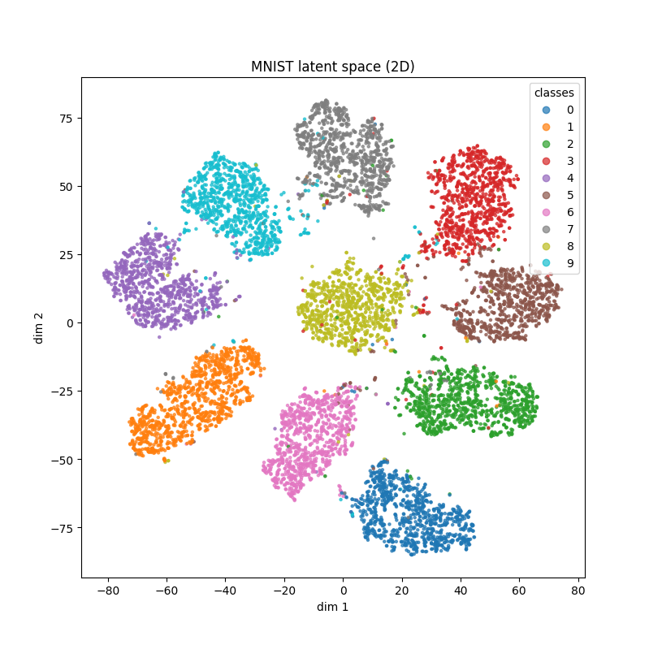
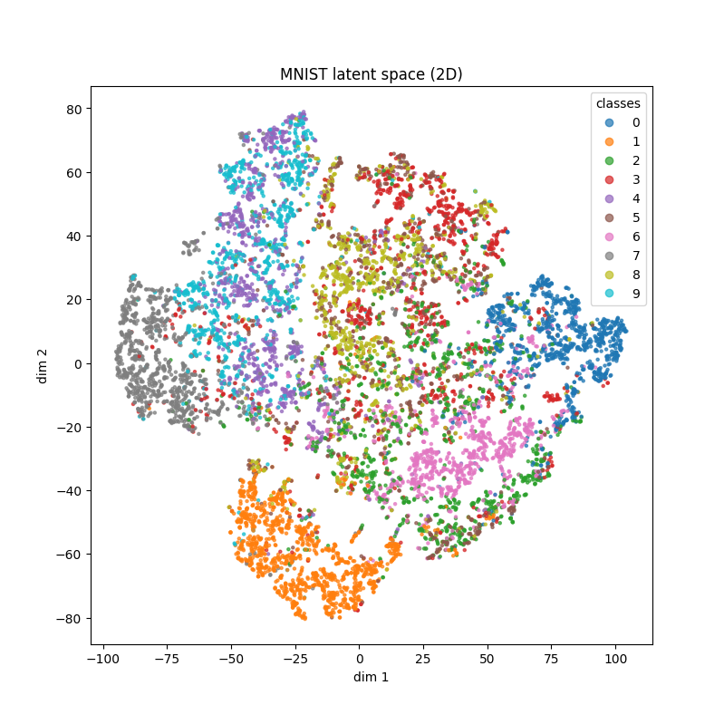
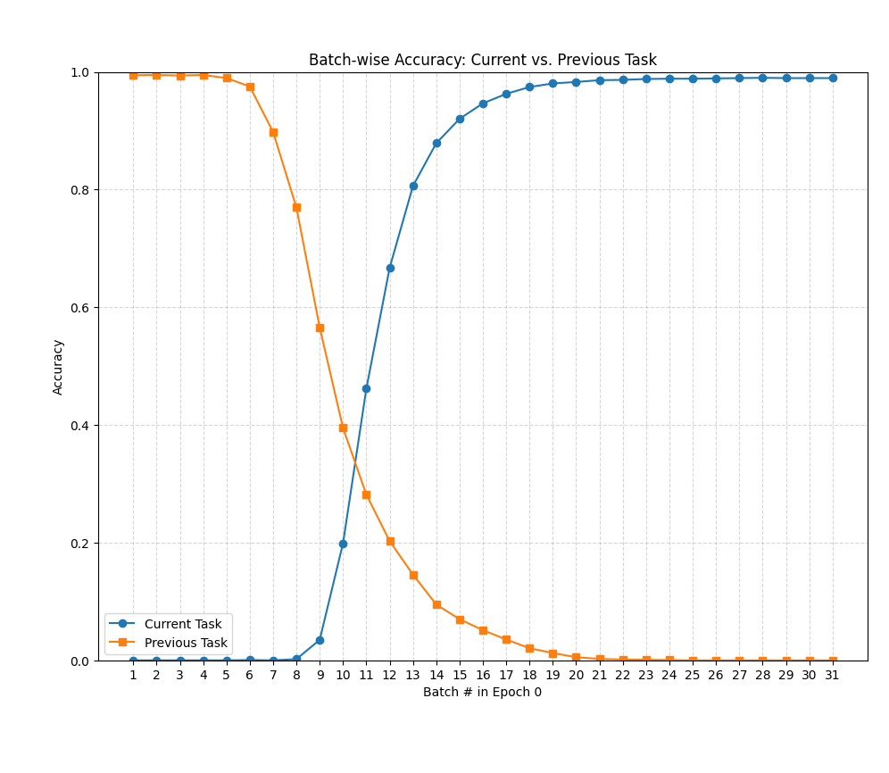

## MNIST MLP Training

### Concurrent Training

Training **concurrently** a small MLP network:

```
class MLP(nn.Module):
    def __init__(self, input_dim=784, n_classes=10):
        super().__init__()

        self.fc1 = nn.Linear(input_dim, 120)
        self.fc2 = nn.Linear(120, 84)
        self.fc3 = nn.Linear(84, n_classes)

    def forward(self, x):

        x = F.relu(self.fc1(x))
        z = F.relu(self.fc2(x))
        logits = self.fc3(z)
        return logits, z
```

Got the following results:
Epoch 4, train loss: 0.0117, val loss: 0.0357, train acc: 0.9786, val acc: 0.9646

And the latent space was well separated (not as good, but close to the latent space using LeNet5):




### Sequential Training

Training in Split-MNIST protocol:


**task 1, [1, 2]**

4, train loss 0.010796, train acc 0.996891, val loss 0.008445, val acc 0.996167


**task 2, [3, 4]**

4, train loss 0.003716, train acc 0.999099, val loss 11.001564, val acc 0.485862

We can see the same behavior we saw using the conv net: the neural net forgets very abruptly what it had learned in the previous task, and at that point it starts learning the new task. What is interesting is that looking at the relative updates of the weights, we cannot see anything special at that point in the training (example, between batches 3 and 11).

The only thing that seems notable is that the updates are generally larger at the beginning of training, when the network is *unlearning* the previous task - it is giving relatively large steps at this period - but in general NN learn faster at the beginning, so it may not be anything particular to this case.


Seems not to have a clue of the previous learned classes: very confident in predicting the new classes for examples of the old classes, such as 2 and 1, and when in doubt, it is always in doubt between the current classes.


Also as happened for the conv net, in the latent space the new classes just learned are well separated, and the previous classes are mingled together.


**task 3, [5, 6]**

4, train loss 0.019041, train acc 0.993537, val loss 10.511510, val acc 0.314396


**task 4, [7, 8]**

4, train loss 0.011244, train acc 0.996527, val loss 11.454843, val acc 0.252061


**task 5, [9, 0]**

4, train loss 0.007458, train acc 0.997570, val loss 12.196303, val acc 0.198500




**Upper bound, concurrent training**: 0.9646

**Lower bound, consecutive training**: 0.1985

### Concurent training with batch norm

```
class MLP(nn.Module):
    def __init__(self, input_dim=784, n_classes=10):
        super().__init__()

        self.fc1 = nn.Linear(input_dim, 120)
        self.bn1 = nn.BatchNorm1d(120)
        self.fc2 = nn.Linear(120, 84)
        self.bn2 = nn.BatchNorm1d(84)
        self.fc3 = nn.Linear(84, n_classes)

    def forward(self, x):

        x = F.relu(self.bn1(self.fc1(x)))
        z = F.relu(self.bn2(self.fc2(x)))
        logits = self.fc3(z)
        return logits, z
```

Epoch 4, train loss: 0.0944, val loss: 0.0522, train acc: 0.9819, val acc: 0.9782


### Sequential training with batch norm

Did not solve the problem the slightest - but something changed: the training (and the forgetting) got very smooth (smoother than before). The relative updates of the weights are smoother, but now we can see the the last layers get updated a little more stronger than the other two. 

Also, there was an interesing site that sometimes the NN would give some probabilities for previous classes.

**task 1, [1, 2]**

4, train loss 0.007517, train acc 0.998210, val loss 0.007921, val acc 0.997604

**task 2, [3, 4]**

4, train loss 0.007366, train acc 0.998099, val loss 3.824531, val acc 0.485862




**task 3, [5, 6]**

4, train loss 0.013730, train acc 0.995444, val loss 5.355310, val acc 0.316407


**task 4, [7, 8]**

4, train loss 0.008876, train acc 0.997718, val loss 5.718965, val acc 0.253310


**task 5, [9, 0]**

4, train loss 0.010084, train acc 0.997267, val loss 5.813504, val acc 0.198700


See how some of the previous classes get some probabilities:


**Changing batch norm to layer norm** did not provide any new insight or interesting behavior, so I did not include these experiments here.

### Sequential training with dropout

Using dropout of 0.5, as follows:

```
class MLP(nn.Module):
    def __init__(self, input_dim=784, n_classes=10, prob=0.5):
        super().__init__()

        self.fc1 = nn.Linear(input_dim, 120)
        self.drop1 = nn.Dropout(prob)
        self.fc2 = nn.Linear(120, 84)
        self.drop2 = nn.Dropout(prob)
        self.fc3 = nn.Linear(84, n_classes)

    def forward(self, x):

        x = self.drop1(F.relu(self.fc1(x)))
        z = self.drop2(F.relu(self.fc2(x)))
        logits = self.fc3(z)
        return logits, z
```

It did not help with the forgetting problem:

**task 1, [1, 2]**

4, train loss 0.022379, train acc 0.994629, val loss 0.012148, val acc 0.995688

**task 2, [3, 4]**

4, train loss 0.037854, train acc 0.985290, val loss 8.545651, val acc 0.484387

**task 3, [5, 6]**

4, train loss 0.224478, train acc 0.879754, val loss 11.920597, val acc 0.312385

**task 4, [7, 8]**

4, train loss 0.549324, train acc 0.739407, val loss 5.314554, val acc 0.250812

**task 5, [9, 0]**

4, train loss 0.235963, train acc 0.942195, val loss 25.727476, val acc 0.196800

But what was funny is that it gave very elongated shapes for the latent space (as plotted using t-sne):


## Trying to increase sparsity

### Concurrent training

Adding sparsity by means of L1 regularization to the *latent representations*:

```
for epoch in range(1, epochs):

    model.train()

    for x, y, _ in train_loader:
        optimizer.zero_grad()
        logits, (h1, h2) = model(x)
        base_loss = criterion(logits, y)

        # compute the l1 norm for the activations
        l1_norm = (h1.abs().mean() + h2.abs().mean())

        loss = base_loss + lambda_l1 * l1_norm

        loss.backward()
        optimizer.step()
```

Varying lambda l1 to get different levels of population sparcity, as measured by:

```
total_size = 0
num_zeros = 0

with torch.no_grad():
    for xb, yb, _ in test_loader:
        logits, latent = model(xb)          # z has shape [batch,84]

        for i, hidden_pt in enumerate(latent, 1):
            hidden = hidden_pt.cpu().numpy()
            total_size += np.prod(hidden.shape)
            num_zeros += (hidden == 0).sum()

population_sparcity = (num_zeros / total_size) # total_size = n_examples * n_neurons
print(f"Sparcity analysis - population sparcity: {population_sparcity:.4f}")
```

**lambda L1: 0.0**

Epoch 4, train loss: 0.0007, val loss: 0.0159, train acc: 0.9792, val acc: 0.9719

Sparcity analysis - population sparcity: 0.5437

**lambda L1: 0.001**

Epoch 4, train loss: 0.0240, val loss: 0.0263, train acc: 0.9793, val acc: 0.9751

Sparcity analysis - population sparcity: 0.5667

**lambda L1: 0.1**

Epoch 4, train loss: 0.1424, val loss: 0.0560, train acc: 0.9815, val acc: 0.9725

Sparcity analysis - population sparcity: 0.8307

**lambda L1: 1.0**

Epoch 4, train loss: 0.5234, val loss: 0.2253, train acc: 0.9533, val acc: 0.9494

Sparcity analysis - population sparcity: 0.9241

**lambda L1: 2.0**

Epoch 4, train loss: 0.8515, val loss: 0.3602, train acc: 0.9108, val acc: 0.9063

Sparcity analysis - population sparcity: 0.9326

#### Looking at the latent representations for the two hidden layers:

**lambda L1: 0.0**

Sparcity analysis - population sparcity: 0.5369


**lambda L1: 1.0**

Sparcity analysis - population sparcity: 0.9236


### Sequential training

Without adding the L1 norm, we could see that the network presents a progressive amount of sparsity as it trains in more tasks:

*lambda L1: 0.0*

**task 1, [1, 2]**

4, train loss 0.007918, train acc 0.997644, val loss 0.012917, val acc 0.995688

Sparcity analysis - population sparcity: 0.4987

**task 2, [3, 4]**

4, train loss 0.006190, train acc 0.998199, val loss 11.244117, val acc 0.485124

Sparcity analysis - population sparcity: 0.7782

**task 3, [5, 6]**

4, train loss 0.020671, train acc 0.993432, val loss 10.351263, val acc 0.314899

Sparcity analysis - population sparcity: 0.8593

**task 4, [7, 8]**

4, train loss 0.013371, train acc 0.995832, val loss 13.886833, val acc 0.251561

Sparcity analysis - population sparcity: 0.8637

**task 5, [9, 0]**

4, train loss 0.010451, train acc 0.996862, val loss 9.311324, val acc 0.19850

Sparcity analysis - population sparcity: 0.90260

Adding the L1 pensalization to the hidden states increased the sparcity, but did not help with forgetting (or changed anything in that regard):

*lambda L1: 1.0*

**task 1, [1, 2]**

4, train loss 0.126483, train acc 0.997927, val loss 0.023806, val acc 0.996646

Sparcity analysis - population sparcity: 0.9440

**task 2, [3, 4]**

4, train loss 0.115641, train acc 0.998299, val loss 3.586066, val acc 0.484878

Sparcity analysis - population sparcity: 0.9353

**task 3, [5, 6]**

4, train loss 0.210337, train acc 0.982519, val loss 4.093104, val acc 0.313055

Sparcity analysis - population sparcity: 0.9565

**task 4, [7, 8]**

4, train loss 0.144630, train acc 0.996130, val loss 4.783073, val acc 0.253185

Sparcity analysis - population sparcity: 0.9720

**task 5, [9, 0]**

4, train loss 0.145485, train acc 0.997570, val loss 4.684452, val acc 0.199900

Sparcity analysis - population sparcity: 0.9657


## Some observations

* Batch norm and sparse NN have lower validation losses than the regular and dropout nets. 

The cross-entropy loss is: `loss = y * log(y_hat)`

So this low loss must be because those nets tend to give a smoother output, or something closer to a uniform distribution, less peaky: they do not let the y_hat probability go to very small values, such as something to the e-9.

Comparing the regular net with the batch norm (which we saw has a smoother training):

**Regular net**

*task 1, [1, 2]*: val loss 0.012917, sparcity: 0.4987

*task 2, [3, 4]*: val loss 11.244117, sparcity: 0.7782

*task 3, [5, 6]*: val loss 10.351263, sparcity: 0.8593

*task 4, [7, 8]*: val loss 13.886833, sparcity: 0.8637

*task 5, [9, 0]*: val loss 9.311324, sparcity: 0.90260

It is also apparent the growing sparcity of the neural network.

**Batch norm**

*task 1, [1, 2]*: val loss 0.015192, sparcity: 0.5112

*task 2, [3, 4]*: val loss 3.735139, sparcity: 0.4764

*task 3, [5, 6]*: val loss 4.799133, sparcity: 0.4952

*task 4, [7, 8]*: val loss 5.491990, sparcity: 0.5100

*task 5, [9, 0]*: val loss 5.838927, sparcity: 0.5421 

Probably this difference in the loss is more due to a more stable training regime than to anything to do with forgetting itself.

The other interesting thing is that batch norm do not allow the network to grow sparse as it is trained in new tasks.

If we force the batch norm network to be sparse, we get:

*lambda L1: 1.0*

*task 1, [1, 2]*: val loss 0.030630, sparcity: 0.8955

*task 2, [3, 4]*: val loss 2.413128, sparcity: 0.8457

*task 3, [5, 6]*: val loss 3.948847, sparcity: 0.9146

*task 4, [7, 8]*: val loss 5.269120, sparcity: 0.9006

*task 5, [9, 0]*: val loss 5.107574, sparcity: 0.8966

The results are very similar, a little bit better perhaps, and it may be to the final distribution being more like a uniform, and not to something related to forgetting specifically.

## Orthogonal Gradient Descent

Train to train the neural net until it achieves 0.98 accuracy on each task.

The method is hard to get it right, because the learning rate needs to be very small for it to work, and SGD seems to be preferable than Adam. Using the simple net, without normalization, it did not make any difference for the validation accuracy, but the losses were somehow smaller, because the net is giving more probability for the correct classes (even though not enough probability to pick them)

Because of the learning rate and the SGD, the method also takes considerably longer to train.

**task 1, [1, 2]**

10, train loss 0.069403, train acc 0.980684, val loss 0.072960, val acc 0.977480

Accuracy larger than 0.98, breaking from training...

registering gradients for the task

1 gradients stored

Sparcity analysis - population sparcity: 0.4305


**task 2, [3, 4]**

21, train loss 0.392691, train acc 0.980086, val loss 1.397583, val acc 0.513892

Accuracy larger than 0.98, breaking from training...

registering gradients for the task

2 gradients stored

Sparcity analysis - population sparcity: 0.4125


**task 3, [5, 6]**

29, train loss 0.277512, train acc 0.943214, val loss 3.300617, val acc 0.303000

registering gradients for the task

3 gradients stored

Sparcity analysis - population sparcity: 0.3909


**task 4, [7, 8]**

29, train loss 0.256513, train acc 0.948695, val loss 3.648200, val acc 0.239695

registering gradients for the task

4 gradients stored

Sparcity analysis - population sparcity: 0.3855

**task 5, [9, 0]**

29, train loss 0.128153, train acc 0.979652, val loss 4.095770, val acc 0.195600

registering gradients for the task

5 gradients stored


### Adding batch normalization

Adding batch norm makes the training much more stable, and we are able to get a 10 percentual points improvement over the baseline, and we can see that the model is capable of getting some predictions right for old tasks, as well as giving old classes non negligible probabilities, even if the class chosen is wrong.

Some hyperparemeters:

```
class MLPSparse(nn.Module):
    def __init__(self, input_dim=784, n_classes=10, prob=0.5):
        super().__init__()

        self.fc1 = nn.Linear(input_dim, 120)
        self.bn1 = nn.BatchNorm1d(120)
        #self.drop1 = nn.Dropout(prob)
        self.fc2 = nn.Linear(120, 84)
        self.bn2 = nn.BatchNorm1d(84)
        #self.drop2 = nn.Dropout(prob)
        self.fc3 = nn.Linear(84, n_classes)

    def forward(self, x):

        h1 = F.relu(self.bn1(self.fc1(x)))
        h2 = F.relu(self.bn2(self.fc2(h1)))
        logits = self.fc3(h2)
        return logits, (h1, h2)
```

```
lr = 1e-4

    # for subsequent tasks, decreases the learning rate
    if previous is not None:
        for group in optimizer.param_groups:
            group['lr'] = lr / 5

```

```
    # for subsequent tasks, decreases the learning rate
    if previous is not None:
        for group in optimizer.param_groups:
            group['lr'] = lr / 5

```

lambda L1: 0.0

**task 1, [1, 2]**

1, train loss 0.404343, train acc 0.988976, val loss 0.274081, val acc 0.991854

1 gradients stored

Sparcity analysis - population sparcity: 0.5183


**task 2, [3, 4]**

7, train loss 0.533705, train acc 0.981387, val loss 0.961941, val acc 0.660192

2 gradients stored

Sparcity analysis - population sparcity: 0.4967

We can see here thatit gets right the classification of 2, and that 1 has a high probability.


**task 3, [5, 6]**

11, train loss 0.406581, train acc 0.980718, val loss 1.568797, val acc 0.378582

3 gradients stored

Sparcity analysis - population sparcity: 0.4893

It still is able to give high probability for 1, and got right the class 3 of the previous task.


**task 4, [7, 8]**

9, train loss 0.557092, train acc 0.981443, val loss 1.754179, val acc 0.366850

4 gradients stored

Sparcity analysis - population sparcity: 0.4957

It was able to get right 6, which learned in the previous task, and 1, which learned in the first task.


**task 5, [9, 0]**

11, train loss 0.573457, train acc 0.982486, val loss 1.969253, val acc 0.291900

5 gradients stored

Sparcity analysis - population sparcity: 0.4759

Different than for the other experiments, several classes trained on old tasks have non-negligible probabilities - even though the latent space does not look great.


If we compare the losses of the regular training, training with bn, and training with orthogonal gradients + batch norm:


**Regular net** --- **BN** --- **Ortho + BN**

*task 1, val loss*: 0.012 --- 0.015 --- 0.274

*task 2*, val loss*: 11.244 --- 3.735 --- 0.961

*task 3*, val loss*: 10.351 --- 4.799 --- 1.568

*task 4*, val loss*: 13.886 --- 5.491 --- 1.754

*task 5*, val loss*: 9.311 --- 5.838 --- 1.969

So we can see there is a definite improvement here.

**Second experiment**

If we do force the net to go above 95% accuracy on the training set of every task, the final validation accuracy on the fifth task 36.9%, and the latent space looks nices:

5, train loss 0.917523, train acc 0.961328, val loss 1.804248, val acc 0.369000

Accuracy larger than 0.95, breaking from training...

Sparcity analysis - population sparcity: 0.4807


**Adding sparcity to the model**

Forcing some sparcity in the hidden representations from the model helps get some improvoment still over this result:

lambda L1: 5.0

task 1, [1, 2]

1, train loss 4.096504, train acc 0.991237, val loss 0.552659, val acc 0.991854

Accuracy larger than 0.95, breaking from training...

Sparcity analysis - population sparcity: 0.5472

task 2, [3, 4]

8, train loss 4.151971, train acc 0.959171, val loss 0.810917, val acc 0.865995

Sparcity analysis - population sparcity: 0.5299

task 3, [5, 6]

11, train loss 3.755616, train acc 0.951266, val loss 1.377856, val acc 0.541981

Sparcity analysis - population sparcity: 0.5381


task 4, [7, 8]

11, train loss 3.569125, train acc 0.950481, val loss 1.676593, val acc 0.445666

Accuracy larger than 0.95, breaking from training...

Sparcity analysis - population sparcity: 0.5533


**task 5, [9, 0]**

9, train loss 3.899263, train acc 0.808463, val loss 1.882602, val acc 0.473100

10, train loss 3.759052, train acc 0.861612, val loss 1.884961, val acc 0.455300

11, train loss 3.667446, train acc 0.896335, val loss 1.874089, val acc 0.450700

12, train loss 3.557602, train acc 0.921543, val loss 1.882073, val acc 0.433800

13, train loss 3.458467, train acc 0.941182, val loss 1.875224, val acc 0.424300

14, train loss 3.370600, train acc 0.948876, val loss 1.882908, val acc 0.416500

15, train loss 3.272219, train acc 0.960316, val loss 1.909718, val acc 0.388300

Accuracy larger than 0.95, breaking from training...

Sparcity analysis - population sparcity: 0.5646


**Dropout**

Adding dropout to the net (already with BN) did not help to improve its performance.

With dropout of 0.2:

task 5, [9, 0]

13, train loss 0.567077, train acc 0.957886, val loss 2.023252, val acc 0.290400

With dropout of 0.2:

task 5, [9, 0]

29, train loss 0.314577, train acc 0.951407, val loss 2.482809, val acc 0.265200

With dropout of 0.2 AND trying to force sparcity (l1 penalty = 5.0):

Dropout makes the training take considerably longer (once we train until achievieng 0.95 on the training set)

29, train loss 2.549706, train acc 0.953533, val loss 2.097130, val acc 0.371600

A little lower than without sparcity, and considerably better than dropout alone. So we consider that dropout is not helping here.

***Observations***

This method requires a lot of approximations and hypothesis that do not hold in the training. For instance, we calculate the gradient for a task once, and we use forever after. But that gradient is true only close to the weight space it was calculated - therefore for most of the training it is wrong, and gets more wrong overtime. That is why it is critical to use a small learning rate, so you do not get too farther away from the point the gradient use for orthogonalization were calculated, and therefore do not get too wrong in your calculations.

Even with this approximation, the method is able to get a nice improvement over the baseline, just holding on memory one gradient vector for every past task.

The code is:

```
# orthogonal gradient descen
class OGDProjector:
    def __init__(self, model, eps=1e-8):
        self.model = model
        # list of torch tensors, each is a unit-norm flattened gradient
        self.basis = []
        self.eps = eps

    def __len__(self):
        return len(self.basis)
    
    def _flatten_grads(self):
        flats = []
        for p in self.model.parameters():
            if p.grad is not None:
                flats.append(p.grad.detach().view(-1))
        if len(flats) == 0:
            return None
        return torch.cat(flats)

    def project_current_gradients(self):
        # call after loss.backward() and before optimizer.step()
        grads = self._flatten_grads()
        if grads is None or len(self.basis) == 0:
            return
        # project grads onto orthogonal complement of the basis
        g = grads.clone()
        for b in self.basis:
            g -= b * (b @ g)

        # write g back into parameter gradients
        idx = 0
        for p in self.model.parameters():
            if p.grad is not None:
                numel = p.grad.numel() # total number of elements in the tensor
                new_grad = g[idx:idx+numel].view_as(p.grad)
                p.grad.data.copy_(new_grad)
                idx += numel

for every task:
    
    ...
    
    # during training

    for epoch in range(epochs):
    
        model.train()

        for xb, yb, _ in train_loader:

            optimizer.zero_grad()
            
            logits, (h1, h2) = model(xb)
            base_loss = criterion(logits, yb)

            # compute the l1 norm for the activations
            l1_norm = (h1.abs().mean() + h2.abs().mean())

            loss = base_loss + lambda_l1 * l1_norm

            loss.backward()

            ogd.project_current_gradients()

            optimizer.step()
        ...

    # at the end of every task
    # register a prototype gradient for the class
    model.train()
    print("registering gradients for the task")
    running_g = 0
    count = 0
    for idx, (xb, yb, _) in enumerate(train_loader):

        optimizer.zero_grad()
        logits, _ = model(xb)
        loss = criterion(logits, yb)
        loss.backward()

        flat_g = ogd._flatten_grads()
        running_g += flat_g
        count += 1
        #ogd.register_task_gradients()
            
    running_g /= float(count)

    # Gram-Schmidt
    for b in ogd.basis:
        running_g -= b * (b @ running_g)
    ng = running_g.norm()
    if ng > ogd.eps:
       ogd.basis.append(running_g / ng)
```


