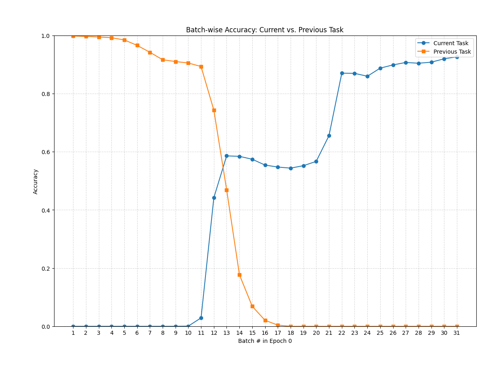
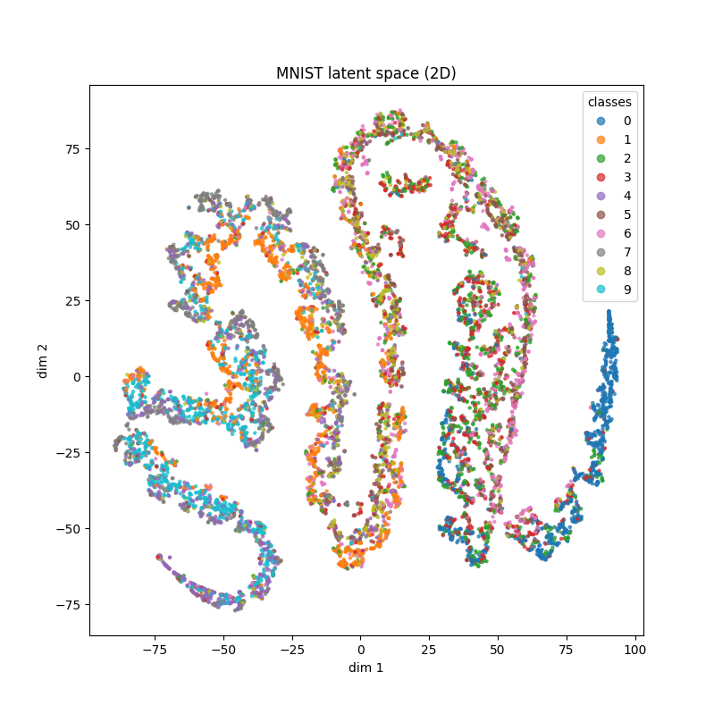
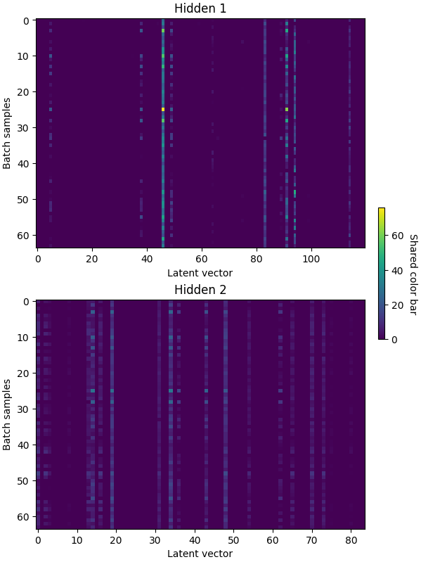
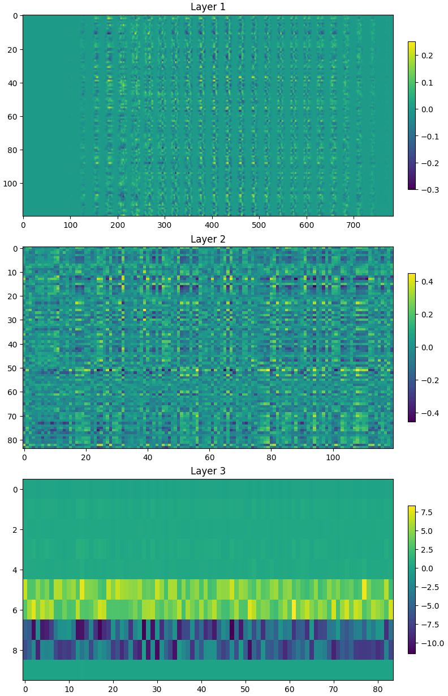
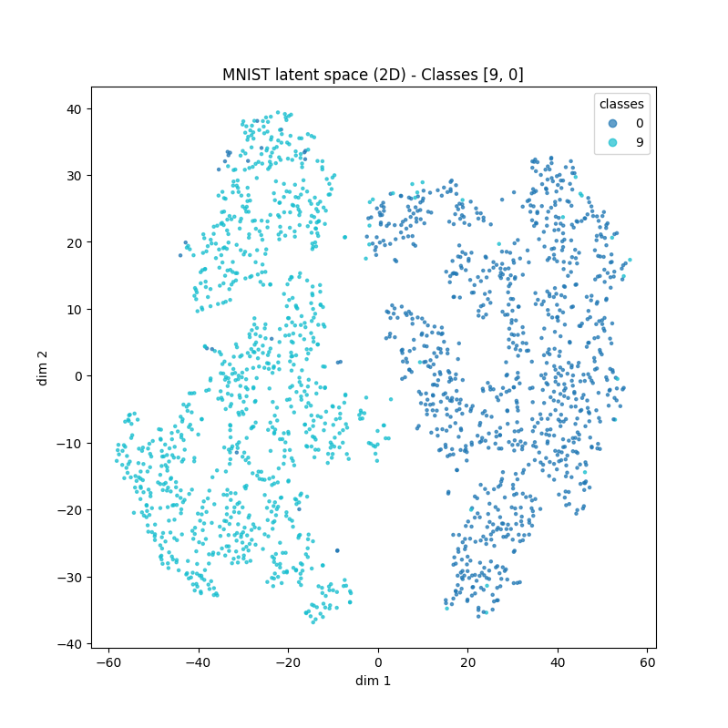
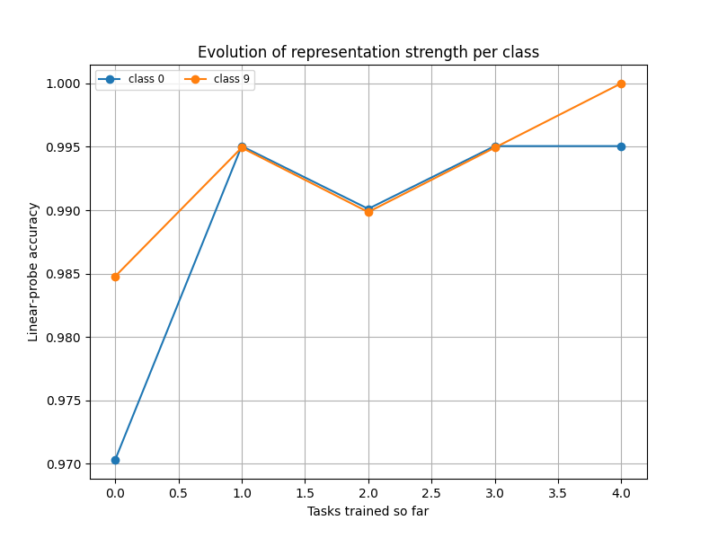
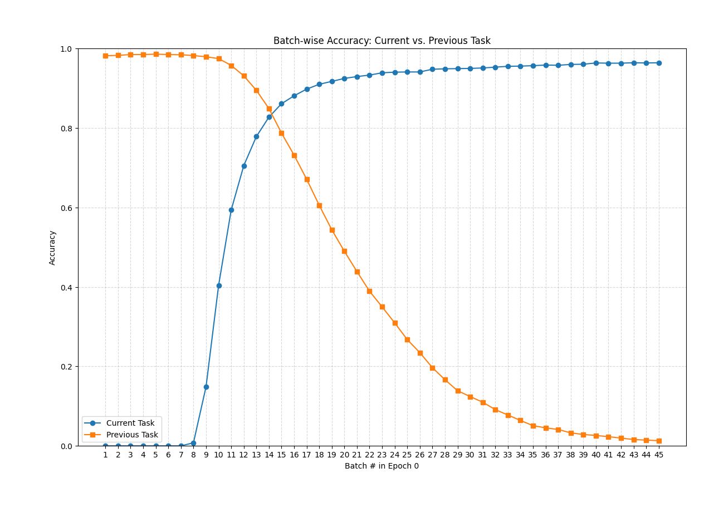

## MNIST MLP Training

### Concurrent Training

Training **concurrently** a small MLP network:

```
class MLP(nn.Module):
    def __init__(self, input_dim=784, n_classes=10):
        super().__init__()

        self.fc1 = nn.Linear(input_dim, 120)
        self.fc2 = nn.Linear(120, 84)
        self.fc3 = nn.Linear(84, n_classes)

    def forward(self, x):

        x = F.relu(self.fc1(x))
        z = F.relu(self.fc2(x))
        logits = self.fc3(z)
        return logits, z
```

Got the following results:
Epoch 4, train loss: 0.0117, val loss: 0.0357, train acc: 0.9786, val acc: 0.9646

And the latent space was well separated (not as good, but close to the latent space using LeNet5):


### Sequential Training

Training in Split-MNIST protocol:


**task 1, [1, 2]**

4, train loss 0.010796, train acc 0.996891, val loss 0.008445, val acc 0.996167


**task 2, [3, 4]**

4, train loss 0.003716, train acc 0.999099, val loss 11.001564, val acc 0.485862

We can see the same behavior we saw using the conv net: the neural net forgets very abruptly what it had learned in the previous task, and at that point it starts learning the new task. What is interesting is that looking at the relative updates of the weights, we cannot see anything special at that point in the training (example, between batches 3 and 11).

The only thing that seems notable is that the updates are generally larger at the beginning of training, when the network is *unlearning* the previous task - it is giving relatively large steps at this period - but in general NN learn faster at the beginning, so it may not be anything particular to this case.


Seems not to have a clue of the previous learned classes: very confident in predicting the new classes for examples of the old classes, such as 2 and 1, and when in doubt, it is always in doubt between the current classes.


Also as happened for the conv net, in the latent space the new classes just learned are well separated, and the previous classes are mingled together.


**task 3, [5, 6]**

4, train loss 0.019041, train acc 0.993537, val loss 10.511510, val acc 0.314396




**task 4, [7, 8]**

4, train loss 0.011244, train acc 0.996527, val loss 11.454843, val acc 0.252061


**task 5, [9, 0]**

4, train loss 0.007458, train acc 0.997570, val loss 12.196303, val acc 0.198500


**Upper bound, concurrent training**: 0.9646

**Lower bound, consecutive training**: 0.1985

### Concurent training with batch norm

```
class MLP(nn.Module):
    def __init__(self, input_dim=784, n_classes=10):
        super().__init__()

        self.fc1 = nn.Linear(input_dim, 120)
        self.bn1 = nn.BatchNorm1d(120)
        self.fc2 = nn.Linear(120, 84)
        self.bn2 = nn.BatchNorm1d(84)
        self.fc3 = nn.Linear(84, n_classes)

    def forward(self, x):

        x = F.relu(self.bn1(self.fc1(x)))
        z = F.relu(self.bn2(self.fc2(x)))
        logits = self.fc3(z)
        return logits, z
```

Epoch 4, train loss: 0.0944, val loss: 0.0522, train acc: 0.9819, val acc: 0.9782


### Sequential training with batch norm

Did not solve the problem the slightest - but something changed: the training (and the forgetting) got very smooth (smoother than before). The relative updates of the weights are smoother, but now we can see the the last layers get updated a little more stronger than the other two. 

Also, there was an interesing site that sometimes the NN would give some probabilities for previous classes.

**task 1, [1, 2]**

4, train loss 0.007517, train acc 0.998210, val loss 0.007921, val acc 0.997604

**task 2, [3, 4]**

4, train loss 0.007366, train acc 0.998099, val loss 3.824531, val acc 0.485862


**task 3, [5, 6]**

4, train loss 0.013730, train acc 0.995444, val loss 5.355310, val acc 0.316407


**task 4, [7, 8]**

4, train loss 0.008876, train acc 0.997718, val loss 5.718965, val acc 0.253310


**task 5, [9, 0]**

4, train loss 0.010084, train acc 0.997267, val loss 5.813504, val acc 0.198700


See how some of the previous classes get some probabilities:


**Changing batch norm to layer norm** did not provide any new insight or interesting behavior, so I did not include these experiments here.

### Sequential training with dropout

Using dropout of 0.5, as follows:

```
class MLP(nn.Module):
    def __init__(self, input_dim=784, n_classes=10, prob=0.5):
        super().__init__()

        self.fc1 = nn.Linear(input_dim, 120)
        self.drop1 = nn.Dropout(prob)
        self.fc2 = nn.Linear(120, 84)
        self.drop2 = nn.Dropout(prob)
        self.fc3 = nn.Linear(84, n_classes)

    def forward(self, x):

        x = self.drop1(F.relu(self.fc1(x)))
        z = self.drop2(F.relu(self.fc2(x)))
        logits = self.fc3(z)
        return logits, z
```

It did not help with the forgetting problem:

**task 1, [1, 2]**

4, train loss 0.022379, train acc 0.994629, val loss 0.012148, val acc 0.995688

**task 2, [3, 4]**

4, train loss 0.037854, train acc 0.985290, val loss 8.545651, val acc 0.484387

**task 3, [5, 6]**

4, train loss 0.224478, train acc 0.879754, val loss 11.920597, val acc 0.312385

**task 4, [7, 8]**

4, train loss 0.549324, train acc 0.739407, val loss 5.314554, val acc 0.250812

**task 5, [9, 0]**

4, train loss 0.235963, train acc 0.942195, val loss 25.727476, val acc 0.196800

But what was funny is that it gave very elongated shapes for the latent space (as plotted using t-sne):




### Sequential training with weight decay

The use of weight decay was not very successfull at first, but it may be more to it.

It was not able to arrest the growing sparsity, and resulted in very few feature with high activation values.

The loss of the network was less than using the regular training, but the network also had more difficulty training, specially for high penality values (e.g., 1.0, 5.0).

As the penality values increased, the representation of the latent space got worse (as measured by the linear probe), althought it was better than the one from the regular training at first, with l2 value of 0.1 (instead of the default value of 0.01).

* Lambda l2: 0.1

**task 1, [1, 2]**

1, train loss 0.024787, train acc 0.992274, val loss 0.017167, val acc 0.994729

Sparcity analysis - population sparcity: 0.4906

**task 2, [3, 4]**

1, train loss 0.017797, train acc 0.994896, val loss 9.147215, val acc 0.484632

Sparcity analysis - population sparcity: 0.7679

**task 3, [5, 6]**

1, train loss 0.051606, train acc 0.982413, val loss 10.311390, val acc 0.313558

Sparcity analysis - population sparcity: 0.8402

**task 4, [7, 8]**

1, train loss 0.020093, train acc 0.993649, val loss 9.786181, val acc 0.252186

Sparcity analysis - population sparcity: 0.8803

**task 5, [9, 0]**

1, train loss 0.020455, train acc 0.993622, val loss 10.147829, val acc 0.198200

Sparcity analysis - population sparcity: 0.8938

*This was a little bit of improvement over the version with the default weight decay value: 0.71 acc on task 5*

| Accuracy    | Task 1 | Task 2 | Task 3 | Task 4 | Task 5 |
|------------|------- |------- |------- |------- |------- |
| Classifier | 0.9976 | 0.9521 | 0.8308 | 0.7459 | 0.7660 |
| Class 1    | 0.9953 | 0.9752 | 0.9272 | 0.9027 | 0.9152 |
| Class 2    | 1.0000 | 0.9155 | 0.6959 | 0.5074 | 0.8083 |
| Class 3    |        | 0.9271 | 0.7892 | 0.6701 | 0.6569 |
| Class 4    |        | 0.9903 | 0.8824 | 0.8426 | 0.7268 |
| Class 5    |        |        | 0.8209 | 0.5227 | 0.5856 |
| Class 6    |        |        | 0.8663 | 0.8000 | 0.8750 |
| Class 7    |        |        |        | 0.9271 | 0.8177 |
| Class 8    |        |        |        | 0.7536 | 0.6940 |
| Class 9    |        |        |        |        | 0.6653 |
| Class 0    |        |        |        |        | 0.8990 |

* Lambda l2: 1.0

**task 1, [1, 2]**

1, train loss 0.024242, train acc 0.992556, val loss 0.016717, val acc 0.995208

Sparcity analysis - population sparcity: 0.4586

**task 2, [3, 4]**

1, train loss 0.017370, train acc 0.994996, val loss 4.635416, val acc 0.484878

Sparcity analysis - population sparcity: 0.7733

**task 3, [5, 6]**

1, train loss 0.050839, train acc 0.983473, val loss 6.033093, val acc 0.313055

Sparcity analysis - population sparcity: 0.7696

**task 4, [7, 8]**

1, train loss 0.025013, train acc 0.991664, val loss 6.586073, val acc 0.251811

Sparcity analysis - population sparcity: 0.8913

**task 5, [9, 0]**

1, train loss 0.022257, train acc 0.993420, val loss 7.834760, val acc 0.198200

Sparcity analysis - population sparcity: 0.8903

| Accuracy    | Task 1 | Task 2 | Task 3 | Task 4 | Task 5 |
|------------|------- |------- |------- |------- |------- |
| Classifier | 0.9952 | 0.9545 | 0.7797 | 0.6866 | 0.6815 |
| Class 1    | 0.9907 | 0.9752 | 0.9466 | 0.9159 | 0.8884 |
| Class 2    | 1.0000 | 0.9296 | 0.6392 | 0.5419 | 0.5855 |
| Class 3    |        | 0.9271 | 0.7206 | 0.2944 | 0.6029 |
| Class 4    |        | 0.9855 | 0.8503 | 0.7639 | 0.4809 |
| Class 5    |        |        | 0.6318 | 0.5568 | 0.3812 |
| Class 6    |        |        | 0.8861 | 0.8108 | 0.6875 |
| Class 7    |        |        |        | 0.9219 | 0.8276 |
| Class 8    |        |        |        | 0.6522 | 0.7705 |
| Class 9    |        |        |        |        | 0.6192 |
| Class 0    |        |        |        |        | 0.9192 |

* Lambda l2: 5.0

**task 1, [1, 2]**

1, train loss 0.034112, train acc 0.990106, val loss 0.033527, val acc 0.989459

Accuracy larger than 0.98, breaking from training...

Sparcity analysis - population sparcity: 0.4263

**task 2, [3, 4]**

1, train loss 0.033530, train acc 0.992495, val loss 2.765567, val acc 0.483649

Sparcity analysis - population sparcity: 0.7230

**task 3, [5, 6]**

2, train loss 0.073173, train acc 0.980824, val loss 4.213092, val acc 0.312888

Sparcity analysis - population sparcity: 0.8075

**task 4, [7, 8]**

1, train loss 0.038519, train acc 0.991962, val loss 4.627779, val acc 0.251686

Sparcity analysis - population sparcity: 0.8785

**task 5, [9, 0]**

1, train loss 0.042587, train acc 0.992306, val loss 5.418901, val acc 0.197800

Sparcity analysis - population sparcity: 0.9204

| Accuracy    | Task 1 | Task 2 | Task 3 | Task 4 | Task 5 |
|------------|------- |------- |------- |------- |------- |
| Classifier | 0.9856 | 0.7764 | 0.7035 | 0.5774 | 0.5885 |
| Class 1    | 0.9814 | 0.8911 | 0.9126 | 0.8673 | 0.8661 |
| Class 2    | 0.9901 | 0.4742 | 0.4845 | 0.4433 | 0.4249 |
| Class 3    |        | 0.7760 | 0.7794 | 0.1269 | 0.3382 |
| Class 4    |        | 0.9758 | 0.6471 | 0.7778 | 0.4973 |
| Class 5    |        |        | 0.5075 | 0.3466 | 0.2155 |
| Class 6    |        |        | 0.8713 | 0.4541 | 0.4010 |
| Class 7    |        |        |        | 0.8698 | 0.8177 |
| Class 8    |        |        |        | 0.6473 | 0.6339 |
| Class 9    |        |        |        |        | 0.6695 |
| Class 0    |        |        |        |        | 0.9242 |


## Trying to increase sparsity

### Concurrent training

Adding sparsity by means of L1 regularization to the *latent representations*:

```
for epoch in range(1, epochs):

    model.train()

    for x, y, _ in train_loader:
        optimizer.zero_grad()
        logits, (h1, h2) = model(x)
        base_loss = criterion(logits, y)

        # compute the l1 norm for the activations
        l1_norm = (h1.abs().mean() + h2.abs().mean())

        loss = base_loss + lambda_l1 * l1_norm

        loss.backward()
        optimizer.step()
```

Varying lambda l1 to get different levels of population sparcity, as measured by:

```
total_size = 0
num_zeros = 0

with torch.no_grad():
    for xb, yb, _ in test_loader:
        logits, latent = model(xb)          # z has shape [batch,84]

        for i, hidden_pt in enumerate(latent, 1):
            hidden = hidden_pt.cpu().numpy()
            total_size += np.prod(hidden.shape)
            num_zeros += (hidden == 0).sum()

population_sparcity = (num_zeros / total_size) # total_size = n_examples * n_neurons
print(f"Sparcity analysis - population sparcity: {population_sparcity:.4f}")
```

**lambda L1: 0.0**

Epoch 4, train loss: 0.0007, val loss: 0.0159, train acc: 0.9792, val acc: 0.9719

Sparcity analysis - population sparcity: 0.5437

**lambda L1: 0.001**

Epoch 4, train loss: 0.0240, val loss: 0.0263, train acc: 0.9793, val acc: 0.9751

Sparcity analysis - population sparcity: 0.5667

**lambda L1: 0.1**

Epoch 4, train loss: 0.1424, val loss: 0.0560, train acc: 0.9815, val acc: 0.9725

Sparcity analysis - population sparcity: 0.8307

**lambda L1: 1.0**

Epoch 4, train loss: 0.5234, val loss: 0.2253, train acc: 0.9533, val acc: 0.9494

Sparcity analysis - population sparcity: 0.9241

**lambda L1: 2.0**

Epoch 4, train loss: 0.8515, val loss: 0.3602, train acc: 0.9108, val acc: 0.9063

Sparcity analysis - population sparcity: 0.9326

#### Looking at the latent representations for the two hidden layers:

**lambda L1: 0.0**

Sparcity analysis - population sparcity: 0.5369


**lambda L1: 1.0**

Sparcity analysis - population sparcity: 0.9236


### Sequential training

Without adding the L1 norm, we could see that the network presents a progressive amount of sparsity as it trains in more tasks:

*lambda L1: 0.0*

**task 1, [1, 2]**

4, train loss 0.007918, train acc 0.997644, val loss 0.012917, val acc 0.995688

Sparcity analysis - population sparcity: 0.4987

**task 2, [3, 4]**

4, train loss 0.006190, train acc 0.998199, val loss 11.244117, val acc 0.485124

Sparcity analysis - population sparcity: 0.7782

**task 3, [5, 6]**

4, train loss 0.020671, train acc 0.993432, val loss 10.351263, val acc 0.314899

Sparcity analysis - population sparcity: 0.8593

**task 4, [7, 8]**

4, train loss 0.013371, train acc 0.995832, val loss 13.886833, val acc 0.251561

Sparcity analysis - population sparcity: 0.8637

**task 5, [9, 0]**

4, train loss 0.010451, train acc 0.996862, val loss 9.311324, val acc 0.19850

Sparcity analysis - population sparcity: 0.90260

Adding the L1 pensalization to the hidden states increased the sparcity, but did not help with forgetting (or changed anything in that regard):

*lambda L1: 1.0*

**task 1, [1, 2]**

4, train loss 0.126483, train acc 0.997927, val loss 0.023806, val acc 0.996646

Sparcity analysis - population sparcity: 0.9440

**task 2, [3, 4]**

4, train loss 0.115641, train acc 0.998299, val loss 3.586066, val acc 0.484878

Sparcity analysis - population sparcity: 0.9353

**task 3, [5, 6]**

4, train loss 0.210337, train acc 0.982519, val loss 4.093104, val acc 0.313055

Sparcity analysis - population sparcity: 0.9565

**task 4, [7, 8]**

4, train loss 0.144630, train acc 0.996130, val loss 4.783073, val acc 0.253185

Sparcity analysis - population sparcity: 0.9720

**task 5, [9, 0]**

4, train loss 0.145485, train acc 0.997570, val loss 4.684452, val acc 0.199900

Sparcity analysis - population sparcity: 0.9657


## Some observations

* Batch norm and sparse NN have lower validation losses than the regular and dropout nets. 

The cross-entropy loss is: `loss = y * log(y_hat)`

So this low loss must be because those nets tend to give a smoother output, or something closer to a uniform distribution, less peaky: they do not let the y_hat probability go to very small values, such as something to the e-9.

Comparing the regular net with the batch norm (which we saw has a smoother training):

**Regular net**

*task 1, [1, 2]*: val loss 0.012917, sparcity: 0.4987

*task 2, [3, 4]*: val loss 11.244117, sparcity: 0.7782

*task 3, [5, 6]*: val loss 10.351263, sparcity: 0.8593

*task 4, [7, 8]*: val loss 13.886833, sparcity: 0.8637

*task 5, [9, 0]*: val loss 9.311324, sparcity: 0.90260

It is also apparent the growing sparcity of the neural network.

Asking ChatGPT insights about this growing sparcity, it gave me the following points:

– Units specialize on small subsets of classes,  
– biases go negative to silence them on everything else,  
– previous tasks get overwritten so those units no longer fire even on their “old” classes.

Can test this "biases go negative" to silence features of old classes, and compare this with the use of batch norm, that avoids this growing sparcity (as the follows).

#### Investigating the weights/bias distribution with respect to the sparcity

**Concurrent training**

The histograms for biases and weights are well behaved and like you would have expected:


**Sequential**

*Task 1*


*Task 2*


*Task 3*


*Task 4*


*Task 5*


Looking at the plots they seem very similar and offer little insight. The statistics of the weights seem in fact no to cchange meaningfully. But we put down some values for the biases, we start seeing something:

| Regime    | Mean | Median | Std | Sparcity|
| -------- | ------- |------- |------- |------- |
| Concurrent  | 0.003    | 0.001 | 0.0487 | 0.5266 |
| Seq, task 1 | 0.005     | 0.008 | 0.0393 | 0.4517 |
| Seq, task 2 | -0.004    | -0.010 | 0.0495 | 0.7382 |
| Seq, task 3 | -0.013    | -0.016 | 0.0483 | 0.8361 |
| Seq, task 4 | -0.017    | -0.018 | 0.0534 | 0.8739 |
| Seq, task 5 | -0.022    | -0.023 | 0.0577 | 0.8965 |

Even thought the number are all small, the change that happens in the mean, and particularly in the median seem to be important: when the sparcity goes from 0.45 to 0.73 in task 2, the median change signs and increases by an order of magnitude. After this, the median is always negative and one order of magnitude larger for the sequential case than for the concurrent, and the same happens with the mean.

It suggests that it is this slight change in the bias that pushes the values of the activations to the negative part of the relu, making the representations get sparser and sparser.

As ChatGPT puts it:

...emergent mechanism the network uses to reduce catastrophic interference: “I don’t want my old features firing all over the place on new tasks, so I’ll just push their biases down and only use a small subset of units.”

...your bias‐histogram is a smoking gun: the network is solving the new tasks in part by turning down (i.e. deactivating) old units via negative bias shifts, and that is exactly what is driving your rising sparsity numbers.

Looking at the latent representations learned by the model during sequential training, we can see that the network start with many features, but it start shutting them off: By task 3 it is already only using a handfull of features, and most of the neurons are shut off:

*task 1*


*task 2*


*task 3*


*task 4*


*task 5*



If we force the network to have sparse representations using a penaly, we get the sparse representation from the beginning (task 1), and one thing that is different from this spontanous sparsity is that the values of the non-sparse features are much lower (more well behaved). This is probably a result of using the penalty itself, which does not allow the representation to grow uncheked. For instance, for the features for a batch of examples in the fifth task, the values of the features are about 1/10th of before:


If we use batch norm (no sparsity penalty), and plot the same representations for every task, we can see that the is not allowed to turn off its features. We hyphotese that this is why the loss using batch norm is much lower than without it. The features do not allowed the probabilities for the older classes to go to extremely small values such as 1e-9.

*task 1*


*task 2*


*task 3*


*task 4*


*task 5*


**Batch norm**

*task 1, [1, 2]*: val loss 0.015192, sparcity: 0.5112

*task 2, [3, 4]*: val loss 3.735139, sparcity: 0.4764

*task 3, [5, 6]*: val loss 4.799133, sparcity: 0.4952

*task 4, [7, 8]*: val loss 5.491990, sparcity: 0.5100

*task 5, [9, 0]*: val loss 5.838927, sparcity: 0.5421 

Probably this difference in the loss is more due to a more stable training regime than to anything to do with forgetting itself.

The other interesting thing is that batch norm do not allow the network to grow sparse as it is trained in new tasks.

If we force the batch norm network to be sparse, we get:

*lambda L1: 1.0*

*task 1, [1, 2]*: val loss 0.030630, sparcity: 0.8955

*task 2, [3, 4]*: val loss 2.413128, sparcity: 0.8457

*task 3, [5, 6]*: val loss 3.948847, sparcity: 0.9146

*task 4, [7, 8]*: val loss 5.269120, sparcity: 0.9006

*task 5, [9, 0]*: val loss 5.107574, sparcity: 0.8966

The results are very similar, a little bit better perhaps, and it may be to the final distribution being more like a uniform, and not to something related to forgetting specifically.

### Gradient

Now looking at the gradients accumulated for each task, we can see a reflex of the sparcity of the weights.

For the first task there is nothing out of ordinary:


For the second task some interesting things begin to happen: Mainly, we can see that our output weight matrix is strongly updated (much more strongly than in our first task). We can already see slight traces of dead non-linearities on layer 2, but few yet.


On task 3 we can see a lot of dead neurons, that are not being updated during training. The last layer is updated even more strongly than before. The second layer also have very high updates for the features it still has.


Things get worse in task 4 and 5, with lots of neurons not being trained, and very high updates on all layers, but particurlaly on the second and on the final layers.


**Comparing with the net with BN**

If we compare the same gradients with the ones from the net with batch norm, for layers 4 and 5 that were the most dramatic:

We can see that the net has a lot of features to learn, particularly on layer 2. Also, the updates for layers 1 and 2 are in a very healthy range, and even thought the updates for layer 3 are in the high side, it is still much lower than before (5 versus 40).




**Sparsity**: If I just add a sparsity penalty for my activations, I get a picture as bad as for the normal training - even though my validation loss gets smaller. If I add sparsity + bn, it gets a little better, with less dead zone in my weight matrix that dont learn anything.

Example of gradients for the fourth task:


### Representation strength and forgetting

I experiment with three different forms of measuring the strength and the decay of the representation as training goes on and more tasks are added:

*Method 1: comparing the representation of a class with the representations of all classes*

```
for c in seen:
    m_all = all_repr.mean(axis=0)
    std_all = all_repr.std(axis=0)
    m_class = all_repr[all_labels==c].mean(axis=0)
    saliency = (m_class - m_all)/(std_all + 1e-9)
    strength = np.linalg.norm(saliency)
```

*Method 2: linear probing - strength of the coefficients*

```
# use the coefficients of the linear classifier to compute per-class strength
W = clf.coef_ # shape (n_classes, feat_dim)

# in the binary case, the strenth of both classes is the same
if W.shape[0] == 1:
    w_c = W[0]
    strength = np.linalg.norm(w_c)
    for c in seen:
        print(f"Class {c}, strength, coeff weight norm: {strength:.4f}")
else:
    for i, c in enumerate(seen):
        w_c = W[i]
        strength = np.linalg.norm(w_c)
        print(f"Class {c}, strength, coeff weight norm: {strength:.4f}")
```

*Method 3: linear probing - classifier accuracy*

```
for c in seen:
    mask = (y_test == c)
    if mask.sum() > 0:
        acc_c = (y_pred[mask] == y_test[mask]).mean()
        print(f"Class {c} accuracy on linear probing: {acc_c:.4f}")
```

The results were inconsistent between the methods, so I chose method 3 which is the most intuitive of the three.

**Basic sequential training**


| Accuracy    | Task 1 | Task 2 | Task 3 | Task 4 | Task 5 |
|------------|--------- |--------- |--------- |--------- |--------- |
| Classifier | 0.9976 | 0.9459 | 0.8643 | 0.6941 | 0.7190 |
| Class 1    | 0.9953 | 0.9802 | 0.9612 | 0.8982 | 0.8973 |
| Class 2    | 1.0000 | 0.9014 | 0.7526 | 0.6059 | 0.7876 |
| Class 3    |        | 0.9219 | 0.7941 | 0.3401 | 0.6275 |
| Class 4    |        | 0.9807 | 0.9144 | 0.8009 | 0.6393 |
| Class 5    |        |        | 0.8159 | 0.4318 | 0.3149 |  
| Class 6    |        |        | 0.9455 | 0.7676 | 0.7604 |  
| Class 7    |        |        |        | 0.9219 | 0.8916 |  
| Class 8    |        |        |        | 0.7295 | 0.5902 |  
| Class 9    |        |        |        |        | 0.6987 |  
| Class 0    |        |        |        |        | 0.9141 | 

What is very interesting is that the decay is not as bad as I expected, and overall the representations learned are not too bad: the classifier can get around 72% accuracy. Which is worse than the 98% one can get training the neural net concurrently, but is much better than the sequential learning result.

Particularly, the representations of the classes remain in the network, some of them strongly, such as for the number 1, that is trained in the first task, and by the fifth task the linear probe still can classify it 89% correctly.

This suggests that the representation still exist in the network, but the prediction head ignores them, in favor of predicting only the classes presented in the last class. This effect could be seen in the gradients observed from task to task, where the last task is highly modified in order to classify the current classes and ignore the classes from the previous task.


**Training with Batch Normalization**

| Accuracy    | Task 1 | Task 2 | Task 3 | Task 4 | Task 5 |
|------------|--------- |--------- |--------- |--------- |--------- |
| Classifier | 0.9976 | 0.9582 | 0.9288 | 0.9220 | 0.8925 |
| Class 1    | 0.9953 | 0.9802 | 0.9709 | 0.9779 | 0.9598 |
| Class 2    | 1.0000 | 0.9202 | 0.9175 | 0.8670 | 0.9067 |
| Class 3    |        | 0.9479 | 0.8824 | 0.8680 | 0.8775 |
| Class 4    |        | 0.9855 | 0.9572 | 0.9722 | 0.8798 |
| Class 5    |        |        | 0.8756 | 0.8239 | 0.7624 |
| Class 6    |        |        | 0.9703 | 0.9730 | 0.9479 |
| Class 7    |        |        |        | 0.9688 | 0.9261 |
| Class 8    |        |        |        | 0.9082 | 0.8470 |
| Class 9    |        |        |        |        | 0.8619 |
| Class 0    |        |        |        |        | 0.9394 |

The result with batch norm is very interesting: we can see that the network does conserve significantly its hidden representation, considerably better than without batch norm: from 0.7190 to 0.8925, reducing the difference to the 0.9646 achieved in concurrent learning.

This suggest the conservation of the features resulting from the BN acting is beneficial to the keeping of the representational power of the network, and that in this case the forgetting of the network is even more a role of the prediction head - therefore of a more shallow form.


**Training with sparsity**

If we add a sparse penalty `l1=1.0` to the representations, we see that the forgetting is more complete: The network cannot keep good representations of past classes. In fact, 3 classes have zero accuracy at the end of the fifth task, and the overall accuracy of the classifies is 0.3140, and the network consistently does considerably better on the newly introduced classes (the class 5 is the exception, that seems to be specially hard to predict).

It suggest that forcing the sparcity from the beginning in the network does not allow it to learn features reach enough or numerous enough to represent the several classes without overwritting it.

| Accuracy    | Task 1 | Task 2 | Task 3 | Task 4 | Task 5 |
|------------|--------- |--------- |--------- |--------- |--------- |
| Classifier | 0.9952 | 0.6450 | 0.5938 | 0.4863 | 0.3140 |
| Class 1    | 0.9907 | 0.4901 | 0.8592 | 0.7832 | 0.1830 |
| Class 2    | 1.0000 | 0.2394 | 0.3144 | 0.0739 | 0.4093 |
| Class 3    |        | 0.8802 | 0.7451 | 0.4365 | 0.0196 |
| Class 4    |        | 0.9952 | 0.4973 | 0.5602 | 0.0000 |
| Class 5    |        |        | 0.2338 | 0.0398 | 0.0000 |
| Class 6    |        |        | 0.8861 | 0.1189 | 0.3750 |
| Class 7    |        |        |        | 0.9323 | 0.5123 |
| Class 8    |        |        |        | 0.8309 | 0.0000 |
| Class 9    |        |        |        |        | 0.6360 |
| Class 0    |        |        |        |        | 0.8889 |


**Training with BN + sparsity**

Adding batch norm and sparsity is considerably better than sparsity alone. Batch norm seems to counter-balance, not allowing it to shrink all information. But the result is considerably be worse than BN alone, and slighly worse than just training the basic net.

| Accuracy    | Task 1 | Task 2 | Task 3 | Task 4 | Task 5 |
|------------|--------- |--------- |--------- |--------- |--------- |
| Classifier | 0.9976 | 0.9533 | 0.8802 | 0.7984 | 0.6920 |
| Class 1    | 0.9953 | 0.9752 | 0.9515 | 0.9204 | 0.9420 |
| Class 2    | 1.0000 | 0.9014 | 0.8041 | 0.6355 | 0.6943 |
| Class 3    |        | 0.9427 | 0.8284 | 0.8274 | 0.6471 |
| Class 4    |        | 0.9952 | 0.9305 | 0.8750 | 0.4754 |
| Class 5    |        |        | 0.7910 | 0.5341 | 0.2983 |
| Class 6    |        |        | 0.9752 | 0.8649 | 0.7604 |
| Class 7    |        |        |        | 0.9583 | 0.7488 |
| Class 8    |        |        |        | 0.7343 | 0.5902 |
| Class 9    |        |        |        |        | 0.7155 |
| Class 0    |        |        |        |        | 0.9545 |


**Training with dropout**

Adding dropout `p=0.2` with the basic training made things worse. The network showed it usual sign of increasing sparsity with training, and dropout cutting its capacity even more suggests for us the cause of the worse performance.

| Accuracy    | Task 1 | Task 2 | Task 3 | Task 4 | Task 5 |
|------------|--------- |--------- |--------- |--------- |--------- |
| Classifier | 0.9976 | 0.9595 | 0.7580 | 0.6142 | 0.6415 |
| Class 1    | 0.9953 | 0.9802 | 0.9126 | 0.8761 | 0.9241 |
| Class 2    | 1.0000 | 0.9577 | 0.7268 | 0.1921 | 0.6062 |
| Class 3    |        | 0.9115 | 0.7108 | 0.5584 | 0.5637 |
| Class 4    |        | 0.9855 | 0.8182 | 0.7454 | 0.3497 |
| Class 5    |        |        | 0.5124 | 0.3693 | 0.3646 |
| Class 6    |        |        | 0.8663 | 0.6595 | 0.8542 |
| Class 7    |        |        |        | 0.9062 | 0.5567 |
| Class 8    |        |        |        | 0.5556 | 0.6612 |
| Class 9    |        |        |        |        | 0.5732 |
| Class 0    |        |        |        |        | 0.9040 |


**Training with BN + dropout**

We postulate that dropout might be beneficial in conjunction with BN - once BN avoids the growing sparcity in the network, allowing capacity enough for the dropping of features of dropout, and also avoiding features to grow to unduly values, as it happens in the basic training and happend with dropout as well - which may make generalization for previous classes harder.

The results suggest that dropout + BN did ripped most of the benefits we thought it would. The result was in line if a little worse than using BN alone, but it may have other benefits resulting from avoiding the co-adaptation of neurons that we cannot observe just yet.

| Accuracy    | Task 1 | Task 2 | Task 3 | Task 4 | Task 5 |
|------------|--------- |--------- |--------- |--------- |--------- |
| Classifier | 0.9952 | 0.9693 | 0.9363 | 0.9170 | 0.8835 |
| Class 1    | 0.9953 | 0.9851 | 0.9563 | 0.9735 | 0.9598 |
| Class 2    | 0.9951 | 0.9343 | 0.9175 | 0.8621 | 0.8860 |
| Class 3    |        | 0.9688 | 0.9020 | 0.8883 | 0.8676 |
| Class 4    |        | 0.9903 | 0.9786 | 0.9583 | 0.8634 |
| Class 5    |        |        | 0.8806 | 0.8125 | 0.7845 |
| Class 6    |        |        | 0.9851 | 0.9730 | 0.9271 |
| Class 7    |        |        |        | 0.9635 | 0.8966 |
| Class 8    |        |        |        | 0.8889 | 0.8525 |
| Class 9    |        |        |        |        | 0.8494 |
| Class 0    |        |        |        |        | 0.9343 |


**Training with BN + dropout + sparsity**

For completeness, we did the same thing with BN, dropout and sparsity. The results were worse, suggesting that dropout and sparcity may have reduced the capacity of the net too much to keep good representations for everything.

| Accuracy    | Task 1 | Task 2 | Task 3 | Task 4 | Task 5 |
|------------|--------- |--------- |--------- |--------- |--------- |
| Classifier | 0.9976 | 0.9521 | 0.8727 | 0.8196 | 0.7065 |
| Class 1    | 0.9953 | 0.9802 | 0.9272 | 0.9159 | 0.9107 |
| Class 2    | 1.0000 | 0.8967 | 0.7938 | 0.6355 | 0.6528 |
| Class 3    |        | 0.9427 | 0.8627 | 0.8173 | 0.5392 |
| Class 4    |        | 0.9903 | 0.8770 | 0.8241 | 0.5191 |
| Class 5    |        |        | 0.8060 | 0.7159 | 0.4420 |
| Class 6    |        |        | 0.9653 | 0.8919 | 0.8333 |
| Class 7    |        |        |        | 0.9375 | 0.8768 |
| Class 8    |        |        |        | 0.8068 | 0.5902 |
| Class 9    |        |        |        |        | 0.6987 |
| Class 0    |        |        |        |        | 0.9343 |

#### Forward transfer - representation strength for future tasks

We can see in this experiment that the network had pretty much learned the features necessary to separate unseen digits (using 0 and 9 as a proxy) from the first task. It means that for the next tasks, the most it had to do was to try to make the current classes more far apart - as we can observe was the case for the fifth task, where the digits [9, 0] were finally seen on training - and change the weight in the classification layer, so that the new classes are predicted.

* To make sure this was not because of some charactersitics of 1's and 2's that make them specially good prototypes, the same experiment was done again starting training with [3, 8] and [1, 4], and the same results were obtained. 

**Task 1, [1, 2]**

Linear probe overall acc: 0.9774

Class 9 accuracy on linear probing: 0.9848

Class 0 accuracy on linear probing: 0.9703


**Task 2, [3, 4]**

Linear probe overall acc: 0.9950

Class 9 accuracy on linear probing: 0.9949

Class 0 accuracy on linear probing: 0.9950



**Task 3, [5, 6]**

Linear probe overall acc: 0.9900

Class 9 accuracy on linear probing: 0.9898

Class 0 accuracy on linear probing: 0.9901


**Task 4, [7, 8]**

Linear probe overall acc: 0.9950

Class 9 accuracy on linear probing: 0.9949

Class 0 accuracy on linear probing: 0.9950


**Task 5, [9, 0]**

Linear probe overall acc: 0.9975

Class 9 accuracy on linear probing: 1.0000

Class 0 accuracy on linear probing: 0.9950


| Accuracy    | Task 1 | Task 2 | Task 3 | Task 4 | Task 5 |
|------------|-------- |------- |------- |------- |------- |
| Classifier | 0.9774 | 0.9950 | 0.9900 | 0.9950 | 0.9975 |
| Class 0    | 0.9703 | 0.9950 | 0.9901 | 0.9950 | 0.9950 |
| Class 9    | 0.9848 | 0.9949 | 0.9898 | 0.9949 | 1.0000 |




##### Performance on all classes

It seems that the features that are important to separate digits in the latent space were for a large part learned during the first task. From task 1 to task 5, around 5 p.p. were gained in performance, showing that there was some refiniment in the representation.

| Accuracy    | Task 1 | Task 2 | Task 3 | Task 4 | Task 5 |
|------------|------- |------- |------- |------- |------- |
| Classifier | 0.8470 | 0.8820 | 0.8835 | 0.8935 | 0.8905 |
| Class 0    | 0.9343 | 0.9293 | 0.8788 | 0.9091 | 0.9596 |
| Class 1    | 0.9688 | 0.9554 | 0.9598 | 0.9688 | 0.9688 |
| Class 2    | 0.8912 | 0.8653 | 0.9067 | 0.9067 | 0.8808 |
| Class 3    | 0.8235 | 0.8284 | 0.8922 | 0.8873 | 0.9020 |
| Class 4    | 0.7869 | 0.9235 | 0.8743 | 0.8579 | 0.8470 |
| Class 5    | 0.8011 | 0.7790 | 0.7624 | 0.8122 | 0.7901 |
| Class 6    | 0.8750 | 0.9323 | 0.9583 | 0.9219 | 0.9375 |
| Class 7    | 0.8276 | 0.9015 | 0.8818 | 0.9261 | 0.9163 |
| Class 8    | 0.7158 | 0.8142 | 0.8470 | 0.8907 | 0.8470 |
| Class 9    | 0.8201 | 0.8745 | 0.8577 | 0.8452 | 0.8410 |


## Orthogonal Gradient Descent

Train the neural net until it achieves 0.98 accuracy on each task.

The method is hard to get it right, because the learning rate needs to be very small for it to work, and SGD seems to be preferable than Adam. Using the simple net, without normalization, it did not make any difference for the validation accuracy, but the losses were somehow smaller, because the net is giving more probability for the correct classes (even though not enough probability to pick them)

Because of the learning rate and the SGD, the method also takes considerably longer to train.

**task 1, [1, 2]**

10, train loss 0.069403, train acc 0.980684, val loss 0.072960, val acc 0.977480

Accuracy larger than 0.98, breaking from training...

registering gradients for the task

1 gradients stored

Sparcity analysis - population sparcity: 0.4305


**task 2, [3, 4]**

21, train loss 0.392691, train acc 0.980086, val loss 1.397583, val acc 0.513892

Accuracy larger than 0.98, breaking from training...

registering gradients for the task

2 gradients stored

Sparcity analysis - population sparcity: 0.4125


**task 3, [5, 6]**

29, train loss 0.277512, train acc 0.943214, val loss 3.300617, val acc 0.303000

registering gradients for the task

3 gradients stored

Sparcity analysis - population sparcity: 0.3909


**task 4, [7, 8]**

29, train loss 0.256513, train acc 0.948695, val loss 3.648200, val acc 0.239695

registering gradients for the task

4 gradients stored

Sparcity analysis - population sparcity: 0.3855

It is interesting that it did not allow the network to grow sparse over time, as it happened with the normal training. My intuition is that it has a relation with the probabilities of the previous classes not shrinking to very small sizes (e.g. 10e-9), a consequently resulting in the smaller loss)

**task 5, [9, 0]**

29, train loss 0.128153, train acc 0.979652, val loss 4.095770, val acc 0.195600

registering gradients for the task

5 gradients stored


**Working with Adam**

Working with Adam gives a much faster converge, but it may not be ideal, once you probably are violating more stronly the locality assumption. Training until the net achieves 98% on the current task does not afford any improvement in the overall accuracy than using the regular training, but a feel interesting things can be observed.

```
lr = 1e-4
optimizer = torch.optim.AdamW(model.parameters(), lr=lr)

lambda_l1 = 0.0

for task in tasks:
    ...
    # decreasing lr for tasks other than the first
    if previous is not None:
        for group in optimizer.param_groups:
            group['lr'] = lr / 5
```

1. The method does not allow sparcity to grow:

task 1, [3, 4]

Sparcity analysis - population sparcity: 0.3378

task 2, [3, 4]

Sparcity analysis - population sparcity: 0.2514

task 3, [5, 6]

Sparcity analysis - population sparcity: 0.2317

task 4, [7, 8]

Sparcity analysis - population sparcity: 0.2496

task 5, [9, 0]

Sparcity analysis - population sparcity: 0.2805

We can observe it clearly looking at the features of the net at the fifth task:


2. The method retains well information, but as the net is overtrained in the current task, the performance in the previous task do not have a plateou where they stop decreasing. So as long as you are training in the current task, the performance on the previous tasks will continue approaching zero. This is different from humans, who have a plateou, and usually do not forget all the information.

This may be do the network continue updating the classification layer, decreasing ever more the probabilities of predicting a class that is not present in the current task. But if this is the case, the representation of the older classes are still lingering inside the network, are just not been expressed.

This can be seen at the forgetting curves:

Task 1:


Task 2:



Task 3:


Task 4:


Looking at the stength of the representation was pretty remarkable:

| Accuracy    | Task 1 | Task 2 | Task 3 | Task 4 | Task 5 |
|------------|--------- |--------- |--------- |--------- |--------- |
| Classifier | 0.9928 | 0.9693 | 0.9447 | 0.9201 | 0.9165 |
| Class 1    | 0.9907 | 0.9901 | 0.9903 | 0.9867 | 0.9732 |
| Class 2    | 0.9951 | 0.9390 | 0.9588 | 0.8818 | 0.9067 |
| Class 3    |        | 0.9635 | 0.8873 | 0.8883 | 0.8775 |
| Class 4    |        | 0.9855 | 0.9572 | 0.9583 | 0.9235 |
| Class 5    |        |        | 0.9154 | 0.8636 | 0.8785 |
| Class 6    |        |        | 0.9604 | 0.9514 | 0.9531 |
| Class 7    |        |        |        | 0.9323 | 0.9360 |
| Class 8    |        |        |        | 0.8841 | 0.8907 |
| Class 9    |        |        |        |        | 0.9038 |
| Class 0    |        |        |        |        | 0.9141 |

The results were better than with BN with the regular training (which was the best result so far), and it showed how much the representation is still held in the NN - and that the orthogonalization indeed helps the network not to remove/overwrite features important for previous task - altought it is not strong enough to avoid it changing the output layer.


Comparing with the final network accuracies between the network and the linear probing we see a big gap, that is much concentrated on the prediction head, and therefore there is a suggestion that it is shallow sort:

task 1, [1, 2]

1, train loss 0.048748, train acc 0.985961, val loss 0.040498, val acc 0.989938

task 2, [3, 4]

4, train loss 0.088861, train acc 0.983989, val loss 1.716111, val acc 0.478485

task 3, [5, 6]

13, train loss 0.061551, train acc 0.980295, val loss 4.737431, val acc 0.312720

task 4, [7, 8]

5, train loss 0.084525, train acc 0.981145, val loss 3.660242, val acc 0.250187

task 5, [9, 0]

3, train loss 0.094343, train acc 0.981575, val loss 3.720836, val acc 0.196400

### Adding batch normalization

Adding batch norm makes the training much more stable, and we are able to get a 10 percentual points improvement over the baseline, and we can see that the model is capable of getting some predictions right for old tasks, as well as giving old classes non negligible probabilities, even if the class chosen is wrong.

Some hyperparemeters:

```
class MLPSparse(nn.Module):
    def __init__(self, input_dim=784, n_classes=10, prob=0.5):
        super().__init__()

        self.fc1 = nn.Linear(input_dim, 120)
        self.bn1 = nn.BatchNorm1d(120)
        #self.drop1 = nn.Dropout(prob)
        self.fc2 = nn.Linear(120, 84)
        self.bn2 = nn.BatchNorm1d(84)
        #self.drop2 = nn.Dropout(prob)
        self.fc3 = nn.Linear(84, n_classes)

    def forward(self, x):

        h1 = F.relu(self.bn1(self.fc1(x)))
        h2 = F.relu(self.bn2(self.fc2(h1)))
        logits = self.fc3(h2)
        return logits, (h1, h2)
```

```
lr = 1e-4

    # for subsequent tasks, decreases the learning rate
    if previous is not None:
        for group in optimizer.param_groups:
            group['lr'] = lr / 5

```

```
    # for subsequent tasks, decreases the learning rate
    if previous is not None:
        for group in optimizer.param_groups:
            group['lr'] = lr / 5

```

lambda L1: 0.0

**task 1, [1, 2]**

1, train loss 0.404343, train acc 0.988976, val loss 0.274081, val acc 0.991854

1 gradients stored

Sparcity analysis - population sparcity: 0.5183


**task 2, [3, 4]**

7, train loss 0.533705, train acc 0.981387, val loss 0.961941, val acc 0.660192

2 gradients stored

Sparcity analysis - population sparcity: 0.4967

We can see here thatit gets right the classification of 2, and that 1 has a high probability.


**task 3, [5, 6]**

11, train loss 0.406581, train acc 0.980718, val loss 1.568797, val acc 0.378582

3 gradients stored

Sparcity analysis - population sparcity: 0.4893

It still is able to give high probability for 1, and got right the class 3 of the previous task.


**task 4, [7, 8]**

9, train loss 0.557092, train acc 0.981443, val loss 1.754179, val acc 0.366850

4 gradients stored

Sparcity analysis - population sparcity: 0.4957

It was able to get right 6, which learned in the previous task, and 1, which learned in the first task.


**task 5, [9, 0]**

11, train loss 0.573457, train acc 0.982486, val loss 1.969253, val acc 0.291900

5 gradients stored

Sparcity analysis - population sparcity: 0.4759

Different than for the other experiments, several classes trained on old tasks have non-negligible probabilities - even though the latent space does not look great.


If we compare the losses of the regular training, training with bn, and training with orthogonal gradients + batch norm:


**Regular net** --- **BN** --- **Ortho + BN**

*task 1, val loss*: 0.012 --- 0.015 --- 0.274

*task 2*, val loss*: 11.244 --- 3.735 --- 0.961

*task 3*, val loss*: 10.351 --- 4.799 --- 1.568

*task 4*, val loss*: 13.886 --- 5.491 --- 1.754

*task 5*, val loss*: 9.311 --- 5.838 --- 1.969

So we can see there is a definite improvement here.

**Working with Batch Norm and Adam**

Evaluating the strenth of the representation, we can see that the linear probe got a slighter smaller accuracy from the representations of the model.

| Accuracy    | Task 1 | Task 2 | Task 3 | Task 4 | Task 5 |
|------------|--------- |--------- |--------- |--------- |--------- |
| Classifier | 0.9880 | 0.9668 | 0.9397 | 0.9151 | 0.8900 |
| Class 1    | 0.9860 | 0.9950 | 0.9709 | 0.9735 | 0.9643 |
| Class 2    | 0.9901 | 0.9437 | 0.9227 | 0.9163 | 0.8860 |
| Class 3    |        | 0.9479 | 0.8971 | 0.8376 | 0.8480 |
| Class 4    |        | 0.9807 | 0.9733 | 0.9630 | 0.8415 |
| Class 5    |        |        | 0.9104 | 0.8239 | 0.8011 |
| Class 6    |        |        | 0.9653 | 0.9676 | 0.9531 |
| Class 7    |        |        |        | 0.9531 | 0.9163 |
| Class 8    |        |        |        | 0.8696 | 0.8251 |
| Class 9    |        |        |        |        | 0.8787 |
| Class 0    |        |        |        |        | 0.9646 |


But batch norm gave much smoother forgetting curves, and it allowed the model for the first time to retain some information and get a final accuracy better than the baseline (around 10 p.p., the same as trainig with SGD):

task 1, [1, 2]

1, train loss 0.406158, train acc 0.989258, val loss 0.272051, val acc 0.988979

task 2, [3, 4]

6, train loss 0.548262, train acc 0.981587, val loss 0.821321, val acc 0.746988

Looking at the forgetting curve, we can see much more resilience than before to forgetting - it forgets surely, but slowly. This suggest that BN is providing a smoother loss landscape, where moving the the direction of the new minima is not outright a bad position for the last task.


task 3, [5, 6]

12, train loss 0.380191, train acc 0.982625, val loss 1.631609, val acc 0.379923


task 4, [7, 8]

8, train loss 0.625929, train acc 0.981641, val loss 1.653679, val acc 0.364726


task 5, [9, 0]

10, train loss 0.602138, train acc 0.981980, val loss 1.969599, val acc 0.295300


**BN + Sparcity**

Adding sparcity `lambda_l1 = 1.0`:

The classification accuracy with the linear probe was pretty much the same, and the validation accuracy of the network was slightly better.

| Accuracy    | Task 1 | Task 2 | Task 3 | Task 4 | Task 5 |
|------------|--------- |--------- |--------- |--------- |--------- |
| Classifier | 0.9904 | 0.9717 | 0.9405 | 0.9139 | 0.8890 |
| Class 1    | 0.9814 | 0.9802 | 0.9709 | 0.9690 | 0.9688 |
| Class 2    | 1.0000 | 0.9671 | 0.9433 | 0.8916 | 0.9119 |
| Class 3    |        | 0.9479 | 0.8971 | 0.8528 | 0.8088 |
| Class 4    |        | 0.9903 | 0.9733 | 0.9444 | 0.8142 |
| Class 5    |        |        | 0.8905 | 0.8295 | 0.8674 |
| Class 6    |        |        | 0.9703 | 0.9784 | 0.9271 |
| Class 7    |        |        |        | 0.9688 | 0.9163 |
| Class 8    |        |        |        | 0.8647 | 0.8579 |
| Class 9    |        |        |        |        | 0.8452 |
| Class 0    |        |        |        |        | 0.9646 |

task 5, [9, 0]

14, train loss 1.253531, train acc 0.983296, val loss 1.983489, val acc 0.304800

**BN + Dropout**

Using BN and dropout gave similar results in the linear probe test, but slightly worse network accuracy:

task 5, [9, 0]

17, train loss 0.343513, train acc 0.980462, val loss 2.239344, val acc 0.265100

| Accuracy    | Task 1 | Task 2 | Task 3 | Task 4 | Task 5 |
|------------|--------- |--------- |--------- |--------- |--------- |
| Classifier | 0.9856 | 0.9631 | 0.9322 | 0.9064 | 0.8915 |
| Class 1    | 0.9814 | 0.9802 | 0.9757 | 0.9735 | 0.9554 |
| Class 2    | 0.9901 | 0.9437 | 0.8608 | 0.8818 | 0.8860 |
| Class 3    |        | 0.9375 | 0.9216 | 0.8274 | 0.8382 |
| Class 4    |        | 0.9903 | 0.9733 | 0.9583 | 0.8579 |
| Class 5    |        |        | 0.8856 | 0.7955 | 0.8177 |
| Class 6    |        |        | 0.9752 | 0.9622 | 0.9531 |
| Class 7    |        |        |        | 0.9635 | 0.9212 |
| Class 8    |        |        |        | 0.8696 | 0.8634 |
| Class 9    |        |        |        |        | 0.8577 |
| Class 0    |        |        |        |        | 0.9545 |


**Second experiment**

If we do not force the net to go above 95% accuracy on the training set of every task, the final validation accuracy on the fifth task 36.9%, and the latent space looks nices:

5, train loss 0.917523, train acc 0.961328, val loss 1.804248, val acc 0.369000

Accuracy larger than 0.95, breaking from training...

Sparcity analysis - population sparcity: 0.4807


**Adding sparcity to the model**

Forcing some sparcity in the hidden representations from the model helps get some improvoment still over this result:

lambda L1: 5.0

task 1, [1, 2]

1, train loss 4.096504, train acc 0.991237, val loss 0.552659, val acc 0.991854

Accuracy larger than 0.95, breaking from training...

Sparcity analysis - population sparcity: 0.5472

task 2, [3, 4]

8, train loss 4.151971, train acc 0.959171, val loss 0.810917, val acc 0.865995

Sparcity analysis - population sparcity: 0.5299

task 3, [5, 6]

11, train loss 3.755616, train acc 0.951266, val loss 1.377856, val acc 0.541981

Sparcity analysis - population sparcity: 0.5381


task 4, [7, 8]

11, train loss 3.569125, train acc 0.950481, val loss 1.676593, val acc 0.445666

Accuracy larger than 0.95, breaking from training...

Sparcity analysis - population sparcity: 0.5533


**task 5, [9, 0]**

9, train loss 3.899263, train acc 0.808463, val loss 1.882602, val acc 0.473100

10, train loss 3.759052, train acc 0.861612, val loss 1.884961, val acc 0.455300

11, train loss 3.667446, train acc 0.896335, val loss 1.874089, val acc 0.450700

12, train loss 3.557602, train acc 0.921543, val loss 1.882073, val acc 0.433800

13, train loss 3.458467, train acc 0.941182, val loss 1.875224, val acc 0.424300

14, train loss 3.370600, train acc 0.948876, val loss 1.882908, val acc 0.416500

15, train loss 3.272219, train acc 0.960316, val loss 1.909718, val acc 0.388300

Accuracy larger than 0.95, breaking from training...

Sparcity analysis - population sparcity: 0.5646


**Dropout**

Adding dropout to the net (already with BN) did not help to improve its performance.

With dropout of 0.2:

task 5, [9, 0]

13, train loss 0.567077, train acc 0.957886, val loss 2.023252, val acc 0.290400

With dropout of 0.2:

task 5, [9, 0]

29, train loss 0.314577, train acc 0.951407, val loss 2.482809, val acc 0.265200

With dropout of 0.2 AND trying to force sparcity (l1 penalty = 5.0):

Dropout makes the training take considerably longer (once we train until achievieng 0.95 on the training set)

29, train loss 2.549706, train acc 0.953533, val loss 2.097130, val acc 0.371600

A little lower than without sparcity, and considerably better than dropout alone. So we consider that dropout is not helping here.

***Observations***

This method requires a lot of approximations and hypothesis that do not hold in the training. For instance, we calculate the gradient for a task once, and we use forever after. But that gradient is true only close to the weight space it was calculated - therefore for most of the training it is wrong, and gets more wrong overtime. That is why it is critical to use a small learning rate, so you do not get too farther away from the point the gradient use for orthogonalization were calculated, and therefore do not get too wrong in your calculations.

Even with this approximation, the method is able to get a nice improvement over the baseline, just holding on memory one gradient vector for every past task.

The code is:

```
# orthogonal gradient descen
class OGDProjector:
    def __init__(self, model, eps=1e-8):
        self.model = model
        # list of torch tensors, each is a unit-norm flattened gradient
        self.basis = []
        self.eps = eps

    def __len__(self):
        return len(self.basis)
    
    def _flatten_grads(self):
        flats = []
        for p in self.model.parameters():
            if p.grad is not None:
                flats.append(p.grad.detach().view(-1))
        if len(flats) == 0:
            return None
        return torch.cat(flats)

    def project_current_gradients(self):
        # call after loss.backward() and before optimizer.step()
        grads = self._flatten_grads()
        if grads is None or len(self.basis) == 0:
            return
        # project grads onto orthogonal complement of the basis
        g = grads.clone()
        for b in self.basis:
            g -= b * (b @ g)

        # write g back into parameter gradients
        idx = 0
        for p in self.model.parameters():
            if p.grad is not None:
                numel = p.grad.numel() # total number of elements in the tensor
                new_grad = g[idx:idx+numel].view_as(p.grad)
                p.grad.data.copy_(new_grad)
                idx += numel

for every task:
    
    ...
    
    # during training

    for epoch in range(epochs):
    
        model.train()

        for xb, yb, _ in train_loader:

            optimizer.zero_grad()
            
            logits, (h1, h2) = model(xb)
            base_loss = criterion(logits, yb)

            # compute the l1 norm for the activations
            l1_norm = (h1.abs().mean() + h2.abs().mean())

            loss = base_loss + lambda_l1 * l1_norm

            loss.backward()

            ogd.project_current_gradients()

            optimizer.step()
        ...

    # at the end of every task
    # register a prototype gradient for the class
    model.train()
    print("registering gradients for the task")
    running_g = 0
    count = 0
    for idx, (xb, yb, _) in enumerate(train_loader):

        optimizer.zero_grad()
        logits, _ = model(xb)
        loss = criterion(logits, yb)
        loss.backward()

        flat_g = ogd._flatten_grads()
        running_g += flat_g
        count += 1
        #ogd.register_task_gradients()
            
    running_g /= float(count)

    # Gram-Schmidt
    for b in ogd.basis:
        running_g -= b * (b @ running_g)
    ng = running_g.norm()
    if ng > ogd.eps:
       ogd.basis.append(running_g / ng)
```


