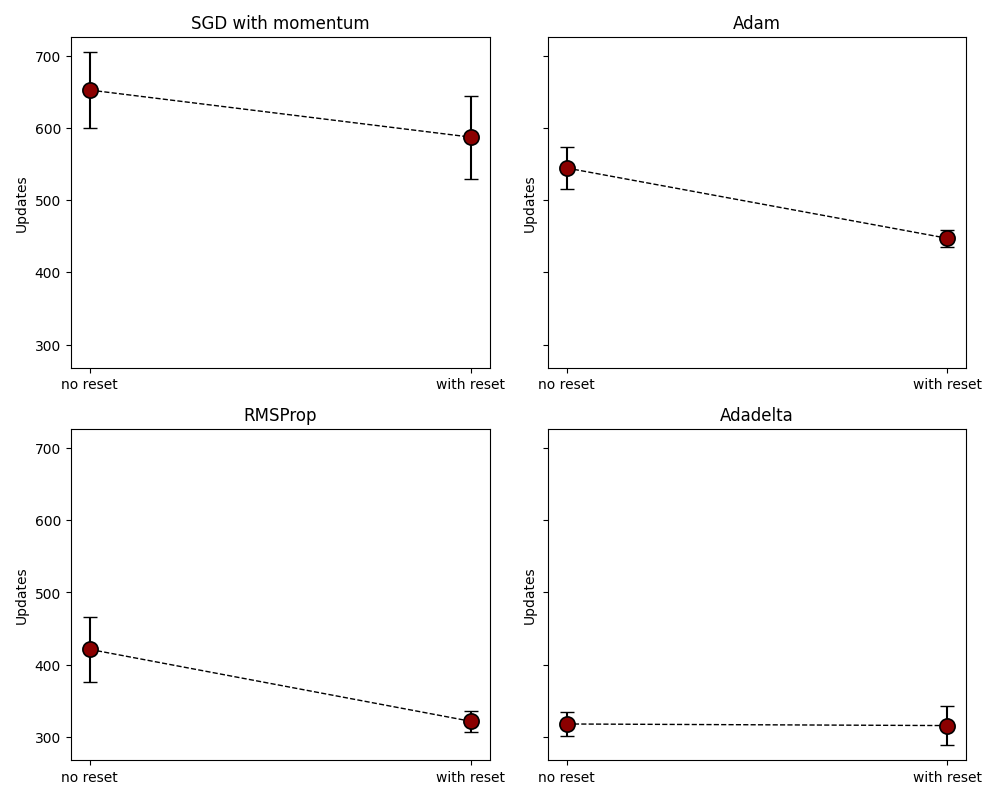
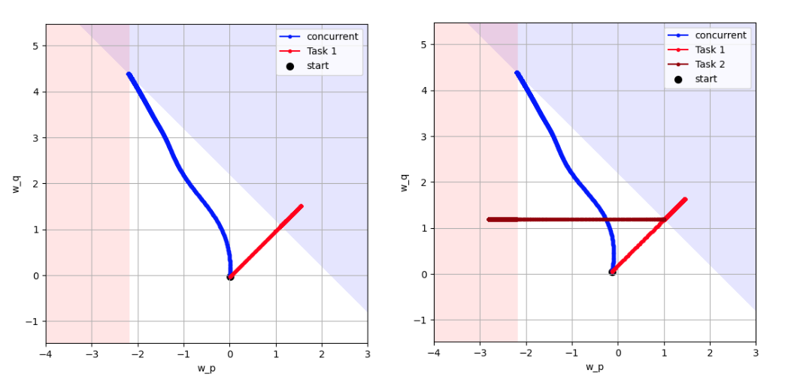
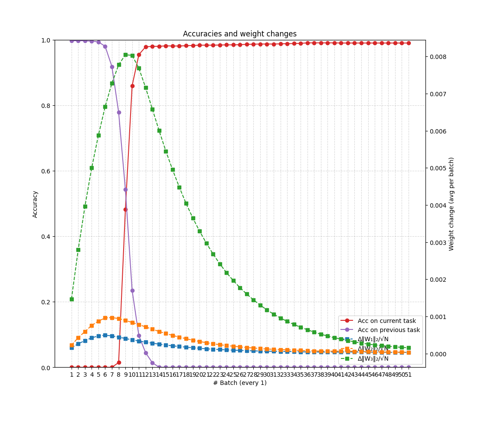
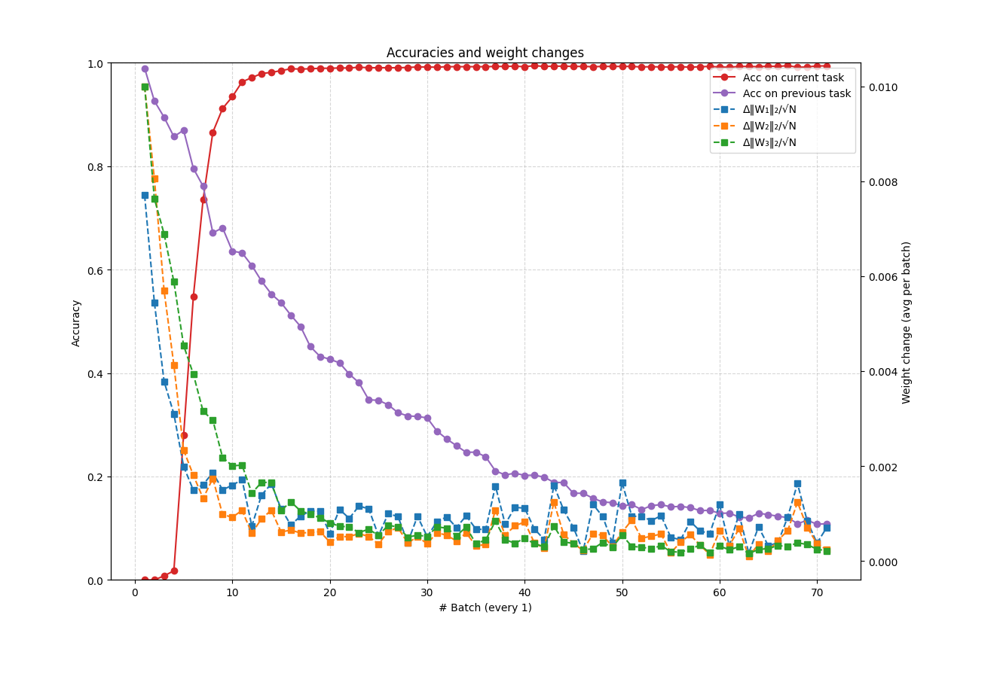
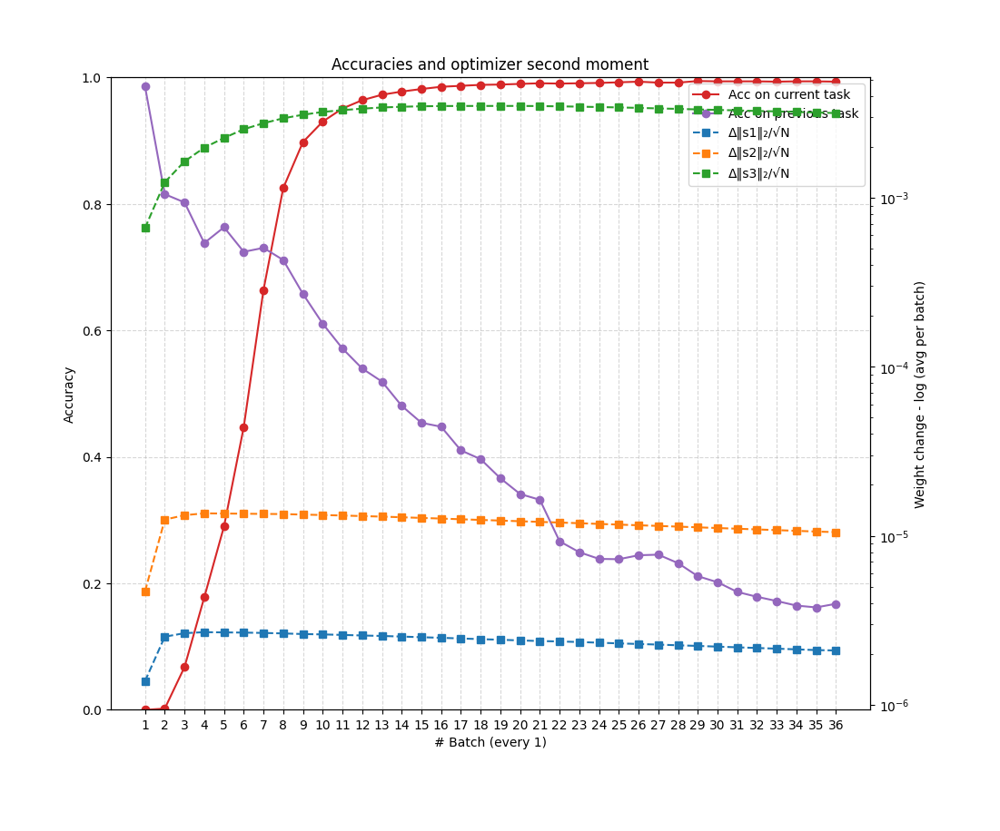
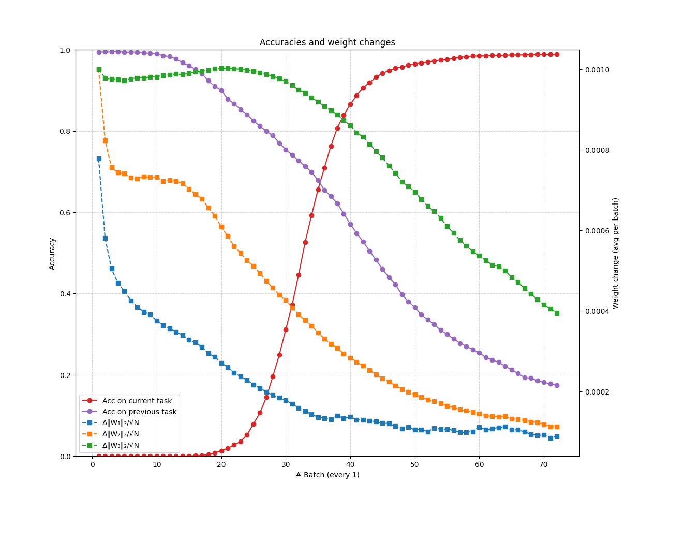

Notes about optimization in sequential learning

*September 24, 2025*

### Last week results

The last thing we discussed last meeting was the somewhat confusing results obtained when testing for the *savings* of the model.

If we recall, the idea was to measure, after the model has trained on a Task A, and then on a Task B, how much faster would it learn Task A now when compared with the first time it learned it.

```
Task A -> Task B -> Task A
```

The results were complicated: they varied strongly with the optimizer used, and were not always positive, meaning the model took more time to learn the task the second time around. Secondly, for optimizers with a state, there was a significant difference in the result depending if the state was reset between tasks or not.


|     | SGD | SGD + momentum | SGD + momentum | Adam | Adam | RMSProp | RMSProp |
|------------|------- |------- |------- |------- |------- |------- |------- |
| Reset state   | - | No | Yes | No | Yes | No | Yes |
| Learning rate | 0.1 | 0.01 | 0.01 | 0.001 | 0.001 | 0.001 | 0.001 |
| Savings    | 0.59 | -0.11 | -0.09 | -0.74 | 0.13 | 0.57 | 0.70 |

** Results are the mean of 25 runs.

Adding to these, we cited two papers advising against the use of Adam in favor of vanilla SGD for sequential learning tasks (`Mirzadeh et al., 2020`, `Ashley & Sutton, 2021`). I was not convinced by their argumentation, and thought that the matter of optimization in the sequential learning scenario needed more investigation.

But one thing can be highligted before proceeding: the metric *savings* was inspired by the work from `Ebbinghaus, 1885`, in his pioneering memory studies. In its original definition, *savings* was a measure of the inner stability of what was learned - so a measure of the state of knowledge of the system itself.

Translating this to neural networks, the stability of what was learned depends only on the knowledge encoded in the parameters of the neural network, and therefore it is a measure inherent to the model itself (like accuracy would be).

Using this interpretation, my intention was to investigate if the metric could be used to measure how shallow/deep was the forgetting in the model.

But the way we are measuring *savings* in neural network makes it not dependent only on the knowledge of the model, but also on the optimizer, and therefore it is dependent of a number of hyperparameters as well. This makes the concept of what we are measuring very confusing and hard to interpret in the context of learning with neural networks.

***Soft conclusion:*** The measure of *savings* is not measuring what it says it is, that is: *the stability of what the model has learned*, and therefore its interpretation can be misleading. This conclusion suggests it should no be used to evaluate what a model has learned or forgot.

### About the state of the optimizer

A point that warrants further investigation is the different performances obtained when resetting and not resetting the optimizers state between tasks.

To test this, we abandon the notion of *savings*, to a different setup that we can deal without mixing up interpretations from psychology. The idea is, first we train the model sequentially on a number of tasks:

```
tasks = [
    [1, 2],
    [3, 4], 
    [5, 6],
    [7, 8],
    [9, 0],
]
```

Everytime the model trains on a task, it converges to the solution to that task, and may forget about the task it saw before. But intuitively we believe that, as the model trains on more of this tasks, it may be easier to get to the joint solution for all the classes.

So we measure, after the sequential learning, how fast the model is able to get to the joint solution, training for all taks concurrently.

```
base_task = [[1, 2, 3, 4, 5, 6, 7, 8, 9, 0]]
```

This can be interpreted as:




For all optimizers (except Adadelta), the result is quite clear: resetting the model at each task is advantageous for in terms of speed of convergence.

Adadelta needs more investigation.

### Why the state is not helping?

An optimizer with state means that it can carry a little bit of history, and this history influences the optimization path. Intuitively, we may think this is a positive thing for the sequential learning scenario, once it probably is a useful thing to help the model not forget the task it has learned before.

#### Intuition

Thinking in the context of the weight space and solution boundaries of a simple problem, we may think that an optimizer with momentum will be able to, when learning the second task, to land into a position closer to the joint solution.


#### What really happens

What really happens is that we train on the first task until convergence, and this makes the moment die out, being very close to zero. When the model starts training on the second task using this moment, it slows it down in the beginning, making the training slower.



### Looking at our model

Bringing it back to our task, we compare the updates in weight using SGD (no state) with SGD with momentum.

All plots are for the training of the **second task [2, 3]**.


#### Optimization without state: SGD 

We can see that SGD starts with relatively high updates, that quickly decrease in magnitude as the gradient of the loss decreases.


#### SGD with momentum (not reset between tasks)

In comparison, when we carry a moment from the last task, the updates start very small, increase to a maximum, and then decrease again. This dynamic of training makes slows it down.



#### Behavior of the first and second moments (with resets)

Comparing a number of optimizers, that use both first and second moments of the gradients, we have the following picture: SGD with moment has the worst result, followed by SGD, then Adam, RMSprop and Adadelta.

It is noticeable that in this scenario models that use the first moment (momentum) alone or in addition to the second moment have a worse performance than methods that use the second moment alone. 


Let us see if we can get some insight on what is going on.

#### Starting with SGD

This is the same training curve as before for SGD, showing the magnitude of the updates for each of the layers.


#### Adding 2nd moment

If we add the second momento of the gradients to SGD, we get RMSProp:

```
g = ∇L(θ) 

s <- β * s + (1 - β) * g * g

# update the weights
θ <- θ - lr * g / (sqrt(s + eps))

```

The gradient is divided by the **square root of the exponential average of the gradients squared**.

The effect is that directions that have small gradients get a boost in their updates, and directions that have large gradients have their updates shrink:



Zooming in, we can see that in the beginning of the training the second layer is even being updated more than the output layer:


If we plot the evolution of the second moment, we can see that it is very stable, and it follows a consistent order: the second moment for the last layer is larger than for the second, which is largest than of the first. Once this value goes in the denominator, it has the affect of making the updates of the first and second layers larger than of the last layer.



#### Adding 1st moment

If we also add the first moment (momentum) to the optimizer, we get Adam:

```
g = ∇L(θ) 

m <- β1 * m + (1 - β1) * g
s <- β2 * s + (1 - β2) * g * g


# update the weights
θ <- θ - lr * m / (sqrt(s + eps)
```

And now the behavior is quite different: the momentum does not let the updates die out quickly, keeping them going gor a while before decreasing.



If we track the evolution of the first moment, we see that it increases in the beginning of the training and takes a while to go down:


Comparing SGD with Adam in this scenario, we can see that in this case Adam makes the updates go on for a while longer, and takes more time to learn the task. I interpret that the momentum is not letting Adam decrease its learning rate, and this is not allowing Adam to go down in the local minima, perhaps circling around.

But this may be particular to this dataset, and need to be investigated in more scenarios.


### Does training on more tasks makes us closer to the joint solution?

Finally, intuitively we may think that as the model trains on more tasks, it will be closer to the joint solution. For instance, a model trained on all 5 tasks should be closer to the joint solution than a model trained on only one of the tasks, that in turn should be closer to the solution than a model randomly initialized. Is this the case?

```
tasks = [
    [1, 2],
    [3, 4], 
    [5, 6],
    [7, 8],
    [9, 0],
]

base_task = [[1, 2, 3, 4, 5, 6, 7, 8, 9, 0]]
```

We see that this behavior is *mostly* consistent between the optimizers, having a particularly smooth behavior in RMSprop. The most inconsistent is SGD with momentum, and Adadelta also appeared very insensitive to it, even though it was very fast to converge in all cases.


## Coming

* Do the results from the last month generalize? 
    * Test in more difficult benchmarks (e.g. Split CIFAR-100).
* Investigate Adadelta. 
    * Why is it going so well? 
    * Does this behavior persist in other datasets?
* New ideas from the PhD school, can they help? 
    * Plotting and observing the loss landscape, 
    * Plotting the decision boundary of the model.
