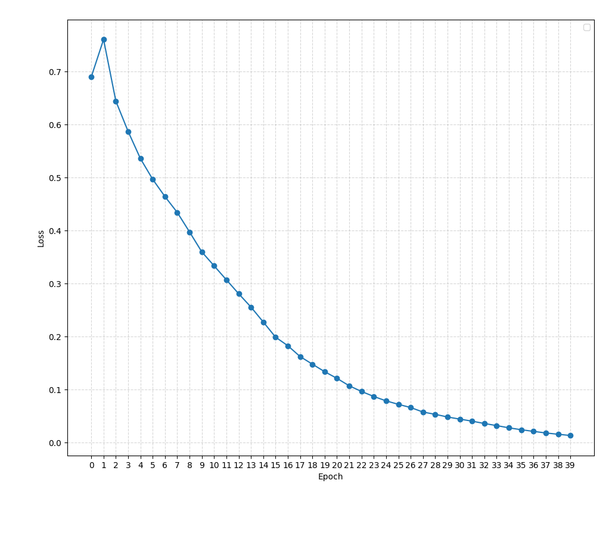
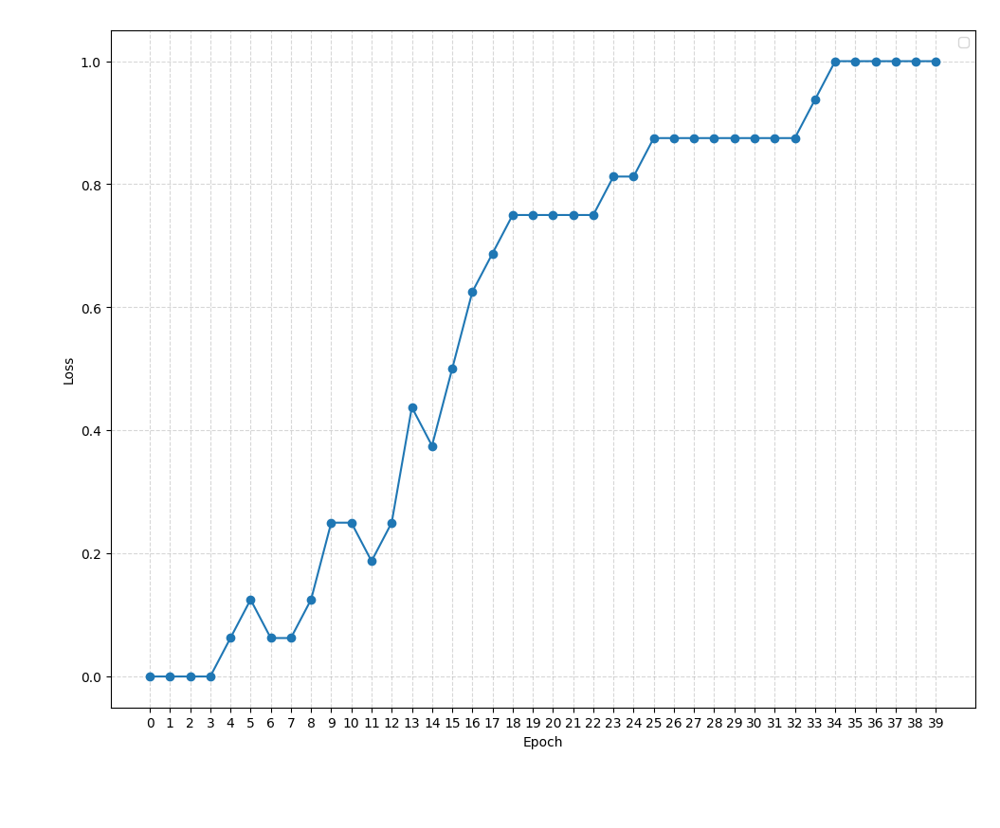
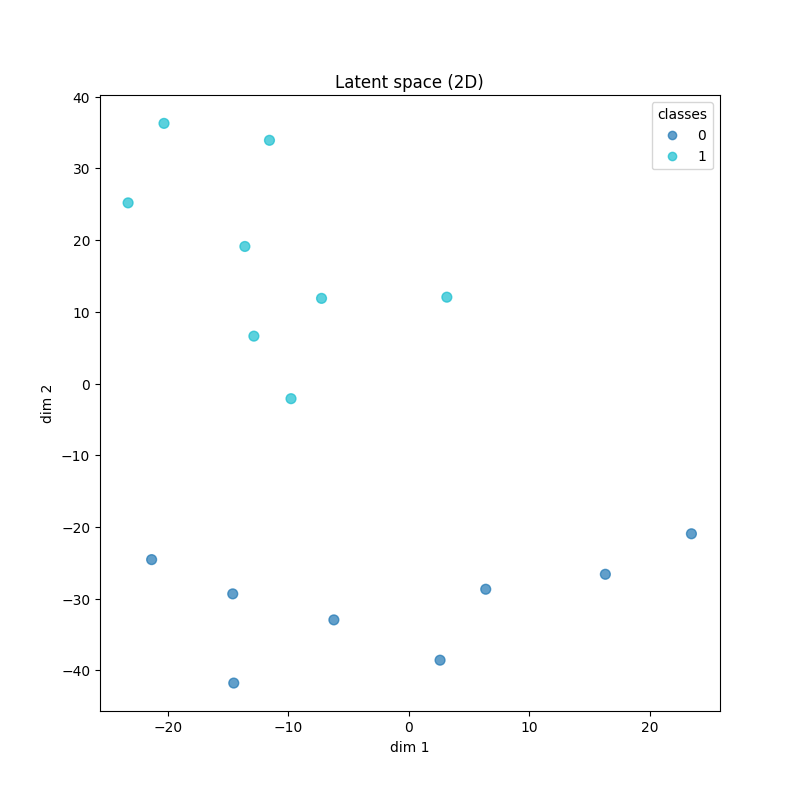
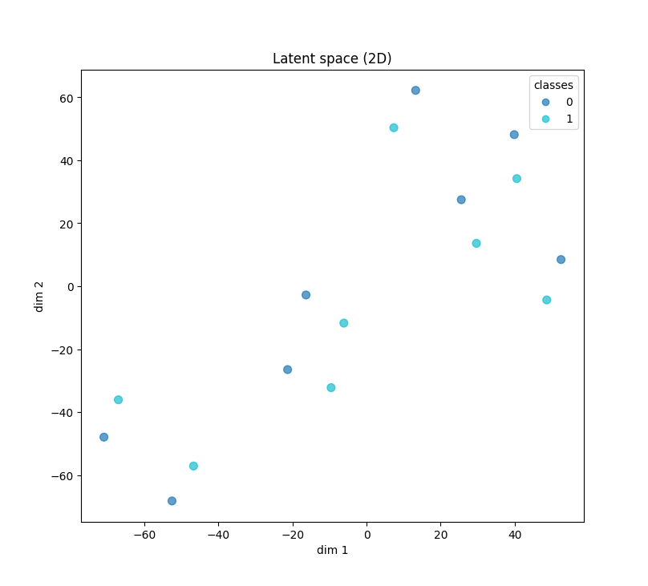
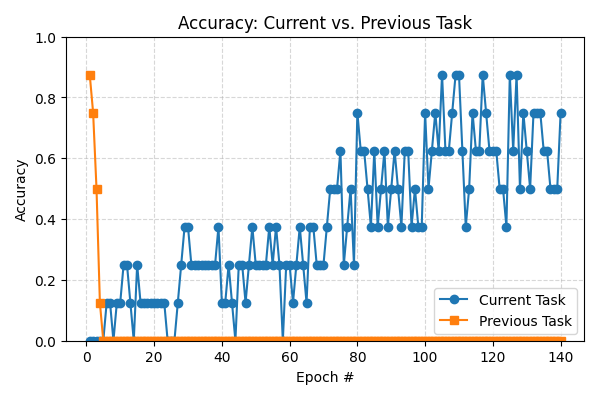

# Notes - Retrospective inference experiment

## Concurrent or interleaved learning

As expected, the model was able to get 100% accuracy on the 16 patterns.

Epoch 0, loss 0.6894, acc 0.0000

Epoch 1, loss 0.7599, acc 0.0000

Epoch 2, loss 0.6436, acc 0.0000

Epoch 3, loss 0.5864, acc 0.0000

Epoch 4, loss 0.5352, acc 0.0625

Epoch 5, loss 0.4961, acc 0.1250

Epoch 6, loss 0.4634, acc 0.0625

...

Epoch 30, loss 0.0437, acc 0.8750

Epoch 31, loss 0.0399, acc 0.8750

Epoch 32, loss 0.0354, acc 0.8750

Epoch 33, loss 0.0315, acc 0.9375

Epoch 34, loss 0.0273, acc 1.0000




## Sequentially learning

Now training first the 8 patterns from the AB list, and then the 8 pattersn from the AC list.

The first 8 patterns are learned fairly quicky, in less than 15 iterations. The second pattern takes much longer to achieve 100%, around 40 epochs. The previous learning seems to have made more difficult for the next learning to occur.

Also it is very interesting to see the evolution of the accuracy lines for the previous and current tasks:

The accuracy for the current task only start increasing after the accuracy of the previous task when to zero. And this happens very quickly, in only 6 epochs.

This make be linked to the fact that the new learning took more epochs to occur: one may think that this is because the network had first to forget what it had learned before.


Looking at two examples with can see that the network is giving to the inputs of AB list the same output as for the AC list, ignoring the context and the fact it is another pair of signal:

**Example 1**

AC input:
[0.0, 1.0, 0.0, 1.0, 1.0, 1.0, 1.0, 0.0, 1.0, 0.0, **1.0, 0.0, 1.0, 0.0, 1.0, 1.0, 1.0, 1.0, 0.0, 1.0**]

AB input:
[0.0, 1.0, 0.0, 1.0, 1.0, 1.0, 1.0, 0.0, 1.0, 0.0, **0.0, 0.0, 1.0, 0.0, 0.0, 0.0, 0.0, 0.0, 1.0, 0.0**]

AC output:
[0.0, 0.0, 1.0, 0.0, 1.0, 1.0, 1.0, 0.0, 1.0, 0.0]

AC target:
[0.0, 0.0, 1.0, 0.0, 1.0, 1.0, 1.0, 0.0, 1.0, 0.0] 

AB output:
[0.0, 0.0, 1.0, 0.0, 1.0, 1.0, 1.0, 0.0, 1.0, 0.0]

AB target:
[1.0, 0.0, 1.0, 1.0, 0.0, 1.0, 0.0, 1.0, 1.0, 0.0]
 
**Example 2**

AC input:
[1.0, 1.0, 1.0, 1.0, 0.0, 1.0, 1.0, 0.0, 0.0, 1.0, **1.0, 0.0, 1.0, 0.0, 1.0, 1.0, 1.0, 1.0, 0.0, 1.0**]

AB input:
[1.0, 1.0, 1.0, 1.0, 0.0, 1.0, 1.0, 0.0, 0.0, 1.0, **0.0, 0.0, 1.0, 0.0, 0.0, 0.0, 0.0, 0.0, 1.0, 0.0**]

AC output:
[1.0, 1.0, 0.0, 0.0, 0.0, 0.0, 0.0, 1.0, 0.0, 1.0]

AC target:
[1.0, 1.0, 0.0, 0.0, 0.0, 0.0, 0.0, 1.0, 0.0, 1.0] 

AB output:
[1.0, 1.0, 0.0, 0.0, 0.0, 0.0, 0.0, 1.0, 0.0, 1.0]

AB target:
[1.0, 0.0, 0.0, 0.0, 0.0, 0.0, 1.0, 0.0, 0.0, 0.0]

### Latent space

Looking at the latent space for the two sequences, we can see that in the **concurrent training** they are well separated:



But now looging at the latent representation after sequential training, we can see that for each example from the A-C class, there is an example of the A-B class tagging along - this would be the corresponding example from the A-B list that is output the C pattern instead of the B pattern.




### Architecture

The neural net is composed of 2 layers, the input and output.

It has an input layer that receives 20 inputs and maps it to 50 dimensions,
and an output layer that receives the 50 dimensions and maps it down to the 10 dimensions of the output pattern.

```
import torch.nn as nn
import torch.nn.functional as F

class MLP(nn.Module):
    def __init__(self, input_size=20, hidden_size=50, output_size=10):
        super().__init__()

        self.linear1 = nn.Linear(input_size, hidden_size)
        self.linear2 = nn.Linear(hidden_size, output_size)

    def forward(self, x):

        self.h1 = F.relu(self.linear1(x))
        logits = self.linear2(self.h1)

        return logits
```

My experiments with dropout were not very successful. It did not helped with the forgetting problem, but it did make the neural net harder to learn. I also added a new hidden layer, but it had a limited effect in helping it:

```
import torch.nn as nn
import torch.nn.functional as F

class MLP(nn.Module):
    def __init__(self, input_size=20, hidden_size=50, output_size=10, p=0.1):
        super().__init__()

        self.linear1 = nn.Linear(input_size, hidden_size)
        self.dropout1 = nn.Dropout(p)
        self.linear2 = nn.Linear(hidden_size, hidden_size)
        self.dropout2 = nn.Dropout(p)
        self.linear3 = nn.Linear(hidden_size, output_size)

    def forward(self, x):

        self.h1 = F.relu(self.linear1(x))
        self.h2 = F.relu(self.linear2(self.dropout1(self.h1)))
        logits = self.linear3(self.dropout2(self.h2))

        return logits
```


