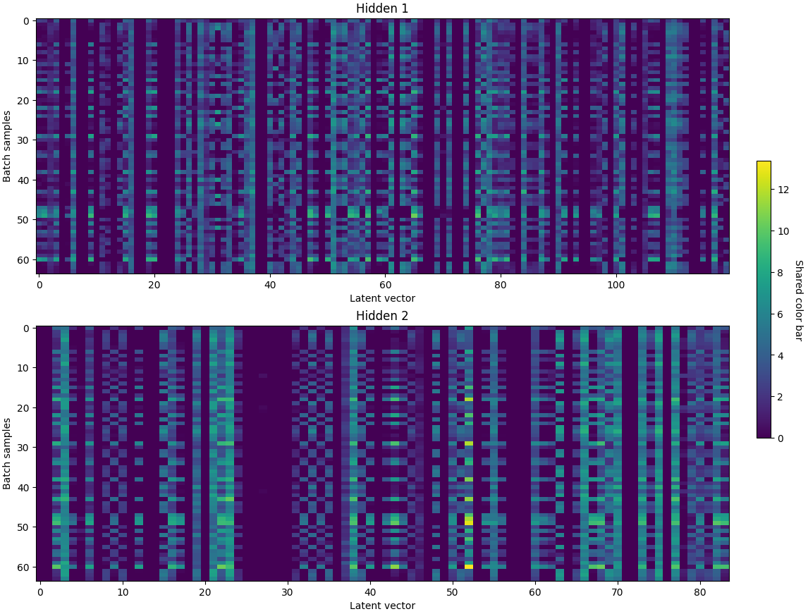
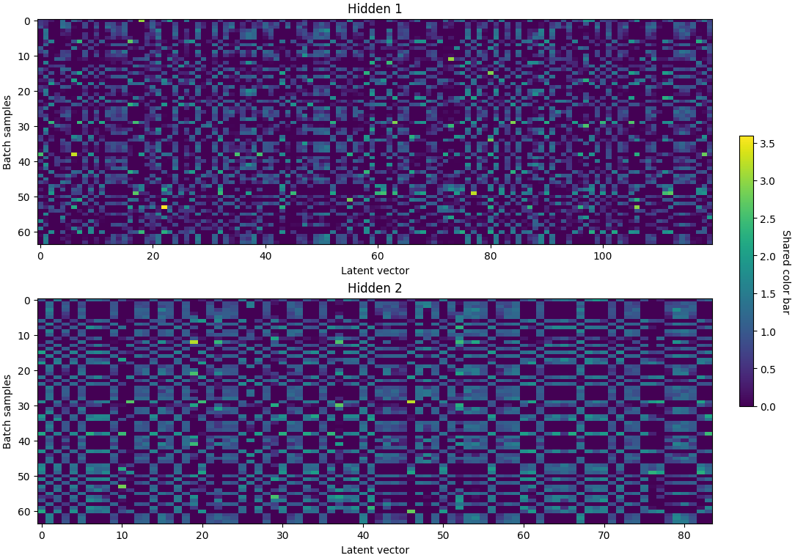
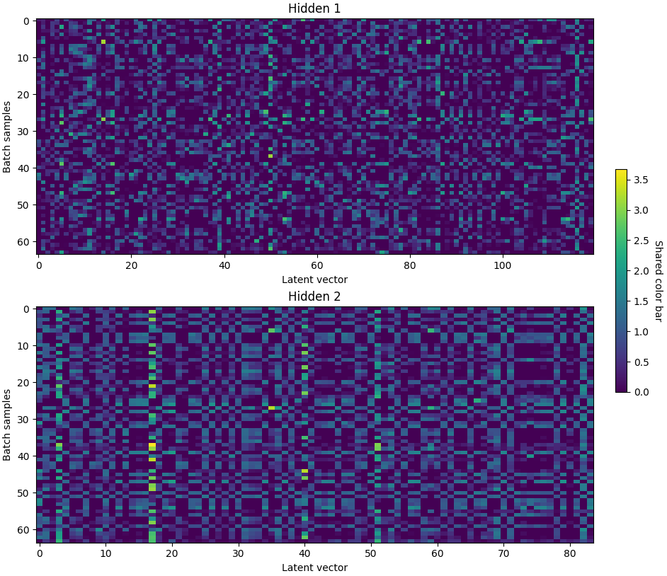
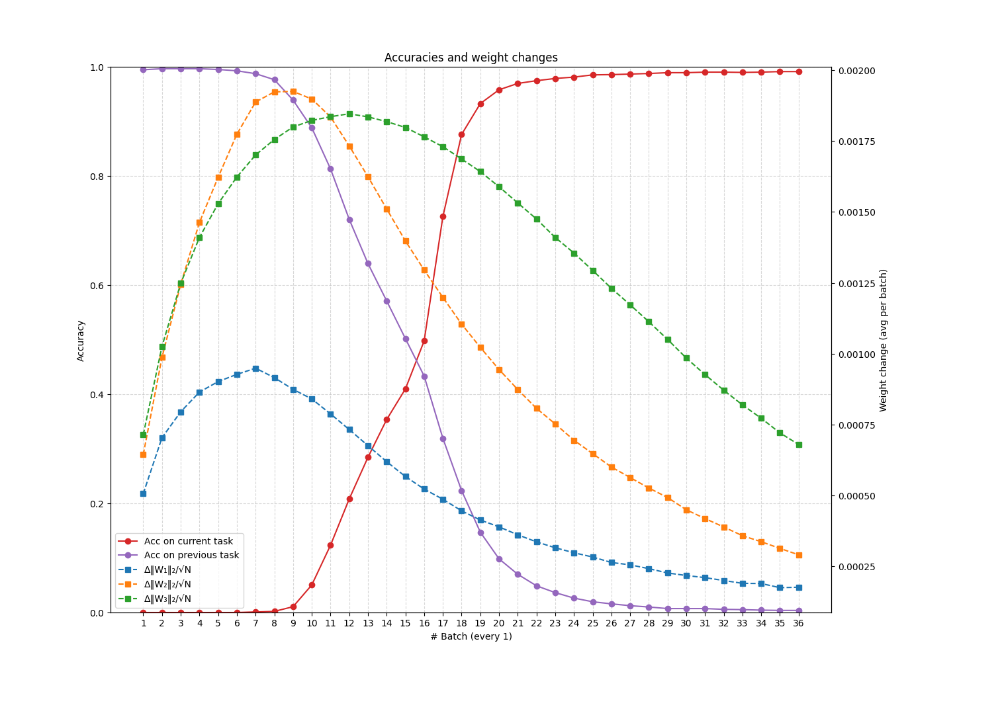

Notes summarizing research up till now.

*September 30, 2025*

### MNIST key observations

#### Growing sparcity in the model, due to a shift in the bias terms

**Task 1**

`val loss 0.012917`

`Population sparcity: 0.4987`



**Task 2**

`val loss 11.244117`

`Population sparcity: 0.7782`


#### Arrested by the batch norm layer

* Also avoided the values of the features growing unchecked, and reduced the loss (even though the forgetting was the same).
* The training curves got smoother.

**Task 1**

`val loss 0.015192, sparcity: 0.5112`



**Task 2**

`val loss 3.735139, sparcity: 0.4764`



### Strength and stability of the latent features learned

Using a linear probe to investigate the knowledge encoded on the latent features of the model:

| Accuracy    | Task 1 | Task 2 | Task 3 | Task 4 | Task 5 |
|------------|--------- |--------- |--------- |--------- |--------- |
| Classifier | 0.9976 | 0.9582 | 0.9288 | 0.9220 | 0.8925 |

Comparing:

```
NN with concurrent learning: 0.9646
NN with sequential learning: 0.1985
Linear probe on latent features: 0.8925 
```

We see that the latent features have preserved about `0.8925 / 0.9646 = 0.9231` of the discriminative power learned by the neural net when learning all classes at once.

#### How general are the features learned?

Very.

Training sequentially and evaluating the classification accuracy of the linear probe on all the classes, shows that after training on only Task 1 (2 classes), it is able to classify all ten classes with 0.8470 accuracy.

| Accuracy    | Task 1 | Task 2 | Task 3 | Task 4 | Task 5 |
|------------|------- |------- |------- |------- |------- |
| Classifier | 0.8470 | 0.8820 | 0.8835 | 0.8935 | 0.8905 |

### Shallow forgetting

This suggests that the forgetting is more shallow than expected, and is happening more strongly on the classification layers. This can be seen by accumulating the gradients during training on the 3 layers of the neural net:


#### Cross-entropy loss

The current loss pushes down the logits of the incorrect classes. Once the previous classes are not seen anymore, what happens is that their logits are effectively shut down and the model uses the latent features just to separate the current classes.

#### What about a different loss?

##### Alternative 1: Flow gradients only throught the correct logit

Leave the others unaltered. Apparently good: forgetfullness is much slower (such as learning), at the end of Task 5, got 40% accuracy on all classes - but could not converge to 98% accuracy on the current task.

**Task 5**

Epoch 19, train loss 0.001012, train acc 0.882567, val loss 2.232976, **val acc 0.408200**


But if we look at one example, we see that the system is very fragile. Passing the logits through sigmoids, we see that the logits are high and result in probabilities close to one for all of them:

Correct class: 0

| Prob. 0 | Prob. 1 | Prob. 2 | Prob. 3 | Prob. 4 | Prob. 5 |Prob. 6 |Prob. 7 | Prob. 8 | Prob. 9 |  
|------------|------- |------- |------- |------- |------- |------- |------- |------- |------- |
| 0.9997 | 0.9632 | 0.9947 | 0.9974 | 0.9889 | 0.9961 | 0.9987| 0.9965| 0.9922 | 0.9036 |

The current loss sees only the probability for the current class - so makes it as high as possible. But it has no agency over the other probabilities, therefore they can also be arbitrarily large, and the neural net will make no effort to change them. 

Looking at the accuracy of the linear probe on the latent representations, it continues the same as before. It suggests that the model is not changing much the latent representation, but focusing its changes on the classification head:

| Accuracy    | Task 1 | Task 2 | Task 3 | Task 4 | Task 5 |
|------------|------- |------- |------- |------- |------- |
| Classifier | 0.9928 | 0.9619 | 0.9380 | 0.9051 | 0.8815 |

##### Alternative 2: Force the gradients to the latent space

What we want is that the model is able to separate the current and previous classes. So we are going to flow the gradients throught the incorrect logits, but not updating the classification layer, only the hidden underneath.

It did not work, achieved the same forgetting as before:

**Task 5**

Epoch 1, train loss 0.991418, train acc 0.980259, val loss 2.350173, **val acc 0.197300**

But if we look at the classification accuracy of the linear probe, we see that something has changed:

| Accuracy    | Task 1 | Task 2 | Task 3 | Task 4 | Task 5 |
|------------|------- |------- |------- |------- |------- |
| Classifier | 0.9952 | 0.9631 | 0.8702 | 0.7216 | 0.4940 |

The apparent forgetting is the same, but *it is in fact deeper now*: the neural net has in fact lost information.

#### Interesting direction

We can use linear probing to measure how deep the forgetting actually is.

#### A second idea relating to how shallow or deep forgetting is

A second way to measure forgetting could be the *savings* metric: how much work is saved relearning a task that was already learned, compared to when you first learned it.

But it is not so straighforward as it first seems:

|     | SGD | SGD + momentum | SGD + momentum | Adam | Adam | RMSProp | RMSProp |
|------------|------- |------- |------- |------- |------- |------- |------- |
| Reset state   | - | No | Yes | No | Yes | No | Yes |
| Learning rate | 0.1 | 0.01 | 0.01 | 0.001 | 0.001 | 0.001 | 0.001 |
| Savings    | 0.59 | -0.11 | -0.09 | -0.74 | 0.13 | 0.57 | 0.70 |

The savings depends on the *path* you take and at the *speed* you progress. So it is not a actually a measure of the knowledge of the model - *and cannot be used to describe the forgetting alone*.

#### Investigating role of the optimizer

Setting: train the optimizer sequentially on all tasks:

```
tasks = [
    [1, 2],
    [3, 4], 
    [5, 6],
    [7, 8],
    [9, 0],
]
```

So we measure, after the sequential learning, how fast the model is able to get to the joint solution, training for all tasks concurrently.

```
base_task = [[1, 2, 3, 4, 5, 6, 7, 8, 9, 0]]
```

##### Resetting or not resetting


For all optimizers (except Adadelta), the result is quite clear: resetting the model at each task is advantageous for in terms of speed of convergence.

Adadelta has the same results because its state, when initialized, is set to zero, which is the same state it starts when training on a task after having converged from the previous task: therefore, resetting or not resetting is equivalent.

#### Intuition

Thinking in the context of the weight space and solution boundaries of a simple problem, we may think that an optimizer with momentum will be able to, when learning the second task, to land into a position closer to the joint solution.


#### What really happens

What really happens is that we train on the first task until convergence, and this makes the moment die out, being very close to zero. When the model starts training on the second task using this moment, it slows it down in the beginning, making the training slower.


#### What does the first moment do

##### SGD, no state


##### Adding momentum


#### What does the second moment do

##### SGD, no state


##### RMSProp


##### Adding first and second moment: Adam



#### Conclusion for now

Intuitively having a history (state) in the optimizer seems like a useful thing when learning sequentially. But for the current optimizers, resetting for every task seems to work best - so we do not take any advantage of it. 

* Something here may be part of a solution to the problem.
* But leaving this for now to learn what other people have done - if I get an idea will come back!

### Split CIFAR-100 

Adding a harder problem to our test-bed:

```
NN with concurrent learning: 0.5076
NN with sequential learning: 0.0859
```

#### Observation 1: Sparcity

Agreeing with what was observed in MNIST, training the model without BN leads to much larger sparsity. The difference is that in this case the sparsity without batch norm is already very large from the first task.


#### Observation 2: Strength and stability of latent features

Linear probing the latent representations of the model we get that at the end of the 10th task, the accuracy of the linear probe is `0.3835`.

| Accuracy    | Task 1 | Task 2 | Task 3 | Task 4 | Task 5 | Task 6 | Task 7 | Task 8 | Task 9 | Task 10 |
|------------|------- |------- |------- |------- |------- |------- |------- |------- |------- |------- |
| Classifier                     | 0.8400 | 0.7650 | 0.6683 | 0.5837 | 0.5600 | 0.4758 | 0.4514 | 0.4444 | 0.3861 | 0.3835 |

We then have:

```
NN with concurrent learning: 0.5076
NN with sequential learning: 0.0859
Linear probe on latent features: 0.3835
```

Comparing: The MNIST trained model preserved `0.8905/0.9646 = 0.9231` of its representation on the latent layer. The CIFAR trained model preserved `0.3835/0.5076 = 0.7555` of its representation.

Therefore, there was more forgetting in the later case, but a good amount of knowledge is still preserved in the system - and this may well be the case when the tasks being learned are related to each other (such as object recognition).

#### Observation 3: How general are the features learned 

We redid the linear probing experiment, now evaluating how well they could predict all classes (not only the ones seeing up to that point):

| Accuracy    | Task 1 | Task 2 | Task 3 | Task 4 | Task 5 | Task 6 | Task 7 | Task 8 | Task 9 | Task 10 |
|------------|------- |------- |------- |------- |------- |------- |------- |------- |------- |------- |
| Classifier                     | 0.3225 | 0.3335 | 0.3490 | 0.3520 | 0.3580 | 0.3330 | 0.3710 | 0.3810 | 0.3840 | 0.3700 |

After training on the first 10 classes, the model can predict all the 100 classes with accuracy 0.3225. This means it can achieve `0.3225/0.5076 = 0.6353` of the upper bound accuracy: the features learned are fairly general.

#### Coming up 

* Investigate proposed approaches to solve the problem.
* Some tools in the bag: 
    * Visualizing the loss landscape.
    * Visualizing the decision boundary of the model.

