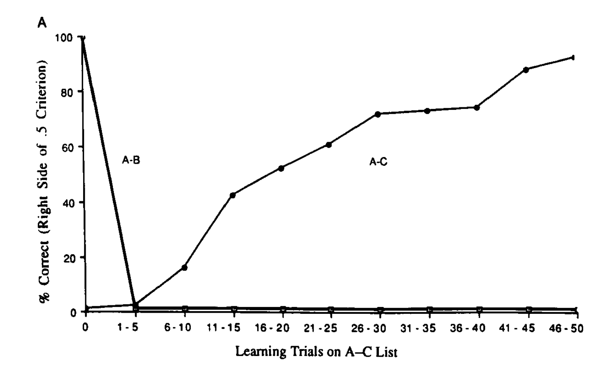
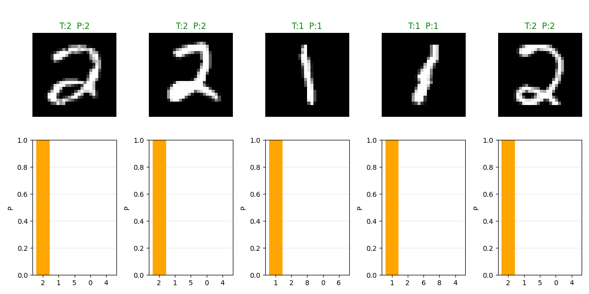
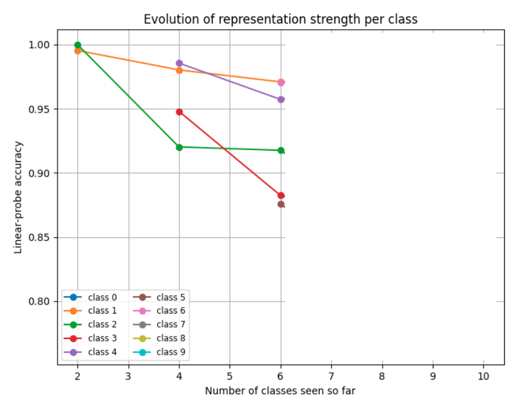

*09, October 2025*

# Catastrophic forgetting

This file documents our understanding of the phenomenon and the direction we are currently pursuing.

## What is the problem

Famous experiment by `Barnes & Underwood, 1959`, replicated on neural nets by `Michael McCloskey & Neal J . Cohen, 1989`.

```
Teach A-B pairs of words

Teach A-C pairs of words

Test on the retention of the A-B pairs
```


As the subjects got better at the recall of the A-C list, their ability for recalling
the A-B list decreased, to about 52%. It is noted that regardless the level of the learning 
in the second list, unlearning the first list is virtually never complete and rarely exceeds 50%.

Doing the same with a neural net:



We replicated this experiment, and got the same result: 


These early studies identified two causes for this phenomenon:

1. The nature of gradient descent optimization; and
2. The use of distributed representation.

### Gradient descent optimization

`Michael McCloskey & Neal J . Cohen, 1989` illustrated the problem in terms of the search in the weight space of a solution, or a region of low loss.


### Current research

This problem is pretty much not solved, and people have been studying mainly in the perspective of classification. Additionally, the solution have fallen into three different categories `Gido M. van de Ven, Tinne Tuytelaars & Andreas S. Tolias, 2022`.


### Looking at one example

Training on MNIST dataset: first **concurrently**, then **sequentially**

### Concurrent training

First, training a small neural network concurrently on all the classes (the typical training protocol).

```
Neural net acc: 0.9777
```


### Sequential training

Now training on the Split-MNIST protocol, two classes at a time (Note: at all times the network has available the same prediction layer with ten outputs).

**Task 1, [1, 2]**

`Accuracy 0.9961`




**Task 2, [3, 4]**

`Accuracy 0.4858`


**Task 3, [5, 6]**

`Accuracy 0.3143`


**Task 4, [7, 8]**

`Accuracy 0.2520`

**Task 5, [9, 0]**

`Accuracy 0.1985`

**Upper bound, concurrent training**: 0.9646

**Lower bound, consecutive training**: 0.1985

### State of the art

Currently, methods that present a descent accuracy need to store examples of the previous classes or need several components, such as image generators besides the model itself (and the performance of the latter depends on the complexity of the inputs that need to be generated).


### How does the strength of the memories evolve?

To tackle this problem, we decided to probe the hidden representations of the neural network, after each task.

| Accuracy    | Task 1 |
|------------|--------- |
| Classifier | 0.9976 | 
| Class 1    | 0.9953 | 
| Class 2    | 1.0000 | 
| Class 3    |        | 
| Class 4    |        | 
| Class 5    |        | 
| Class 6    |        | 
| Class 7    |        | 
| Class 8    |        | 
| Class 9    |        | 
| Class 0    |        | 


| Accuracy    | Task 1 | Task 2 |
|------------|--------- |--------- |
| Classifier | 0.9976 | 0.9582 | 
| Class 1    | 0.9953 | 0.9802 | 
| Class 2    | 1.0000 | 0.9202 | 
| Class 3    |        | 0.9479 | 
| Class 4    |        | 0.9855 | 
| Class 5    |        |        | 
| Class 6    |        |        | 
| Class 7    |        |        | 
| Class 8    |        |        | 
| Class 9    |        |        | 
| Class 0    |        |        | 


| Accuracy    | Task 1 | Task 2 | Task 3 |
|------------|--------- |--------- |--------- |
| Classifier | 0.9976 | 0.9582 | 0.9288 | 
| Class 1    | 0.9953 | 0.9802 | 0.9709 | 
| Class 2    | 1.0000 | 0.9202 | 0.9175 | 
| Class 3    |        | 0.9479 | 0.8824 | 
| Class 4    |        | 0.9855 | 0.9572 | 
| Class 5    |        |        | 0.8756 | 
| Class 6    |        |        | 0.9703 | 
| Class 7    |        |        |        | 
| Class 8    |        |        |        | 
| Class 9    |        |        |        | 
| Class 0    |        |        |        | 



| Accuracy    | Task 1 | Task 2 | Task 3 | Task 4 |
|------------|--------- |--------- |--------- |--------- |
| Classifier | 0.9976 | 0.9582 | 0.9288 | 0.9220 | 
| Class 1    | 0.9953 | 0.9802 | 0.9709 | 0.9779 | 
| Class 2    | 1.0000 | 0.9202 | 0.9175 | 0.8670 | 
| Class 3    |        | 0.9479 | 0.8824 | 0.8680 | 
| Class 4    |        | 0.9855 | 0.9572 | 0.9722 | 
| Class 5    |        |        | 0.8756 | 0.8239 | 
| Class 6    |        |        | 0.9703 | 0.9730 | 
| Class 7    |        |        |        | 0.9688 | 
| Class 8    |        |        |        | 0.9082 | 
| Class 9    |        |        |        |        | 
| Class 0    |        |        |        |        | 


| Accuracy    | Task 1 | Task 2 | Task 3 | Task 4 | Task 5 |
|------------|--------- |--------- |--------- |--------- |--------- |
| Classifier | 0.9976 | 0.9582 | 0.9288 | 0.9220 | 0.8925 |
| Class 1    | 0.9953 | 0.9802 | 0.9709 | 0.9779 | 0.9598 |
| Class 2    | 1.0000 | 0.9202 | 0.9175 | 0.8670 | 0.9067 |
| Class 3    |        | 0.9479 | 0.8824 | 0.8680 | 0.8775 |
| Class 4    |        | 0.9855 | 0.9572 | 0.9722 | 0.8798 |
| Class 5    |        |        | 0.8756 | 0.8239 | 0.7624 |
| Class 6    |        |        | 0.9703 | 0.9730 | 0.9479 |
| Class 7    |        |        |        | 0.9688 | 0.9261 |
| Class 8    |        |        |        | 0.9082 | 0.8470 |
| Class 9    |        |        |        |        | 0.8619 |
| Class 0    |        |        |        |        | 0.9394 |


Comparing:

```
NN with concurrent learning: 0.9646
NN with sequential learning: 0.1985
Linear probing accuracy on the last hidden layer: 0.8925 
```

### How deep is the forgetting?


Most of the forgetting happens in the classification head of the neural network. 

#### Two things seem to be necessary

1. Keep the logits alive for classes trained previously
2. Separate in the latent space classes not seen together


#### Directions to go

1. Investigate how current methods fare in the two previous points
2. Develop a method to solve the problem based on our insights


