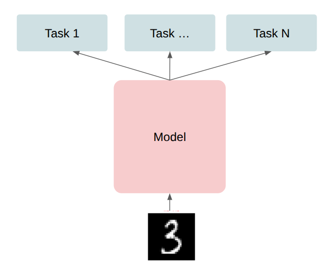
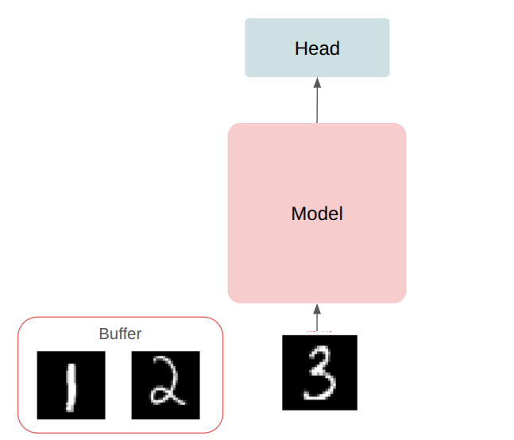
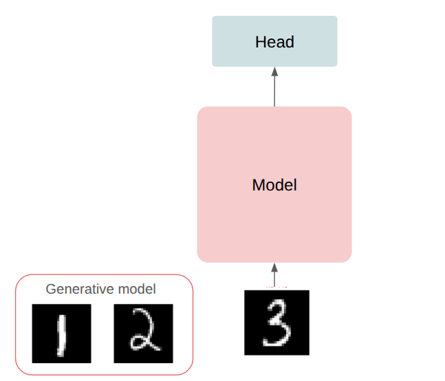
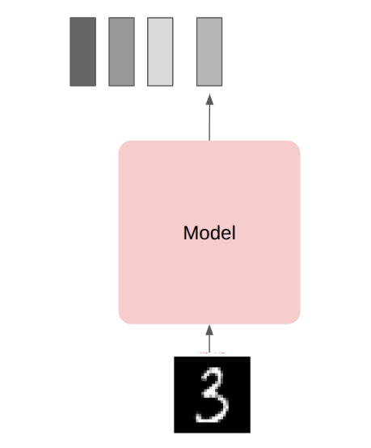
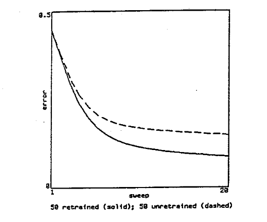
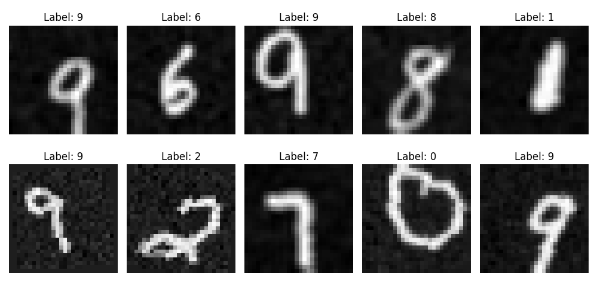
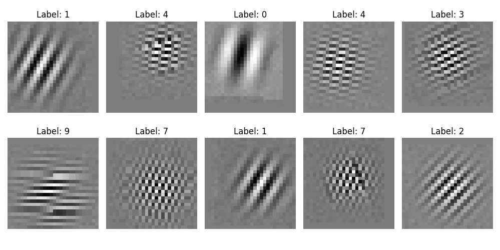

*10 November, 2025*

## Catastrophic forgetting

### Remembering the protocol for class-incremental learning

Train the network on disjoint sets of classes.

```
Split-Cifar 100

Train the network on 10 tasks, where on each task it learns 10 classes

At any point, it should be able to predict all classes it learned so far
```

### Last meeting

Forgetting is catastrophic, but it seems more superficial than it was thought to be.


### Classification head degeneration

But the supeficial forgetting in the classification head is well rooted, once the classification head gets degenerated to a low-rank matrix.

#### Full (sort of) rank decision matrix


#### Rank-1 decision matrix


### How do people try to solve it

1. Task-specific classification head:



2. Memory buffer



3. Training generative models to generate replay data



4. Nearest neighbor classification



### One interesting direction

Investigating an idea from an old Geoffrey Hinton paper (1987):

```
1. Train on Task A

2. Train on Task B

3. Retrain on a subset of Task A
```



Could we associate the classes we are interested about if a signal we can freely generate?

Afterwards, replay to the netwok only the signal, so that both the signal and the corresponding class continue to be alive in the network represetantion and classification head.






