Notes with latest updates.

*October 9, 2025*

## Measuring how deep is the forgetting


#### Papers that tackled this issue

`Anatomy of Catastrophic Forgetting [Ramasesh, 2020]`:

* Higher layers are more responsible for the forgetting (found freezing layers).
* Between tasks, the representations learned for lower layers are more similar than for higher layers.

`Probing Representation Forgetting in Supervised and Unsupervised Continual Learning [Davari, 2022]`:

* Used linear probing (LP) to evaluate forgetting.
* LP accuracy suggested less drastic forgetting than using the observed accuracy.
* Also observed that forgetting is concentrated in the higher layers.

##### Note

Both studies use **task-incremental** learning, where a multi-headed model is trained and told which task should be done, or **domain-incremental**, where a single head is used, but the classes remain the same, and new instances of the classes are learned.

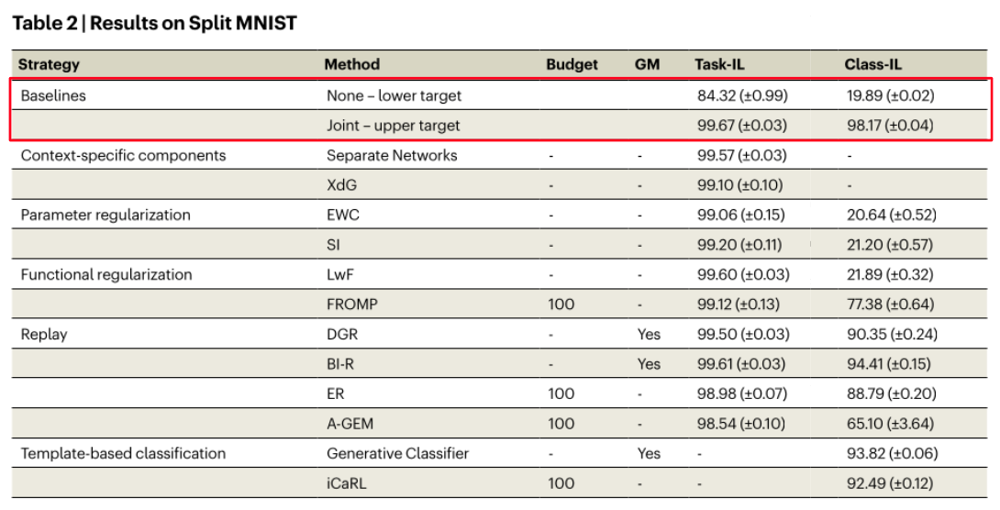

#### Methods that work and that don't

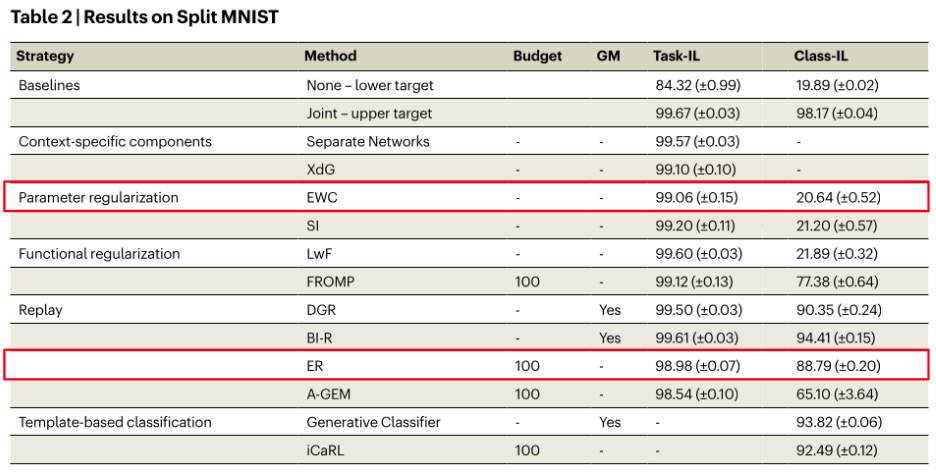

##### Replay

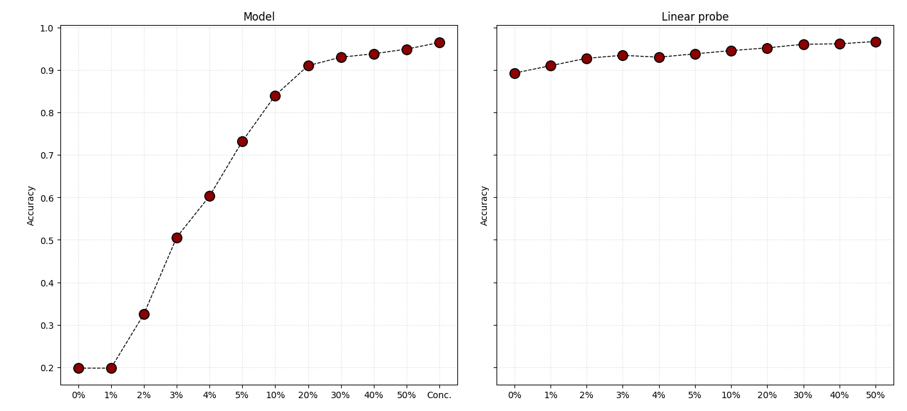

```
Rehearsal: 0% -> 20%

Accuracy Network: 0.1987 -> 0.9100
Accuracy LP (last layer): 0.8925 -> 9520
```

##### Interesting learning behavior:

*Task 5, 10% replay*

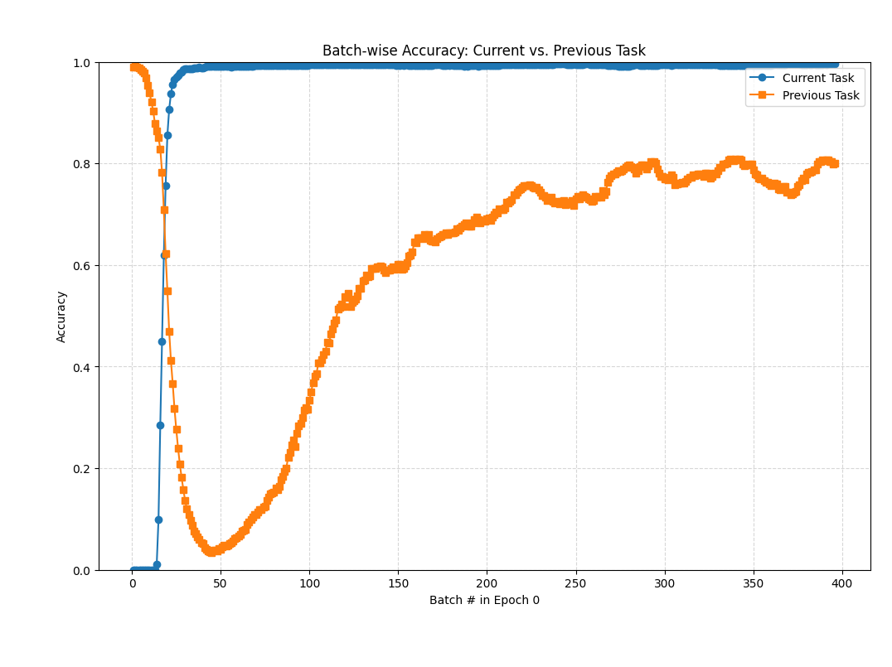

*Task 5, 30% replay*

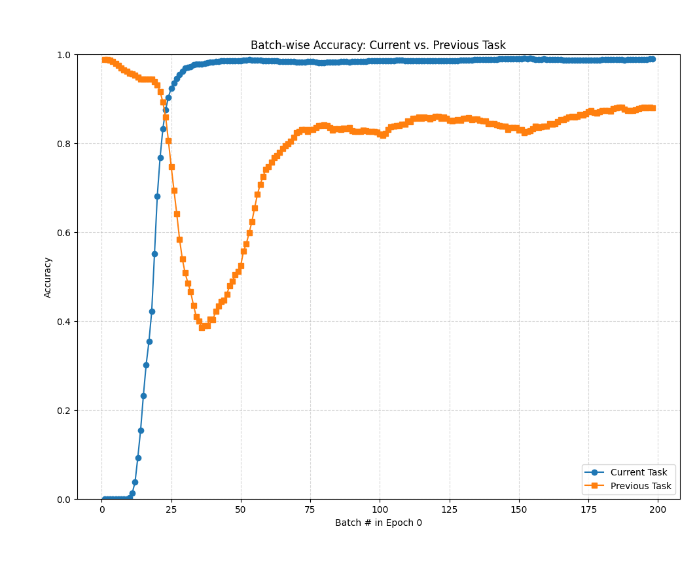

*Task 5, 50% replay*

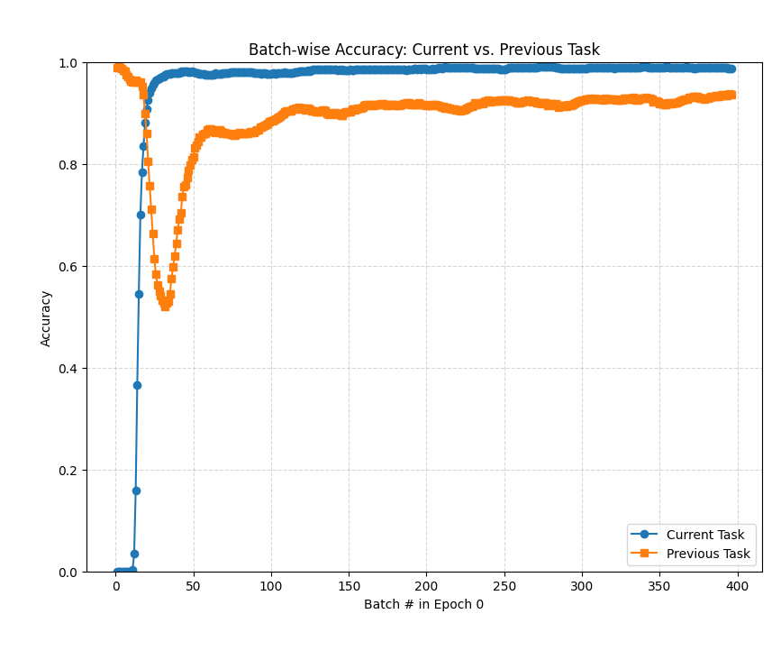

Replay acts **mostly on the classification layer of the neural network.**

##### Elastic Weight Consolidation (EWC)

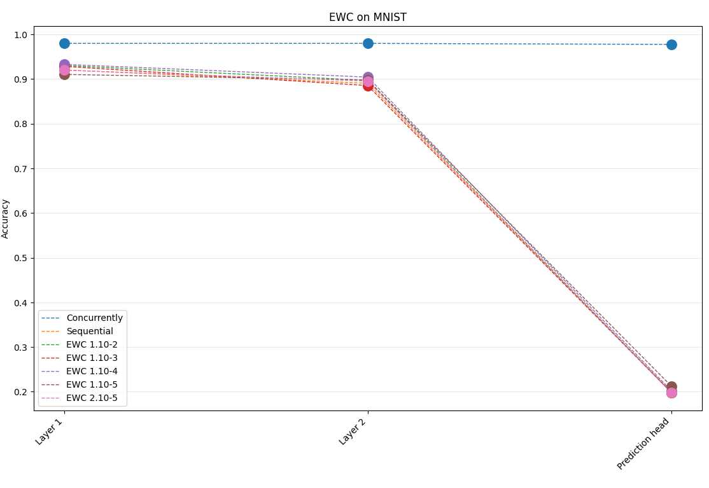

Best scenario:

```
lambda = 1.10^4

Network accuracy: 0.2018 (baseline: 0.1981)
LP (layer 2): 0.9045 (baseline: 0.8905)
LP (layer 1): 0.9330 (baseline: 0.9205)
```

#### On the illness of the prediction layer

With SVD (singular value decomposition) we break a matrices into three parts:

```
A = U ∑ V.T
```

Doing the outer products of the columns of *U* and the rows of *V.T*, scaled by the corresponding singular value, we get the rank-1 pieces of matrix A.

Summing the first *k* of those pieces we get the *k-rank* matrix closest to *A* (provable).

##### Training concurrently

```
rank-7 accuracy: 0.9604
rank-10 accuracy: 0.9777
```

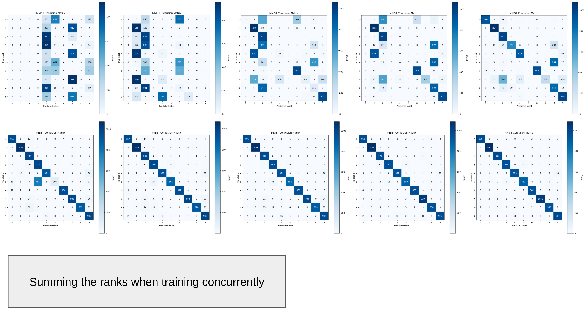

Looking individually at the single rank-1 matrices, you get at most *0.2023* accuracy.

##### Training sequentially

Except for *Task 4, [7, 8]*, you only need a rank-1 piece to get all the accuracy of the network. 

For *Task 4, [7, 8]* you need a rank-2 matrix.

**Task 1, [1, 2]**

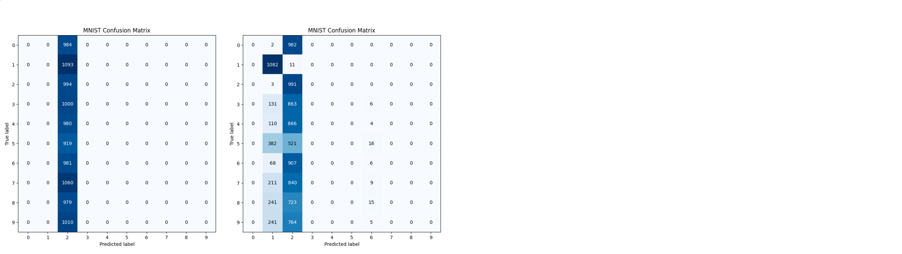

**Task 2, [2, 4]**

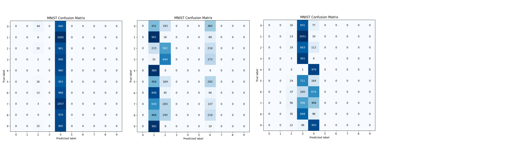

**Task 3, [5, 6]**

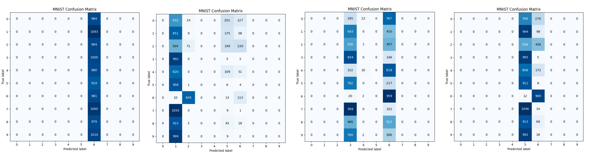

#### Two things seem to be necessary

1. Keep the logits alive for classes trained previously
2. Separate in the latent space classes not seeing together

### Uniform noise

#### Enforcing uniform output distribution

**Task 2, [2, 4]**

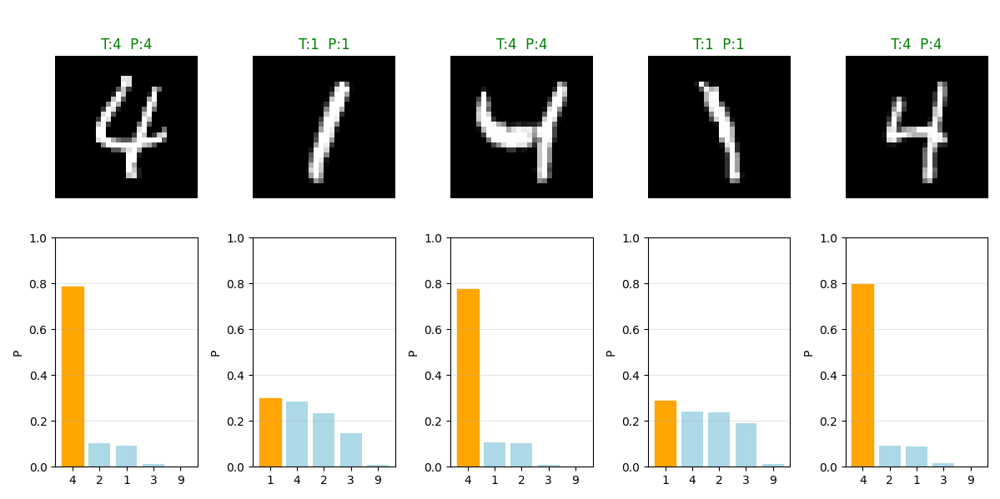

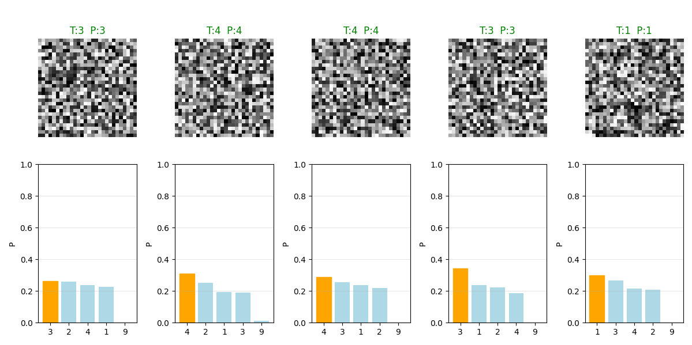

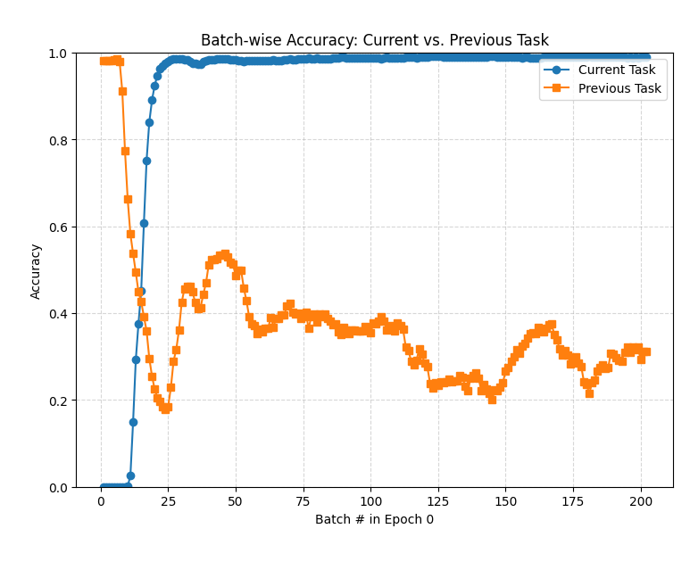

**Task 4, [7, 8]**

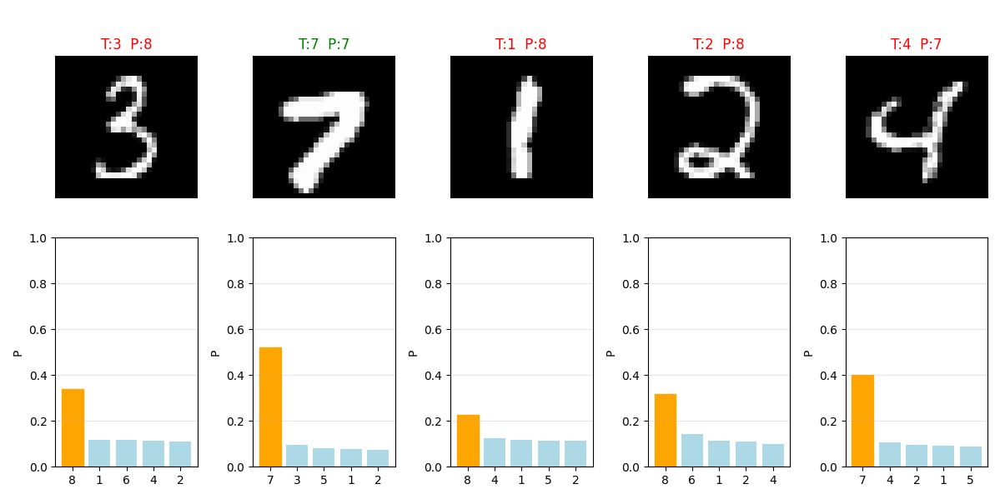

At the end:

```
Network acc.: 0.200 (baseline: 0.1981)
LP layer 2 acc.: 0.8375 (baseline: 0.8905)
LP layer 1 acc: 0.9075 (baseline: 0.9205)
```

#### Next steps

* See the behavior of other methods
* Try to develop a method based on our insights
