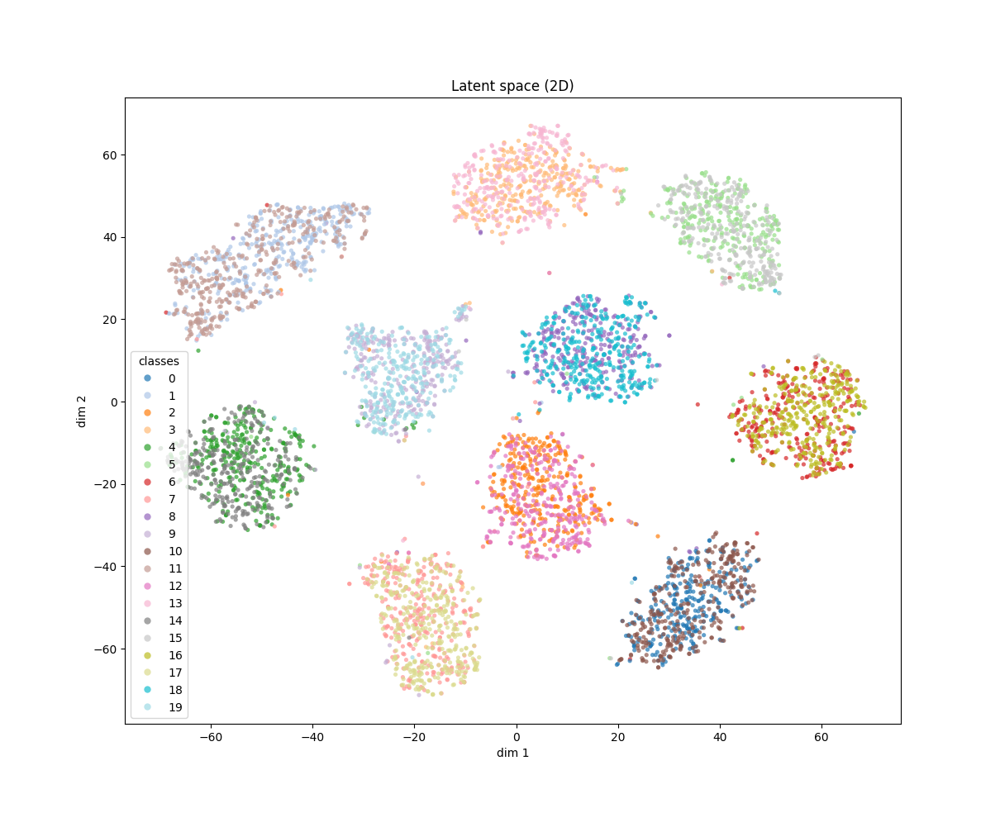
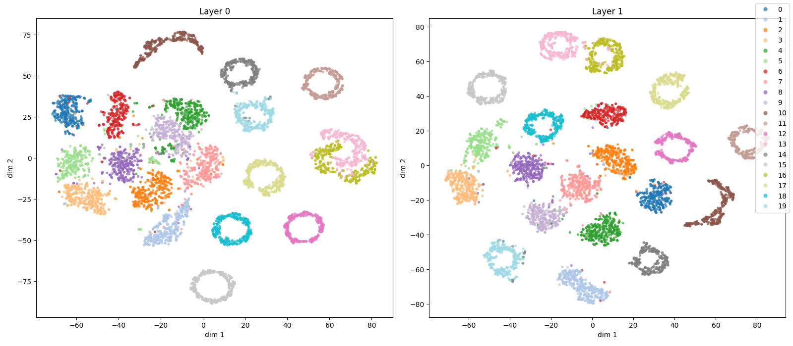
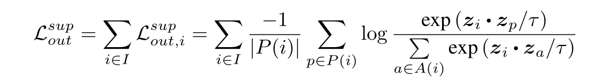
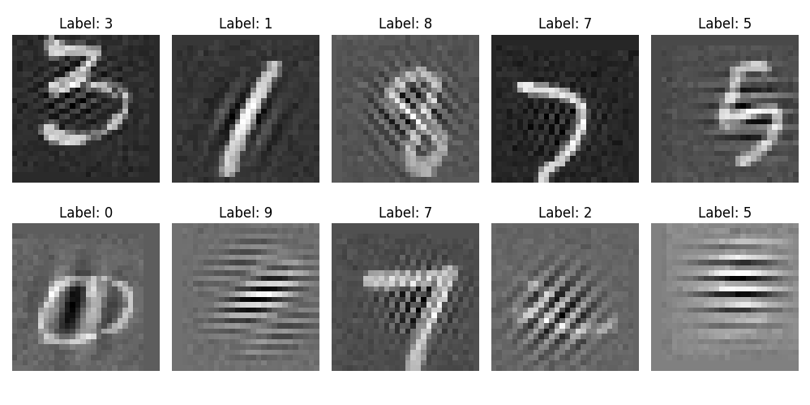
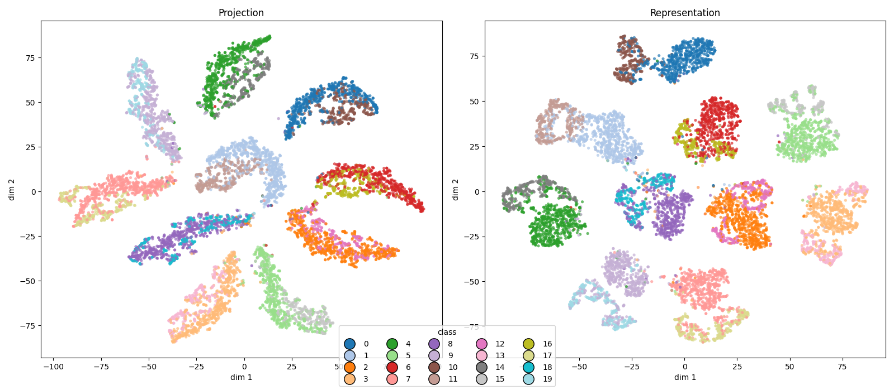
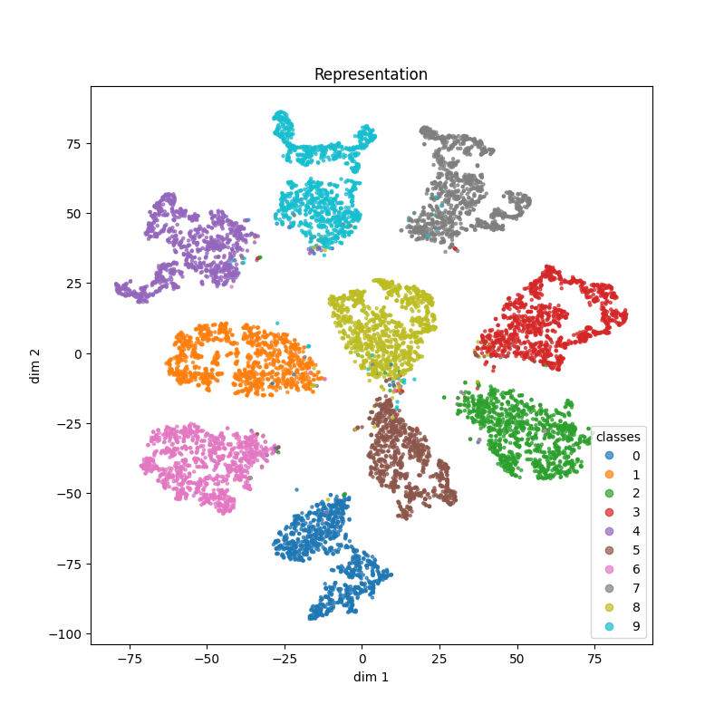

Notes with latest updates, for

*October, 14*

### Tentative direction 

We identified two things that seem to be necessary to avoid forgetting old knowledge (in a class-incremental learning scenario):

1. Keep the logits alive for classes trained previously
2. Separate in the latent space classes not seen together

And we translated this in two directions to go:

1. How do current methods do on these points
2. Using the insights we gathered, develop our own method to solve it

### Experiments for this week

Using generated patterns as proxies for the learned classes, effectively binding their representations

#### There was a bug in last weeks code

Training concurrently using cross-entropy, the representations for the digits and patters ***do not fall together in the latent space***.

This is not real:



#### FIXED: Latent space, concurrent training

Much more funky (or peculiar) than before:



Even thought the digits and patterns do not fall together, the network gets a good accuracy, and this may explain why it does not make a further effort to pull them together.

```
val acc mnist: 0.9494, val acc pt: 0.9861
```

#### Constrastive learning

But we are mainly interested that this representations be the as entangled as possible. One possible solution for this is supervised contrastive learning loss, that explicitly pulls together the representations of *positive* examples, and push *apart* the representations of negative examples.



Besides every example from the same class being positive, the following is done: very example is replicated into 2 examples or views, with random data augmentation operations done on each of them. This makes the own example one of its positive pairs (this is the most reliable positive).

**We do more than that**: We replicate every example from the dataset into 5 views:

Each data point generates 2 views of the dataset example:


Also, generates 2 views of the pattern associated with it:


And generates 1 view of the interpolation between the pattern and the example:



##### Concurrent training



With this operations, we get the following latent space in the concurrent training:



If we compare with the latent obtained trained with batch norm, with no patterns:


Some info:

```
# 15 epochs contrastive learning training
# 10 epochs classification Training

Epoch 9, val acc: 0.9621

Linear probe overall acc: 0.9714
Class 0 accuracy on linear probing: 0.9890
Class 1 accuracy on linear probing: 0.9878
Class 2 accuracy on linear probing: 0.9708
Class 3 accuracy on linear probing: 0.9587
Class 4 accuracy on linear probing: 0.9664
Class 5 accuracy on linear probing: 0.9668
Class 6 accuracy on linear probing: 0.9802
Class 7 accuracy on linear probing: 0.9715
Class 8 accuracy on linear probing: 0.9558
Class 9 accuracy on linear probing: 0.9633
```


#### For next week

* Do this for sequential learning, to see if our hyphotesis is correct


