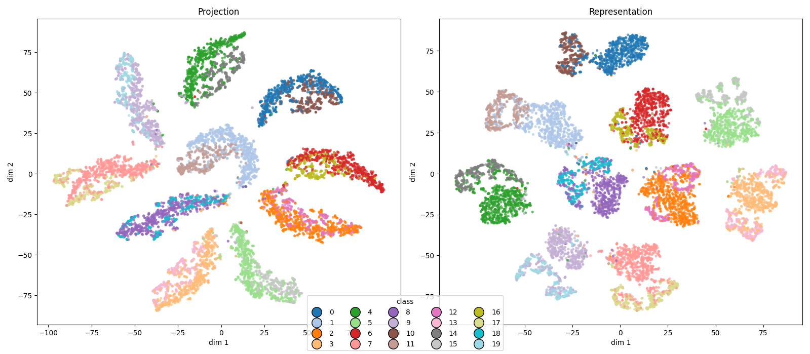

Notes with latest updates, for

*October, 21*

### Last week, using contrastive learning

to try to force entanglement between patterns and digits:



### Sequential learning

Could not confirm our hyphotesis so far.

**Task 5, [9, 0]**


Linear probe overall acc: 0.6690

#### Why is this the case?

Looking at what the network is learning:

Task 1, trained


Task 2, trained


Looking at the same latent space, with no training

Task 1


Task 2


Perhaps is it that the patterns and digits representation are too much decoupled in the lower layers?

(Is this lack of entanglement that is preventing the binding between the patterns and digits representations?)


One idea to test if this is the case:

```
Task 1:

Train to predict digit 1 (with digit 7 as its pattern)
Train to predict digit 2 (with digit 8 as its pattern)


Task 2:

Train to predict digit 3 (with digit 9 as its pattern)
Train to predict digit 4 (with digit 0 as its pattern)
(replaying patterns of task 1)


Task 3:

Train to predict digit 5
Train to predict digit 6
(replaying patterns of task 1 and task 2)

```
