Notes with latest updates, for

*October, 29*

### Comparing cross-entropy training and (in infancy) domain adversarial training

#### Latent space, task 1 [1, 2]:

##### Cross-entropy

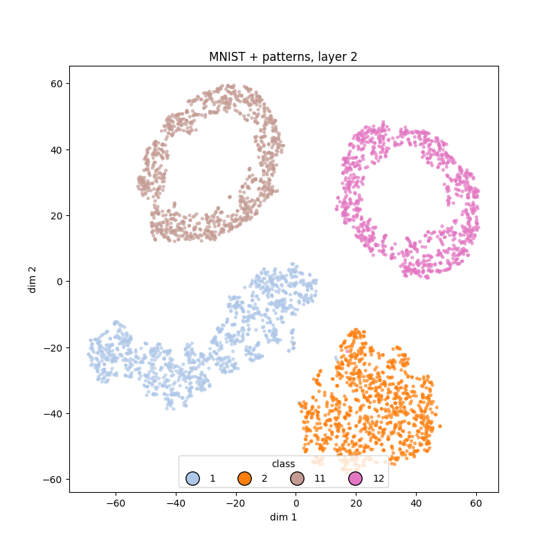

##### Domain adaptation

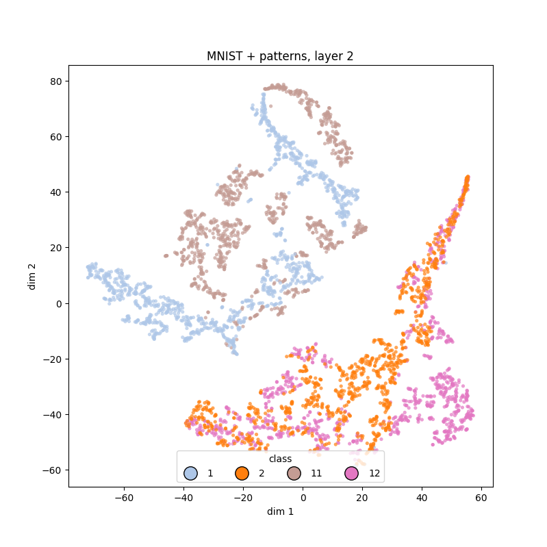

#### Latent space, task 2 [3, 4]:

#### Cross-entropy

* Ground truth:

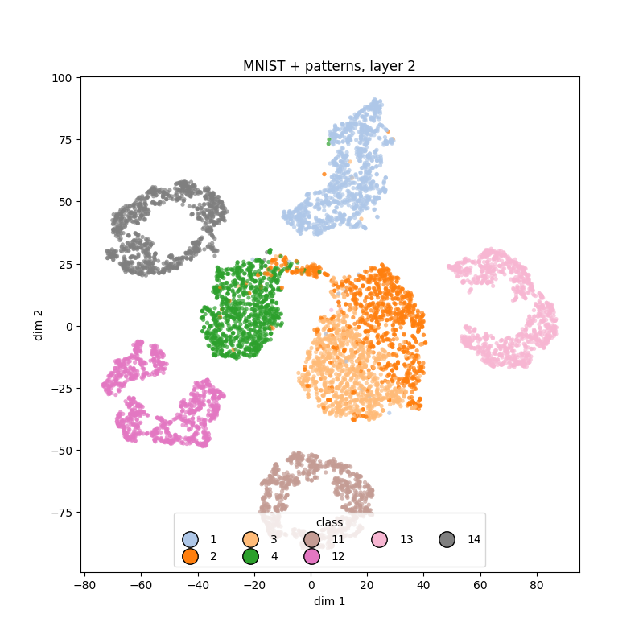

* Predictions:

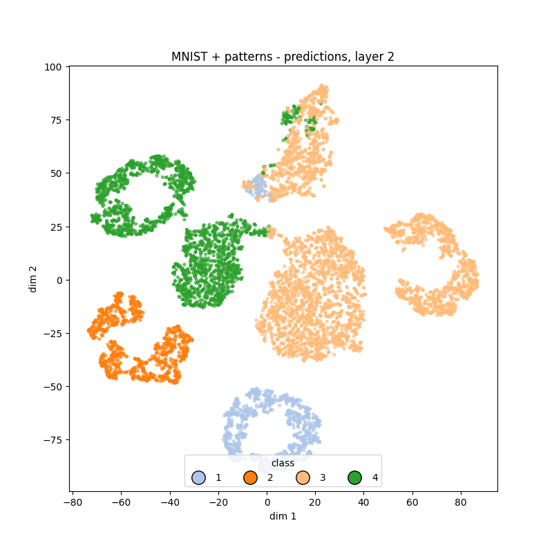

##### Domain adaptation

* Ground truth

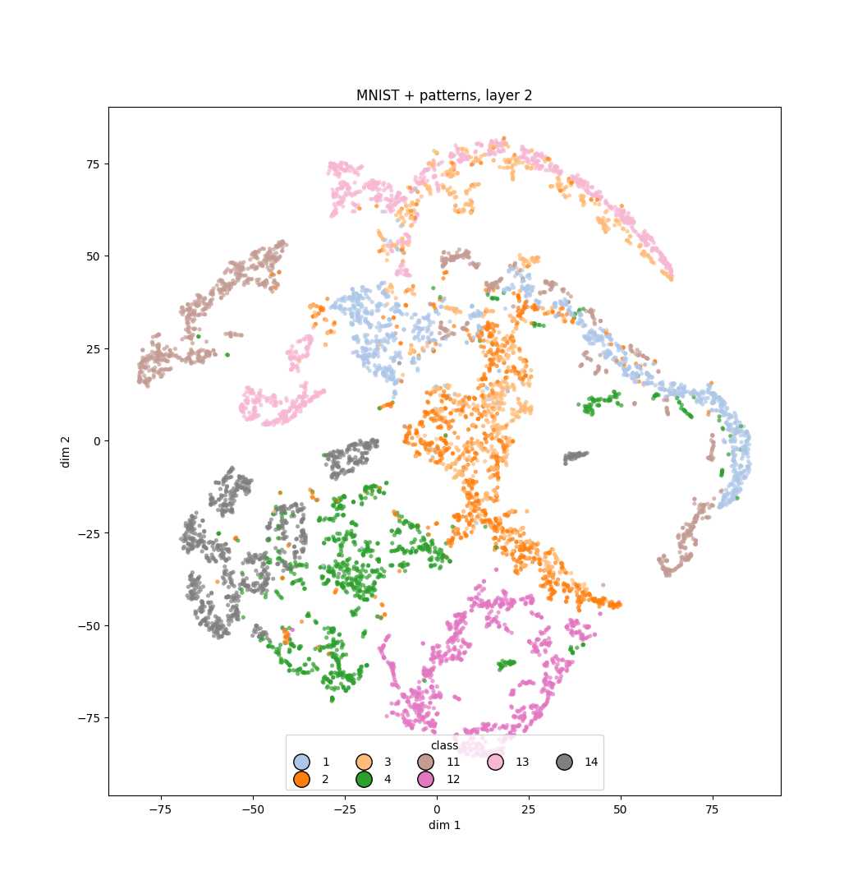

* Predictions:

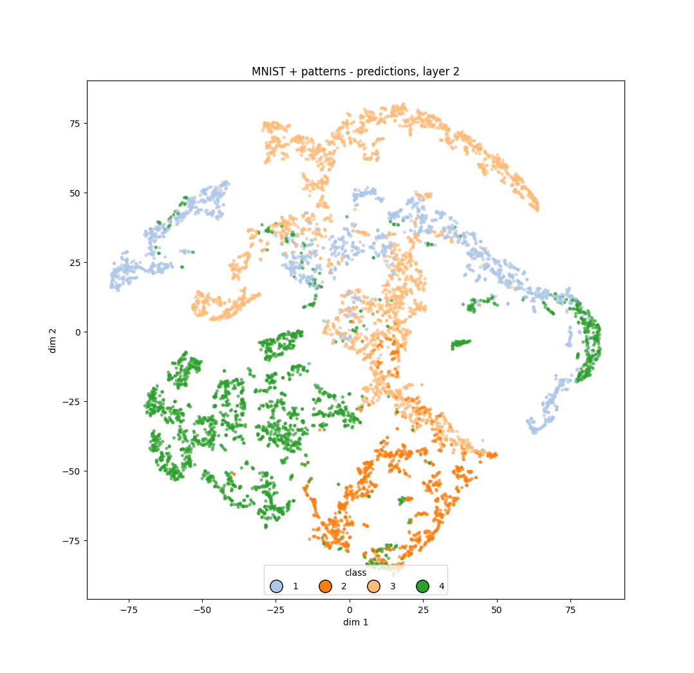

#### Latent space, task 2 [9, 0]:

#### Cross-entropy

* Ground truth:

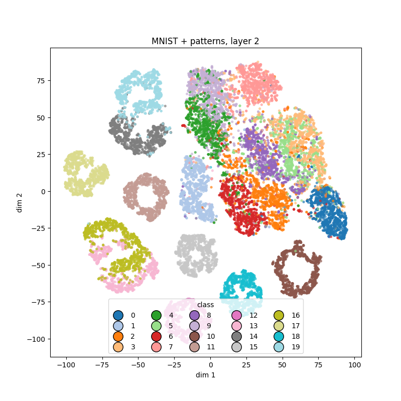

* Predictions:

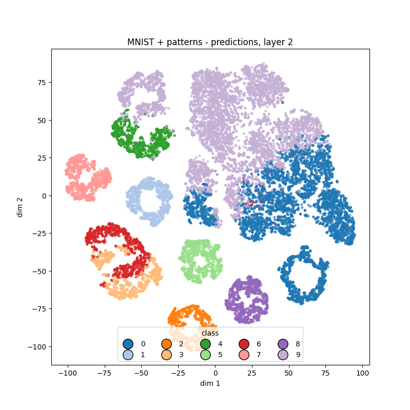

##### Domain adaptation

* Ground truth

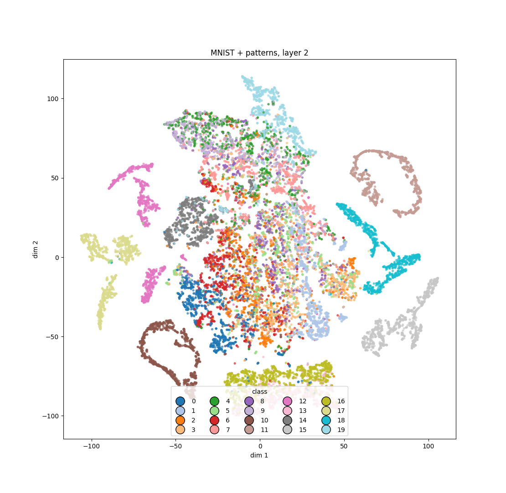

* Predictions:

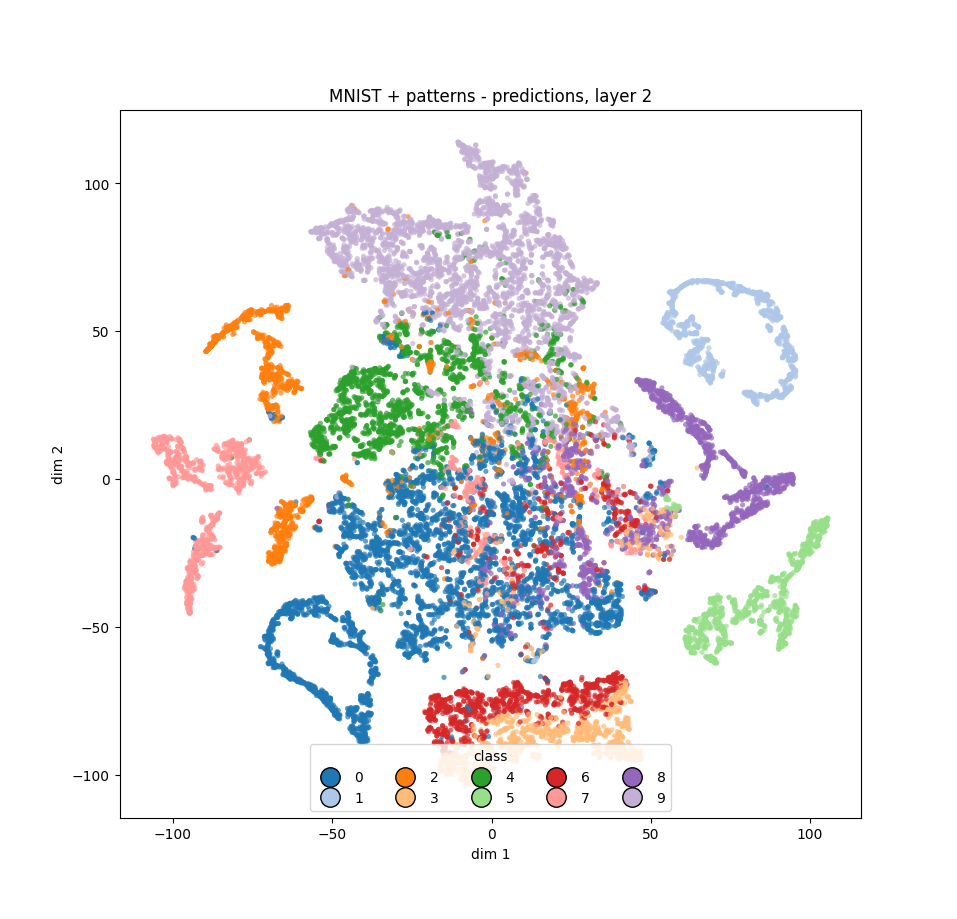

* Predictions domain, Latent space, layer 3, digits and patterns

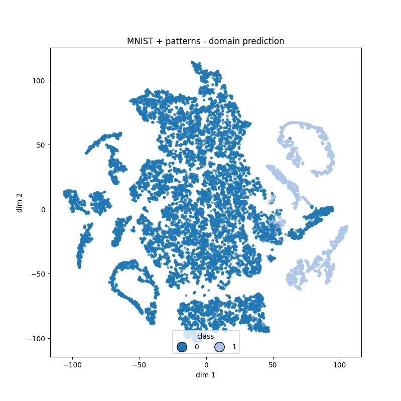

* Forgetting

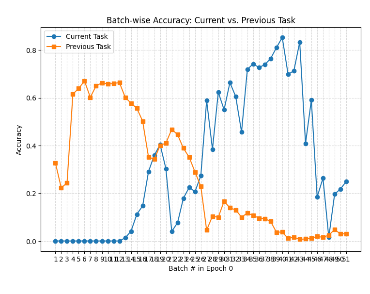

#### Comparing with cross-entropy / domain adaptation / contrastive learning

#### Two things seem to be necessary

1. Keep the logits alive for classes trained previously
2. Separate in the latent space classes not seen together
